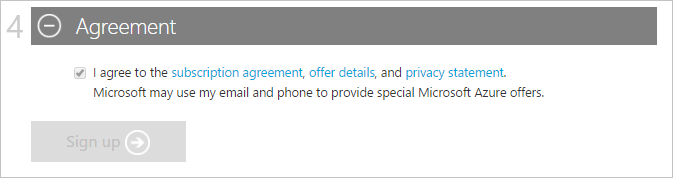
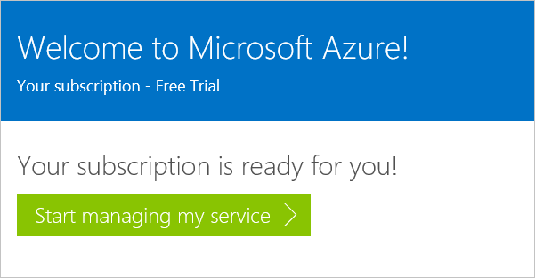
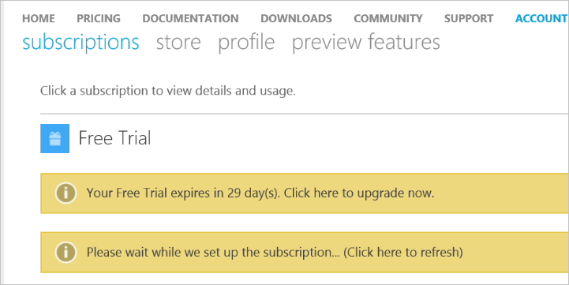

<properties
    pageTitle="如何註冊購買、 升級或啟動 Azure 訂閱 |Microsoft Azure"
    description="說明如何購買或註冊 Azure 的訂閱"
    services=""
    documentationCenter=""
    authors="genlin"
    manager="mbaldwin"
    editor=""
    tags="billing,top-support-issue"
    />

<tags
    ms.service="billing"
    ms.workload="na"
    ms.tgt_pltfrm="na"
    ms.devlang="na"
    ms.topic="article"
    ms.date="09/23/2016"
    ms.author="genli"/>

# 如何登入，購買、 升級，或啟動 Azure

> [AZURE.NOTE] 如果您需要更多協助，這份文件中的任何點，請[連絡支援部門](https://portal.azure.com/?#blade/Microsoft_Azure_Support/HelpAndSupportBlade)以取得您的問題已解決快速。

Azure 提供各種優惠] 之下，配合您的業務需求，並開始使用 Azure。 請造訪[Azure 提供](https://azure.microsoft.com/support/legal/offer-details/)的詳細資料的所有使用中提供的完整清單上瞭解哪些他們的每個優惠封面、 優點及可用性依國家/地區。

## Azure 提供的優點和限制

下表提供一般優惠的詳細資訊︰

| 優惠                                                                              | 詳細資料 |
|--------------------------------------------------------------------------------------|---------|
| 免費試用版                                                                           |•[逐步註冊指南](billing-buy-sign-up-azure-subscription.md#SignupFreeTrial) •[優點](https://azure.microsoft.com/pricing/free-trial/) •[常見問題集](https://azure.microsoft.com/pricing/free-trial-faq/) •[升級 Pay-As-You-Go 免費試用版](billing-buy-sign-up-azure-subscription.md#UpgradeFreeToPYG)     |
| Pay-As-You-Go                                                                        | •[註冊](https://azure.microsoft.com/pricing/purchase-options/) •[價格](https://azure.microsoft.com/pricing/)   |
| MPN （Microsoft 合作夥伴網路）-成員收到每月免費的 Azure 信用額度 | • [Azure 協力廠商的優點](https://azure.microsoft.com/offers/ms-azr-0025p/) •[為合作夥伴註冊](http://go.microsoft.com/fwlink/?linkid=309258&clcid=0x409)或[Microsoft 動作套件的訂閱](http://go.microsoft.com/fwlink/?linkid=525768&clcid=0x409) • 使用 Azure 貸項總計-存取[MPN 入口網站](https://partner.microsoft.com)驗證您的資格狀態，並遵循軟體金鑰和優點] 下的步驟。 如果您無法驗證您的資格，請連絡[支援 MPN](https://partner.microsoft.com/Support/)。   |
| MSDN 與 Visual Studio 訂閱者                                                      |• [MSDN 開發/測試優點](https://azure.microsoft.com/offers/ms-azr-0023p/) • [Visual Studio 訂閱的好處](https://azure.microsoft.com/pricing/member-offers/msdn-benefits-details/) •[啟動 Visual Studio 訂閱者 Azure 信用卡](https://azure.microsoft.com/pricing/member-offers/msdn-benefits-details/) •[三個簡單的步驟啟動 MSDN Azure 優點](https://www.youtube.com/watch?v=SN2CA71uOEI&feature=youtu.be)︰  登入[MSDN 帳戶頁面，](https://msdn.microsoft.com/subscriptions/manage/default.aspx)並確認資格，請按一下 「 啟動 Azure 優勢 」。 如果您無法驗證您的資格，請連絡[MSDN 訂閱客戶服務中心](https://msdn.microsoft.com/subscriptions/contactus.aspx)。|
| BizSpark                                                                             | •[優點 BizSpark](https://www.microsoft.com/bizspark/default.aspx#start-two)。 如需詳細資訊，請參閱[每月 Azure 信用卡 Visual Studio 企業版](https://azure.microsoft.com/offers/ms-azr-0064p/) •[加入 BizSpark](https://www.microsoft.com/bizspark/signup/default.aspx)。 如果您遇到問題，請連絡[BizSpark 小組](mailto:bizspark@microsoft.com?subject=BizSpark%20Support&body=Thank%20you%20for%20contacting%20BizSpark.%20Please%20provide%20as%20much%20of%20the%20following%20information%20as%20possible,%20as%20it%20will%20help%20expedite%20our%20response%20to%20you.%0aContact%20name:%0aStartup%20name:%0aMicrosoft%20Account/Live%20ID:%0aSpecific%20description%20of%20issue%20experienced%20or%20question:%0a%0aThank%20you,%0a%0aThe%20BizSpark%20Team)。      |
| BizSpark 加號                                                                        |•[瞭解 BizSpark 加號](https://www.microsoft.com/bizspark/plus/default.aspx)。 如需詳細資訊，請參閱[BizSpark 加上的優點](https://azure.microsoft.com/offers/ms-azr-0149p/) •[加入 BizSpark](https://www.microsoft.com/bizspark/signup/default.aspx) ，然後使用您的合作夥伴升級至 BizSpark 加號的連絡人。 如果您遇到問題，請連絡[BizSpark 小組](mailto:bizspark@microsoft.com?subject=BizSpark%20Support&body=Thank%20you%20for%20contacting%20BizSpark.%20Please%20provide%20as%20much%20of%20the%20following%20information%20as%20possible,%20as%20it%20will%20help%20expedite%20our%20response%20to%20you.%0aContact%20name:%0aStartup%20name:%0aMicrosoft%20Account/Live%20ID:%0aSpecific%20description%20of%20issue%20experienced%20or%20question:%0a%0aThank%20you,%0a%0aThe%20BizSpark%20Team)。     |
| 轉售商 （Open 大量授權方案）                                             |•[啟動線上服務索引鍵的逐步指南](billing-buy-sign-up-azure-subscription.md#activateKey) •[購買的福利啟動](https://azure.microsoft.com/offers/ms-azr-0111p/)        |
| EA （企業版合約）                                                            |•[授權 Azure 企業版](https://azure.microsoft.com/pricing/enterprise-agreement/) • 若要啟動，請連絡您的 Microsoft 帳戶管理員或轉銷商，即可立即開始使用     |

## 註冊 Azure 免費試用版訂閱

若要註冊 Azure 免費試用版訂閱，必須提供的電話號碼與信用卡，以 Microsoft 帳戶。 您的 Microsoft 帳戶是您使用，以及您的密碼，登入任何 Windows Live 程式或服務，例如 Outlook、 Hotmail 或 OneDrive 的電子郵件地址。 您可能會設定 Microsoft 帳戶使用給您，包括您的公司電子郵件屬於任何電子郵件地址。 如需詳細資訊，請參閱[常見問題集的 Microsoft 帳戶](https://www.microsoft.com/account/faq.aspx)。

如果您遇到任何問題，請參閱[疑難排解 Azure 註冊問題](billing-troubleshoot-azure-sign-up-issues.md)。

>[AZURE.NOTE] 您的電話號碼]，然後信用卡詳細資料僅可用於驗證您的身分識別。 雖然無法充電您的信用卡，Microsoft 就會置於授權保留為最少，以驗證您的信用卡有效。 保留會釋放內 3-5 天，根據您的財務機構原則而定。

1. 開啟 [ [Azure 免費的試用版頁面](https://azure.microsoft.com/pricing/free-trial/)]，然後選取 [**立即開始**。

2. 使用您的 Microsoft 帳戶或組織帳戶登入。

3. 在**您的相關資訊**] 區段中，輸入您的個人資訊。 [深入](billing-troubleshoot-azure-sign-up-issues.md#i-am-getting-an-error-when-entering-my-information-to-sign-up)瞭解正確地輸入您的個人資訊。

    

    >[AZURE.NOTE] 當您註冊 Azure 的訂閱，所提供的電子郵件地址與國家/地區資訊一定會與訂閱相關聯，且無法稍後變更。

4. 在 [**電話驗證**] 區段中，您必須提供電話號碼接收驗證碼，您可以提供給完成驗證程序。

    您可以選擇以文字訊息，或透過語音電話會收到的驗證碼。 選取 [**傳送簡訊**或 [**撥號給我**讓您的選擇。 在第一個方塊中，選取您的國家/地區的國際撥號程式碼，然後在第二個方塊中輸入您的電話號碼。 您收到的驗證碼之後，請在 [第三個] 方塊中輸入，然後選取 [**驗證程式碼**] 按鈕。 [請參閱本文的更多詳細資料](billing-troubleshoot-azure-sign-up-issues.md#i-am-not-getting-text-messages-or-calls-during-account-verification-when-i-try-to-sign-up)。

    >[AZURE.NOTE] 您無法使用 [VOIP 電話號碼的電話驗證程序。

    

    如果您沒有收到簡訊或通話，請嘗試使用不同的電話號碼，或連絡[Azure 支援](https://portal.azure.com/#blade/Microsoft_Azure_Support/HelpAndSupportBlade)取得協助。

5. 在 [**驗證卡**] 區段中，輸入有效的信用卡卡的詳細資料。 這項資訊會收集只以驗證您的身分識別。

    如果您收到錯誤，提交您的信用卡資訊後，請參閱[我信用卡嘗試註冊 Azure 時沒有幫助](billing-credit-card-fails-during-azure-sign-up.md)。

    

6. 在**合約**] 區段中，如果您同意合約的訂閱優惠的詳細資訊，與隱私權聲明核取方塊。 然後選取 [**註冊**]。 合約表單依國家/地區可能會視情況而定。

    

    它可能需要幾分鐘，才能設定您的訂閱。 如果訂閱設定未完成在 15 分鐘，請連絡[支援 Azure](https://portal.azure.com/#blade/Microsoft_Azure_Support/HelpAndSupportBlade)取得協助。

    > [AZURE.NOTE] 如果您收到錯誤訊息，請遵循的步驟來解決問題訊息中。 一般錯誤訊息為︰

    > **很抱歉，我們無法完成作業。請稍後再次嘗試或重新載入網頁**

    > 在此情況下，請嘗試使用其他瀏覽器完成註冊程序。 如果仍發生此問題，請連絡[支援 Azure](https://portal.azure.com/#blade/Microsoft_Azure_Support/HelpAndSupportBlade)取得協助。

7. 當訂閱時時，請選取 [**開始管理我的服務**] 以開始。

    

### 其他資源

- [我無法啟動 Azure 免費試用版](billing-troubleshoot-azure-sign-up-issues.md#i-cant-activate-an-azure-free-trial)
- [Azure 免費試用版常見問題集](https://azure.microsoft.com/pricing/free-trial-faq/)。

## 將 Azure 免費試用版升級至 Pay-As-You-Go

1. 使用 Microsoft 帳戶或您用來註冊免費試用版您的組織帳戶登入[Azure 帳戶入口網站](https://account.windowsazure.com/subscriptions)。

2. 選取 [訂閱]，然後再選取 [**升級**

    

3. 選取 [ **]**，然後按一下**立即升級**。

    

當您升級從免費試用訂閱 Pay-As-You-Go 訂閱時，任何優點剩餘的免費試用版等 30 天限制或者 $200 光榮成果使用 Azure 服務會繼續直到其中耗盡。 訂閱升級會之後發生。

## 使用線上服務啟用金鑰啟動

如果您從轉銷商購買**Azure 中開啟**貸項總計，那麼啟動金鑰 （5 x 5），請遵循下列步驟來啟動訂閱︰

1. 移至 [[訂閱摘要頁面](https://account.windowsazure.com/subscriptions)]。

2. 選取 [ **Azure 中開啟**]。 在[開啟的授權機碼中的 Azure](https://azure.microsoft.com/offers/ms-azr-0111p/)頁面上，選取 [**啟動新的訂閱] 或 [現有的訂閱**]。

3. 輸入產品金鑰，然後核取 [合約] 選項。

> [AZURE.NOTE] 如果您仍有更進一步的問題，請[連絡支援部門](https://portal.azure.com/?#blade/Microsoft_Azure_Support/HelpAndSupportBlade)以取得您的問題已解決快速。
