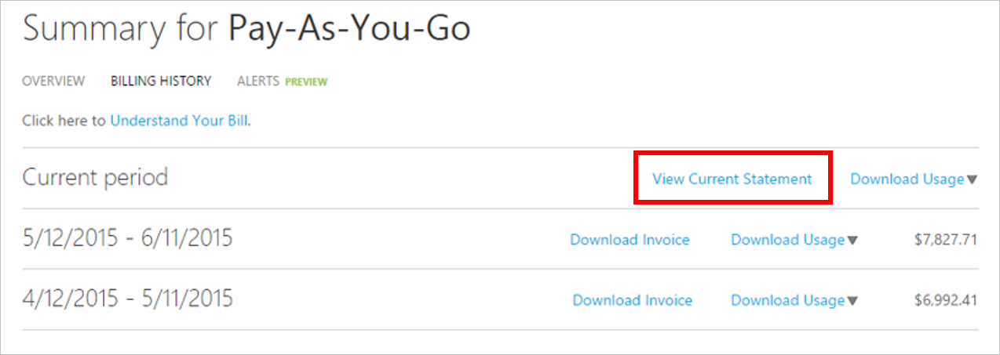
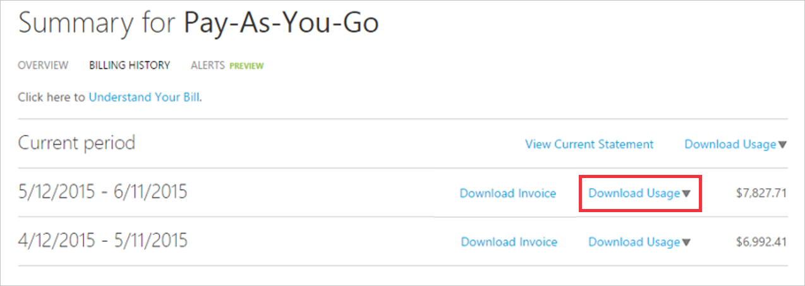

<properties
    pageTitle="如何下載帳單發票及每日使用資料您 Azure |Microsoft Azure"
    description="說明如何下載您 Azure 帳單發票及每日使用資料"
    services=""
    documentationCenter=""
    authors="genlin"
    manager="mbaldwin"
    editor=""
    tags="billing"
    />

<tags
    ms.service="billing"
    ms.workload="na"
    ms.tgt_pltfrm="na"
    ms.devlang="na"
    ms.topic="article"
    ms.date="10/10/2016"
    ms.author="genli"/>

# 如何下載您 Azure 帳單發票及每日使用資料

> [AZURE.NOTE] 如果您需要更多協助，這份文件中的任何點，請[連絡支援部門](https://portal.azure.com/?#blade/Microsoft_Azure_Support/HelpAndSupportBlade)以取得您的問題已解決快速。

Azure 帳戶管理員，您可以檢視帳單發票及每日使用情況資料[Azure 入口網站](https://portal.azure.com)或[Azure 帳戶中心](https://account.windowsazure.com/subscriptions)。 以下是如何︰

## Azure 入口網站

1. 帳戶系統管理員的身分登入[Azure 入口網站](https://portal.azure.com)。

    >[AZURE.NOTE] 只有帳戶管理員有帳單資料存取權限。 如需有關如何找出誰是訂閱的帳戶管理員的詳細資訊，請參閱[常見問題集](billing-subscription-transfer.md#faq)。

2. 在中樞] 功能表中，選取 [**計費**]。 在**計費**刀，您可以找到一些實用的資訊，例如 [下一個計費日期。

    ![帳單] 按鈕](./media/billing-download-azure-invoice-daily-usage-date/billing1.png)
3. 在 [**訂閱成本**] 區段中，選取您想要檢視的訂閱。

    ![帳單] 按鈕](./media/billing-download-azure-invoice-daily-usage-date/billing2.png)
4. 按一下 [**帳單及使用方式**。

    

5. 在 [**帳單記錄**刀，按一下 [**下載發票**，若要檢視您的帳單的複本]。 按一下 [檢視每日的使用情況資料的計費期間]。

    

## Azure 帳戶中心

1. 以系統管理員帳戶登入[Azure 帳戶中心](https://account.windowsazure.com/subscriptions)。
2. 選取的訂閱，您所用的發票及使用方式的資訊。
3. 選取 [**帳單記錄**]。  
4. 您可以看到您的陳述式的六個最後一個計費週期和目前的欠繳的週期。   
5. 選取 [**檢視目前的陳述式**，查看產生估計值的時間的費用估計值。 此資訊只會更新，每日，且可能不會包含您所有的使用方式。 每月帳單，此估計值可能會有所不同。   
6. 選取 [若要查看的最後一個帳單複本**下載發票**]。  
7. 選取要下載每日使用情況資料另存為 CSV 檔案**下載的使用方式**。 

> [AZURE.NOTE] 如果您仍有更進一步的問題，請[連絡支援部門](https://portal.azure.com/?#blade/Microsoft_Azure_Support/HelpAndSupportBlade)以取得您的問題已解決快速。
