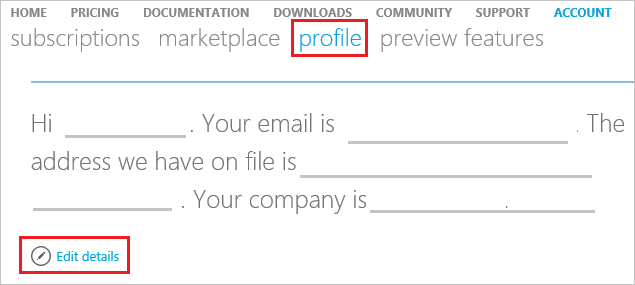

<properties
    pageTitle="如何變更您的 Azure 帳戶的設定檔資訊 |Microsoft Azure"
    description="說明如何變更您的 Azure 帳戶的設定檔，並回答一般問題，例如為何無法變更國家/地區中 Azure 帳戶中心"
    services=""
    documentationCenter=""
    authors="genlin"
    manager="mbaldwin"
    editor=""
    tags="billing"
    />

<tags
    ms.service="billing"
    ms.workload="na"
    ms.tgt_pltfrm="na"
    ms.devlang="na"
    ms.topic="article"
    ms.date="08/17/2016"
    ms.author="genli"/>

# 如何變更您的 Azure 帳戶，例如連絡人的電子郵件、 地址和電話號碼的設定檔資訊

## 摘要

未接來電 Azure 的重要電子郵件？ 想要更新您的設定檔中的其他連絡人資訊？ 本文中，您將瞭解︰

-   [如何變更您的設定檔資訊](#how-to-change-your-profile-information)
-   [常見的問題與問題的解答](#frequently-asked-questions)

> [AZURE.NOTE] 如果您需要更多協助，這份文件中的任何點，請[連絡支援部門](https://portal.azure.com/?#blade/Microsoft_Azure_Support/HelpAndSupportBlade)以取得您的問題已解決快速。

## 您的設定檔的電子郵件地址的重要資訊

Microsoft 會使用帳戶管理員的設定檔中的電子郵件地址訂閱相關的重要計費相關更新會通知您。 我們建議您指定定期檢查連絡人的電子郵件地址。

## 如何變更您的設定檔資訊

1.  [Azure 帳戶中心](https://account.windowsazure.com/)帳戶系統管理員的身分登入，然後按一下 [**設定檔**。 或移至 [https://account.windowsazure.com/Profile。

2.  選取 [**編輯詳細資料**] 按鈕，然後更新**設定檔**資訊。

    

## 常見問題集

### 可以在我的設定檔中變更帳戶管理員電子郵件地址嗎？

[是]。 帳戶管理員是誰設定 Azure 帳戶和人員會收到關於的帳號] 之下的所有訂閱重要的電子郵件通知。 我們建議您指定帳戶管理員會定期檢查連絡人的電子郵件地址。

### 不會更新我的設定檔的電子郵件也會更新我的登入電子郵件地址？

[否]。 更新設定檔的電子郵件地址，並不會更新您的登入電子郵件地址。 若要變更您的登入電子郵件地址，您必須轉移的帳戶。

### 不會更新我的設定檔的地址也會更新信用卡帳單地址？

[否]。 您可以更新移至 Azure 帳戶管理中心[訂閱] 頁面](https://account.windowsazure.com/subscriptions)，與您的信用卡相關聯的帳單地址。

### 為什麼無法更新國家/地區？

技術限制，因為我們無法變更現有帳戶國家/地區。 不過，您可以所需的國家/地區中建立新的帳戶，然後連絡 Azure 的支援，以將您的服務移轉到該帳戶。

### 哪些電子郵件地址會 Azure 帳單通知預覽功能使用？

如果您註冊新 Azure 帳單通知預覽功能時，您會收到 Azure 帳單通知電子郵件地址您指定，無論是否有有所變更帳戶管理員電子郵件地址。

> [AZURE.NOTE] 如果您仍有更進一步的問題，請[連絡支援部門](https://portal.azure.com/?#blade/Microsoft_Azure_Support/HelpAndSupportBlade)以取得您的問題已解決快速。
