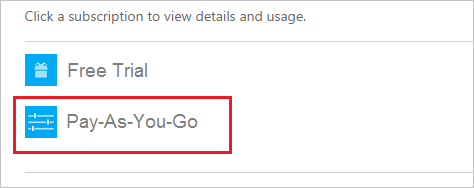

<properties
    pageTitle="如何變更用來支付的 Azure 訂閱的信用卡 |Microsoft Azure"
    description="說明如何變更用來支付的 Azure 訂閱信用卡卡的方式"
    services=""
    documentationCenter=""
    authors="genlin"
    manager="mbaldwin"
    editor=""
    tags="billing"
    />

<tags
    ms.service="billing"
    ms.workload="na"
    ms.tgt_pltfrm="na"
    ms.devlang="na"
    ms.topic="article"
    ms.date="08/24/2016"
    ms.author="genli"/>

# 如何變更用來支付的 Azure 訂閱的信用卡

您有時可能需要更新的信用卡，在您的帳戶資訊的詳細資料，或變更用來支付帳單的卡片。

如果您的信用卡取得更新的數字保持不變，您可以直接更新現有信用卡時，例如 [到期日的詳細資料。

如果您的信用卡卡號變更，因為遺失，竊取或過期，您需要新增新的信用卡至您的帳戶。 這是因為信用卡卡號變更時，會變更 CVV 安全性程式碼，在卡片上。

> [AZURE.NOTE] 如果您需要更多協助，這份文件中的任何點，請[連絡支援部門](https://portal.azure.com/?#blade/Microsoft_Azure_Support/HelpAndSupportBlade)以取得您的問題已解決快速。

## 編輯現有信用卡付款資訊
1. [Azure 帳戶中心](https://account.windowsazure.com/Subscriptions)以管理員身分登入帳戶。 在[Azure 入口網站](https://portal.azure.com)，您可以存取帳戶中心選取**訂閱**>*訂閱名稱*>**管理**。

    > [AZURE.NOTE] 僅限帳戶管理員權限來存取帳戶中心。 如需有關帳戶管理員的詳細資訊，請參閱[如何新增或變更 Azure 管理員角色](billing-add-change-azure-subscription-administrator.md)。

2. 在底下，**按一下 [檢視詳細資料及使用方式的訂閱**，請選取 [連結至信用卡卡訂閱]。  
3. 在頁面的右側，請選取 [**管理付款方法**]。  
4. 在 [**管理付款方式**] 頁面上選取 [信用卡號碼旁的 [**編輯**]。  
5. 在 [**編輯**] 頁面上，確認您已選取正確的信用卡類型以及卡片數字。
6. 卡片的詳細資料，您需要的變更，然後選取 [**選擇付款方法**頁面的 [**下一步**。

## 新增新的信用卡付款方法
1. 至[Azure 帳戶中心](https://account.windowsazure.com/Subscriptions)帳戶管理員身分登入。
2. 在底下，**按一下 [檢視詳細資料及使用方式的訂閱**，選取您要新增新的付款方式。
3. 在頁面的右側，請選取 [**管理付款方法**]。
4. 在 [**管理付款方式**] 頁面選取 [+] 新增新的信用卡。
5. 選擇信用卡類型，並提供所需的資訊。
6. 選取 [**下一步**返回 [**管理付款方式**] 頁面。 如果您新增的卡片有效，它會新增至清單可用的付款方法。

## 變更您用來支付 Azure 的帳單的信用卡
1. 至[Azure 帳戶中心](https://account.windowsazure.com/Subscriptions)帳戶管理員身分登入。
2. 在 [底下，**按一下 [檢視詳細資料及使用方式的訂閱**，選取您要更新的付款方法的訂閱。
3. 在頁面的右側，請選取 [**管理付款方法**]。
4. 在 [**管理付款方式**] 頁面上，按一下 [**改為使用**，選取您想要使用的信用卡]。

## 信用卡移除帳戶
1. 至[Azure 帳戶中心](https://account.windowsazure.com/Subscriptions)帳戶管理員身分登入。
2. 在 [底下，**按一下 [檢視詳細資料及使用方式的訂閱**，選取您要更新的付款方法的訂閱。
3. 在頁面的右側，請選取 [**管理付款方法**]。
4. 在 [**管理付款方式**] 頁面上，按一下 [**刪除**] 以選取您想要刪除的信用卡。

    > [AZURE.NOTE] 您無法刪除信用卡，如果它是與其他作用中的 Microsoft 訂閱相關聯。 如果您收到錯誤使用中的卡片，請確定它與所有使用中訂閱您的 microsoft 解除關聯。

> [AZURE.NOTE] 如果您仍有更進一步的問題，請[連絡支援部門](https://portal.azure.com/?#blade/Microsoft_Azure_Support/HelpAndSupportBlade)以取得您的問題已解決快速。
