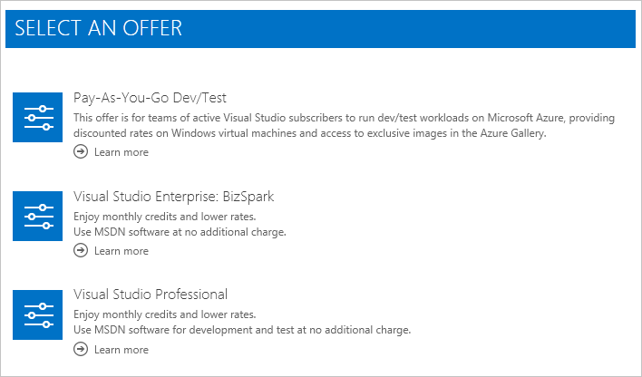

<properties
    pageTitle="Azure 訂閱切換到另一個方案 |Microsoft Azure"
    description="進一步瞭解如何變更您的 Azure 訂閱並切換到不同的提供使用訂閱管理入口網站"
    services=""
    documentationCenter=""
    authors="genlin"
    manager="mbaldwin"
    editor=""
    tags="billing,top-support-issue"/>

<tags
    ms.service="billing"
    ms.workload="na"
    ms.tgt_pltfrm="na"
    ms.devlang="na"
    ms.topic="article"
    ms.date="09/30/2016"
    ms.author="genli"/>

# Azure 訂閱切換到另一個優惠

為[Pay-As-You-Go](https://azure.microsoft.com/offers/ms-azr-0003p/)客戶，您可能無法切換[帳戶中心](https://account.windowsazure.com/Subscriptions)] 中的另一個優惠 Azure 訂閱。 例如，您可以使用此功能，以利用[Visual Studio 訂閱者的每月貸項總計](https://azure.microsoft.com/pricing/member-offers/msdn-benefits-details/)。 如果您是在[免費試用版](https://azure.microsoft.com/free/)，瞭解如何[升級至 Pay-As-You-Go](billing-upgrade-azure-subscription.md)。

#### 支援的項目︰

| 從                                                              | 若要                                                                                      |
|-------------------------------------------------------------------|-----------------------------------------------------------------------------------------|
| [Pay-As-You-Go](https://azure.microsoft.com/offers/ms-azr-0003p/) | [Pay-As-You-Go 開發/測試](https://azure.microsoft.com/offers/ms-azr-0023p/)              |
| [Pay-As-You-Go](https://azure.microsoft.com/offers/ms-azr-0003p/) | [Visual Studio 專業版](https://azure.microsoft.com/offers/ms-azr-0059p/)          |
| [Pay-As-You-Go](https://azure.microsoft.com/offers/ms-azr-0003p/) | [Visual Studio 測試專業版](https://azure.microsoft.com/offers/ms-azr-0060p/)     |
| [Pay-As-You-Go](https://azure.microsoft.com/offers/ms-azr-0003p/) | [MSDN 平台](https://azure.microsoft.com/offers/ms-azr-0062p/)                      |
| [Pay-As-You-Go](https://azure.microsoft.com/offers/ms-azr-0003p/) | [Visual Studio 企業版](https://azure.microsoft.com/offers/ms-azr-0063p/)            |
| [Pay-As-You-Go](https://azure.microsoft.com/offers/ms-azr-0003p/) | [Visual Studio 企業 (Bizspark)](https://azure.microsoft.com/offers/ms-azr-0064p/) |

> [AZURE.NOTE] 對於其他提供修訂，請[連絡支援人員](https://portal.azure.com/?#blade/Microsoft_Azure_Support/HelpAndSupportBlade)。
    
## 切換的訂閱優惠

> [AZURE.VIDEO switch-to-a-different-azure-offer]

1.  [Azure 帳戶](https://account.windowsazure.com/Subscriptions)中心登入。

2.  選取您 Pay-As-You-Go 訂閱]。

3.  按一下 [**切換到另一個方案**。 ] 按鈕才可用如果您位於 Pay-As-You-Go 並完成您的第一個計費週期。

    ![請注意頁面右側的 [切換方案] 按鈕](./media/billing-how-to-switch-azure-offer/switchbutton.png)
    
4.  可切換您的訂閱優惠] 之下的清單中的 [**選取您想要的優惠**]。 這份清單，視您的帳戶相關聯的成員資格。 如果不是使用，核取[可用的提議，您可以切換到清單](#whats-supported)，並確定您擁有正確的成員資格。 

    

5.  視您要切換到優惠，而定，您可能會看到的附註的切換影響。 請仔細瀏覽此清單，並遵循指示，再繼續進行。

    

6.  您可以重新命名您的訂閱。 根據預設，我們將它設定為新的方案名稱。 按一下 [完成程序的 [**切換提供**。

    ![按一下 [綠色] 按鈕](./media/billing-how-to-switch-azure-offer/confirmpage.png)

7.  成功 ！ 您的訂閱現在切換到新方案。

## 為什麼我無法切換優惠？

如果，可能不會看到**切換至另一個方案**︰

- 您目前不在[Pay-As-You-Go](https://azure.microsoft.com/offers/ms-azr-0003p/)上。 目前僅 Pay-As-You-Go 訂閱可切換至另一個方案。

    - 如果您是在[免費試用版](https://azure.microsoft.com/free/)，瞭解如何[升級至 Pay-As-You-Go](billing-upgrade-azure-subscription.md)。

    - 若要切換從不同的訂閱，[請連絡支援](https://portal.azure.com/?#blade/Microsoft_Azure_Support/HelpAndSupportBlade)的方案。

- 您仍在您的第一個計費期間;您必須等到您可以切換優惠之前結束的第一個計費期間。

如果，您可能會看到**有提供您的地區或國家/地區這次不提供**︰

- 您不符合任何優惠選項。 檢查[您可以切換到提供的優惠的清單](#whats-supported)。

## 有什麼？ Azure 優惠執行切換至我的服務與帳單

以下是當您切換 Azure 時，會發生什麼情況的詳細資料帳戶中央的方案。

### 存取服務

不沒有任何使用者與訂閱相關聯的任何服務停擺。 不過，您切換到優惠可能會有限制。 舉例來說，某些優惠禁止生產使用，所以您需要將生產資源移至另一個訂閱。

### 帳單

在您切換的天發票會產生的所有未完成的費用。 然後，您的訂閱被付費每個新優惠給價格的字詞。 您的訂閱計費變更為在您變更優惠的日期。 使用情況和帳單資料之前，無法保留優惠變更，因此我們建議您在切換之前，先下載複本。

> [AZURE.NOTE] 計費與相關的限制式，因為優惠選項不可能建立訂閱之後的第一個計費週期內。

## 可以移轉從 Pay-As-You-Go 要視 (CSP) 產生的[雲端解決方案提供者](https://partner.microsoft.com/Solutions/cloud-reseller-overview)或[Enterprise 合約](https://azure.microsoft.com/pricing/enterprise-agreement/)(EA)？

我們目前不支援方案切換至 [CSP 或 EA 中心中的帳戶。 若要將 EA 移動您現有的訂閱，則請將您的帳戶新增到 EA 註冊系統管理員。 然後，您會收到邀請電子郵件。 當您追蹤的指示來接受邀請時，請在企業合約時，會自動移動您的訂閱。 若要移轉到 CSP，請參閱[Azure 訂閱移轉 CSP](https://blogs.technet.microsoft.com/hybridcloudbp/2016/08/26/azure-subscription-migration-to-csp/)。

## 後續步驟

- 瞭解如何[管理管理員角色](billing-add-change-azure-subscription-administrator.md)，您的訂閱

- 以[下載使用情況資料和發票](billing-download-azure-invoice-daily-usage-date.md)追蹤您的使用方式

## 需要協助嗎？ 連絡支援人員。

如果您仍有更進一步的問題，請[連絡支援部門](https://portal.azure.com/?#blade/Microsoft_Azure_Support/HelpAndSupportBlade)以取得您的問題已解決快速。
