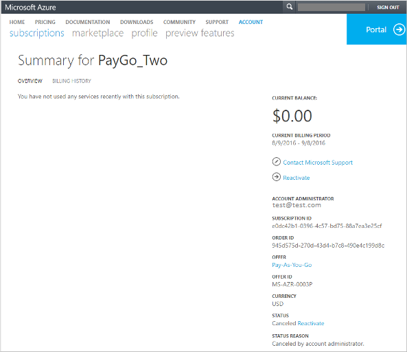

<properties
    pageTitle="重新啟動已停用 Azure 訂閱 |Microsoft Azure"
    description="說明當您可能需要停用的 Azure 訂閱及重新啟動它。"
    keywords="azure 停用的訂閱"
    services=""
    documentationCenter=""
    authors="genlin"
    manager="mbaldwin"
    editor=""
    tags="billing"
    />

<tags
    ms.service="billing"
    ms.workload="na"
    ms.tgt_pltfrm="na"
    ms.devlang="na"
    ms.topic="article"
    ms.date="10/04/2016"
    ms.author="genli"/>

# 為什麼我 Azure 訂閱停用和如何執行重新啟動它嗎？

您可能已停用，因為您達到您費用限制您 Azure 訂閱、 有逾期的帳單，按下您的信用卡限制，或因為帳戶系統管理員已取消訂閱。 請參閱適用於您有什麼問題，並依照本文以瞭解重新啟動您的訂閱中的步驟。 

## 您達到您耗費的限制

當您使用耗盡您的訂閱隨附的每月金額時，我們會停用您的帳單當月的其餘部分的服務。 您的服務會停用來防止您不小心會產生費用超過您的訂閱隨附的使用方式。 您可以移除費用限制並[設定您的 Microsoft Azure 訂閱的帳單的提醒](billing-set-up-alerts.md)，協助您監控和管理帳單的活動，以便您 Azure 帳戶。

若要移除您耗費的限制

1. 登入[Azure 帳戶中心](https://account.windowsazure.com/Home/Index)。

2. 按一下 [**訂閱**]。

3. 選取 [訂閱]。

4. 按一下 [**訂閱達到花費限制，以防止費用已停用**]。

    如果您沒有看到該選項，按一下 [訂閱的**狀態**區域中的 [**移除費用限制**]。

5. 選取下列選項之一︰

|選項|效果|
|------|------|
|永遠移除耗費的限制|會移除耗費的限制，直到您再次開啟。|
|移除目前計費期間的費用限制|移除重新啟動下一個計費期間的費用限制，但耗費的限制。|

如果您有免費試用版訂閱移除金額的限制，您的訂閱會轉換 Pay-As-You-Go 結尾的免費試用版。

## 您的帳單是逾期

完整支付您未完成的餘額。 請參閱[為什麼您收到通知，Azure 訂閱具有過去到期平衡？](billing-azure-subscription-past-due-balance.md#what-can-you-do-to-resolve-the-issue)

## 帳單超過您的信用卡限制

若要解決此問題，請[切換至不同的信用卡](billing-how-to-change-credit-card.md)。 或者，如果您代表商務，您可以[切換到按發票付款](https://azure.microsoft.com/pricing/invoicing/)。

## 訂閱已取消由帳戶管理員

如果您是帳戶管理員，請重新啟動 Pay-As-You-Go 訂閱，請使用下列步驟︰ 

1. 登入[Azure 帳戶中心](https://account.windowsazure.com/Home/Index)。
2. 選取 [取消的訂閱]。
3. 按一下 [**重新啟動**]。

針對其他訂閱的類型，請[連絡支援人員](https://portal.azure.com/?#blade/Microsoft_Azure_Support/HelpAndSupportBlade)將會重新啟動訂閱。

## 需要協助嗎？ 連絡支援人員。
如果您仍然需要說明，請[連絡支援部門](https://portal.azure.com/?#blade/Microsoft_Azure_Support/HelpAndSupportBlade)以取得您快速解決的問題。 

