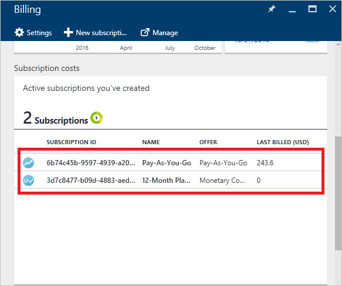
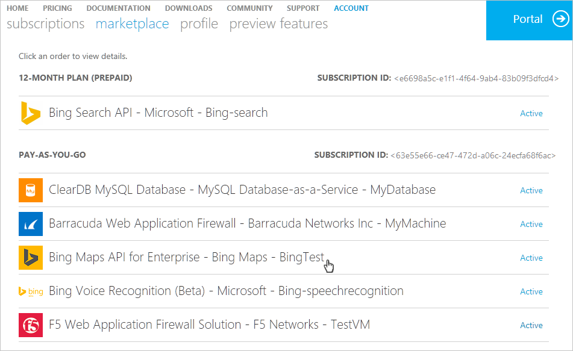
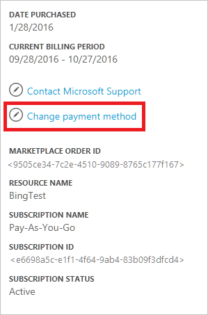
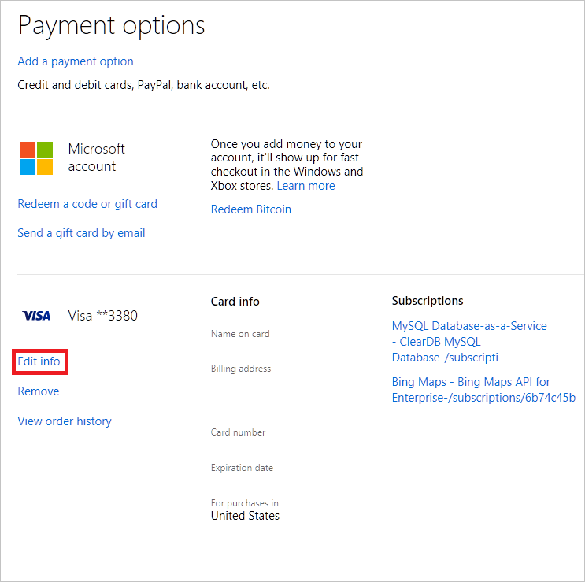

<properties
    pageTitle="了解 Azure 外部服務費用 |Microsoft Azure"
    description="瞭解帳單的外部服務商場，稱為 Azure 中的費用。"
    services=""
    documentationCenter=""
    authors="adpick"
    manager="felixwu"
    editor=""
    tags="billing"
    />

<tags
    ms.service="billing"
    ms.workload="na"
    ms.tgt_pltfrm="na"
    ms.devlang="na"
    ms.topic="article"
    ms.date="10/12/2016"
    ms.author="adpick"/>

# 了解 Azure 外部服務費用

本文說明 Azure 中外部服務的帳單。 被稱為 Marketplace 訂單用於外部服務。 獨立的服務廠商提供的外部服務，但內 Azure 生態完全整合。 瞭解如何︰

- 找出外部服務
- 瞭解如何計費與其他 Azure 資源
- 檢視及追蹤您累算任何成本從外部服務的使用
- 管理外部服務訂單] 和 [支付的方式

## 什麼是 Azure 的外部服務？

使用呼叫 Azure Marketplace 的外部服務。 通常來說，就會為 Azure 發行由協力廠商提供的服務。 例如，ClearDB 和 SendGrid 是最多可以購買中 Azure，但未發佈 microsoft 的外部服務。

### 找出外部服務

當您提供的新的外部服務或資源時，會顯示警告︰

>[AZURE.NOTE] 發佈不是 Microsoft 的公司外部的服務，但有時候也會 Microsoft 產品分類為外部服務。

### 分別向收費外部服務

外部服務會被視為 Azure 訂閱中的個別訂單。 購買服務時，會設定為每個服務的計費期間。 不在其在您購買的訂閱的帳單週期混淆。 您也會收到不同帳單和負責分別設定您的信用卡。

### 每個外部服務具有不同的帳單模型

某些服務會付費 pay-as-you-go 的方式，而其他則使用的每月根據的付款的模型。 您需要信用卡 Azure 的外部服務，您無法購買發票支付的外部服務。

### 您無法用於外部服務中的每月免費貸項總計

如果您使用的包含[免費貸項總計](https://azure.microsoft.com/pricing/spending-limits/)的 Azure 訂閱，則它們無法套用到外部服務帳單。 使用信用卡購買外部服務。

## 檢視外部服務花費及歷程記錄

您可以檢視[Azure 入口網站](https://portal.azure.com/)中的每個訂閱的外部服務的清單︰ 

1. 登入[Azure 入口網站](https://portal.azure.com/)和[瀏覽至 [**計費**刀](https://portal.azure.com/?flight=1#blade/Microsoft_Azure_Billing/BillingBlade)。

    ![選取 [中心] 功能表中的 [計費](./media/billing-understand-your-azure-marketplace-charges/billing-button.png) 
  
2. 在 [**訂閱成本**] 區段中，選取您想要檢視的訂閱。 
   
    

3. 按一下 [**外部服務**]。

    

4. 您應該會看到每一個您的外部服務訂單、 publisher 名稱、 您購買的服務層級、 名稱資源，與目前的順序狀態。 選取以查看帳單過去的外部服務。

    

5. 從這裡開始，您可以檢視過去的帳單金額包括稅金分解。

    

## 管理外部服務訂單的付款方式

更新您的付費方式[帳戶中心](https://account.windowsazure.com/)的外部服務訂單。

> [AZURE.NOTE] 如果您購買訂閱的公司或學校帳戶您應該[連絡支援人員](https://portal.azure.com/?#blade/Microsoft_Azure_Support/HelpAndSupportBlade)若要變更您的付款方法。

1. 登入[帳戶中心](https://account.windowsazure.com/)和[瀏覽至 [**市集**] 索引標籤](https://account.windowsazure.com/Store)

    

2. 選取您想要管理的外部服務

    

3. 在右側的頁面上，按一下 [**變更付款方法**。 此連結可讓您不同的入口網站，以管理您的付款方法。
    
    

4. 按一下 [**編輯資訊**，請依照下列指示更新您的付款資訊]。

    
    
## 取消外部服務順序

如果您想要取消您的外部服務順序，您需要刪除[Azure 入口網站](https://portal.azure.com)中的資源。

## 需要協助嗎？ 連絡支援人員。

如果您仍有更進一步的問題，請[連絡支援部門](https://portal.azure.com/?#blade/Microsoft_Azure_Support/HelpAndSupportBlade)以取得您的問題已解決快速。
