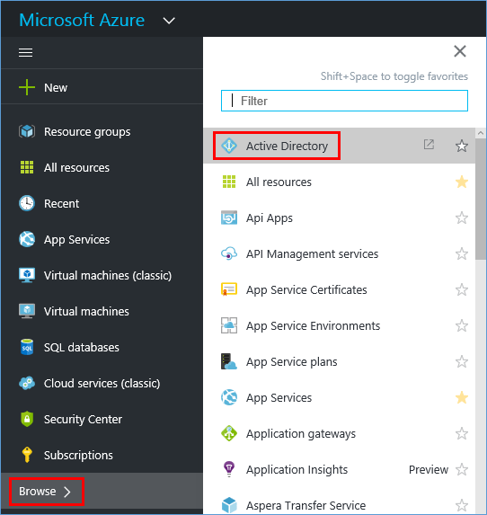

<properties
    pageTitle="共用單一 Azure AD 租用戶，透過 Office 365 和 Azure 訂閱 |Microsoft Azure"
    description="瞭解如何共用您的 Office 365 Azure AD 租用戶和其使用者 Azure 訂閱，或反向操作"
    services=""
    documentationCenter=""
    authors="JiangChen79"
    manager="mbaldwin"
    editor=""
    tags="billing,top-support-issue"/>

<tags
    ms.service="billing"
    ms.workload="na"
    ms.tgt_pltfrm="ibiza"
    ms.devlang="na"
    ms.topic="article"
    ms.date="08/17/2016"
    ms.author="cjiang"/>

# 使用現有的 Office 365 帳戶的 Azure 訂閱或反向操作
案例︰ 您已有 Office 365 訂閱並準備好的 Azure 訂閱，但您想要使用現有的 Office 365 使用者帳戶 Azure 訂閱。 或者，您會 Azure 訂閱者，並想要在現有的 Azure Active Directory 中取得 Office 365 訂閱的使用者。 本文將示範如何輕鬆達成兩者。

> [AZURE.NOTE] 本文內容不適用於 Enterprise 合約 (EA) 客戶。 如果您需要更多協助，這份文件，[請連絡支援](https://portal.azure.com/?#blade/Microsoft_Azure_Support/HelpAndSupportBlade)的任何點取得您快速解決的問題。

## 快速指引

- 如果您已有 Office 365 訂閱，而且想要註冊 Azure，使用**使用您的組織帳戶登入**] 選項。 然後繼續使用您的 Office 365 帳戶的 Azure 註冊程序。 請參閱[本文稍後的詳細的步驟](#s1)。

- 如果您已經有 Azure 訂閱，而且想要取得 Office 365 訂閱，與您 Azure 帳戶登入 Office 365。 然後繼續註冊步驟。 在您完成註冊之後，就會和 Azure 訂閱屬於相同的 Azure Active Directory 執行個體新增 Office 365 訂閱。 如需詳細資訊，請參閱一節[本文稍後的詳細的步驟](#s2)。

>[AZURE.NOTE] 若要取得 Office 365 訂閱，帳戶您用於註冊必須是全域管理員或計費管理員的目錄中的角色 Azure Active Directory 租用戶的成員。 [瞭解如何判斷 Azure Active Directory 中的角色](#how-to-know-your-role-in-your-azure-active-directory)。

若要瞭解當您新增至客戶的訂閱時，會發生什麼情況，請參閱[本文稍後的背景資訊](#background-information)。

## 詳細的步驟

### 情況 1︰ 規劃 Office 365 使用者購買 Azure
在此案例中，我們假設 Kelley 牆會擁有的 Office 365 訂閱，並計劃 Azure 訂閱的使用者。 有兩個其他作用中的使用者，珍和 Tricia。 Kelley 的帳戶是admin@contoso.onmicrosoft.com。

若要註冊 Azure，請遵循下列步驟︰

1. 註冊 Azure 在[Azure.com](https://azure.microsoft.com/)。 按一下 [**免費試用**]。 在下一個頁面上，按一下 [**立即開始**。

    

2. 按一下 [**使用您的組織帳戶登入**]。

    

3. 使用您的 Office 365 帳戶登入。 在此情況下，則 Kelley 的 Office 365 帳戶。

    

4. 填入資訊並完成註冊程序。

    

    

現在您已完成所有設定。 在 Azure 入口網站，您應該會看到相同的使用者顯示。 若要檢查，請遵循下列步驟︰

1. 在先前的顯示畫面中，按一下 [**開始管理我的服務**]。
2. 按一下 [**瀏覽**，，然後按一下 [ **Active Directory**。

    ![按一下 [瀏覽]，然後按一下 [Active Directory。](./media/billing-use-existing-office-365-account-azure-subscription/7-azure-portal-browse-ad.png)

3. 按一下 [**使用者**]。

    ![[使用者] 索引標籤](./media/billing-use-existing-office-365-account-azure-subscription/8-azure-portal-ad-users-tab.png)

4. 如預期般，會列出所有使用者，包括 Kelley。

    

### 案例 2︰ 規劃 Azure 使用者購買 Office 365

在這個案例中，Kelley 牆是具有的帳號] 之下的 Azure 訂閱的使用者admin@contoso.onmicrosoft.com。 Kelley 想要訂閱 Office 365 並使用她與 Azure 中已有相同的目錄。

>[AZURE.NOTE] 若要取得 Office 365 訂閱，您使用的登入帳戶必須是角色的全域管理員或計費管理員的目錄中 Azure Active Directory 租用戶的成員。 [瞭解如何知道 Azure Active Directory 中的角色](#how-to-know-your-role-in-your-azure-active-directory)。

若要訂閱 Office 365，請遵循下列步驟︰

1. 移至 [ [Office 365 產品頁面](https://products.office.com/business)]，然後選取 [適用於您的計劃。
2. 選取方案之後，會顯示下列頁面。 未在表單中填滿。 在頁面右上角，按一下 [**登入**]。

    

3. 使用您的帳戶認證登入。 在此範例中，則 Kelley 的帳戶。

    

4. 按一下 [**立即嘗試**]。

    

5. 在 [訂單回條] 頁面上按一下 [**繼續**。

    

現在您已完成所有設定。 在 Office 365 系統管理中心中，您應該會看到顯示為 [作用中的使用者 Contoso 目錄中的使用者。 若要檢查，請遵循下列步驟︰

1. 開啟 Office 365 系統管理中心。
2. 展開**的使用者**，然後按一下 [**作用中的使用者**。

    

### 如何知道您在您的 Azure Active Directory 中的角色

1. [Azure 入口網站](https://portal.azure.com/)登入。
2. 按一下 [**瀏覽**，，然後按一下 [ **Active Directory**。

    

3. 按一下 [**使用者**]。

    

4. 按一下 [使用者]。 在此範例中，使用者會是 Kelley 牆面。

    請注意**組織角色**的欄位。

    

## Azure 和 Office 365 訂閱的相關背景資訊
Office 365 和 Azure 使用 Azure Active Directory 服務來管理使用者與訂閱。 您可以在其中群組使用者和訂閱的容器，請考慮 Azure 的目錄。 若要針對的 Azure 和 Office 365 訂閱中使用相同的使用者帳戶，您需要確認訂閱會建立在相同的目錄。 請謹記下列重點︰

- 在 [目錄] 而不倒取得建立的訂閱。
- 使用者屬於不倒的目錄。
- 訂閱落在建立訂閱的使用者的目錄。 如此一來，您的 Office 365 訂閱連結至 Azure 訂閱為相同的帳戶時建立 Office 365 訂閱的情況下，您在使用該帳戶。

如需詳細資訊，請參閱[如何 Azure 訂閱 Azure Active Directory 與相關聯](./active-directory/active-directory-how-subscriptions-associated-directory.md)。

>[AZURE.NOTE] Azure 訂閱擁有的目錄中的個別使用者。

>[AZURE.NOTE] 擁有 office 365 訂閱的目錄本身。 如果在目錄中的使用者擁有必要的權限，他們可以操作這些訂閱。

## 後續步驟
如果您取得您 Azure 」 和 「 Office 365 訂閱分別過去，且您想要將無法存取 Office 365 租用戶從 Azure 的訂閱，請參閱[建立 Office 365 租用戶，以 Azure 訂閱之間的關聯](billing-add-office-365-tenant-to-azure-subscription.md)。

> [AZURE.NOTE] 如果您仍有問題，[請連絡支援人員](https://portal.azure.com/?#blade/Microsoft_Azure_Support/HelpAndSupportBlade)，以取得您快速解決的問題。
