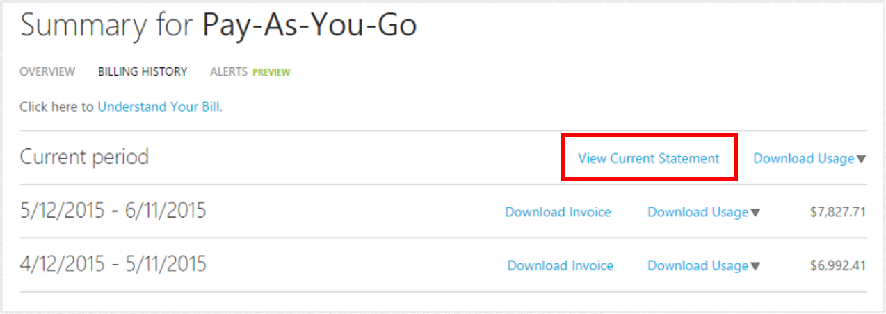
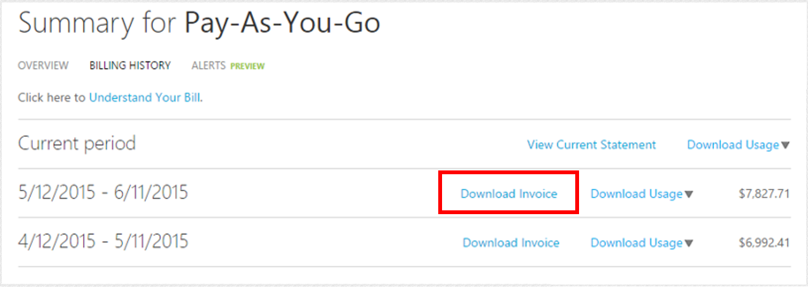

<properties
   pageTitle="瞭解您的帳單 |Microsoft Azure"
   description="瞭解如何閱讀並瞭解使用情況和 Azure 訂閱的帳單"
   services=""
   documentationCenter=""
   authors="genlin"
   manager="stevenpo"
   editor=""
   tags="billing"/>

<tags
   ms.service="billing"
   ms.devlang="na"
   ms.topic="article"
   ms.tgt_pltfrm="na"
   ms.workload="na"
   ms.date="10/31/2016"
   ms.author="erihur;genli"/>

# 瞭解 Microsoft Azure 帳單

> [AZURE.NOTE] 如果您需要更多協助，這份文件中的任何點，請[連絡支援部門](https://portal.azure.com/?#blade/Microsoft_Azure_Support/HelpAndSupportBlade)以取得您的問題已解決快速。

Microsoft Azure 訂閱的費用因費率計劃。 工資率計劃，例如 Visual Studio 企業 (MPN) 訂閱者，包括任何 Azure 服務，根據您的需求，您可以使用的每月貸項總計。

請注意，設定 24 小時的潛在的使用方式，從您先前計費週期可以報告中您目前計費期間。

如需有關消耗量與工資率計劃的詳細資訊，請參閱[Microsoft Azure 購買選項] 頁面](https://azure.microsoft.com/pricing/purchase-options/)。

<!-- The below links cover a complete list of all Microsoft Azure services.

<!-- - [Service Details list (csv1)](https://azurepricing.blob.core.windows.net/supplemental/MOSPServices_csv1.xlsx)
<!-- - [Service Details list (csv2)](https://azurepricing.blob.core.windows.net/supplemental/MOSPServices_csv2.xlsx)

<!-- *NOTE: The **csv1** link refers to the column header names for csv version 1 and **csv2** link refers to the new column header names for csv version 2.  These files are updated monthly.*-->

### 檢視或下載適用於 Microsoft Azure 帳單︰

1. 登入[帳戶中心](https://account.windowsazure.com/subscriptions)使用您的 Microsoft 帳戶或組織的識別碼。

2. 按一下您想要查看詳細資料及使用方式的訂閱]。

3. 按一下 [**帳單記錄**

    

4. **計費歷程記錄**] 區段會列出您的陳述式先前計費週期以及目前欠繳的期間。 目前期間的陳述式是在估計值所產生的時間費用估計值。 此資訊只會更新，每日，且可能不會包含所有日期所產生的使用方式。 每月帳單，此估計值可能會有所不同。  

    

5. 按一下 [**檢視目前的陳述式**，若要檢視產生估計值在時間費用估計值。 此資訊只會更新，每日，且可能不會包含所有日期所產生的使用方式。 每月帳單，此估計值可能會有所不同。

    

    

6. 按一下 [**下載發票**檢視先前帳單的複本。

    

> [AZURE.NOTE] 列出的國際客戶付款陳述式的費用是為了方便估計只銀行有不同的成本轉換比率。

以下是兩個不同的提供 Microsoft Azure 提供的一些範例陳述式。

 提供類型 | 描述 | 下載 |
 :--------- |:-------- | :-------|
Pay-As-You-Go | 每月支付 arrears 中 | [範例檔案](https://azurepricing.blob.core.windows.net/sampleinvoices/Microsoft_Azure_ccinvoice_Sample.pdf)
認可優惠 | 從您預付認可 deducted 花 | [範例檔案](https://azurepricing.blob.core.windows.net/sampleinvoices/Microsoft_Azure_invoice_Sample.pdf)

## 帳戶資訊

[帳戶資訊] 區段會識別您的使用狀況和設定檔的相關資訊。

| 字詞                | 描述                                                                                         |
|---------------------|-----------------------------------------------------------------------------------------------------|
| 發票 [否]。         | 用於追蹤唯一發票識別碼                                                   |
| 計費循環圖       | 在其中使用情況發生時間範圍                                                       |
| 發票日期        | 產生發票的日期                                                                 |
| 付款方法      | 付款帳戶 （發票或信用卡） 上使用的類型                                   |
| 帳單收件者             | Microsoft Azure 付款地址                                                                    |
| 訂閱優惠  | （Pay-As-You-Go、 BizSpark 加號、 Azure 行程等） 的購買的訂閱優惠的類型 |
| 帳戶擁有者的電子郵件 | Microsoft Azure 帳戶下註冊帳戶電子郵件地址                      |

## 了解發票摘要

帳單**發票摘要**區段自您上次和您目前使用費用摘要的交易。

前期結餘、 付款和未完成的平衡帳單區段摘要交易自您上次的帳單。

| 字詞                                              | 描述                                                                              |
|---------------------------------------------------|------------------------------------------------------------------------------------------|
| 前期結餘                                  | 從您上次的帳單應付總金額                                                 |
| 付款                                          | 套用至最後一個帳單的總支出                                                 |
| 未完成遞減 （從先前計費週期） | 帳單調整 （貸項總計或結餘） 套用至您的帳戶，自您上次的帳單  |

## 了解目前費用
帳單目前費用區段包含每月費用的詳細資料。 連結會組織成下面子區段。

| 字詞          | 描述                                                                                                                                                                                                                                                                                                                                                                                                                                            |
|---------------|--------------------------------------------------------------------------------------------------------------------------------------------------------------------------------------------------------------------------------------------------------------------------------------------------------------------------------------------------------------------------------------------------------------------------------------------------------|
| 使用費用 | 使用費用是訂閱的每月費用總計。 是向您收費中 arrears 過去一個月的使用方式。                                                                                                                                                                                                                                                                                                                                       |
| 折扣     | 套用至您目前的帳單的服務折扣會反映在此項目。                                                                                                                                                                                                                                                                                                                                              |
| 調整   | 其他調整為其他貸項總計或未完成套用至您目前的帳單的費用。 例如，如果您有 Visual Studio 企業 MSDN 提供使用，您會看到這個線條的項目中的每月信用卡。 如果您要取消您的訂閱，您會看到每月使用量超過您提供的優惠方案從您的目前計費期間的開始您的訂閱取消日期中包含每月信用卡費用。|

## 頁尾資訊

## 瞭解其他資訊
其他資訊] 頁面可讓您瞭解您的發票，以及連結以檢視您的使用情況和您的帳單的其他相關資訊的其他資源的參照。

### 詳細的使用方式
在 [**詳細的使用方式**的描述中的連結會引導您帳戶中央位置，您可以檢視您對此訂閱詳細的使用方式。  現在有兩個版本，才能下載︰ **.csv 版本 1**包含的舊的命名慣例及使用方式的欄位和**.csv 版本 2**包含客戶好記的名稱，為每個類別，以及可協助您瞭解那些服務的其他欄位都會使用 Microsoft Azure。 請注意，在.csv 版本 1 沒有 Azure 資源管理員詳細資料。 在.csv 版本 2 找 azure 資源管理員資訊。

### 其他資訊及實用的資源
本節有連結簡單計算執行個體大小、 SQL DB 費用和有用的連結，可協助您進一步回答問題的問題。

| 字詞                 | 描述                                                                                                                            |
|----------------------|----------------------------------------------------------------------------------------------------------------------------------------|
| 若要賣出              | 此都會填入帳戶的設定檔地址                                                                           |
| 付款指示 | 本節是要傳送檢查、 線上傳輸或夜間檢查，如果您的付款方式為發票付款指示 |

## 瞭解使用詳細的費用

我們我們會持續協助客戶輕鬆地管理 Azure 使用的一部分，我們已增強 Azure 服務使用情況和成本報表下載使用檔案。  下載連結包含兩個版本的使用狀況檔案︰

- **1 版**使用現有的格式

- **第 2 版**包含的其他資訊，更新 [每日的使用狀況] 區段中的資料行名稱。  

使用費用是較不任何信用卡或折扣訂閱的總**每月**費用。 是向您收費中 arrears 過去一個月的使用方式。  檔案的上方顯示您的計費的前一個月的計費週期期間的服務的詳細資料。  上述表格列出每個版本.csv 檔案的欄名。

第 1 版 |  第 2  |  描述|
:---------------| :---------------- | --------|
計費週期 | 計費週期 | 資源的使用狀況計費期間。
名稱 | 量表類別 | 識別為其所屬此使用狀況的最上層服務。
類型 | 量表子類別 | Azure 服務可能會在 [此欄，可能會影響工資率輸入進一步定義。
資源 | 量表名稱 | 識別資源所使用的度量單位。
區域 | 量表區域 | 識別價格大於根據資料中心位置特定服務資料中心的位置。
SKU | SKU | 識別每個 Azure 資源的唯一系統識別碼。
單位 | 單位 | 識別服務在支付的單位。 例如，GB，10,000s 小時。
使用 | 使用的數量 | 包含已耗用計費週期期間資源的數量。
包含 | 包含的數量 | 包含在您目前計費期間免費隨附的資源。
計費 | Overage 數量 | 如果 Consumed 超過包含，此欄會顯示的差異。 您是在這段付費。 具有隨附優惠任何數量的 Pay-As-You-Go 優惠，此總計位於 Consumed 數量相同。
認可中 | 認可中 | 包含就會從您 6 或 12 月提供相關聯的認可數量遞減資源費用。 依時間順序就會從認可量遞減資源費用。
貨幣 | 貨幣 | 識別反映在您目前計費期間的貨幣。
Overage | Overage | 包含超過您 6 或 12 月提供相關聯的認可數量資源費用。
認可工資率 | 認可工資率 | 包含根據您的總認可數量 6 或 12 月提供相關聯的認可率。
工資率 | 工資率 | 工資率會顯示您負責每計費單位工資率。
值 | 值 | 顯示相乘的工資率] 欄的計費資料行的結果。 如果 Consumed 量不超過包含的量，在 [此欄會有不另外收費。

## 分析每日使用資料
根據您使用的方式，可以數以千計的每日使用情況資料的列。 如果要分析資料，請按一下**下載的使用狀況**]，然後選擇 [逗點分隔變數檔案 (.csv) 版本，以查看您每日的使用情況資料適當的計費週期。  供您參考，您可以下載下方各版本的範例.csv 檔案。

 名稱 | 下載 |
 :----------:| :-------: |
  詳細的使用.csv 版本 1|  [範例檔案](https://azurepricing.blob.core.windows.net/supplemental/MOSPServices_csv1.xlsx)
  詳細的使用.csv 版本 2 | [範例檔案](https://azurepricing.blob.core.windows.net/supplemental/MOSPServices_csv2.xlsx)

.Csv 檔案中的項目會分解顯示多少各個資源的使用狀況目前計費期間內的清單。

下列資料行顯示影響費率計費期間的開頭的詳細資料︰

第 1 版 |   第 2   |  描述 |
:---------------| :----------------| -----|
使用日期 | 使用日期 | 資源發出時的日期。
名稱 | 量表類別 | 識別為其所屬此使用狀況的最上層服務。
資源 GUID | 量表識別碼 | 計費量表識別項。  這用為識別項，用於價格帳單的使用方式。
類型 | 量表子類別 | Azure 服務可能會在 [此欄，可能會影響工資率輸入進一步定義。
資源 | 量表名稱 | 識別資源所使用的度量單位。
區域 | 量表區域 | 識別價格大於根據資料中心位置特定服務資料中心的位置。
單位 | 單位 | 識別服務在支付的單位。 例如，GB，10,000s 小時。
使用 | 使用的數量 | 包含具有已耗用的那一天的資源。
Sub 區域 | 資源位置 | 識別正在執行資源中心。
服務 | 使用的服務 | 此欄會利用追蹤可能不專門在 [名稱] 欄中的個別 Azure 平台服務。 相關的特定服務使用方式] 欄會指出此服務。
N/A | 資源群組 | _**新的資料行元件。**_ 在執行部署的資源的資源群組。 請參閱[Azure 資源管理員的概觀](../azure-resource-manager/resource-group-overview.md)
元件 | 執行個體識別碼 | 執行資源的識別碼。 識別碼包含建立時，您指定資源的名稱。
N/A | 標記 | _**新的資料行元件。**_ Azure 中新的資源類型可讓您標籤資源。 [組織標籤您 Azure 資源，](http://azure.microsoft.com/updates/organize-your-azure-resources-with-tags/)請參閱
其他資訊 | 其他資訊 | 其他服務相關的中繼資料。
1 的服務狀態 | 1 的服務狀態 | 此欄會提供您的訂閱服務所屬的專案名稱。
服務資訊 2 | 服務資訊 2 | 這是舊版的欄位擷取選擇性服務的中繼資料。

除了一些新的欄位，名稱變更為 csv 版本 2 那里將可標準化格式中的資料欄位的下方︰

- **執行個體識別碼**︰ 使用者指定的識別碼服務佈建後的執行個體識別碼] 欄位表示。 目前，有兩種格式表示執行個體識別碼︰ 是資源的名稱或完整的資源識別碼。 Microsoft Azure 服務會轉換為表示標準化的完整資源識別碼格式的執行個體識別碼_**(/subscriptions/<subscription id>/resourcegroups/<resourcegroupname>/providers/<providername>/<resourcename>)**_。 當服務切換到新的格式，您就會看到執行個體識別碼資料欄位從 [資源名稱變更為資源識別碼。 資源識別碼是用來識別訂閱中的資源[Azure 資源管理員 API](https://msdn.microsoft.com/library/azure/dn790567.aspx)的格式。

- **其他資訊**︰ 使用.csv 中的其他資訊欄指定服務特定的中繼資料。 例如，圖像類型 vm。 目前服務會發出多個欄中的特定服務的中繼資料︰ 其他資訊、 服務 Info1 及服務的狀態 2] 欄位。 Microsoft Azure 服務會發出服務的中繼資料，在 [其他資訊] 欄只會標準化。  請參閱下方的標準化格式快照︰

- **標籤**︰ 此資料行包含指定的使用者資源標籤。 標籤可以用於群組帳單記錄。 例如，您可以使用標籤使用服務的部門所散發成本。 進一步瞭解[使用組織 Azure 資源的標籤](../resource-group-using-tags.md)。 支援發出標籤服務是︰  

    - 虛擬機器

    - 儲存和

    - 網路佈建使用[Azure 資源管理員 API](https://msdn.microsoft.com/library/azure/dn790567.aspx)的服務

## 後續步驟

- [設定帳單通知](../billing-set-up-alerts.md)

- [管理您的付款方式](../billing-how-to-change-credit-card.md)

- [了解 Azure Marketplace 費用](../billing-understand-your-azure-marketplace-charges.md)

- [Azure 帳單與訂閱的常見問題集](../billing-subscription-faq.md)

> [AZURE.NOTE] 如果您仍有更進一步的問題，請[連絡支援部門](https://portal.azure.com/?#blade/Microsoft_Azure_Support/HelpAndSupportBlade)以取得您的問題已解決快速。

<!--
OLD MSDN Articles
- [What do I do if my Azure subscription become disabled?](https://msdn.microsoft.com/library/azure/dn736049.aspx)
- [Edit payment information for an existing credit card](https://msdn.microsoft.com/library/azure/dn736053.aspx)
- [Add a new credit card to use as a payment method](https://msdn.microsoft.com/library/azure/dn736057.aspx)
- [Change the credit card on your Microsoft Azure account](https://msdn.microsoft.com/library/azure/dn736050.aspx)
- [Manage your payment method](https://msdn.microsoft.com/library/azure/dn736054.aspx)
-->

<!--Image references-->
