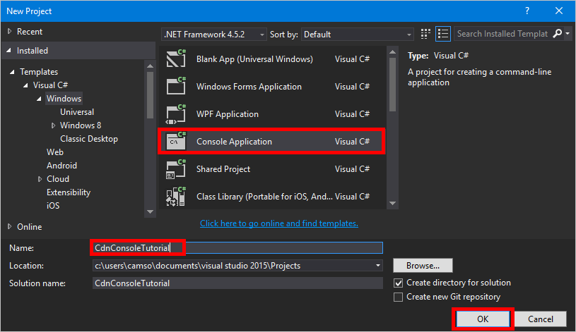

<properties
    pageTitle="快速入門 Azure CDN 文件庫的.NET |Microsoft Azure"
    description="瞭解如何撰寫管理 Azure CDN 使用 Visual Studio.NET 應用程式。"
    services="cdn"
    documentationCenter=".net"
    authors="camsoper"
    manager="erikre"
    editor=""/>

<tags
    ms.service="cdn"
    ms.workload="tbd"
    ms.tgt_pltfrm="na"
    ms.devlang="na"
    ms.topic="article"
    ms.date="09/15/2016"
    ms.author="casoper"/>

# <a name="get-started-with-azure-cdn-development"></a>Azure CDN 開發快速入門

> [AZURE.SELECTOR]
- [Node.js](cdn-app-dev-node.md)
- [.NET](cdn-app-dev-net.md)

您可以使用[Azure CDN 文件庫的.NET](https://msdn.microsoft.com/library/mt657769.aspx)自動建立和管理 CDN 設定檔及結束點。  本教學課程中會引導您透過建立簡單的.NET 主控台應用程式的示範多個可用的作業。  本教學課程中不是.net 詳細說明 Azure CDN 文件庫的所有部分。

您必須完成本教學課程的 Visual Studio 2015。  [Visual Studio 社群 2015年](https://www.visualstudio.com/products/visual-studio-community-vs.aspx)是免費下載。

> [AZURE.TIP] 使用 MSDN 下載[完成本教學課程中的專案](https://code.msdn.microsoft.com/Azure-CDN-Management-1f2fba2c)。

[AZURE.INCLUDE [cdn-app-dev-prep](../../includes/cdn-app-dev-prep.md)]

## <a name="create-your-project-and-add-nuget-packages"></a>建立您的專案，以及新增 Nuget 套件

現在，我們已建立我們 CDN 的設定檔的 [資源群組，並獲得我們 Azure AD 應用程式的權限管理 CDN 設定檔和群組內的結束點，我們可以開始建立應用程式。

從 Visual Studio 2015 中，按一下**檔案**，**新增**]，若要開啟新的 [專案] 對話方塊**的專案]** 。  展開**Visual C#**，然後選取左側窗格中的 [ **Windows** ]。  在中間窗格中按一下**主控台應用程式**。  您的專案的名稱，然後按一下**[確定**]。  



我們 project 會使用 Nuget 套件中包含一些 Azure 文件庫。  讓我們來新增人員至專案。

1. 按一下 [**工具**] 功能表， **Nuget 封裝管理員**] 和 [**封裝管理員主控台**。

    

2. 在封裝管理員主控台中，執行下列命令以安裝**Active Directory 驗證文件庫 (ADAL)**:

    `Install-Package Microsoft.IdentityModel.Clients.ActiveDirectory`

3. 執行下列動作來安裝**Azure CDN 管理文件庫**︰

    `Install-Package Microsoft.Azure.Management.Cdn`

## <a name="directives-constants-main-method-and-helper-methods"></a>指示詞、 常數、 主方法和協助人員的方法

就讓我們開始撰寫我們程式的基本結構。

1. 回 Program.cs] 索引標籤，取代`using`指示詞，以下列頂端︰

    ```csharp
    using System;
    using System.Collections.Generic;
    using Microsoft.Azure.Management.Cdn;
    using Microsoft.Azure.Management.Cdn.Models;
    using Microsoft.Azure.Management.Resources;
    using Microsoft.Azure.Management.Resources.Models;
    using Microsoft.IdentityModel.Clients.ActiveDirectory;
    using Microsoft.Rest;
    ```

2. 我們需要定義我們方法會使用某些常數。  在`Program`類別，但之前`Main`方法將下列文字新增。  請務必取代版面配置區，包括**&lt;角括弧&gt;**，視您的值。

    ```csharp
    //Tenant app constants
    private const string clientID = "<YOUR CLIENT ID>";
    private const string clientSecret = "<YOUR CLIENT AUTHENTICATION KEY>"; //Only for service principals
    private const string authority = "https://login.microsoftonline.com/<YOUR TENANT ID>/<YOUR TENANT DOMAIN NAME>";

    //Application constants
    private const string subscriptionId = "<YOUR SUBSCRIPTION ID>";
    private const string profileName = "CdnConsoleApp";
    private const string endpointName = "<A UNIQUE NAME FOR YOUR CDN ENDPOINT>";
    private const string resourceGroupName = "CdnConsoleTutorial";
    private const string resourceLocation = "<YOUR PREFERRED AZURE LOCATION, SUCH AS Central US>";
    ```

3. 也類別層級，定義這兩個變數。  我們會使用這些稍後來判斷我們的設定檔和端點已經存在。

    ```csharp
    static bool profileAlreadyExists = false;
    static bool endpointAlreadyExists = false;
    ```

4.  取代`Main`方法，如下所示︰

    ```csharp
    static void Main(string[] args)
    {
        //Get a token
        AuthenticationResult authResult = GetAccessToken();

        // Create CDN client
        CdnManagementClient cdn = new CdnManagementClient(new TokenCredentials(authResult.AccessToken))
            { SubscriptionId = subscriptionId };

        ListProfilesAndEndpoints(cdn);

        // Create CDN Profile
        CreateCdnProfile(cdn);

        // Create CDN Endpoint
        CreateCdnEndpoint(cdn);
        
        Console.WriteLine();

        // Purge CDN Endpoint
        PromptPurgeCdnEndpoint(cdn);

        // Delete CDN Endpoint
        PromptDeleteCdnEndpoint(cdn);

        // Delete CDN Profile
        PromptDeleteCdnProfile(cdn);

        Console.WriteLine("Press Enter to end program.");
        Console.ReadLine();
    }
    ```

5. 我們的其他方法將以 [是/否] 的問題。  新增下列方便的一些方法︰

    ```csharp
    private static bool PromptUser(string Question)
    {
        Console.Write(Question + " (Y/N): ");
        var response = Console.ReadKey();
        Console.WriteLine();
        if (response.Key == ConsoleKey.Y)
        {
            return true;
        }
        else if (response.Key == ConsoleKey.N)
        {
            return false;
        }
        else
        {
            // They pressed something other than Y or N.  Let's ask them again.
            return PromptUser(Question);
        }
    }
    ```

現在，我們程式的基本結構所撰寫，我們應該建立所呼叫的方法`Main`方法。

## <a name="authentication"></a>驗證

我們可以使用 Azure CDN 管理文件庫之前，我們需要我們服務主要項目會驗證並取得驗證權杖。  這個方法使用 ADAL 擷取權杖。

```csharp
private static AuthenticationResult GetAccessToken()
{
    AuthenticationContext authContext = new AuthenticationContext(authority); 
    ClientCredential credential = new ClientCredential(clientID, clientSecret);
    AuthenticationResult authResult = 
        authContext.AcquireTokenAsync("https://management.core.windows.net/", credential).Result;

    return authResult;
}
```

如果您使用的個別使用者驗證]，`GetAccessToken`方法看起來的位置略有不同。

>[AZURE.IMPORTANT] 如果您選擇讓，而不是主要服務的個別使用者驗證，僅使用此程式碼範例。

```csharp
private static AuthenticationResult GetAccessToken()
{
    AuthenticationContext authContext = new AuthenticationContext(authority);
    AuthenticationResult authResult = authContext.AcquireTokenAsync("https://management.core.windows.net/",
        clientID, new Uri("http://<redirect URI>"), new PlatformParameters(PromptBehavior.RefreshSession)).Result;

    return authResult;
}
```

請務必取代`<redirect URI>`使用重新導向 URI 輸入當您註冊 Azure AD 中的應用程式。

## <a name="list-cdn-profiles-and-endpoints"></a>清單 CDN 設定檔及結束點

現在，我們已準備好執行 CDN 作業。  我們方法時的第一個項目是清單，所有的設定檔與我們資源] 群組中的端點，如果找到我們常數中指定的設定檔和 [結束點名稱的相符項目也能讓的記事以供下次使用我們不嘗試建立重複的項目。

```csharp
private static void ListProfilesAndEndpoints(CdnManagementClient cdn)
{
    // List all the CDN profiles in this resource group
    var profileList = cdn.Profiles.ListByResourceGroup(resourceGroupName);
    foreach (Profile p in profileList)
    {
        Console.WriteLine("CDN profile {0}", p.Name);
        if (p.Name.Equals(profileName, StringComparison.OrdinalIgnoreCase))
        {
            // Hey, that's the name of the CDN profile we want to create!
            profileAlreadyExists = true;
        }

        //List all the CDN endpoints on this CDN profile
        Console.WriteLine("Endpoints:");
        var endpointList = cdn.Endpoints.ListByProfile(p.Name, resourceGroupName);
        foreach (Endpoint e in endpointList)
        {
            Console.WriteLine("-{0} ({1})", e.Name, e.HostName);
            if (e.Name.Equals(endpointName, StringComparison.OrdinalIgnoreCase))
            {
                // The unique endpoint name already exists.
                endpointAlreadyExists = true;
            }
        }
        Console.WriteLine();
    }
}
```

## <a name="create-cdn-profiles-and-endpoints"></a>建立 CDN 設定檔及結束點

接下來，我們會建立設定檔。

```csharp
private static void CreateCdnProfile(CdnManagementClient cdn)
{
    if (profileAlreadyExists)
    {
        Console.WriteLine("Profile {0} already exists.", profileName);
    }
    else
    {
        Console.WriteLine("Creating profile {0}.", profileName);
        ProfileCreateParameters profileParms =
            new ProfileCreateParameters() { Location = resourceLocation, Sku = new Sku(SkuName.StandardVerizon) };
        cdn.Profiles.Create(profileName, profileParms, resourceGroupName);
    }
}
```

設定檔建立後，我們要建立端點。

```csharp
private static void CreateCdnEndpoint(CdnManagementClient cdn)
{
    if (endpointAlreadyExists)
    {
        Console.WriteLine("Profile {0} already exists.", profileName);
    }
    else
    {
        Console.WriteLine("Creating endpoint {0} on profile {1}.", endpointName, profileName);
        EndpointCreateParameters endpointParms =
            new EndpointCreateParameters()
            {
                Origins = new List<DeepCreatedOrigin>() { new DeepCreatedOrigin("Contoso", "www.contoso.com") },
                IsHttpAllowed = true,
                IsHttpsAllowed = true,
                Location = resourceLocation
            };
        cdn.Endpoints.Create(endpointName, endpointParms, profileName, resourceGroupName);
    }
}
```

>[AZURE.NOTE] 上述範例會指派端點使用 [主機名稱為*「 contoso 」*原點`www.contoso.com`。  您應該變更為指向您自己的原點主機名稱。

## <a name="purge-an-endpoint"></a>清除端點

假設端點一建立之後，我們可能會想要執行程式中的一項常見工作清除我們端點中的內容。

```csharp
private static void PromptPurgeCdnEndpoint(CdnManagementClient cdn)
{
    if (PromptUser(String.Format("Purge CDN endpoint {0}?", endpointName)))
    {
        Console.WriteLine("Purging endpoint. Please wait...");
        cdn.Endpoints.PurgeContent(endpointName, profileName, resourceGroupName, new List<string>() { "/*" });
        Console.WriteLine("Done.");
        Console.WriteLine();
    }
}
```

>[AZURE.NOTE] 上述字串的範例中`/*`表示我想要清除的端點路徑的根目錄中的所有項目。  這是相當於檢查 Azure 入口網站的 「 清除 」] 對話方塊中的 [**清除所有**項目。 在 [`CreateCdnProfile`方法，我在自己建立我們的設定檔以使用程式碼的**Azure CDN Verizon 從**設定檔`Sku = new Sku(SkuName.StandardVerizon)`，因此這是成功。  不過，**從 Akamai Azure CDN**設定檔不支援**[全部清除**]，如果我已在本教學課程中使用 Akamai 設定檔，我必須包含要清除的特定路徑。

## <a name="delete-cdn-profiles-and-endpoints"></a>刪除 CDN 設定檔和端點

我們的結束點和設定檔，將會刪除的最後一個方法。

```csharp
private static void PromptDeleteCdnEndpoint(CdnManagementClient cdn)
{
    if(PromptUser(String.Format("Delete CDN endpoint {0} on profile {1}?", endpointName, profileName)))
    {
        Console.WriteLine("Deleting endpoint. Please wait...");
        cdn.Endpoints.DeleteIfExists(endpointName, profileName, resourceGroupName);
        Console.WriteLine("Done.");
        Console.WriteLine();
    }
}

private static void PromptDeleteCdnProfile(CdnManagementClient cdn)
{
    if(PromptUser(String.Format("Delete CDN profile {0}?", profileName)))
    {
        Console.WriteLine("Deleting profile. Please wait...");
        cdn.Profiles.DeleteIfExists(profileName, resourceGroupName);
        Console.WriteLine("Done.");
        Console.WriteLine();
    }
}
```

## <a name="running-the-program"></a>執行程式

現在，我們可以編譯，並按一下**[開始**] 按鈕，在 Visual Studio 中的執行的程式。


當程式達到上述的提示時，您應該可以返回您 [Azure 入口網站中的 [資源] 群組，並查看已建立設定檔。


然後，我們可以確認提示執行程式的其餘部分。


## <a name="next-steps"></a>後續步驟

若要查看已完成的專案，從這個逐步解說，[下載的範例](https://code.msdn.microsoft.com/Azure-CDN-Management-1f2fba2c)。

若要尋找其他的文件上 Azure CDN 管理文件庫的.NET，檢視[MSDN 上的參考](https://msdn.microsoft.com/library/mt657769.aspx)。

管理使用[PowerShell](./cdn-manage-powershell.md)CDN 資源。


