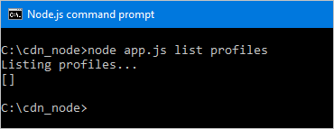

<properties
    pageTitle="快速入門 Azure CDN SDK 的 Node.js |Microsoft Azure"
    description="瞭解如何撰寫 Node.js 應用程式來管理 Azure cdn 到底。"
    services="cdn"
    documentationCenter="nodejs"
    authors="camsoper"
    manager="erikre"
    editor=""/>

<tags
    ms.service="cdn"
    ms.workload="tbd"
    ms.tgt_pltfrm="na"
    ms.devlang="na"
    ms.topic="article"
    ms.date="09/15/2016"
    ms.author="casoper"/>

# <a name="get-started-with-azure-cdn-development"></a>Azure CDN 開發快速入門

> [AZURE.SELECTOR]
- [Node.js](cdn-app-dev-node.md)
- [.NET](cdn-app-dev-net.md)

您可以使用[Node.js Azure CDN SDK](https://www.npmjs.com/package/azure-arm-cdn)自動建立和管理 CDN 設定檔及結束點。  本教學課程中會引導您透過建立簡單的 Node.js 主控台應用程式的示範多個可用的作業。  本教學課程中不是 Node.js 的詳細說明 Azure CDN SDK 的所有部分。

若要完成此教學課程中，您應該已經有[Node.js](http://www.nodejs.org) **為 4.x.x**或更高安裝和設定。  您可以使用您想要建立 Node.js 應用程式的任何文字編輯器。  若要撰寫本教學課程中，我可以使用[Visual Studio 程式碼](https://code.visualstudio.com)。  

> [AZURE.TIP] 使用 MSDN 下載[完成本教學課程中的專案](https://code.msdn.microsoft.com/Azure-CDN-SDK-for-Nodejs-c712bc74)。

[AZURE.INCLUDE [cdn-app-dev-prep](../../includes/cdn-app-dev-prep.md)]

## <a name="create-your-project-and-add-npm-dependencies"></a>建立您的專案，並新增 NPM 相依性

現在，我們已建立我們 CDN 的設定檔的 [資源群組，並獲得我們 Azure AD 應用程式的權限管理 CDN 設定檔和群組內的結束點，我們可以開始建立應用程式。

建立資料夾來儲存您的應用程式。  您目前的路徑的 Node.js 工具主控台，設定您目前位置到新資料夾，並執行初始化專案︰
    
    npm init
    
您會再顯示一系列的初始化專案的問題。  **指向 [項目**，本教學課程中使用*app.js*。  您可以看到我在下列範例中的其他選項。


現在我們專案初始化*packages.json*檔案。  我們 project 會使用 NPM 套件中包含一些 Azure 文件庫。  我們將使用 Azure 用戶端執行階段的 Node.js (ms-其餘-azure) 和 Azure CDN 用戶端的文件庫的 Node.js (azure-雲端世界-cd)。  讓我們來新增人員至專案相依性。
 
    npm install --save ms-rest-azure
    npm install --save azure-arm-cdn

完成封包後安裝， *package.json*檔案看起來應該像此範例 （數字可能不同的版本）︰

``` json
{
  "name": "cdn_node",
  "version": "1.0.0",
  "description": "Azure CDN Node.js tutorial project",
  "main": "app.js",
  "scripts": {
    "test": "echo \"Error: no test specified\" && exit 1"
  },
  "author": "Cam Soper",
  "license": "MIT",
  "dependencies": {
    "azure-arm-cdn": "^0.2.1",
    "ms-rest-azure": "^1.14.4"
  }
}
```

最後，使用文字編輯器建立空白的文字檔案，並將其儲存為*app.js*我們專案資料夾的根目錄。  現在，我們準備好要開始撰寫程式碼。

## <a name="requires-constants-authentication-and-structure"></a>需要，常數、 驗證及結構

使用*app.js*我們編輯器中開啟，就讓我們開始撰寫我們程式的基本結構。

1. 新增 「 需要 「 我們 NPM 套件頂端以下列︰

    ``` javascript
    var msRestAzure = require('ms-rest-azure');
    var cdnManagementClient = require('azure-arm-cdn');
    ```

2. 我們需要定義我們方法會使用某些常數。  新增下列項目。  請務必取代版面配置區，包括**&lt;角括弧&gt;**，視您的值。

    ``` javascript
    //Tenant app constants
    const clientId = "<YOUR CLIENT ID>";
    const clientSecret = "<YOUR CLIENT AUTHENTICATION KEY>"; //Only for service principals
    const tenantId = "<YOUR TENANT ID>";

    //Application constants
    const subscriptionId = "<YOUR SUBSCRIPTION ID>";
    const resourceGroupName = "CdnConsoleTutorial";
    const resourceLocation = "<YOUR PREFERRED AZURE LOCATION, SUCH AS Central US>";
    ```

3. 接下來，我們將會產生 CDN 管理用戶端，讓它我們認證。

    ``` javascript
    var credentials = new msRestAzure.ApplicationTokenCredentials(clientId, tenantId, clientSecret);
    var cdnClient = new cdnManagementClient(credentials, subscriptionId);
    ```
    
    如果您使用的個別使用者驗證，這兩行看起來稍有不同。

    >[AZURE.IMPORTANT] 如果您選擇讓，而不是主要服務的個別使用者驗證，僅使用此程式碼範例。  請小心保護您的個別使用者認證，並將這些私人。

    ``` javascript
    var credentials = new msRestAzure.UserTokenCredentials(clientId, 
        tenantId, '<username>', '<password>', '<redirect URI>');
    var cdnClient = new cdnManagementClient(credentials, subscriptionId);
    ```

    請務必取代中的項目**&lt;角括弧&gt;**以正確的資訊。  針對`<redirect URI>`，使用重新導向 URI 輸入當您註冊 Azure AD 中的應用程式。
    

4.  我們 Node.js 主控台應用程式會採取一些命令列參數。  讓我們來驗證該至少一個參數傳遞。

    ```javascript
    //Collect command-line parameters
    var parms = process.argv.slice(2);

    //Do we have parameters?
    if(parms == null || parms.length == 0)
    {
        console.log("Not enough parameters!");
        console.log("Valid commands are list, delete, create, and purge.");
        process.exit(1);
    }
    ```

5. 接著就我們的程式，在我們的分支根據參數傳遞其他函數的主要部分。

    ```javascript
    switch(parms[0].toLowerCase())
    {
        case "list":
            cdnList();
            break;

        case "create":
            cdnCreate();
            break;
        
        case "delete":
            cdnDelete();
            break;

        case "purge":
            cdnPurge();
            break;

        default:
            console.log("Valid commands are list, delete, create, and purge.");
            process.exit(1);
    }
    ```

6.  在多個程式中的位置] 中，我們需要，確保正確的數字的參數傳遞的如果沒有看起來正確顯示協助。  現在就讓我們建立函數來執行這項作業。

    ```javascript
    function requireParms(parmCount) {
        if(parms.length < parmCount) {
            usageHelp(parms[0].toLowerCase());
            process.exit(1);
        }
    }

    function usageHelp(cmd) {
        console.log("Usage for " + cmd + ":");
        switch(cmd)
        {
            case "list":
                console.log("list profiles");
                console.log("list endpoints <profile name>");
                break;

            case "create":
                console.log("create profile <profile name>");
                console.log("create endpoint <profile name> <endpoint name> <origin hostname>");
                break;
            
            case "delete":
                console.log("delete profile <profile name>");
                console.log("delete endpoint <profile name> <endpoint name>");
                break;

            case "purge":
                console.log("purge <profile name> <endpoint name> <path>");
                break;

            default:
                console.log("Invalid command.");
        }
    }
    ```

7. 最後，我們將使用 CDN 管理用戶端函數是非同步，因此需要呼叫回完成這些方法。  現在就讓我們進行可以顯示的輸出 CDN 管理用戶端 （如果有的話），請結束程式正常。

    ```javascript
    function callback(err, result, request, response) {
        if (err) {
            console.log(err);
            process.exit(1);
        } else {
            console.log((result == null) ? "Done!" : result);
            process.exit(0);
        }
    }
    ```

現在我們程式的基本結構所撰寫，我們應該建立函數呼叫根據我們的參數。

## <a name="list-cdn-profiles-and-endpoints"></a>清單 CDN 設定檔及結束點

現在就讓我們開始清單我們現有的設定檔和 [結束點的程式碼。  我的程式碼的註解提供預期的語法，讓我們知道每個參數到哪裡去。

```javascript
// list profiles
// list endpoints <profile name>
function cdnList(){
    requireParms(2);
    switch(parms[1].toLowerCase())
    {
        case "profiles":
            console.log("Listing profiles...");
            cdnClient.profiles.listByResourceGroup(resourceGroupName, callback);
            break;

        case "endpoints":
            requireParms(3);
            console.log("Listing endpoints...");
            cdnClient.endpoints.listByProfile(parms[2], resourceGroupName, callback);
            break;

        default:
            console.log("Invalid parameter.");
            process.exit(1);
    }
}
```

## <a name="create-cdn-profiles-and-endpoints"></a>建立 CDN 設定檔及結束點

接下來，我們要撰寫函數來建立設定檔及結束點。

```javascript
function cdnCreate() {
    requireParms(2);
    switch(parms[1].toLowerCase())
    {
        case "profile":
            cdnCreateProfile();
            break;

        case "endpoint":
            cdnCreateEndpoint();
            break;

        default:
            console.log("Invalid parameter.");
            process.exit(1);
    }
}

// create profile <profile name>
function cdnCreateProfile() {
    requireParms(3);
    console.log("Creating profile...");
    var standardCreateParameters = {
        location: resourceLocation,
        sku: {
            name: 'Standard_Verizon'
        }
    };

    cdnClient.profiles.create(parms[2], standardCreateParameters, resourceGroupName, callback);
}

// create endpoint <profile name> <endpoint name> <origin hostname>        
function cdnCreateEndpoint() {
    requireParms(5);
    console.log("Creating endpoint...");
    var endpointProperties = {
        location: resourceLocation,
        origins: [{
            name: parms[4],
            hostName: parms[4]
        }]
    };

    cdnClient.endpoints.create(parms[3], endpointProperties, parms[2], resourceGroupName, callback);
}
```

## <a name="purge-an-endpoint"></a>清除端點

假設端點一建立之後，我們可能會想要執行程式中的一項常見工作清除我們端點中的內容。

```javascript
// purge <profile name> <endpoint name> <path>
function cdnPurge() {
    requireParms(4);
    console.log("Purging endpoint...");
    var purgeContentPaths = [ parms[3] ];
    cdnClient.endpoints.purgeContent(parms[2], parms[1], resourceGroupName, purgeContentPaths, callback);
}
```

## <a name="delete-cdn-profiles-and-endpoints"></a>刪除 CDN 設定檔和端點

我們會包含的最後一個函數刪除端點及設定檔。

```javascript
function cdnDelete() {
    requireParms(2);
    switch(parms[1].toLowerCase())
    {
        // delete profile <profile name>
        case "profile":
            requireParms(3);
            console.log("Deleting profile...");
            cdnClient.profiles.deleteIfExists(parms[2], resourceGroupName, callback);
            break;

        // delete endpoint <profile name> <endpoint name>
        case "endpoint":
            requireParms(4);
            console.log("Deleting endpoint...");
            cdnClient.endpoints.deleteIfExists(parms[3], parms[2], resourceGroupName, callback);
            break;

        default:
            console.log("Invalid parameter.");
            process.exit(1);
    }
}
```

## <a name="running-the-program"></a>執行程式

現在，我們可以執行我們最愛的偵錯工具使用我們 Node.js 程式，或是在主控台。

> [AZURE.TIP] 如果您使用的為您偵錯工具 Visual Studio 程式碼，必須將您的環境設定為傳入的命令列參數。  Visual Studio 程式碼會**lanuch.json**檔案中。  尋找名為**引數**的屬性，然後新增您的參數的字串值的陣列，讓它看起來就像這樣︰ `"args": ["list", "profiles"]`。

現在就讓我們開始，列出我們的設定檔。



我們回頭空白陣列。  資源群組中，我們沒有安裝任何的設定檔，因為的預期。  現在讓我們來建立設定檔。


現在讓我們來新增端點。


最後，讓我們來刪除我們的設定檔。


## <a name="next-steps"></a>後續步驟

若要查看已完成的專案，從這個逐步解說，[下載的範例](https://code.msdn.microsoft.com/Azure-CDN-SDK-for-Nodejs-c712bc74)。

若要查看的 Azure CDN SDK 的參照的 Node.js，檢視 [[參照](http://azure.github.io/azure-sdk-for-node/azure-arm-cdn/latest/)]。

若要尋找其他文件上 Azure SDK Node.js，檢視[完整的參考](http://azure.github.io/azure-sdk-for-node/)。

管理使用[PowerShell](./cdn-manage-powershell.md)CDN 資源。

