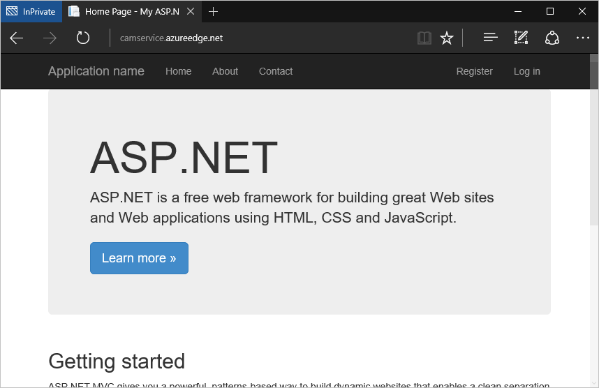

<properties
    pageTitle="在雲端服務整合 Azure CDN |Microsoft Azure"
    description="教學課程會指導您如何部署雲端服務，提供整合式 Azure CDN 端點的內容"
    services="cdn, cloud-services"
    documentationCenter=".net"
    authors="camsoper"
    manager="erikre"
    editor="tysonn"/>

<tags
    ms.service="cdn"
    ms.workload="tbd"
    ms.tgt_pltfrm="na"
    ms.devlang="dotnet"
    ms.topic="article"
    ms.date="07/28/2016"
    ms.author="casoper"/>

# 在雲端服務整合 Azure CDN

與 Azure CDN，提供從雲端服務的位置的任何內容，就可以整合雲端服務。 這種方法可讓您下列優點︰

- 輕鬆部署與更新的圖像、 指令碼和雲端服務的專案目錄中的樣式表
- 輕鬆升級您的雲端服務，例如 jQuery 或啟動安裝的版本中的 NuGet 套件
- 管理 Web 應用程式與您 CDN 提供內容皆是從相同的 Visual Studio 介面
- Web 應用程式和 CDN 提供內容的整合的部署工作流程
- 與 Azure CDN 整合 ASP.NET 搭售和縮小

## 您將學習 ##

在此教學課程中，您將學習如何︰

-   [雲端服務整合 Azure CDN 端點，並從 Azure CDN 提供在網頁中的靜態內容](#deploy)
-   [設定您的雲端服務中的靜態內容的快取設定](#caching)
-   [由控制器的動作，透過 Azure CDN 提供內容](#controller)
-   [供應結合在一起，同時保留指令碼偵錯體驗 Visual Studio minified 透過 Azure CDN 的內容](#bundling)
-   [設定您 Azure CDN 離線時後援為您的 CSS 和指令碼](#fallback)

## 您會建立 ##

部署雲端服務 Web 角色使用預設 ASP.NET MVC 範本、 新增提供內容從整合式 Azure CDN，例如圖像、 控制器巨集指令的結果及預設 JavaScript 及 CSS 檔案的程式碼和也撰寫程式碼設定配搭 served 的 cdn 到底是離線的後援機制。

## 您需要的項目 ##

本教學課程中，您必須︰

-   使用中的[Microsoft Azure 帳戶](/account/)
-   使用[Azure SDK](http://go.microsoft.com/fwlink/?linkid=518003&clcid=0x409)的 visual Studio 2015

> [AZURE.NOTE] 您必須完成本教學課程 Azure 帳戶︰
> + 您可以[開啟 Azure 帳戶免費](/pricing/free-trial/)-取得貸項總計試用付費 Azure 服務，您可以使用和即使使用這些之後最多，您可以將該帳戶，然後使用免費 Azure 服務，例如網站。
> + 您可以[啟動 MSDN 訂閱者優點](/pricing/member-offers/msdn-benefits-details/)-您的 MSDN 訂閱可讓您貸項總計付費 Azure 服務，您可以使用每個月。

## 部署雲端服務 ##

在此區段中，預設 ASP.NET MVC 應用程式範本，在 Visual Studio 2015 中部署至雲端服務 Web 角色，然後整合新的 CDN 結束點。 請遵循以下指示︰

1. 在 Visual Studio 2015，建立新的 Azure 雲端服務功能表列中移至**檔案 > 新增 > 專案 > 雲端 > Azure 雲端服務**。 名稱，然後按一下**[確定**]。

    

2. 選取**ASP.NET 網頁角色**，然後按一下**>**] 按鈕。 按一下 [確定]。

    

3. 選取**MVC** ，然後按一下**[確定**]。

    

4. 現在，發佈此網頁角色 Azure 雲端服務。 以滑鼠右鍵按一下雲端服務專案，然後選取 [**發佈]**。

    

5. 如果您還沒有登入 Microsoft Azure，請按一下 [**新增帳戶]**下拉式清單，然後按一下 [**新增帳戶]**功能表項目。

    

6. 在 [登入] 頁面中，Microsoft 帳戶登入您用來啟動 Azure 帳戶。
7. 一旦您登入，請按一下 [**下一步**]。

    

8. 假設您還沒有建立雲端服務或儲存帳戶，Visual Studio 可協助您建立兩者。 在 [**建立雲端服務與帳戶**] 對話方塊中，輸入所要的服務名稱，然後選取所要的區域。 然後按一下 [**建立**]。

    

9. 在 [發佈設定] 頁面混合式部署設定，然後按一下 [**發佈**]。

    

    >[AZURE.NOTE] 雲端服務的發佈程序會花費很長的時間。 啟用 Web 部署的所有角色] 選項，可以讓您更快的雲端服務的偵錯時，提供給您的 Web 角色快速 （但暫時） 更新。 如需此選項的詳細資訊，請參閱[發佈使用 Azure 工具雲端服務](http://msdn.microsoft.com/library/ff683672.aspx)。

    **Microsoft Azure 活動記錄**會顯示該發佈狀態**已完成**，當您將建立這項雲端服務整合 CDN 結束點。

    >[AZURE.WARNING] 如果發佈之後, 已部署的雲端服務會顯示錯誤畫面，它可能是因為您已部署雲端服務使用的以[來賓的不包含.NET 4.5.2 OS](../cloud-services/cloud-services-guestos-update-matrix.md#news-updates)。  您可以[部署.NET 4.5.2 啟動工作](../cloud-services/cloud-services-dotnet-install-dotnet.md)，以解決此問題。

## 建立新的 CDN 設定檔

Cdn 到底設定檔是 CDN 端點的集合。  每個設定檔含有一或多個 CDN 結束點。  您可能會想要組織 CDN 端點 internet 的網域、 web 應用程式，或一些其他準則中使用多個設定檔。

> [AZURE.TIP] 如果您已經有的 CDN 設定檔，您想要使用此教學課程中，前往[建立新的 CDN 結束點](#create-a-new-cdn-endpoint)。

[AZURE.INCLUDE [cdn-create-profile](../../includes/cdn-create-profile.md)]

## 建立新的 CDN 端點

**若要建立新的 CDN 端點，為您儲存的帳戶**

1. 在[管理入口網站 Azure](https://portal.azure.com)，瀏覽至您的 CDN 設定檔。  您可能會有釘選它到上一個步驟中的儀表板。  如果您不是，您可以找到它，按一下 [**瀏覽]**，然後**CDN 設定檔**]，按一下您要新增端點，可設定檔。

    Cdn 到底設定檔刀隨即出現。

    ![Cdn 到底設定檔][cdn-profile-settings]

2. 按一下 [**新增結束點**] 按鈕。

    ![新增結束點] 按鈕][cdn-new-endpoint-button]

    **新增端點**刀隨即出現。

    ![新增端點刀][cdn-add-endpoint]

3. 此 CDN 端點，請輸入 [**名稱**]。  這個名稱會用來存取您的網域的快取的資源`<EndpointName>.azureedge.net`。

4. 在 [**來源類型**] 下拉式清單中，選取 [*雲端服務*]。  

5. 在 [ **Origin 主機名稱**] 下拉式清單中，選取您的雲端服務。

6. 您可以保留預設值的**原點路徑**與**原始主機標頭**，**原始通訊協定/連接埠**。  您必須指定至少有一個通訊協定 （HTTP 或 HTTPS）。

7. 按一下 [**新增**] 按鈕，以建立新的結束點。

8. 端點建立之後，它會出現在清單中的設定檔的結束點。 [清單] 檢視會顯示用來存取快取的內容，以及原始網域的 URL。

    ![Cdn 到底端點][cdn-endpoint-success]

    > [AZURE.NOTE] 端點會立即無法為可供使用。  可以需要 90 分鐘的時間，才會傳播到 CDN 網路註冊。 嘗試立即使用 CDN 的網域名稱的使用者可能會收到狀態碼 404，直到該內容會透過 CDN 提供使用。

## 測試 CDN 端點

發佈的狀態為 [**已完成]**，開啟瀏覽器視窗，然後瀏覽至**http://<cdnName>*.azureedge.net/Content/bootstrap.css**。 在 [我的設定，此 URL 為︰

    http://camservice.azureedge.net/Content/bootstrap.css

對應至下列來源 URL CDN 結束點︰

    http://camcdnservice.cloudapp.net/Content/bootstrap.css

當您瀏覽至**http://*&lt;cdnName >*.azureedge.net/Content/bootstrap.css**，根據您的瀏覽器中，將會提示您下載或開啟您已發佈的 Web 應用程式已預先 bootstrap.css。

同樣地，您就可以存取任何公開存取 URL * *http://*&lt;serviceName >*.cloudapp.net/**，直接從您的 CDN 端點。 例如︰

-   從 /Script 路徑.js 檔案
-   從 /Content 任何內容檔案路徑
-   任何控制器/動作
-   如果在您的 CDN 端點，任何具有查詢字串 URL 啟用查詢字串

事實上，使用上述的設定，您可以主控整個雲端服務**http://*&lt;cdnName >*.azureedge.net/**。如果我瀏覽至**http://camservice.azureedge.net/ * * 將巨集指令結果中的常用/索引。

不過，這不表示永遠建議您先 （或通常建議您先） 可透過 Azure CDN 整個雲端服務。 警告如下︰

-   這個方法需要為公開]，因為 Azure CDN 無法提供任何私人的內容，此時您整個網站。
-   如果基於任何原因離線 CDN 端點，是否排程的維護或使用者錯誤，您整個雲端服務離線除非客戶，可以重新導向至來源 URL * *http://*&lt;serviceName >*.cloudapp.net/**。
-   即使使用自訂的快取控制項設定 （請參閱[設定快取靜態檔案，您的雲端服務中的選項](#caching)），CDN 結束點並無法改善效能的高度動態內容。 如果您嘗試從您的 CDN 端點的 [首頁] 頁面載入為第一次，是相當簡單頁面載入預設首頁至少 5 秒所花費的上方，顯示通知。 假設就會發生什麼事的用戶端經驗如果此頁面包含必須更新每分鐘的動態內容。 提供從 CDN 端點的動態內容需要簡短的快取到期，將常用的快取遺漏 CDN 結束點。 這痛您雲端服務的效能和 cdn 到底的目的，就失去了。

替代方案是決定要從 Azure CDN 作為您的雲端服務中以依案例為基礎的內容。 若要這麼做，您已經看到如何從 CDN 端點存取個別內容檔案。 我會告訴您怎麼做透過 CDN 端點的特定控制器動作中[由控制器的動作，透過 Azure CDN 提供內容](#controller)。

## 設定您的雲端服務中的靜態檔案的快取選項 ##

整合 Azure CDN 您雲端服務中，您可以指定您想要快取中的 CDN 端點的靜態內容的方式。 若要這麼做，請開啟*Web.config*從 Web 角色專案 (例如 WebRole1) 並新增`<staticContent>`項目`<system.webServer>`。 下列 XML 會設定為在 3 天後過期的快取。  

    <system.webServer>
      <staticContent>
        <clientCache cacheControlMode="UseMaxAge" cacheControlMaxAge="3.00:00:00"/>
      </staticContent>
      ...
    </system.webServer>

一旦您這麼做，您的雲端服務中的所有靜態檔案會觀察 CDN 快取中相同的規則。 微調快取設定的控制，請將*Web.config*檔案新增到資料夾，然後新增您的設定。 例如*\Content*資料夾新增*Web.config*檔案，並以下列 XML 取代內容︰

    <?xml version="1.0"?>
    <configuration>
      <system.webServer>
        <staticContent>
          <clientCache cacheControlMode="UseMaxAge" cacheControlMaxAge="15.00:00:00"/>
        </staticContent>
      </system.webServer>
    </configuration>

此設定會導致快取為 15 天*\Content*資料夾中的所有靜態檔案。

如需有關如何設定`<clientCache>`項目，請參閱[用戶端快取&lt;clientCache >](http://www.iis.net/configreference/system.webserver/staticcontent/clientcache)。

在[由控制器的動作，透過 Azure CDN 提供內容](#controller)，我將會顯示您如何 CDN 快取中設定的控制站動作結果的快取設定。

## 由控制器的動作，透過 Azure CDN 提供內容 ##

當您與 Azure CDN 整合雲端服務 Web 角色時，是很容易由控制器的動作，透過 Azure CDN 提供內容。 非提供您的雲端服務，直接透過 Azure CDN （示範上方），[馬頓 Balliauw](https://twitter.com/maartenballiauw)示範如何處理有趣 MemeGenerator 控制器[減少與 Azure CDN 網頁上](http://channel9.msdn.com/events/TechDays/Techdays-2014-the-Netherlands/Reducing-latency-on-the-web-with-the-Windows-Azure-CDN)的延遲時間。 我會直接重現以下。

假設您想要產生 memes 根據像這樣的年輕 Chuck Norris 圖像 （依[Alan Light](http://www.flickr.com/photos/alan-light/218493788/)相片） 您雲端服務中︰

您有一個簡單`Index`動作，讓客戶，若要指定高級圖像，然後產生 meme 後張貼至動作。 由於 Chuck Norris，您應該會變得 （implementation） 熱門全域此頁面。 這是與 Azure CDN 提供半動態內容的好範例。

請遵循上述步驟，設定這個控制器動作︰

1. 在 [ *\Controllers* ] 資料夾中，建立新的.cs 檔案，稱為*MemeGeneratorController.cs*並取代內容下列程式碼。 請務必以您的 CDN 名稱取代醒目提示的部分。  

        using System;
        using System.Collections.Generic;
        using System.Diagnostics;
        using System.Drawing;
        using System.IO;
        using System.Net;
        using System.Web.Hosting;
        using System.Web.Mvc;
        using System.Web.UI;

        namespace WebRole1.Controllers
        {
            public class MemeGeneratorController : Controller
            {
                static readonly Dictionary<string, Tuple<string ,string>> Memes = new Dictionary<string, Tuple<string, string>>();

                public ActionResult Index()
                {
                    return View();
                }

                [HttpPost, ActionName("Index")]
                public ActionResult Index_Post(string top, string bottom)
                {
                    var identifier = Guid.NewGuid().ToString();
                    if (!Memes.ContainsKey(identifier))
                    {
                        Memes.Add(identifier, new Tuple<string, string>(top, bottom));
                    }

                    return Content("<a href=\"" + Url.Action("Show", new {id = identifier}) + "\">here's your meme</a>");
                }

                [OutputCache(VaryByParam = "*", Duration = 1, Location = OutputCacheLocation.Downstream)]
                public ActionResult Show(string id)
                {
                    Tuple<string, string> data = null;
                    if (!Memes.TryGetValue(id, out data))
                    {
                        return new HttpStatusCodeResult(HttpStatusCode.NotFound);
                    }

                    if (Debugger.IsAttached) // Preserve the debug experience
                    {
                        return Redirect(string.Format("/MemeGenerator/Generate?top={0}&bottom={1}", data.Item1, data.Item2));
                    }
                    else // Get content from Azure CDN
                    {
                        return Redirect(string.Format("http://<yourCdnName>.azureedge.net/MemeGenerator/Generate?top={0}&bottom={1}", data.Item1, data.Item2));
                    }
                }

                [OutputCache(VaryByParam = "*", Duration = 3600, Location = OutputCacheLocation.Downstream)]
                public ActionResult Generate(string top, string bottom)
                {
                    string imageFilePath = HostingEnvironment.MapPath("~/Content/chuck.bmp");
                    Bitmap bitmap = (Bitmap)Image.FromFile(imageFilePath);

                    using (Graphics graphics = Graphics.FromImage(bitmap))
                    {
                        SizeF size = new SizeF();
                        using (Font arialFont = FindBestFitFont(bitmap, graphics, top.ToUpperInvariant(), new Font("Arial Narrow", 100), out size))
                        {
                            graphics.DrawString(top.ToUpperInvariant(), arialFont, Brushes.White, new PointF(((bitmap.Width - size.Width) / 2), 10f));
                        }
                        using (Font arialFont = FindBestFitFont(bitmap, graphics, bottom.ToUpperInvariant(), new Font("Arial Narrow", 100), out size))
                        {
                            graphics.DrawString(bottom.ToUpperInvariant(), arialFont, Brushes.White, new PointF(((bitmap.Width - size.Width) / 2), bitmap.Height - 10f - arialFont.Height));
                        }
                    }

                    MemoryStream ms = new MemoryStream();
                    bitmap.Save(ms, System.Drawing.Imaging.ImageFormat.Png);
                    return File(ms.ToArray(), "image/png");
                }

                private Font FindBestFitFont(Image i, Graphics g, String text, Font font, out SizeF size)
                {
                    // Compute actual size, shrink if needed
                    while (true)
                    {
                        size = g.MeasureString(text, font);

                        // It fits, back out
                        if (size.Height < i.Height &&
                             size.Width < i.Width) { return font; }

                        // Try a smaller font (90% of old size)
                        Font oldFont = font;
                        font = new Font(font.Name, (float)(font.Size * .9), font.Style);
                        oldFont.Dispose();
                    }
                }
            }
        }

2. 以滑鼠右鍵按一下預設`Index()`動作，並選取 [**新增檢視畫面**。

    

3.  接受下列設定值，然後按一下 [**新增**]。

    

4. 開啟新的*Views\MemeGenerator\Index.cshtml*並取代送出高級下列簡單的 HTML 內容︰

        <h2>Meme Generator</h2>

        <form action="" method="post">
            <input type="text" name="top" placeholder="Enter top text here" />
             
            <input type="text" name="bottom" placeholder="Enter bottom text here" />
             
            <input class="btn" type="submit" value="Generate meme" />
        </form>

5. 一次發佈雲端服務，並瀏覽至**http://*&lt;serviceName >*.cloudapp.net/MemeGenerator/Index** 在瀏覽器中的。

當您送出表單值`/MemeGenerator/Index`、`Index_Post`動作方法會傳回連結`Show`動作方法分別輸入的識別碼。 當您按一下連結時，您到達下列程式碼︰  

    [OutputCache(VaryByParam = "*", Duration = 1, Location = OutputCacheLocation.Downstream)]
    public ActionResult Show(string id)
    {
        Tuple<string, string> data = null;
        if (!Memes.TryGetValue(id, out data))
        {
            return new HttpStatusCodeResult(HttpStatusCode.NotFound);
        }

        if (Debugger.IsAttached) // Preserve the debug experience
        {
            return Redirect(string.Format("/MemeGenerator/Generate?top={0}&bottom={1}", data.Item1, data.Item2));
        }
        else // Get content from Azure CDN
        {
            return Redirect(string.Format("http://<yourCDNName>.azureedge.net/MemeGenerator/Generate?top={0}&bottom={1}", data.Item1, data.Item2));
        }
    }

如果您的本機偵錯工具附加時，您會收到與本機重新導向的一般偵錯體驗。 如果在雲端服務中執行，它會重新導向至︰

    http://<yourCDNName>.azureedge.net/MemeGenerator/Generate?top=<formInput>&bottom=<formInput>

對應至下列來源 URL 您 CDN 結束點︰

    http://<youCloudServiceName>.cloudapp.net/MemeGenerator/Generate?top=<formInput>&bottom=<formInput>

然後，您可以使用`OutputCacheAttribute`在`Generate`指定如何動作結果應該快取，其會受限於 Azure CDN 的方法。 下列程式碼指定快取的到期日 1 小時 （3600 秒）。

    [OutputCache(VaryByParam = "*", Duration = 3600, Location = OutputCacheLocation.Downstream)]

同樣地，您可以做任何控制器巨集指令的內容設定您的雲端服務中透過您的 Azure CDN，使用快取所要的選項。

在下一個區段中，我會顯示您要做的搭售和 minified 指令碼及 CSS 透過 Azure CDN 的方式。

## 與 Azure CDN 整合 ASP.NET 搭售和縮小 ##

指令碼及 CSS 樣式表變更不常，主要適合 Azure CDN 快取。 提供整個網頁角色透過您 Azure cdn 到底是最簡單的方法與 Azure CDN 整合搭售和縮小。 不過，您可能不想要執行此動作，我會告訴您如何操作時保留所需的 develper 和的經驗 ASP.NET 搭售縮小，例如︰

-   好的偵錯模式體驗
-   精簡的部署
-   立即更新指令碼/CSS 版本升級的用戶端
-   當您 CDN 端點失敗後援機制
-   最小化程式碼修改

在您建立的[整合與 Azure 網站和供應靜態內容從 Azure CDN 在網頁中 Azure CDN 端點](#deploy) **WebRole1** project 中，開啟 [ *App_Start\BundleConfig.cs* ，看看`bundles.Add()`方法呼叫。

    public static void RegisterBundles(BundleCollection bundles)
    {
        bundles.Add(new ScriptBundle("~/bundles/jquery").Include(
                    "~/Scripts/jquery-{version}.js"));
        ...
    }

第一個`bundles.Add()`陳述式在虛擬目錄新增指令碼套件`~/bundles/jquery`。 然後，開啟*Views\Shared\_Layout.cshtml*若要查看的指令碼套件標記的呈現方式。 您可以尋找 Razor 程式碼的下列行︰

    @Scripts.Render("~/bundles/jquery")

Azure Web 角色中執行此 Razor 程式碼時，它會呈現`

不過，當執行 Visual Studio 中輸入`F5`，它會呈現在套件中的每個指令碼檔個別 （上述情況，只有一個指令碼檔是在套件中）︰

    

這可讓您偵錯 JavaScript 程式碼，在您的開發環境中時減少一個用戶端連線 （搭售） 和改善檔案下載生產效能 （縮放）。 若要保留 Azure CDN 整合很棒的功能則。 此外，呈現的套件已包含自動產生的版本的字串，因為您想要複製的功能，因此當您更新透過 NuGet jQuery 版本，可在更新用戶端越快越。

整合 ASP.NET 搭售和縮小與您的 CDN 端點，請遵循下列步驟。

1. 回*App_Start\BundleConfig.cs*，修改`bundles.Add()`，請使用不同[套件建構函式](http://msdn.microsoft.com/library/jj646464.aspx)，可指定 CDN 地址的其中一個方法。 若要這麼做，取代`RegisterBundles`方法定義下列程式碼︰  

        public static void RegisterBundles(BundleCollection bundles)
        {
            bundles.UseCdn = true;
            var version = System.Reflection.Assembly.GetAssembly(typeof(Controllers.HomeController))
                .GetName().Version.ToString();
            var cdnUrl = "http://<yourCDNName>.azureedge.net/{0}?v=" + version;

            bundles.Add(new ScriptBundle("~/bundles/jquery", string.Format(cdnUrl, "bundles/jquery")).Include(
                        "~/Scripts/jquery-{version}.js"));

            bundles.Add(new ScriptBundle("~/bundles/jqueryval", string.Format(cdnUrl, "bundles/jqueryval")).Include(
                        "~/Scripts/jquery.validate*"));

            // Use the development version of Modernizr to develop with and learn from. Then, when you're
            // ready for production, use the build tool at http://modernizr.com to pick only the tests you need.
            bundles.Add(new ScriptBundle("~/bundles/modernizr", string.Format(cdnUrl, "bundles/modernizer")).Include(
                        "~/Scripts/modernizr-*"));

            bundles.Add(new ScriptBundle("~/bundles/bootstrap", string.Format(cdnUrl, "bundles/bootstrap")).Include(
                        "~/Scripts/bootstrap.js",
                        "~/Scripts/respond.js"));

            bundles.Add(new StyleBundle("~/Content/css", string.Format(cdnUrl, "Content/css")).Include(
                        "~/Content/bootstrap.css",
                        "~/Content/site.css"));
        }

    請務必取代`<yourCDNName>`您 Azure CDN 的名稱。

    以純文字，也就將`bundles.UseCdn = true`謹慎的 CDN URL 新增至每個套件。 例如，在程式碼中的第一個建構函式︰

        new ScriptBundle("~/bundles/jquery", string.Format(cdnUrl, "bundles/jquery"))

    為相同︰

        new ScriptBundle("~/bundles/jquery", string.Format(cdnUrl, "http://<yourCDNName>.azureedge.net/bundles/jquery?v=<W.X.Y.Z>"))

    ASP.NET 搭售和縮小轉譯個別的指令碼偵錯在本機的檔案，但若要存取有問題的指令碼使用指定的 CDN 地址，就是告訴這個建構函式。 不過，請注意此謹慎 CDN url 的兩個重要特性︰

    -   此 CDN URL 的原點`http://<yourCloudService>.cloudapp.net/bundles/jquery?v=<W.X.Y.Z>`，這是實際指令碼套件，在您的雲端服務的虛擬目錄。
    -   由於您使用 CDN 建構函式，套件的 CDN 指令碼標記不再包含自動產生的版本的字串的轉譯。 每次強制快取遺漏在您 Azure CDN 修改指令碼套件時，您必須以手動方式產生的唯一版本字串。 同時，此唯一版本字串必須保持不變透過生命週期的部署套件之後，最大化快取點擊，在您 Azure CDN 部署。
    -   查詢字串 v = < W.X.Y.Z > 提取*Properties\AssemblyInfo.cs*從 Web 角色專案中的。 您可以有包含遞增的組件版本，每次您發佈至 Azure 部署工作流程。 或者，您就可以自動遞增版本字串，每次建立，使用萬用字元的專案中修改*Properties\AssemblyInfo.cs* ' *'。 例如︰

            [assembly: AssemblyVersion("1.0.0.*")]

        簡化產生唯一的字串部署的生命週期的任何其他策略運作以下所示。

3. 重新發佈雲端服務，存取 [首頁] 頁面。

4. 檢視頁面的 HTML 程式碼。 您應該能夠看到 CDN URL 呈現，每當您重新變更發佈至您的雲端服務的唯一的版本字串。 例如︰  

        ...

        <link href="http://camservice.azureedge.net/Content/css?v=1.0.0.25449" rel="stylesheet"/>

        

        ...

        

        

        ...

5. 在 Visual Studio 中，為偵錯雲端服務，在 Visual Studio 中的輸入`F5`。，

6. 檢視頁面的 HTML 程式碼。 您仍然會看到每個個別呈現，讓您可以讓一致偵錯體驗 Visual Studio 中的指令碼檔。  

        ...

            <link href="/Content/bootstrap.css" rel="stylesheet"/>
        <link href="/Content/site.css" rel="stylesheet"/>

            

        ...

            

            
        

        ...   

## Cdn 到底 Url 後援機制 ##

當您 Azure CDN 端點無法基於任何原因時，您想要聰明後援] 選項為載入 JavaScript 或啟動安裝程式存取您的原始網頁伺服器網頁。 這是嚴重遺失 CDN 無法使用，但更嚴重遺失提供的指令碼和樣式表的重要網頁功能因為網站上的圖像。

[套件](http://msdn.microsoft.com/library/system.web.optimization.bundle.aspx)包含稱為[CdnFallbackExpression](http://msdn.microsoft.com/library/system.web.optimization.bundle.cdnfallbackexpression.aspx)可讓您設定 CDN 失敗的後援機制的屬性。 若要使用此屬性，請遵循下列步驟︰

1. 在 Web 角色專案中，開啟*App_Start\BundleConfig.cs*，您新增 CDN URL 中每個[套件建構函式](http://msdn.microsoft.com/library/jj646464.aspx)，並進行下列將後援機制新增至預設配搭醒目提示的變更︰  

        public static void RegisterBundles(BundleCollection bundles)
        {
            var version = System.Reflection.Assembly.GetAssembly(typeof(BundleConfig))
                .GetName().Version.ToString();
            var cdnUrl = "http://cdnurl.azureedge.net/.../{0}?" + version;
            bundles.UseCdn = true;

            bundles.Add(new ScriptBundle("~/bundles/jquery", string.Format(cdnUrl, "bundles/jquery"))
                        { CdnFallbackExpression = "window.jquery" }
                        .Include("~/Scripts/jquery-{version}.js"));

            bundles.Add(new ScriptBundle("~/bundles/jqueryval", string.Format(cdnUrl, "bundles/jqueryval"))
                        { CdnFallbackExpression = "$.validator" }
                        .Include("~/Scripts/jquery.validate*"));

            // Use the development version of Modernizr to develop with and learn from. Then, when you&#39;re
            // ready for production, use the build tool at http://modernizr.com to pick only the tests you need.
            bundles.Add(new ScriptBundle("~/bundles/modernizr", string.Format(cdnUrl, "bundles/modernizer"))
                        { CdnFallbackExpression = "window.Modernizr" }
                        .Include("~/Scripts/modernizr-*"));

            bundles.Add(new ScriptBundle("~/bundles/bootstrap", string.Format(cdnUrl, "bundles/bootstrap"))     
                        { CdnFallbackExpression = "$.fn.modal" }
                        .Include(
                                "~/Scripts/bootstrap.js",
                                "~/Scripts/respond.js"));

            bundles.Add(new StyleBundle("~/Content/css", string.Format(cdnUrl, "Content/css")).Include(
                        "~/Content/bootstrap.css",
                        "~/Content/site.css"));
        }

    當`CdnFallbackExpression`是不是 null，指令碼插入測試是否順利載入套件時，如果不是，存取套件，直接從原始網頁伺服器的 HTML。 此屬性必須設定為 [測試是否正確載入個別的 CDN 套件 JavaScript 運算式。 測試每個套件所需的運算式會根據內容而異。 為上述的預設配搭︰

    -   `window.jquery`定義在 jquery-{版本}.js
    -   `$.validator`定義在 jquery.validate.js
    -   `window.Modernizr`定義在 modernizer-{版本}.js
    -   `$.fn.modal`定義在 bootstrap.js

    您可能已經注意到我未設定為 CdnFallbackExpression`~/Cointent/css`套件。 這是因為目前會插入[錯誤 System.Web.Optimization](https://aspnetoptimization.codeplex.com/workitem/104) `

            
        

        ...

            
        

            
        

        ...

    請注意，插入的指令碼的 CSS 套件仍會包含從錯誤殘餘`CdnFallbackExpression`行中的屬性︰

        }())||document.write('

    自的第一個部分，但個管線運算式一定會傳回 （在上面的虛線），則為 true，永遠不會執行 document.write() 函數。

## 詳細資訊 ##
- [Azure 內容傳遞網路 」 (CDN) 的概觀](http://msdn.microsoft.com/library/azure/ff919703.aspx)
- [使用 Azure 的 CDN](cdn-create-new-endpoint.md)
- [ASP.NET 搭售和縮小](http://www.asp.net/mvc/tutorials/mvc-4/bundling-and-minification)

[new-cdn-profile]: ./media/cdn-cloud-service-with-cdn/cdn-new-profile.png
[cdn-profile-settings]: ./media/cdn-cloud-service-with-cdn/cdn-profile-settings.png
[cdn-new-endpoint-button]: ./media/cdn-cloud-service-with-cdn/cdn-new-endpoint-button.png
[cdn-add-endpoint]: ./media/cdn-cloud-service-with-cdn/cdn-add-endpoint.png
[cdn-endpoint-success]: ./media/cdn-cloud-service-with-cdn/cdn-endpoint-success.png
