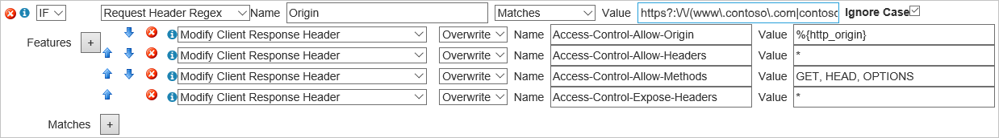

<properties
    pageTitle="Azure CDN 使用 CORS |Microsoft Azure"
    description="瞭解如何使用 Azure 內容傳遞網路 (CDN) 若要使用跨原點資源共用 (CORS)。"
    services="cdn"
    documentationCenter=""
    authors="camsoper"
    manager="erikre"
    editor=""/>

<tags
    ms.service="cdn"
    ms.workload="tbd"
    ms.tgt_pltfrm="na"
    ms.devlang="na"
    ms.topic="article"
    ms.date="09/30/2016"
    ms.author="casoper"/>
    
# 使用 CORS Azure 的 CDN     

## 什麼是 CORS？

CORS （交互 Origin 資源共用） 是 HTTP 功能可讓 web 應用程式執行下一個網域，存取另一個網域中的資源。 若要降低跨網站指令碼攻擊的機會，所有的現代化的網頁瀏覽器會執行安全性限制稱為[相同來源的原則](http://www.w3.org/Security/wiki/Same_Origin_Policy)。  如此可避免從另一個網域中的呼叫 Api 的網頁。  CORS 提供安全的方法，若要允許撥打 Api 另一個網域中的一個網域 （原點的網域）。
 
## 運作方式
1.  在瀏覽器會傳送選項要求搭配**原點**HTTP 標題。 這個標題的值是 served 上層頁面的網域。 當 https://www.contoso.com 頁面嘗試存取 fabrikam.com 網域中的使用者的資料時，下列要求標頭將傳送給 fabrikam.com: 
    
    `Origin: https://www.contoso.com`
 
2.  伺服器可能會使用下列回覆︰
    - 指出所允許的原始網站及其回應**存取 Control-允許的來源**標題。 例如︰
        
        `Access-Control-Allow-Origin: https://www.contoso.com`
        
    - 如果伺服器不允許的十字形，要求錯誤頁面
    - 使用萬用字元，讓所有網域**存取控制-允許的來源**頁首︰
        
        `Access-Control-Allow-Origin: *`
 
複雜的 HTTP 要求，有的 「 預先 」 要求完成第一個判斷是否有權限，然後再傳送整個要求。
 
## 萬用字元或單一原點案例

在 Azure CDN CORS 可不搭配自動任何其他設定**存取控制-允許的來源**標頭設萬用字元 （*） 或單一的來源。  Cdn 到底會快取第一個回應及後續要求會使用相同的標題。
 
如果要求已經做了 CDN 之前 CORS 中設定您的來源，您將需要清除您端點的內容重新載入的內容**存取控制-允許的來源**標頭上的內容。
 
## 多個來源案例

如果您要允許特定的 CORS 允許的來源清單，請取得更複雜 [項目。 Cdn 到底快取的第一個 CORS 原點的**Access 控制項-允許的來源**標題時，就會發生的問題。  當不同的 CORS 原點的後續要求時，將會 CDN served 快取的**Access 控制項-允許的來源**頁首與不相符。  有數種方式可修正這個問題。
 
### 從 Verizon azure CDN 進階版

若要啟用此的最佳方式是使用**Verizon 從 Azure CDN 進階版**，其會顯示某些進階的功能。 
 
必須建立[規則](cdn-rules-engine.md)檢查要求的**原點**頁首。  如果這是有效的來源，規則會在邀請中所提供的原點設定**存取控制-允許的來源**頁首。  如果 [ **Origin**標頭中指定的來源不允許，您的規則應該省略會導致瀏覽器] 以拒絕要求**存取控制-允許的來源**標頭。 
 
有兩種方法可以執行此動作的規則引擎。  在這兩種情況下，從檔案的原始伺服器**存取控制-允許的來源**頁首完全略過，CDN 的規則引擎完全管理允許的 CORS 來源]。

#### 使用所有有效的來源一個規則運算式
 
在此情況下，您會建立一個規則運算式，包括所有您想要讓來源︰ 

    https?:\/\/(www\.contoso\.com|contoso\.com|www\.microsoft\.com|microsoft.com\.com)$
 
> [AZURE.TIP] **從 Verizon azure CDN**使用規則運算式的引擎[Perl 相容的規則運算式](http://pcre.org/)。  您可以使用的工具，例如[規則運算式 101](https://regex101.com/)以驗證您的運算式。  請注意，「 / 」 字元無效在規則運算式，而且不需要逸出，不過，逸出字元最佳作法是及某些 regex 驗證所預期。

如果符合規則運算式，規則會取代**Access 控制項-允許的來源**標題 （如果有的話） 從與傳送邀請的原點原點。  您也可以新增其他 CORS 標題，例如**存取-控制-允許的方法**。

 
#### 要求每個來源的標頭的規則。

而不是規則運算式，您可以改為建立您想要允許使用[符合條件](https://msdn.microsoft.com/library/mt757336.aspx#Anchor_1)的**要求標頭萬用字元**的另一個規則的每個來源。 使用規則運算式的方法，為單獨的規則引擎設定 CORS 標題。 
  

> [AZURE.TIP] 在上方，使用萬用字元範例 * 告訴規則引擎，以符合 HTTP 和 HTTPS。
 
### Azure CDN 標準

Azure CDN 標準的設定檔，以允許多個來源，而不使用萬用字元 origin 唯一的機制是使用 [[查詢字串快取](cdn-query-string.md)。  您需要啟用 CDN 端點的查詢字串設定，然後使用 [要求從每個允許的網域的 [唯一的查詢字串。 執行此動作會導致快取的每個唯一的查詢字串的另一個物件 cdn 到底。 這種方式不理想，不過，其會造成 CDN 上快取的相同檔案的多份複本。  

