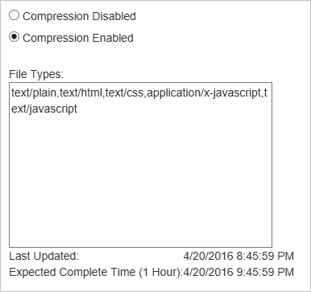

<properties
    pageTitle="改善效能，藉由壓縮檔案中 Azure CDN |Microsoft Azure"
    description="瞭解如何改善檔案傳輸速度和壓縮 Azure CDN 的檔案，藉此增加頁面載入的效能。"
    services="cdn"
    documentationCenter=""
    authors="camsoper"
    manager="erikre"
    editor=""/>

<tags
    ms.service="cdn"
    ms.workload="tbd"
    ms.tgt_pltfrm="na"
    ms.devlang="na"
    ms.topic="article"
    ms.date="07/28/2016"
    ms.author="casoper"/>

# 壓縮檔案以提升效能

壓縮是簡單且有效的方法，以改善檔案傳輸速度，並增加頁面載入效能縮小檔案大小，然後才從伺服器傳送出去。 它會減少頻寬成本，並為使用者提供更快的回應的體驗。

有兩種方式可啟用壓縮︰

- 您可以啟用壓縮大小寫的 CDN 通過壓縮的檔案並要求他們用戶端進行壓縮的檔案在來源伺服器上。
- 您可以啟用壓縮直接在 CDN edge server，CDN 的大小寫壓縮的檔案，提供給使用者，即使他們不會壓縮原始伺服器上。

> [AZURE.IMPORTANT] Cdn 到底設定變更需要一些時間，才會傳播到網路。  <b>Azure CDN Akamai 從</b>設定檔，傳播通常會完成底下一分鐘之內。  <b>Azure CDN Verizon 從</b>設定檔，您通常會看到 90 幾分鐘內套用變更。  如果這是您已壓縮設定您的 CDN 端點的第一次，您應該考慮設定有傳播到之前疑難排解 Pop 壓縮務必等候 1-2 個小時

## 壓縮

> [AZURE.NOTE] 標準和進階版 CDN 層提供相同的壓縮功能，但不同的使用者介面。  如需有關標準和進階版 CDN 層之間的差異的詳細資訊，請參閱[Azure CDN 概觀](cdn-overview.md)。

### 標準層

> [AZURE.NOTE] 本節適用於**Azure CDN 標準從 Verizon**和**Azure CDN 標準 Akamai 從**設定檔。

1. Cdn 到底設定檔刀中，按一下您想要管理的 CDN 端點。

    

    Cdn 到底端點刀隨即會開啟。

2. 按一下 [**設定**] 按鈕。

    ![Cdn 到底設定檔刀管理] 按鈕](./media/cdn-file-compression/cdn-config-btn.png)

    Cdn 到底設定刀隨即會開啟。

3. 開啟 [**壓縮**]。

    

4. 使用預設的類型，或修改清單移除或新增檔案類型。
    
    > [AZURE.TIP] 時，不建議套用壓縮壓縮的格式，例如 ZIP MP3、 MP4、 JPG、 等等。
    
5. 在您變更後，按一下 [**儲存**] 按鈕。

### 進階版層

> [AZURE.NOTE] 本節適用於**從 Verizon Azure CDN 進階**設定檔。

1. 從 CDN 的設定檔刀中，按一下 [**管理**] 按鈕。

    ![Cdn 到底設定檔刀管理] 按鈕](./media/cdn-file-compression/cdn-manage-btn.png)

    隨即會開啟 [CDN 管理入口網站。

2. 將游標移**HTTP 大型**] 索引標籤，然後將游標移**快取設定**彈出式。  按一下 [**壓縮**]。

    壓縮選項會顯示。

    

3. 按一下 [**啟用壓縮**選項] 按鈕，以啟用壓縮。  輸入您想要壓縮為逗點分隔清單 （不加空格） 在 [**檔案類型**] 文字方塊中的 MIME 類型。
        
    > [AZURE.TIP] 時，不建議套用壓縮壓縮的格式，例如 ZIP MP3、 MP4、 JPG、 等等。 

4. 在您變更後，按一下 [**更新**] 按鈕。

## 壓縮規則

下列表格說明每一種情況 Azure CDN 壓縮行為。

> [AZURE.IMPORTANT] **從 Verizon Azure CDN** （標準和進階版），用會壓縮符合條件的檔案。  若要壓縮的資格，檔案必須︰
>
> - 會超過 128 個位元組。
> - 能小於 1 MB。
> 
> **從 Akamai Azure CDN**的所有檔案都都有資格申請壓縮。
>
> 為所有 Azure CDN 產品，檔案必須是已[壓縮設定](#enabling-compression)MIME 類型。
>
> **Azure CDN Verizon 從**設定檔 （標準和進階版） 支援**gzip**、**上平凹**，或**bzip2**編碼。  **Azure CDN Akamai 從**設定檔只支援**gzip**編碼。
>
> **從 Akamai azure CDN**端點永遠要求**gzip**編碼檔案從原點，無論用戶端的要求。

### 壓縮停用或檔案不適合用於壓縮

|用戶端要求 （透過接受編碼頁首） 的格式|快取的檔案格式|用戶端的 CDN 回應|備忘稿|
|----------------|-----------|------------|-----|
|壓縮|壓縮|壓縮|   |
|壓縮|壓縮|壓縮|    | 
|壓縮|不快取|壓縮或未壓縮|取決於來源回應|
|壓縮|壓縮|壓縮|    |
|壓縮|壓縮|壓縮|    |   
|壓縮|不快取|壓縮|     |

### 啟用壓縮和檔案有資格申請壓縮

|用戶端要求 （透過接受編碼頁首） 的格式|快取的檔案格式|用戶端的 CDN 回應|備忘稿|
|----------------|-----------|------------|-----|
|壓縮|壓縮|壓縮|支援的格式間的 CDN transcodes|
|壓縮|壓縮|壓縮|Cdn 到底執行壓縮|
|壓縮|不快取|壓縮|Cdn 到底執行壓縮，如果來源會傳回壓縮。  **從 Verizon azure CDN**會將壓縮的檔案的第一個要求然後壓縮和快取的後續要求檔案。  與檔案`Cache-Control: no-cache`標題永遠不會被壓縮。 
|壓縮|壓縮|壓縮|Cdn 到底執行解壓縮|
|壓縮|壓縮|壓縮|     |  
|壓縮|不快取|壓縮|     |

## 媒體服務 CDN 壓縮

壓縮媒體服務 CDN 啟用串流結束點，會啟用下列內容類型的預設︰ 應用程式/vnd.ms-sstr + xml、 application/dash+xml,application/vnd.apple.mpegurl、 應用程式/f4m + xml。 您無法啟用或停用壓縮所述的類型，使用 [Azure 入口網站。  

## 另請參閱
- [疑難排解 CDN 檔案壓縮](cdn-troubleshoot-compression.md)    
