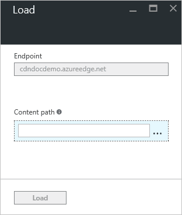

<properties
    pageTitle="預先載入 Azure CDN 端點上的資產 |Microsoft Azure"
    description="瞭解如何將預先載入 CDN 端點上快取的內容。"
    services="cdn"
    documentationCenter=""
    authors="camsoper"
    manager="erikre"
    editor=""/>

<tags
    ms.service="cdn"
    ms.workload="tbd"
    ms.tgt_pltfrm="na"
    ms.devlang="na"
    ms.topic="article"
    ms.date="07/28/2016"
    ms.author="casoper"/>

# Azure CDN 端點上預先載入資產

[AZURE.INCLUDE [cdn-verizon-only](../../includes/cdn-verizon-only.md)]

根據預設，資產會先快取在要求。 這表示每個區域的第一個要求可能要花更長的時間，因為邊緣伺服器沒有的內容快取，以及要轉寄邀請的原始伺服器。 預先載入的內容，可避免此第一個點擊的延遲。

除了提供更佳的客戶體驗，預先載入 [快取的資產，您也可以縮減原始伺服器的網路流量。

> [AZURE.NOTE] 預先載入資產適合用於大型的事件或可同時大量使用者，例如新的影片版本或軟體更新的內容。

本教學課程中會引導您預先載入上所有的 Azure CDN 邊緣節點的快取的內容。

## 逐步解說

1. 在[Azure 入口網站](https://portal.azure.com)中，瀏覽至含有您想要預先載入的端點的 CDN 設定檔。  設定檔刀隨即會開啟。

2. 按一下清單中的端點。  結束點刀隨即會開啟。

3. 從 CDN 端點刀中，按一下 [載入] 按鈕。

    

    載入刀隨即會開啟。

    

4. 輸入您想要載入每個資產的完整路徑 (例如`/pictures/kitten.png`)**路徑**] 文字方塊中。

    > [AZURE.TIP] 輸入文字以讓您建立多個資產清單後，會顯示更多的**路徑**文字方塊。  您可以從清單中刪除資產，按一下 [省略符號 （...）] 按鈕。
    >
    > 路徑必須符合下列[規則運算式](https://msdn.microsoft.com/library/az24scfc.aspx)的 URL: `^(?:\/[a-zA-Z0-9-_.\u0020]+)+$`。  每個資產必須擁有自己的路徑。  不沒有預先載入的資產的任何萬用字元的功能。

    ![載入] 按鈕](./media/cdn-preload-endpoint/cdn-load-paths.png)

5. 按一下 [**載入**] 按鈕。

    ![載入] 按鈕](./media/cdn-preload-endpoint/cdn-load-button.png)

> [AZURE.NOTE] 有 10 載入要求，每分鐘每個 CDN 設定檔的限制。

## 另請參閱
- [清除 Azure CDN 端點](cdn-purge-endpoint.md)
- [Azure CDN REST API 參照-清除或預先載入端點](https://msdn.microsoft.com/library/mt634451.aspx)
