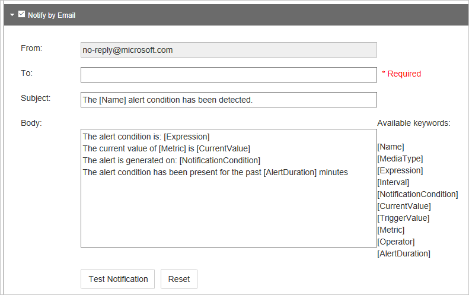

<properties
    pageTitle="Azure CDN 即時通知 |Microsoft Azure"
    description="Microsoft Azure CDN 的即時警示。 即時通知提供有關效能的 CDN 設定檔中的端點的通知。"
    services="cdn"
    documentationCenter=""
    authors="camsoper"
    manager="erikre"
    editor=""/>

<tags
    ms.service="cdn"
    ms.workload="tbd"
    ms.tgt_pltfrm="na"
    ms.devlang="na"
    ms.topic="article"
    ms.date="07/12/2016"
    ms.author="casoper"/>

# <a name="real-time-alerts-in-microsoft-azure-cdn"></a>Microsoft Azure CDN 的即時警示

[AZURE.INCLUDE [cdn-premium-feature](../../includes/cdn-premium-feature.md)]


## <a name="overview"></a>概觀

本文說明 Microsoft Azure CDN 的即時警示。 這項功能提供即時通知您 CDN 的設定檔中的端點的效能。  您可以設定電子郵件] 或 [根據 HTTP 通知︰

* 頻寬
* 狀態碼
* 快取的狀態
* 連線

## <a name="creating-a-real-time-alert"></a>建立即時的通知

1. 在[Azure 入口網站](https://portal.azure.com)中，瀏覽至您的 CDN 設定檔。

    

2. 從 CDN 的設定檔刀中，按一下 [**管理**] 按鈕。

    ![Cdn 到底設定檔刀管理] 按鈕](./media/cdn-real-time-alerts/cdn-manage-btn.png)

    隨即會開啟 [CDN 管理入口網站。

3. 暫留在 [**分析**] 索引標籤，然後將游標移**即時 Stats**延伸。  按一下**即時通知**。

    

    [現有的通知設定 （如果有的話）] 清單會顯示。

4. 按一下 [**新增提醒**]。

    ![[新增提醒] 按鈕](./media/cdn-real-time-alerts/cdn-add-alert.png)

    建立新的警示表單隨即出現。

    ![新增提醒] 表單](./media/cdn-real-time-alerts/cdn-new-alert.png)

5. 若要在作用中，當您按一下 [**儲存**此通知，請核取 [**提醒啟用**] 核取方塊。

6. 在 [**名稱**] 欄位中輸入您的提醒的描述性名稱。

7. 在**媒體類型**] 下拉式清單中，選取 [ **HTTP 大型物件**]。

    

    > [AZURE.IMPORTANT] 您必須先選取**HTTP 大型物件**的**媒體類型**。  **從 Verizon Azure CDN**不會使用其他選項。  若要選取**HTTP 大型物件**失敗會導致您要永遠不會觸發的提醒。

8. 建立要監視選取 [**公制****運算子**，與**觸發程序值**的**運算式**。

    - 針對**公制**，選取您想要監視的條件的類型。  **頻寬 Mbps**是在秒 mb 的頻寬使用量的量。  **總連線**是我們邊緣伺服器同時 HTTP 連線的數目。  定義的各種快取的狀態和狀態碼，請參閱[Azure CDN 快取的狀態碼](https://msdn.microsoft.com/library/mt759237.aspx)和[Azure CDN HTTP 狀態碼](https://msdn.microsoft.com/library/mt759238.aspx)
    - **運算子**是建立公制與觸發程序值之間的關係的數學運算子。
    - **觸發程序值**是通知會送出之前，必須符合臨界值。

    在以下範例中，我已經建立運算式會指出我想要的 404 狀態碼數大於 25 時收到通知。

    

9. **間隔**，輸入您想要評估的運算式的頻率。

10. 在**通知上的**下拉式清單中，選取您想要的運算式為 true 時收到通知。
    
    - **條件開始**指出第一次偵測到指定的條件時，會傳送通知。
    - **條件結束**表示無法偵測到指定的條件時，會傳送通知。 我們網路監控系統偵測到指定的條件發生後，只會觸發此通知。
    - **連續**指出傳送通知將會每次監控系統網路偵測到指定的條件。 請記住網路監控系統只會檢查一次每個指定的條件的間隔。
    - **條件開始和結束**表示的通知將會傳送第一次偵測到指定的條件，然後再次條件無法偵測到時。

11. 如果您想要透過電子郵件中收到通知，核取**使用電子郵件通知**核取方塊。  

    
    
    在 [**至**] 欄位中，輸入您想讓通知傳送的電子郵件地址。 **主旨**和**本文**中，您可以保留預設值，或者您可能會自訂使用**可用的關鍵字**清單來傳送郵件時，以動態方式插入警示資料的訊息。

    > [AZURE.NOTE] 按一下 [**測試通知**] 按鈕，但只有在已儲存的通知設定後，您可以測試電子郵件通知。

12. 如果您想要張貼的網頁伺服器的通知，請核取 [**通知 HTTP 文章的**核取方塊。

    

    在 [ **Url** ] 欄位中，輸入您要的 HTTP 訊息張貼的 URL。 在 [**標題**] 文字方塊中，輸入要傳送邀請中的 HTTP 標頭。  **本文**中，您可以自訂使用**可用的關鍵字**清單來傳送郵件時，以動態方式插入警示資料的訊息。  以類似的 XML 內容的**標題**和**本文**預設下方的範例。

    ```
    <string xmlns="http://schemas.microsoft.com/2003/10/Serialization/">
        <![CDATA[Expression=Status Code : 404 per second > 25&Metric=Status Code : 404 per second&CurrentValue=[CurrentValue]&NotificationCondition=Condition Start]]>
    </string>
    ```

    > [AZURE.NOTE] 按一下 [**測試通知**] 按鈕，但只有在已儲存的通知設定後，您可以測試 HTTP 文章通知。

13. 按一下 [**儲存**] 按鈕，以儲存您的通知設定]。  如果您核取 [**提醒啟用**在步驟 5 中，您的提醒現在作用中。

## <a name="next-steps"></a>後續步驟

- 分析[中 Azure CDN 即時統計資料](cdn-real-time-stats.md)
- 深入瞭解使用[進階的 HTTP 報表](cdn-advanced-http-reports.md)
- 分析[使用模式](cdn-analyze-usage-patterns.md)

