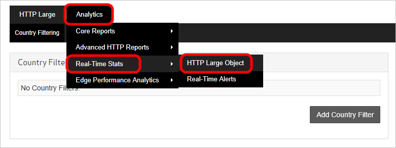
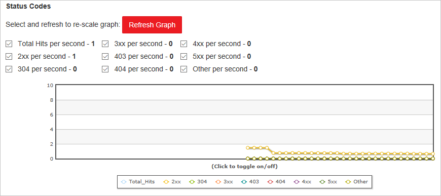

<properties
    pageTitle="Real-單次-Stats 中 Azure CDN |Microsoft Azure"
    description="將內容傳遞給您的用戶端時，即時統計資料會提供 Azure CDN 的效能的即時資料。"
    services="cdn"
    documentationCenter=""
    authors="camsoper"
    manager="erikre"
    editor=""/>

<tags
    ms.service="cdn"
    ms.workload="tbd"
    ms.tgt_pltfrm="na"
    ms.devlang="na"
    ms.topic="article"
    ms.date="07/28/2016"
    ms.author="casoper"/>

# 在 Microsoft Azure CDN 即時統計資料

[AZURE.INCLUDE [cdn-premium-feature](../../includes/cdn-premium-feature.md)]

## 概觀

這份文件會說明在 Microsoft Azure CDN 即時統計資料。  將內容傳遞給您的用戶端時，此功能會提供即時的資料，例如頻寬、 快取的狀態與同時連線至您 CDN 的設定檔。 這可讓連續監視在任何時間，包括線上事件的服務健康狀況。

可使用下列圖形︰

* [頻寬](#bandwidth)
* [狀態碼](#status-codes)
* [快取的狀態](#cache-statuses)
* [連線](#connections)

## 存取即時統計資料

1. 在[Azure 入口網站](https://portal.azure.com)中，瀏覽至您的 CDN 設定檔。

    

2. 從 CDN 的設定檔刀中，按一下 [**管理**] 按鈕。

    ![CDN 的設定檔刀管理] 按鈕](./media/cdn-real-time-stats/cdn-manage-btn.png)

    隨即會開啟 [CDN 管理入口網站。

3. 暫留在 [**分析**] 索引標籤，然後將游標暫留在**即時 Stats**延伸。  按一下**HTTP 大型物件**。

    

    即時統計圖表會顯示。
    
每個圖形會顯示為所選的時間範圍，開始頁面載入時的即時統計資料。  圖形會自動更新每隔幾秒鐘。  使用 [**重新整理圖表**] 按鈕，如果有的話，將會清除 graph 下方之後, 只會顯示選取的資料。

## 頻寬

**頻寬**圖表會顯示用於目前的平台所選的時間範圍內的頻寬。 圖形的陰影的部分指出頻寬使用量。 確實所需的頻寬目前所用會顯示的折線圖的正下方。

## 狀態碼

**狀態碼**圖形表示特定 HTTP 回應碼會發生所選的時間範圍內的頻率。

> [AZURE.TIP]  每個 HTTP 狀態碼選項的說明，請參閱[Azure CDN HTTP 狀態碼](https://msdn.microsoft.com/library/mt759238.aspx)。

顯示 HTTP 狀態碼清單上方的圖形。 此清單會指出可以包含折線圖及秒的狀態碼目前次數中的每個狀態碼。 根據預設，線條會顯示每個這些圖形中的狀態碼。 不過，您可以選擇只監控具有特殊意義 CDN 設定的狀態碼。 若要這麼做，核取所要的狀態碼和清除所有其他選項，然後按一下 [**重新整理圖表**。 

您可以暫時隱藏特定的狀態碼記錄的資料。  從圖形的正下方的圖例，按一下您要隱藏的狀態碼。 從圖形，會立即隱藏狀態碼。 再按一下該狀態碼會導致要再次顯示該選項。

## 快取的狀態

**快取的狀態**圖表會指出選取的時間範圍內發生某些類型的快取的狀態的頻率。 

> [AZURE.TIP]  如需每快取狀態代碼] 選項的說明，請參閱[Azure CDN 快取的狀態碼](https://msdn.microsoft.com/library/mt759237.aspx)。

快取狀態代碼清單會顯示直接圖形上方。 此清單會指出可以包含折線圖及秒的狀態碼目前次數中的每個狀態碼。 根據預設，線條會顯示每個圖形中這些狀態碼。 不過，您可以選擇只監控具有特殊意義 CDN 設定的狀態碼。 若要這麼做，核取您要的狀態碼清除所有其他選項，然後按一下 [**重新整理圖表**。 

您可以暫時隱藏特定狀態碼記錄的資料。  從圖形的正下方的圖例，按一下您要隱藏的狀態碼。 從圖形，會立即隱藏狀態碼。 再按一下該狀態碼會導致要再次顯示該選項。

## 連線

此圖形表示已經建立多少連線至您的 edge server。 每一個的資產經過連線我們 CDN 結果的要求。

## 後續步驟

- 使用[即時警示 Azure CDN](cdn-real-time-alerts.md)取得通知
- 深入瞭解使用[進階的 HTTP 報表](cdn-advanced-http-reports.md)
- 分析[使用模式](cdn-analyze-usage-patterns.md)

