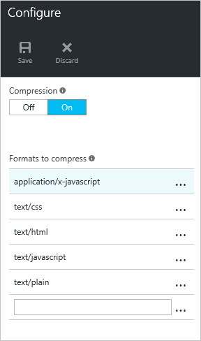

<properties
    pageTitle="疑難排解 Azure CDN 檔案壓縮 |Microsoft Azure"
    description="疑難排解 Azure CDN 檔案壓縮的問題。"
    services="cdn"
    documentationCenter=""
    authors="camsoper"
    manager="erikre"
    editor=""/>

<tags
    ms.service="cdn"
    ms.workload="tbd"
    ms.tgt_pltfrm="na"
    ms.devlang="na"
    ms.topic="article"
    ms.date="09/01/2016"
    ms.author="casoper"/>
    
# 疑難排解 CDN 檔案壓縮

本文可協助您疑難排解[CDN 檔案壓縮](cdn-improve-performance.md)的問題。

如果您需要更多協助，這份文件中的任一點時，您也可以連絡 Azure 專家[MSDN Azure 和堆疊溢位論壇](https://azure.microsoft.com/support/forums/)上。 或者，您也可以檔案 Azure 支援事件。 移至[Azure 支援網站](https://azure.microsoft.com/support/options/)，然後按一下 [**取得支援**。

## 徵狀

針對您結束點壓縮已啟用，但未壓縮傳回檔案。

>[AZURE.TIP] 若要檢查是否會傳回您的檔案壓縮，您需要使用的工具，例如[Fiddler](http://www.telerik.com/fiddler)或瀏覽器的[開發人員工具](https://developer.microsoft.com/microsoft-edge/platform/documentation/f12-devtools-guide/)。  核取 HTTP 回應標頭傳回您快取的 CDN 內容。  是否有標頭名稱為`Content-Encoding`壓縮**gzip**、 **bzip2**，或**上平凹**的值，您的內容。
>
>

## 原因

有多個可能的原因，包括︰

- 無法壓縮符合資格要求的內容。
- 壓縮不會啟用要求的檔案類型。
- HTTP 要求未包含頁首要求有效壓縮類型。

## 疑難排解步驟

> [AZURE.TIP] 使用部署新的端點，CDN 設定變更會需要一些時間，才會傳播到網路。  通常，變更會套用在 90 分鐘內。  如果這是您已壓縮設定您的 CDN 端點的第一次，您應該考慮設定有傳播到 Pop 壓縮務必等候 1-2 個小時。 

### 驗證要求

首先，我們應該如何快速有效檢查的要求。  若要檢視進行要求，您可以使用瀏覽器的[開發人員工具](https://developer.microsoft.com/microsoft-edge/platform/documentation/f12-devtools-guide/)。

- 驗證要求傳送給您端點的 URL， `<endpointname>.azureedge.net`，並不是您的來源。
- 確認 [要求包含**接受編碼**標頭的標頭] 的值包含**gzip**、**上平凹**，或**bzip2**]。

> [AZURE.NOTE] **Azure CDN Akamai 從**設定檔只支援**gzip**編碼。

### 驗證壓縮設定 （標準 CDN 設定檔）

> [AZURE.NOTE] 如果您的 CDN 設定檔是**Azure CDN 標準從 Verizon**或**Azure CDN 標準 Akamai 從**設定檔，僅適用於此步驟。 

瀏覽至您的結束點，在[Azure 入口網站](https://portal.azure.com)，然後按一下 [**設定**] 按鈕。

- 確認已啟用壓縮。
- 確認壓縮內容的 MIME 類型包含壓縮格式的清單中。

### 驗證壓縮設定 （CDN 進階設定檔）

> [AZURE.NOTE] 如果您的 CDN 設定檔是**從 Verizon Azure CDN 進階**設定檔，僅適用於此步驟。

瀏覽至您的結束點，在[Azure 入口網站](https://portal.azure.com)，然後按一下 [**管理**] 按鈕。  隨即會開啟 [附加] 入口網站。  將游標移**HTTP 大型**] 索引標籤，然後將游標移**快取設定**彈出式。  按一下 [**壓縮**]。 

- 確認已啟用壓縮。
- 確認**檔案類型**] 清單包含逗點分隔 （不加空格） 的 MIME 類型清單。
- 確認壓縮內容的 MIME 類型包含壓縮格式的清單中。

### 驗證在快取內容

> [AZURE.NOTE] 如果您的 CDN 設定檔是**Azure CDN Verizon 從**設定檔 （標準或進階版），僅適用於此步驟。

使用瀏覽器的開發人員工具，請核取 [回應標頭，以確保檔案快取，它所要求的區域。

- 檢查**伺服器**回應標頭。  頁首應有**平台 (POP/伺服器 ID)**的格式，如下列範例所示。
- 核取**X 快取**回應標頭。  頁首，請閱讀**叫用**。  

### 確認檔案符合大小需求

> [AZURE.NOTE] 如果您的 CDN 設定檔是**Azure CDN Verizon 從**設定檔 （標準或進階版），僅適用於此步驟。

若要壓縮的資格，檔案必須符合下列大小需求︰

- 超過 128 個位元組。
- 小於 1 MB。

### 核取 [在原始伺服器**透過**標頭的邀請

**透過**HTTP 標頭指出網頁伺服器要求的傳入 proxy 伺服器。  預設的 Microsoft IIS 網頁伺服器時要求包含**透過**標頭壓縮回應。  若要覆寫此行為，請執行下列動作︰

- **IIS 6**:[設定 HcNoCompressionForProxies ="FALSE"IIS 中繼資料庫屬性中](https://msdn.microsoft.com/library/ms525390.aspx)
- **IIS 7 和最**︰[設定**noCompressionForHttp10** ] 和 [ **noCompressionForProxies**為 False 的伺服器設定](http://www.iis.net/configreference/system.webserver/httpcompression)

