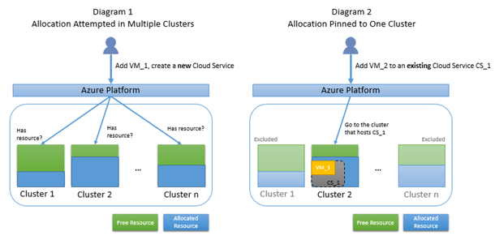

<properties
    pageTitle="疑難排解雲端服務配置失敗 |Microsoft Azure"
    description="疑難排解配置失敗，當您部署 Azure 中的雲端服務"
    services="azure-service-management, cloud-services"
    documentationCenter=""
    authors="simonxjx"
    manager="felixwu"
    editor=""
    tags="top-support-issue"/>

<tags
    ms.service="cloud-services"
    ms.workload="na"
    ms.tgt_pltfrm="ibiza"
    ms.devlang="na"
    ms.topic="article"
    ms.date="10/12/2016"
    ms.author="v-six"/>


# <a name="troubleshooting-allocation-failure-when-you-deploy-cloud-services-in-azure"></a>疑難排解配置失敗，當您部署 Azure 中的雲端服務

## <a name="summary"></a>摘要
當您部署到雲端服務的執行個體，或新增新的 web 或工作者角色執行個體時，則 Microsoft Azure 配置計算資源。 即使在您達到 Azure 訂閱的限制之前，請執行這些作業時，有時候可能會收到錯誤。 本文說明一些常見的配置失敗的原因，並會建議可能補救。 當您規劃部署的服務時，資訊可能也很有用。

[AZURE.INCLUDE [support-disclaimer](../../includes/support-disclaimer.md)]

### <a name="background--how-allocation-works"></a>背景 – 分派的運作方式
Azure 資料中心的伺服器被分割成叢集。 在多個叢集嘗試新增的雲端服務配置要求。 第一個執行個體何時部署至雲端服務的雲端服務 （在臨時或生產），取得釘選叢集。 在相同叢集，將會雲端服務的任何進一步部署。 在本文中，我們會參照此為 「 釘選到叢集 」。 下列圖表 1 說明標準的配置嘗試在多個叢集; 的大小的寫圖 2 說明配置的大小寫的已釘選到叢集 2 因為現有的雲端服務 CS_1 裝載於何處。



### <a name="why-allocation-failure-happens"></a>為什麼會發生配置失敗
當配置要求現已釘選到叢集時，很有較高的尋找免費的資源，因為使用資源資料庫僅限於叢集失敗。 此外，如果您配置要求已釘選到叢集，但您要求的資源類型不支援該叢集，您的要求會失敗，即使有可用的資源。 圖 3 下方說明大小寫，固定的配置失敗，因為只候選叢集沒有可用的資源。 圖 4 說明大小寫，固定的配置失敗，因為只候選叢集不支援要求的虛擬記憶體大小，即使有可用的資源。


## <a name="troubleshooting-allocation-failure-for-cloud-services"></a>疑難排解雲端服務的配置失敗
### <a name="error-message"></a>錯誤訊息
您可能會看到下列錯誤訊息︰

    "Azure operation '{operation id}' failed with code Compute.ConstrainedAllocationFailed. Details: Allocation failed; unable to satisfy constraints in request. The requested new service deployment is bound to an Affinity Group, or it targets a Virtual Network, or there is an existing deployment under this hosted service. Any of these conditions constrains the new deployment to specific Azure resources. Please retry later or try reducing the VM size or number of role instances. Alternatively, if possible, remove the aforementioned constraints or try deploying to a different region."

### <a name="common-issues"></a>常見的問題
以下是常見的配置案例導致固定到單一叢集配置要求。

- 部署臨時位置-若雲端服務部署中的任一位置，然後整個雲端服務現已釘選到特定叢集。  這表示，如果部署已存在於生產位置，然後在新的臨時部署只能配置相同叢集與生產位置。 如果叢集即將容量，要求可能會失敗。

- 縮放比例-將新的執行個體新增至現有的雲端服務必須在同一個叢集配置。  可以通常配置小縮放比例要求，但不是一定。 如果叢集即將容量，要求可能會失敗。

- 相關性] 群組中的空白雲端服務的新部署可以由配置中的區域] 中的任何叢集布料的轉印圖樣除非雲端服務已釘選至相關性群組。 部署至相同的相關性群組會嘗試相同叢集上。 如果叢集即將容量，要求可能會失敗。

- 相關性群組 vNet-較舊的虛擬網路已連結至相關性群組，而不是區域，並在這些虛擬網路中的雲端服務會固定相關性群組叢集。 已釘選叢集上，將會嘗試部署到此類型的虛擬網路。 如果叢集即將容量，要求可能會失敗。

## <a name="solutions"></a>解決方案

1. 重新部署新的雲端服務-此解決方案有可能最成功為其允許從該範圍中的所有叢集選擇的平台。

    - 部署新的雲端服務的工作量  

    - 更新 CNAME 或記錄以指向新的雲端服務的流量

    - 一旦零流量即將舊網站，您可以刪除舊的雲端服務。 此方案應該會造成零停機時間。

2. 刪除生產和臨時位置-此方案會保留您現有的 DNS 名稱，但會導致您的應用程式當機。

    - 刪除生產和暫存之位置的現有的雲端服務，以便雲端服務是空值，然後

    - 在現有的雲端服務中建立新的部署。 這將會重新嘗試區域中的所有叢集上的配置。 請確定雲端服務不受限於相關性群組。

3. 保留的 IP-此方案都將保留您現有的 IP 位址，但會導致您的應用程式當機。  

    - 建立您現有的部署使用 Powershell ReservedIP

    ```
    New-AzureReservedIP -ReservedIPName {new reserved IP name} -Location {location} -ServiceName {existing service name}
    ```

    - 請遵循 from above，確保該服務的 CSCFG 中指定新 ReservedIP #2。

4. 移除相關性群組不建議使用新的部署-相關性群組。 遵循步驟 #1 上述部署新的雲端服務。 請確定相關性群組不是雲端服務。

5. 轉換為地區的虛擬網路-請參閱[如何從地區的虛擬網路 (VNet) 的相關性群組移轉](../virtual-network/virtual-networks-migrate-to-regional-vnet.md)]。
