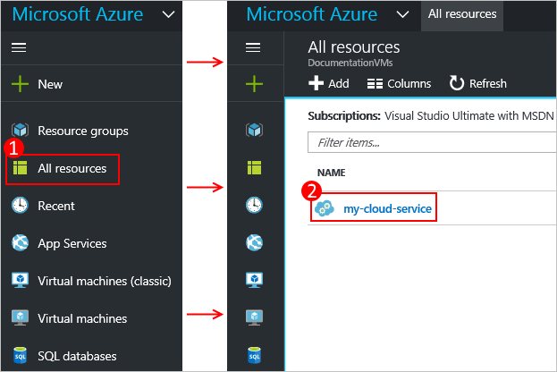

<properties 
    pageTitle="針對雲端服務中設定 SSL |Microsoft Azure" 
    description="瞭解如何指定 web 角色的 HTTPS 端點，以及如何上傳您的應用程式的安全性 SSL 憑證。 這些範例使用 Azure 入口網站。" 
    services="cloud-services" 
    documentationCenter=".net" 
    authors="Thraka" 
    manager="timlt" 
    editor=""/>

<tags 
    ms.service="cloud-services" 
    ms.workload="tbd" 
    ms.tgt_pltfrm="na" 
    ms.devlang="na" 
    ms.topic="article" 
    ms.date="10/04/2016"
    ms.author="adegeo"/>

# Azure 中的應用程式中設定 SSL

> [AZURE.SELECTOR]
- [Azure 入口網站](cloud-services-configure-ssl-certificate-portal.md)
- [Azure 傳統入口網站](cloud-services-configure-ssl-certificate.md)

安全通訊端層 (SSL) 加密是最常用保護透過網際網路傳送資料的方法。 一般工作討論如何指定 web 角色的 HTTPS 端點，以及如何上傳您的應用程式的安全性 SSL 憑證。

> [AZURE.NOTE] 這項工作的程序套用至 Azure 雲端服務;如需應用程式服務，請參閱[此](../app-service-web/web-sites-configure-ssl-certificate.md)。

這項工作使用生產部署;在本主題結尾提供使用暫存的部署的資訊。

[此](cloud-services-how-to-create-deploy-portal.md)先閱讀如果您尚未還建立雲端服務。

[AZURE.INCLUDE [websites-cloud-services-css-guided-walkthrough](../../includes/websites-cloud-services-css-guided-walkthrough.md)]

## 步驟 1︰ 取得 SSL 憑證

若要設定 SSL 應用程式，您必須以取得已簽署的憑證授權單位 (CA)，受信任的協力廠商的意思發行憑證的 SSL 憑證。 如果您還沒有其中一個，您需要取得從公司，銷售 SSL 憑證。

憑證必須符合下列要求的 Azure 中的 SSL 憑證︰

-   憑證必須包含私密金鑰。
-   憑證必須建立索引鍵的 exchange，匯出為個人資訊交換 (.pfx) 檔案。
-   憑證的主體名稱必須符合用來存取雲端服務的網域。 您無法從 cloudapp.net 網域的憑證授權單位 (CA) 取得 SSL 憑證。 您必須取得時所要使用自訂網域名稱存取您的服務。 當您從 CA 要求憑證憑證的主體名稱必須符合用來存取您的應用程式的自訂網域名稱。 例如，如果您的自訂網域名稱為**contoso.com**您想要求憑證從您的 CA * **。 contoso.com**或* *www.contoso.com**。
-   憑證必須使用 2048年位元加密的最小值。

進行測試，您可以[建立](cloud-services-certs-create.md)及使用自我簽署的憑證。 自我簽署的憑證不經過 CA，並且可以使用 cloudapp.net 網域，為網站的 URL。 例如，下列工作使用憑證中使用的常見名稱 (CN) 是**sslexample.cloudapp.net**自我簽署的憑證。

接下來，您必須包含憑證的相關資訊，在您的服務定義和服務設定檔中。

## 步驟 2︰ 修改服務定義和設定檔案

使用憑證，必須設定您的應用程式，您必須新增 HTTPS 端點。 如此一來，服務定義和服務設定檔需要更新。

1.  在您的開發環境中開啟服務定義檔案 (CSDEF)、 新增**憑證**] 區段中 [ **WebRole** ] 區段中，以及包含憑證 （和中繼憑證） 的下列資訊︰

        <WebRole name="CertificateTesting" vmsize="Small">
        ...
            <Certificates>
                <Certificate name="SampleCertificate" 
                             storeLocation="LocalMachine" 
                             storeName="My"
                             permissionLevel="limitedOrElevated" />
                <!-- IMPORTANT! Unless your certificate is either
                self-signed or signed directly by the CA root, you
                must include all the intermediate certificates
                here. You must list them here, even if they are
                not bound to any endpoints. Failing to list any of
                the intermediate certificates may cause hard-to-reproduce
                interoperability problems on some clients.-->
                <Certificate name="CAForSampleCertificate"
                             storeLocation="LocalMachine"
                             storeName="CA"
                             permissionLevel="limitedOrElevated" />
            </Certificates>
        ...
        </WebRole>

    [**憑證**] 區段中定義的名稱我們憑證、 其位置，以及其所在的儲存區名稱。
    
    權限 (`permisionLevel`屬性) 可設定為下列其中一項︰

  	| 權限的值  | 描述 |
  	| ----------------  | ----------- |
  	| limitedOrElevated | **（預設值）**所有的角色程序可以存取私密金鑰。 |
  	| 提高權限          | 僅限提高權限的程序可以存取私密金鑰。|

2.  在您的服務定義檔案，新增**InputEndpoint**內的項目**結束點**] 區段，若要啟用 HTTPS:

        <WebRole name="CertificateTesting" vmsize="Small">
        ...
            <Endpoints>
                <InputEndpoint name="HttpsIn" protocol="https" port="443" 
                    certificate="SampleCertificate" />
            </Endpoints>
        ...
        </WebRole>

3.  在您的服務定義檔案，新增 [**網站**] 區段中的**繫結**的項目。 新增至您的網站對應端點 HTTPS 繫結︰

        <WebRole name="CertificateTesting" vmsize="Small">
        ...
            <Sites>
                <Site name="Web">
                    <Bindings>
                        <Binding name="HttpsIn" endpointName="HttpsIn" />
                    </Bindings>
                </Site>
            </Sites>
        ...
        </WebRole>

    已完成所有服務定義檔案所需的變更，但您仍需要將憑證資訊新增至 [服務設定檔。

4.  服務設定檔中 (CSCFG)，ServiceConfiguration.Cloud.cscfg，將**憑證**區段內 [**角色**] 區段中，取代範例指紋值與您的憑證所示︰

        <Role name="Deployment">
        ...
            <Certificates>
                <Certificate name="SampleCertificate" 
                    thumbprint="9427befa18ec6865a9ebdc79d4c38de50e6316ff" 
                    thumbprintAlgorithm="sha1" />
                <Certificate name="CAForSampleCertificate"
                    thumbprint="79d4c38de50e6316ff9427befa18ec6865a9ebdc" 
                    thumbprintAlgorithm="sha1" />
            </Certificates>
        ...
        </Role>

（上述範例使用指紋演算法**sha1** 。 指定您的憑證指紋演算法適當的值。）

現在，已更新的服務定義和服務設定檔，套件上傳至 Azure 的部署。 如果您使用的**cspack**，不要使用**/generateConfigurationFile**標幟，時，將會覆寫您剛插入的憑證資訊。

## 步驟 3︰ 上傳的憑證

連線到入口網站和...

1. 選取您的雲端服務，在入口網站，選取您的**雲端服務**。 （這是在**所有資源**] 區段中）。 
    
    

2. 按一下 [**憑證**]。

    ![按一下 [憑證] 圖示](media/cloud-services-configure-ssl-certificate-portal/certificate-item.png)

3. 提供**檔案**，**密碼**，然後按一下 [**上傳**]。

## 步驟 4︰ 使用 HTTPS 連線至角色的執行個體

現在，您的部署會位於 Azure 和使用，您可以連線至並使用 HTTPS。
    
1.  按一下以開啟網頁瀏覽器的**網站 URL** 。

    

2.  在網頁瀏覽器，修改而不是**http**]，使用**https**連結，然後瀏覽的頁面。

    >[AZURE.NOTE] 如果您使用自我簽署的憑證，當您瀏覽至自我簽署的憑證，您可能會看到瀏覽器中的憑證錯誤與相關聯的 HTTPS 端點。 使用由受信任的憑證授權單位簽署的憑證可以解決這個問題中;同時，您可以略過錯誤。 （另一個選項是將自我簽署的憑證新增使用者的信任的憑證授權單位憑證存放區）。

    

    >[AZURE.TIP] 如果您想要使用 SSL 暫存部署，而不是實際執行部署，首先必須決定暫存部署所用的 URL。 部署您的雲端服務後, 的暫存的環境的 URL 取決於**部署識別碼**GUID 此格式︰`https://deployment-id.cloudapp.net/`  
      
    >建立一般的名稱 (CN) 憑證等於 GUID 為基礎的 URL (例如， **328187776e774ceda8fc57609d404462.cloudapp.net**)。 若要將憑證新增至您的分段的雲端服務中使用入口網站。 然後，新增憑證資訊 CSDEF 和 CSCFG 檔案、 重新封裝應用程式及更新分段的部署為使用新的套件。

## 後續步驟

* [一般設定您的雲端服務](cloud-services-how-to-configure-portal.md)。
* 瞭解如何[部署雲端服務](cloud-services-how-to-create-deploy-portal.md)。
* 設定[自訂網域名稱](cloud-services-custom-domain-name-portal.md)。
* [管理您的雲端服務](cloud-services-how-to-manage-portal.md)。
