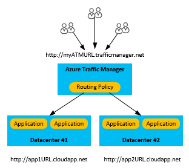

<properties
    pageTitle="如何時 Azure 服務會影響 Azure 雲端服務中斷 |Microsoft Azure"
    description="瞭解如何影響 Azure 雲端服務的 Azure 服務中斷事件。"
    services="cloud-services"
    documentationCenter=""
    authors="kmouss"
    manager="drewm"
    editor=""/>

<tags
    ms.service="cloud-services"
    ms.workload="cloud-services"
    ms.tgt_pltfrm="na"
    ms.devlang="na"
    ms.topic="article"
    ms.date="05/16/2016"
    ms.author="kmouss;aglick"/>

#如何時 Azure 服務會影響 Azure 雲端服務中斷

在 Microsoft，我們使用實，請確定在需要時都可使用我們的服務。 我們控制強制有時會影響我們會導致非預期的服務中斷的方式。

Microsoft 提供其服務為執行時間和連線認可服務等級協定 (SLA)。 個別 Azure 服務 SLA 位於[Azure 服務等級協定](https://azure.microsoft.com/support/legal/sla/)。

Azure 已經有許多內建的平台功能支援高度可用的應用程式。 如需這些服務的相關的詳細資訊，請閱讀[損毀修復與 Azure 應用程式的可用性](../resiliency/resiliency-disaster-recovery-high-availability-azure-applications.md)。

本文會說明 true 損毀修復狀況，整個區域發生主要自然損毀或廣泛的服務中斷中斷時。 這些是少見的項目，但您必須先準備是整個區域的中斷的可能性。 如果的整個區域發生服務中斷，您資料的本機多餘的複本會暫時無法使用。 如果您已啟用地理複寫，Azure 儲存體 blob 與資料表的三個額外的複本會儲存在不同區域中。 完成的地區資料或在其中的主要區域是無法復原損毀，事件 Azure 重新對應所有地理複製區域的 DNS 項目。

>[AZURE.NOTE]請注意，您不需要任何控制此程序，才會發生的整個資料中心的服務中斷。 因此，您必須也依賴達成最高層級的可用性其他特定應用程式的備份策略。 如需詳細資訊，請參閱節[損毀修復的](../resiliency/resiliency-disaster-recovery-high-availability-azure-applications.md#DSDR)相關資料。 如果您想要能夠會影響您自己的容錯移轉，您可能會想要考慮使用的[讀取權限地理多餘的儲存空間 (RA GRS)](../storage/storage-redundancy.md#read-access-geo-redundant-storage)，另一個區域中建立資料的唯讀複本。

若要可協助您處理這些少見的項目，我們會提供下列指導 Azure 虛擬機器 (Vm) 的若是服務中斷的位置 Azure VM 部署應用程式的整個區域。

##選項 1︰ 等待復原
在此情況下，不不需要任何動作，在您的組件。 知道還原服務可用性工作 Azure 小組正努力。 您可以查看我們[Azure 服務健康狀況儀表板](https://azure.microsoft.com/status/)目前的服務狀態。

>[AZURE.NOTE]如果客戶 Azure 網站復原尚未設定，或在不同區域有副的部署，這是最佳選擇。

如果客戶想要立即存取他們的部署的雲端服務，下列選項可供使用。

>[AZURE.NOTE]請注意，這些選項有部分資料遺失的可能性。     

##選項 2︰ 重新部署至新的區域您雲端服務設定

如果您有原來的程式碼，您可以直接只要重新部署應用程式、 相關聯的設定和新的雲端服務中的新區域的相關的資源。  

如需有關如何建立並部署雲端服務應用程式的詳細資訊，請參閱[如何建立並部署雲端服務](./cloud-services-how-to-create-deploy-portal.md)。

根據您的應用程式的資料來源，您可能需要檢查您的應用程式的資料來源的修復程序。
  * Azure 儲存體資料來源，請參閱[Azure 儲存體複寫](../storage/storage-redundancy.md#read-access-geo-redundant-storage)核取選項]，可在應用程式的選擇複寫模型為基礎。
  * 針對 SQL 資料庫來源，請閱讀[概觀︰ 雲端與 SQL 資料庫的業務連續性和資料庫損毀修復](../sql-database/sql-database-business-continuity.md)若要查看可用的選項會根據所選的複寫模型應用程式的。

##選項 [3︰ 使用備份部署透過 Azure 流量管理員
這個選項，假設您已設計與記住的地區損毀修復您應用程式的解決方案。 如果您已經有副雲端服務應用程式部署在不同區域中執行，並透過流量管理員頻道連線，您可以使用這個選項。 在此情況下，核取 [次要部署的狀況。 如果這是健全，您可以流量重新導向至該透過 Azure 流量管理員。 這個策略中，您可以利用流量路由方法和容錯移轉順序設定 Azure 流量管理員中的商務連絡人。 如需詳細資訊，請參閱[如何設定流量管理員設定](../traffic-manager/traffic-manager-overview.md#how-to-configure-traffic-manager-settings)。

##後續步驟

若要瞭解如何實作損毀修復和可用性策略詳細資訊，請參閱[損毀修復和 Azure 應用程式的可用性](../resiliency/resiliency-disaster-recovery-high-availability-azure-applications.md)。

若要開發技術深入的瞭解雲端平台的功能，請參閱[Azure 恢復技術指南](../resiliency/resiliency-technical-guidance.md)。

如果指示清除，或是如果您想要執行的作業，代表您的 Microsoft，請連絡[客戶支援](https://portal.azure.com/#blade/Microsoft_Azure_Support/HelpAndSupportBlade)。
