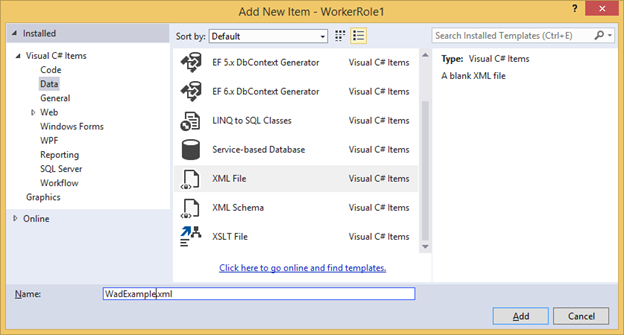
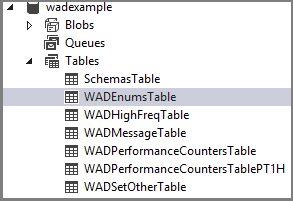

<properties
    pageTitle="如何使用雲端服務中的 Azure 診斷 (.NET) |Microsoft Azure"
    description="使用 Azure 診斷從 Azure 雲端服務的偵錯、 衡量效能、 監控、 流量分析及其他功能收集的資料。"
    services="cloud-services"
    documentationCenter=".net"
    authors="rboucher"
    manager="jwhit"
    editor=""/>

<tags
    ms.service="cloud-services"
    ms.workload="tbd"
    ms.tgt_pltfrm="na"
    ms.devlang="dotnet"
    ms.topic="article"
    ms.date="01/25/2016"
    ms.author="robb"/>


# <a name="enabling-azure-diagnostics-in-azure-cloud-services"></a>啟用 Azure 雲端服務中的 Azure 診斷

Azure 診斷背景，請參閱[Azure 診斷概觀](../azure-diagnostics.md)。


## <a name="how-to-enable-diagnostics-in-a-worker-role"></a>如何啟用診斷工作者角色

此逐步說明如何實作會發出遙測資料使用.NET EventSource 類別 Azure 工作者角色。 Azure 診斷用來收集遙測資料，並將其儲存在 Azure 儲存體帳戶中。 建立工作角色時 Visual Studio 會自動啟用診斷 1.0 Azure Sdk.NET 2.4 及較舊版本中的解決方案的一部分。 下列的指示說明建立工作者角色，您工作者角色停止診斷 1.0 解決方案的和部署診斷 1.2 或 1.3 的程序。

### <a name="pre-requisites"></a>必要條件
本文假設您有 Azure 訂閱並使用 Azure SDK Visual Studio 2013。 如果您沒有 Azure 的訂閱，您可以註冊[免費試用版][]。 請務必[安裝及設定 PowerShell 的 Azure 0.8.7 版本或更新版本][]。

### <a name="step-1-create-a-worker-role"></a>步驟 1︰ 建立工作者角色
1.  啟動 [ **Visual Studio 2013**]。
2.  從**雲端**範本目標的.NET Framework 4.5 建立新**Azure 雲端服務**專案。  「 WadExample 」 為專案的名稱，然後按一下 [確定]。
3.  選取**工作者角色**，然後按一下 [確定]。 將會建立專案。
4.  在**方案總管**] 中，按兩下**WorkerRole1**內容檔案。
5.  在**設定**] 索引標籤取消核取**啟用診斷**以停用診斷 1.0 （Azure SDK 2.4 和 eariler）。
6.  建立您的方案，確認您有沒有錯誤。

### <a name="step-2-instrument-your-code"></a>步驟 2︰ 追蹤記錄您的程式碼
下列程式碼取代 WorkerRole.cs 的內容。 繼承自[EventSource 類別][]，類別 SampleEventSourceWriter，實作四筆記錄的方法︰ **SendEnums**、 **MessageMethod**、 **SetOther**和**HighFreq**。 第一個參數**WriteEvent**方法定義個別事件的識別碼。 執行方法實作無限迴圈呼叫每個記錄方法**SampleEventSourceWriter**類別中實作每 10 秒。

    using Microsoft.WindowsAzure.ServiceRuntime;
    using System;
    using System.Diagnostics;
    using System.Diagnostics.Tracing;
    using System.Net;
    using System.Threading;

    namespace WorkerRole1
    {
    sealed class SampleEventSourceWriter : EventSource
    {
        public static SampleEventSourceWriter Log = new SampleEventSourceWriter();
        public void SendEnums(MyColor color, MyFlags flags) { if (IsEnabled())  WriteEvent(1, (int)color, (int)flags); }// Cast enums to int for efficient logging.
        public void MessageMethod(string Message) { if (IsEnabled())  WriteEvent(2, Message); }
        public void SetOther(bool flag, int myInt) { if (IsEnabled())  WriteEvent(3, flag, myInt); }
        public void HighFreq(int value) { if (IsEnabled()) WriteEvent(4, value); }

    }

    enum MyColor
    {
        Red,
        Blue,
        Green
    }

    [Flags]
    enum MyFlags
    {
        Flag1 = 1,
        Flag2 = 2,
        Flag3 = 4
    }

    public class WorkerRole : RoleEntryPoint
    {
        public override void Run()
        {
            // This is a sample worker implementation. Replace with your logic.
            Trace.TraceInformation("WorkerRole1 entry point called");

            int value = 0;

            while (true)
            {
                Thread.Sleep(10000);
                Trace.TraceInformation("Working");

                // Emit several events every time we go through the loop
                for (int i = 0; i < 6; i++)
                {
                    SampleEventSourceWriter.Log.SendEnums(MyColor.Blue, MyFlags.Flag2 | MyFlags.Flag3);
                }

                for (int i = 0; i < 3; i++)
                {
                    SampleEventSourceWriter.Log.MessageMethod("This is a message.");
                    SampleEventSourceWriter.Log.SetOther(true, 123456789);
                }

                if (value == int.MaxValue) value = 0;
                SampleEventSourceWriter.Log.HighFreq(value++);
            }
        }

        public override bool OnStart()
        {
            // Set the maximum number of concurrent connections
            ServicePointManager.DefaultConnectionLimit = 12;

            // For information on handling configuration changes
            // see the MSDN topic at http://go.microsoft.com/fwlink/?LinkId=166357.

            return base.OnStart();
        }
    }
    }


### <a name="step-3-deploy-your-worker-role"></a>步驟 3︰ 部署您工作者的角色
1.  從 [**建置**] 功能表中選取 [ **WadExample**專案在方案總管] 然後**發佈**Azure 從 Visual Studio 中部署您工作者的角色。
2.  選擇您的訂閱。
3.  在 [ **Microsoft Azure 發佈設定**] 對話方塊中選取 [**建立新...**]。
4.  **建立雲端服務及儲存的帳戶**] 對話方塊中輸入的**名稱**(例如，「 WadExample 」)，然後選取一個區域或相關性群組。
5.  將**環境**設定為**執行**中。
6.  任何其他適當修改**設定**，然後按一下 [**發佈**]。
7.  部署完成後請確認 Azure 傳統入口網站中的雲端服務的**執行**的狀態。

### <a name="step-4-create-your-diagnostics-configuration-file-and-install-the-extension"></a>步驟 4︰ 建立您的診斷設定檔，並安裝副檔名
1.  下載公用設定檔案結構描述定義藉由執行下列動作的 PowerShell 命令︰
2.
        (取得 AzureServiceAvailableExtension-ExtensionName 'PaaSDiagnostics'-ProviderNamespace 'Microsoft.Azure.Diagnostics 」)。PublicConfigurationSchema |輸出檔案的編碼 utf8-檔案路徑 」 WadConfig.xsd 」

2.  新增至**WorkerRole1**專案的 XML 檔案，以滑鼠右鍵按一下**WorkerRole1**專案，然後選取 [**新增** -> **新項目** ->  **Visual C# 項目** -> **資料** -> **XML 檔案**。 為檔案命名 「 WadExample.xml 」。

    

3.  WadConfig.xsd 關聯設定檔。 請確定 [WadExample.xml 編輯器] 視窗是使用中視窗。 按下**F4**以開啟 [**屬性**] 視窗。 按一下 [**屬性**] 視窗中的 [**結構**] 屬性。 按一下 [ **...** 在 [**結構**] 屬性。 按一下 [**新增...** ] 按鈕，瀏覽至儲存 XSD 檔案的位置並選取檔案 WadConfig.xsd。 按一下**[確定]**。
4.  使用下列 XML 取代 WadExample.xml 設定檔的內容，然後儲存檔案。 此設定檔定義收集的幾個效能計數器︰ 的 cpu 和記憶體使用量的。 然後設定定義四個事件對應至 SampleEventSourceWriter 類別中的方法。

```
        <?xml version="1.0" encoding="utf-8"?>
        <PublicConfig xmlns="http://schemas.microsoft.com/ServiceHosting/2010/10/DiagnosticsConfiguration">
            <WadCfg>
                <DiagnosticMonitorConfiguration overallQuotaInMB="25000">
                <PerformanceCounters scheduledTransferPeriod="PT1M">
                    <PerformanceCounterConfiguration counterSpecifier="\Processor(_Total)\% Processor Time" sampleRate="PT1M" unit="percent" />
                    <PerformanceCounterConfiguration counterSpecifier="\Memory\Committed Bytes" sampleRate="PT1M" unit="bytes"/>
                    </PerformanceCounters>
                    <EtwProviders>
                        <EtwEventSourceProviderConfiguration provider="SampleEventSourceWriter" scheduledTransferPeriod="PT5M">
                            <Event id="1" eventDestination="EnumsTable"/>
                            <Event id="2" eventDestination="MessageTable"/>
                            <Event id="3" eventDestination="SetOtherTable"/>
                            <Event id="4" eventDestination="HighFreqTable"/>
                            <DefaultEvents eventDestination="DefaultTable" />
                        </EtwEventSourceProviderConfiguration>
                    </EtwProviders>
                </DiagnosticMonitorConfiguration>
            </WadCfg>
        </PublicConfig>
```

### <a name="step-5-install-diagnostics-on-your-worker-role"></a>步驟 5︰ 安裝診斷您工作者角色
PowerShell 指令程式來管理診斷網頁或背景工作的角色︰ 設定 AzureServiceDiagnosticsExtension、 取得 AzureServiceDiagnosticsExtension 及移除 AzureServiceDiagnosticsExtension。

1.  開啟 Azure PowerShell。
2.  執行安裝診斷您工作者角色 （取代*StorageAccountKey*以儲存的帳戶金鑰 wadexample 儲存帳戶） 的指令碼︰

```
    $storage_name = "wadexample"
    $key = "<StorageAccountKey>"
    $config_path="c:\users\<user>\documents\visual studio 2013\Projects\WadExample\WorkerRole1\WadExample.xml"
    $service_name="wadexample"
    $storageContext = New-AzureStorageContext -StorageAccountName $storage_name -StorageAccountKey $key
    Set-AzureServiceDiagnosticsExtension -StorageContext $storageContext -DiagnosticsConfigurationPath $config_path -ServiceName $service_name -Slot Staging -Role WorkerRole1
```

### <a name="step-6-look-at-your-telemetry-data"></a>步驟 6︰ 查看遙測資料
在 Visual Studio**伺服器總管**] 中瀏覽至 wadexample 儲存帳戶。 之後雲端服務已經執行約 5 分鐘您應該會看到**WADEnumsTable**， **WADHighFreqTable**， **WADMessageTable**、 **WADPerformanceCountersTable**和**WADSetOtherTable**的資料表。 若要檢視已經收集遙測的資料表上按兩下。
    


## <a name="configuration-file-schema"></a>設定檔案結構描述

診斷設定檔定義所使用的診斷代理程式啟動時初始化診斷設定的設定值。 請參閱[最新的結構描述參考](https://msdn.microsoft.com/library/azure/mt634524.aspx)有效值和範例。

## <a name="troubleshooting"></a>疑難排解

如果您有問題，請參閱[疑難排解 Azure 診斷](../azure-diagnostics-troubleshooting.md)一般問題的說明。

## <a name="next-steps"></a>後續步驟
變更您收集的資料的[虛擬機器的清單，請參閱相關 Azure 診斷文章](azure-diagnostics.md#cloud-services)疑難排解問題或進一步瞭解診斷一般。


[EventSource 類別]: http://msdn.microsoft.com/library/system.diagnostics.tracing.eventsource(v=vs.110).aspx

[Debugging an Azure Application]: http://msdn.microsoft.com/library/windowsazure/ee405479.aspx   
[Collect Logging Data by Using Azure Diagnostics]: http://msdn.microsoft.com/library/windowsazure/gg433048.aspx
[免費試用版]: http://azure.microsoft.com/pricing/free-trial/
[安裝和設定 PowerShell 的 Azure 0.8.7 版本或更新版本]: http://azure.microsoft.com/documentation/articles/install-configure-powershell/
