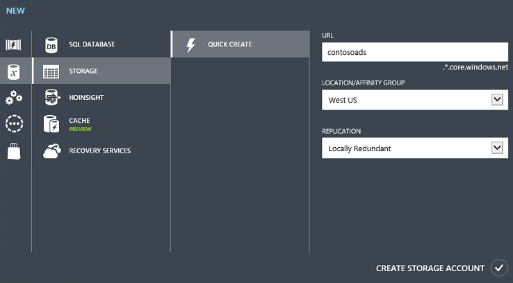
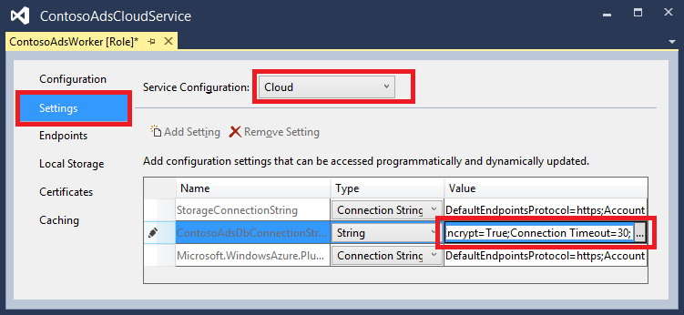
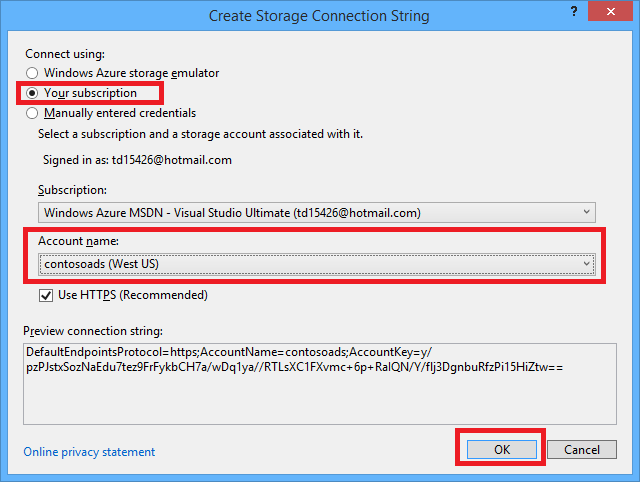
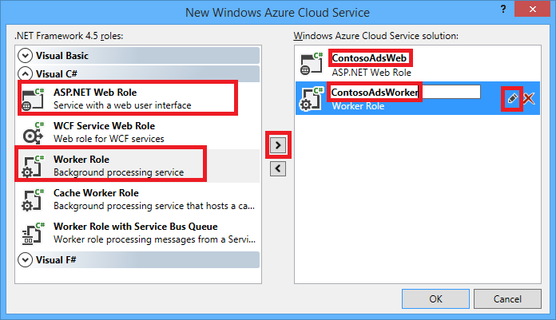

<properties
    pageTitle="開始使用 Azure 雲端服務與 ASP.NET |Microsoft Azure"
    description="瞭解如何建立使用 ASP.NET MVC 和 Azure 多層應用程式。 在雲端服務，網頁角色與工作角色中，執行應用程式。 使用實體架構與 SQL 資料庫 Azure 儲存體佇列和二進位大型物件。"
    services="cloud-services, storage"
    documentationCenter=".net"
    authors="Thraka"
    manager="timlt"
    editor=""/>

<tags
    ms.service="cloud-services"
    ms.workload="tbd"
    ms.tgt_pltfrm="na"
    ms.devlang="dotnet"
    ms.topic="hero-article"
    ms.date="06/10/2016"
    ms.author="adegeo"/>

# <a name="get-started-with-azure-cloud-services-and-aspnet"></a>Azure 雲端服務與 ASP.NET 快速入門

> [AZURE.SELECTOR]
- [Node.js](cloud-services-nodejs-develop-deploy-app.md)
- [.NET](cloud-services-dotnet-get-started.md)

## <a name="overview"></a>概觀

本教學課程中會顯示如何建立 ASP.NET MVC 前端，多層.NET 應用程式，並將其部署至[Azure 雲端服務](cloud-services-choose-me.md)。 應用程式使用[Azure SQL 資料庫](http://msdn.microsoft.com/library/azure/ee336279)、 [Azure Blob 服務](http://www.asp.net/aspnet/overview/developing-apps-with-windows-azure/building-real-world-cloud-apps-with-windows-azure/unstructured-blob-storage)及[Azure 佇列服務](http://www.asp.net/aspnet/overview/developing-apps-with-windows-azure/building-real-world-cloud-apps-with-windows-azure/queue-centric-work-pattern)。 您可以從 MSDN 程式碼庫中[下載 Visual Studio 專案](http://code.msdn.microsoft.com/Simple-Azure-Cloud-Service-e01df2e4)。

教學課程示範如何建立和本機執行應用程式、 如何將其部署到 Azure 及執行在雲端，以及最後從頭建立方式。 您可以建置從頭開始，然後執行測試和部署步驟之後，如果您想。

## <a name="contoso-ads-application"></a>Contoso 廣告應用程式

應用程式的廣告公佈欄。 使用者建立 ad 輸入文字，然後上傳圖像。 他們可以看到廣告縮圖圖像的清單，然後他們選取 ad 查看詳細資料時，他們可以看到完整大小的圖像。


應用程式使用[佇列中為中心的工作模式](http://www.asp.net/aspnet/overview/developing-apps-with-windows-azure/building-real-world-cloud-apps-with-windows-azure/queue-centric-work-pattern)off-load 建立後端處理程序的縮圖的需要大量 CPU 的工作。

## <a name="alternative-architecture-websites-and-webjobs"></a>替代架構︰ 網站和 WebJobs

本教學課程中會顯示如何執行前端與後端 Azure 雲端服務中。 另一個是[Azure 網站](/services/web-sites/)中執行的前端與後端使用[WebJobs](http://go.microsoft.com/fwlink/?LinkId=390226)中的功能 （目前預覽版本）。 使用 WebJobs 的教學課程，請參閱[Azure WebJobs SDK 快速入門](../app-service-web/websites-dotnet-webjobs-sdk-get-started.md)。 若要瞭解如何選擇最適合您的狀況的服務，請參閱[Azure 網站、 雲端服務，以及虛擬機器比較](../app-service-web/choose-web-site-cloud-service-vm.md)。

## <a name="what-youll-learn"></a>您將學習

* 如何安裝 Azure SDK 來啟用您的電腦 Azure 開發。
* 如何建立 ASP.NET MVC Visual Studio 雲端服務專案 web 角色和工作者角色。
* 如何測試雲端服務專案本機，使用 Azure 儲存模擬器。
* 如何發佈雲端 Azure 雲端服務的專案，以及測試使用 Azure 儲存體帳戶。
* 如何上傳檔案並將它們儲存在 Azure Blob 服務。
* 如何使用 Azure 佇列服務層之間的通訊。

## <a name="prerequisites"></a>必要條件

教學課程，假設您瞭解[Azure 雲端服務的相關的基本概念](cloud-services-choose-me.md)，例如*網頁角色*和*工作者角色*術語。  也會假設您已經知道如何在 Visual Studio [ASP.NET MVC](http://www.asp.net/mvc/tutorials/mvc-5/introduction/getting-started)或[Web 表單](http://www.asp.net/web-forms/tutorials/aspnet-45/getting-started-with-aspnet-45-web-forms/introduction-and-overview)專案的共同作業。 範例應用程式使用 MVC，但大部分的教學課程也適用於網頁表單。

您可以執行的應用程式本機沒有 Azure 訂閱，但您會需要才能部署至雲端的應用程式。 如果您沒有帳戶，您可以[啟動您的 MSDN 訂閱權益](/pricing/member-offers/msdn-benefits-details/?WT.mc_id=A55E3C668)或[註冊免費試用版](/pricing/free-trial/?WT.mc_id=A55E3C668)。

教學課程的指示使用下列產品其中一項︰

* Visual Studio 2013
* Visual Studio 2015

如果您沒有安裝下列其中一項，當您安裝 Azure SDK 時自動已安裝 Visual Studio 2015。

## <a name="application-architecture"></a>應用程式結構

應用程式會在 SQL 資料庫中，使用來建立資料表及存取資料的實體架構的程式碼第一個儲存廣告。 每個廣告資料庫會儲存一個完整大小的圖像，另一個縮圖的兩個 Url。


當使用者上傳的圖像時，前端網頁角色執行將圖像儲存[Azure blob](http://www.asp.net/aspnet/overview/developing-apps-with-windows-azure/building-real-world-cloud-apps-with-windows-azure/unstructured-blob-storage)，而且會儲存 ad 資訊在資料庫中以指向 blob 的 URL。 同時，它會將訊息的 Azure 佇列。 定期執行工作者角色中的後端程序輪詢佇列中的新郵件。 新的訊息出現時，工作者角色建立該圖像的縮圖，並更新該廣告縮圖的 [URL 資料庫] 欄位。 下圖顯示部分應用程式中互動的方式。


[AZURE.INCLUDE [install-sdk](../../includes/install-sdk-2015-2013.md)]

## <a name="download-and-run-the-completed-solution"></a>下載並執行已完成的解決方案

1. 下載並解壓縮[完成解決方案](http://code.msdn.microsoft.com/Simple-Azure-Cloud-Service-e01df2e4)。

2. 啟動 [Visual Studio。

3. 從 [**檔案**] 功能表選擇 [**開啟專案**，瀏覽至您已下載的解決方案，然後開啟方案檔案。

3. 按下 CTRL + SHIFT + B 建置解決方案。

    根據預設，Visual Studio 自動還原未包含在*.zip*檔案 NuGet 封裝內容。 如果沒有還原套件，請安裝，以手動方式前往 [**管理解決方案的 NuGet 套件**] 對話方塊中，按一下右上方的 [**還原**] 按鈕。

3. 在**方案總管]**中，請確認已選取 [ **ContosoAdsCloudService**為啟動專案。

2. 如果您使用 Visual Studio 2015，變更 ContosoAdsWeb 專案的應用程式*Web.config*檔案和*ServiceConfiguration.Local.cscfg* ContosoAdsCloudService 專案檔案中的 SQL Server 連接字串。 每個 」 (localdb) \MSSQLLocalDB 「 變更 」 (localdb) \v11.0 」。

1. 按下 CTRL + F5 執行應用程式。

    當您在本機執行雲端服務專案時，Visual Studio 自動叫用 Azure*計算模擬器*和 Azure*儲存模擬器*。 計算模擬器會使用您的電腦資源模擬 web 角色和背景工作角色環境。 儲存模擬器使用[SQL Server Express LocalDB](http://msdn.microsoft.com/library/hh510202.aspx)資料庫模擬 Azure 雲端儲存空間。

    第一次執行雲端服務專案，則需要幾分鐘，或啟動模擬器。 完成模擬器啟動時，預設的瀏覽器會開啟應用程式的 [首頁] 頁面。

    

2. 按一下 [**建立 Ad**。

2. 輸入某些測試資料並選取要上傳、 *.jpg*圖像，然後按一下 [**建立**。

    

    應用程式移至 [索引] 頁面中，但因為尚未尚未發生程序不會顯示新的廣告的縮圖。

3. 等候一下，然後重新整理 [索引] 頁面，以查看縮圖。

    

4. 按一下 [**詳細資料**的 ad 若要查看完整大小的圖像。

    ![詳細資料] 頁面](./media/cloud-services-dotnet-get-started/details.png)

您已完全在您的本機電腦，沒有連線至雲端上執行應用程式。 儲存模擬器將佇列和 blob 資料儲存在 SQL Server Express LocalDB 資料庫中，與應用程式儲存 ad 資料另一個 LocalDB 資料庫。 實體架構的程式碼第一個自動建立 ad 資料庫第一次嘗試存取 web 應用程式。

下一節中，您會設定雲端中執行時，使用 Azure 雲端資源佇列二進位大型物件，以及應用程式資料庫的解決方案。 如果您想要繼續在本機上執行，但使用雲端儲存和資料庫資源，也可以執行的動作;是的連接字串，您會看到如何進行設定。

## <a name="deploy-the-application-to-azure"></a>部署至 Azure 應用程式

您必須執行下列步驟，以在雲端執行應用程式︰

* 建立 Azure 雲端服務。
* 建立 Azure SQL 資料庫。
* 建立 Azure 儲存體帳戶。
* 設定解決方案 Azure 中執行時，使用 Azure SQL 資料庫。
* 設定使用 Azure 儲存體帳戶 Azure 中執行時的解決方案。
* 部署至 Azure 雲端服務的專案。

### <a name="create-an-azure-cloud-service"></a>建立 Azure 雲端服務

Azure 雲端服務是應用程式中執行的環境。

1. 在瀏覽器中開啟[Azure 傳統入口網站](http://manage.windowsazure.com)。

2. 按一下 [**新增 > 計算 > 雲端服務 > 快速建立**。

4. 在 [URL 輸入] 方塊中，輸入 URL 前置字元。

    此 URL 必須是唯一的。  如果您選擇的前置詞已由其他人使用，您將會收到錯誤訊息。

5. 選擇您要部署的應用程式的區域。

    這個欄位指定會裝載您的雲端服務中的資料中心。 生產應用程式，您可以選擇您的客戶的區域。 在此教學課程中，選擇您最接近的區域。

6. 按一下 [**建立雲端服務**。

    下圖中，在雲端服務會建立 URL contosoads.cloudapp.net。

    

### <a name="create-an-azure-sql-database"></a>建立 Azure SQL 資料庫

應用程式執行時在雲端，它會使用雲端的資料庫。

1. 在 [ [Azure 傳統入口網站](http://manage.windowsazure.com)中，按一下 [**新增 > 資料服務 > SQL 資料庫 > 快速建立**。

1. 在 [**資料庫名稱**] 方塊中，輸入*contosoads*。

1. 從 [**伺服器**] 下拉式清單中，選擇**新的 SQL 資料庫伺服器**。

    或者，如果您的訂閱已經有伺服器，您就可以從下拉式清單選取該伺服器。

1. 選擇您選擇雲端服務的同一個**區域**。

    當雲端服務，資料庫位於不同的資料中心 （不同區域），會增加延遲和您付費的外部資料中心的頻寬。 資料中心的頻寬是免費的。

1. 輸入的系統管理員**的登入名稱**和**密碼**。

    如果您選取現有的名稱和密碼，您無法輸入**新的 SQL 資料庫伺服器**時，您輸入的新名稱和密碼您現在定義以供日後使用，當您存取資料庫。 如果您選取您先前建立的伺服器時，系統會提示您輸入密碼，您建立的系統管理員的使用者帳戶。

1. 按一下 [**建立 SQL 資料庫**]。

    

1. Azure 完成建立資料庫後，請按一下入口網站的左窗格中的 [ **SQL 資料庫**] 索引標籤，然後按一下 [新資料庫的名稱。

2. 按一下 [**儀表板**] 索引標籤。

3. 按一下 [**管理允許的 IP 位址**]。

4. 在 [**允許的服務**變更**Azure 服務**為 [**是]**。

5. 按一下 [**儲存**]。

### <a name="create-an-azure-storage-account"></a>建立 Azure 儲存體帳戶

Azure 儲存體帳戶提供資源儲存在雲端的佇列和 blob 的資料。

在真實世界應用程式中，您通常會建立與記錄資料，並在另一個帳戶測試資料的實際執行資料與應用程式的不同的帳戶。 在此教學課程中，您會使用只用一個帳戶。

1. 在 [ [Azure 傳統入口網站](http://manage.windowsazure.com)中，按一下 [**新增 > 資料服務 > 儲存 > 快速建立**。

4. 在 [ **URL** ] 方塊中，輸入 URL 前置字元。

    這個字首加上您看到] 方塊下方的文字會是唯一的 URL，您儲存的帳戶。 如果您輸入的前置詞已經使用其他人，您必須選擇不同的前置詞。

5. 以您選擇的雲端服務的相同地區設定 [**地區**] 下拉式清單。

    雲端儲存空間的服務與帳戶位於不同的資料中心 （不同區域），會增加延遲和您付費的外部資料中心的頻寬。 資料中心的頻寬是免費的。

    Azure 相關性群組提供機制最小化的資料中心，以降低延遲中的資源之間的距離。 本教學課程中不使用相關性群組。 如需詳細資訊，請參閱[如何建立 Azure 中相關性群組](http://msdn.microsoft.com/library/jj156209.aspx)。

6. 若要**從本機多餘**設定**複寫**下拉式清單。

    儲存帳戶啟用地理複寫時，會將儲存的內容複寫到次要的資料中心，以啟用容錯移轉的主要位置的主要損毀的情況下該位置。 地理複寫可以造成成本。 測試和開發的帳戶，您通常不想支付地理複寫。 如需詳細資訊，請參閱[建立、 管理，或刪除儲存的帳戶](../storage/storage-create-storage-account.md#replication-options)。

5. 按一下 [**建立儲存帳戶**]。

    

    在圖像，以儲存帳戶使用 URL 建立`contosoads.core.windows.net`。

### <a name="configure-the-solution-to-use-your-azure-sql-database-when-it-runs-in-azure"></a>設定解決方案 Azure 中執行時，使用 Azure SQL 資料庫

Web 專案與工作角色專案每個都有它自己的資料庫連線字串，而且每個必須 Azure 中執行的應用程式時，指向 Azure SQL 資料庫。

您會使用[Web.config 轉換](http://www.asp.net/mvc/tutorials/deployment/visual-studio-web-deployment/web-config-transformations)網頁角色及工作角色的雲端服務環境設定。

>[AZURE.NOTE] 您可以在此區段與 [下一步] 區段儲存專案檔案中的認證。 [不儲存公用來源程式碼存放庫中的機密資料](http://www.asp.net/aspnet/overview/developing-apps-with-windows-azure/building-real-world-cloud-apps-with-windows-azure/source-control#secrets)。

1. 在 ContosoAdsWeb 專案中，開啟應用程式*Web.config*檔案的*Web.Release.config*轉換檔案，然後刪除包含的註解區塊`<connectionStrings>`項目，並貼上下列程式碼中的位置。

    ```xml
    <connectionStrings>
        <add name="ContosoAdsContext" connectionString="{connectionstring}"
        providerName="System.Data.SqlClient" xdt:Transform="SetAttributes" xdt:Locator="Match(name)"/>
    </connectionStrings>
    ```

    將檔案保留在開啟進行編輯。

2. 在[Azure 傳統入口網站](http://manage.windowsazure.com)中，按一下左窗格中的 [ **SQL 資料庫**您在此教學課程所建立的資料庫、 按一下 [**儀表板**] 索引標籤，然後按一下然後按一下 [**顯示的連接字串**。

    

    入口網站會顯示的連接字串，與版面配置區的密碼。

    

4. 在 [ *Web.Release.config*轉換檔案中，刪除`{connectionstring}`並貼上在原處 Azure 傳統入口網站的 ADO.NET 連接字串。

5. 在您貼上至*Web.Release.config*轉換檔案的連接字串取代`{your_password_here}`您建立新的 SQL 資料庫的密碼。

7. 儲存檔案。  

6. 選取並複製 （不含周圍的引號） 中的連接字串，用於下列步驟設定工作者角色專案。

5. 在**方案總管**] 中，在雲端服務專案中的**角色**下**ContosoAdsWorker**以滑鼠右鍵按一下，然後按一下**屬性**。

    

6. 按一下 [**設定**] 索引標籤。

7. 變更**雲端****服務設定**。

7. 選取 [**值**] 欄位`ContosoAdsDbConnectionString`設定，然後再貼上您從上一節的教學課程複製連線字串。

    

7. 儲存變更。  

### <a name="configure-the-solution-to-use-your-azure-storage-account-when-it-runs-in-azure"></a>設定 Azure 中執行時，使用您的 Azure 儲存體帳戶方案

Azure 儲存體帳戶連線字串 web 角色專案與工作角色專案會儲存在雲端服務專案中的環境設定。 每個專案中有一組個別的應用程式在本機上執行時，和雲端中執行時使用的設定。 您將會更新 web 和工作者角色專案的雲端環境設定。

1. 在**方案總管**] 中，以滑鼠右鍵按一下**ContosoAdsCloudService**專案中的**角色**下**ContosoAdsWeb** ，然後按一下**屬性**。

    

2. 按一下 [**設定**] 索引標籤。 在 [**服務設定**] 下拉式方塊中，選擇 [**雲端**]。

    

3. 選取**StorageConnectionString**項目，而且您會看到線的右端的省略符號 （**...**） 按鈕。 按一下省略符號] 按鈕以開啟 [**建立儲存帳戶連線字串**] 對話方塊。

    

4. 在 [**建立儲存連線字串**] 對話方塊中，按一下 [**您的訂閱**，選擇您先前建立的儲存空間帳戶，然後按一下**[確定]**。 如果您沒有登入，您會提示您 Azure 帳戶認證。

    

5. 儲存變更。

6. 依照您使用的相同程序`StorageConnectionString`若要設定的連接字串`Microsoft.WindowsAzure.Plugins.Diagnostics.ConnectionString`連線字串。

    此連線字串用於記錄。

7. 請遵循您為**ContosoAdsWeb**角色用來設定**ContosoAdsWorker**角色的兩個連接字串的相同程序。 別忘了至**雲端****服務**設定。

您已設定使用 Visual Studio UI 的角色環境設定會儲存在 ContosoAdsCloudService 專案中的下列檔案︰

* *ServiceDefinition.csdef* -定義設定名稱。
* *ServiceConfiguration.Cloud.cscfg* -提供應用程式時執行雲端中的值。
* *ServiceConfiguration.Local.cscfg* -提供的應用程式時執行本機值。

例如，ServiceDefinition.csdef 會包含下列的定義。

```xml
<ConfigurationSettings>
    <Setting name="StorageConnectionString" />
    <Setting name="ContosoAdsDbConnectionString" />
</ConfigurationSettings>
```

並且*ServiceConfiguration.Cloud.cscfg*檔案包含您所輸入的 Visual Studio 中這些設定的值。

```xml
<Role name="ContosoAdsWorker">
    <Instances count="1" />
    <ConfigurationSettings>
        <Setting name="StorageConnectionString" value="{yourconnectionstring}" />
        <Setting name="ContosoAdsDbConnectionString" value="{yourconnectionstring}" />
        <!-- other settings not shown -->

    </ConfigurationSettings>
    <!-- other settings not shown -->

</Role>
```

`<Instances>`設定指定 Azure 會工作者角色執行程式碼的虛擬機器數目。 [[下一步](#next-steps)] 區段包含擴展雲端服務的詳細資訊的連結

###  <a name="deploy-the-project-to-azure"></a>部署專案至 Azure

1.  在**方案總管]**中，請以滑鼠右鍵按一下**ContosoAdsCloudService**雲端專案，，然後選取 [**發佈]**。

    ![發佈] 功能表](./media/cloud-services-dotnet-get-started/pubmenu.png)

2. 在 [**發佈 Azure 應用程式**精靈的**登入**步驟，按一下 [**下一步**]。

    

3. 在精靈的**設定**步驟中，按一下 [**下一步**]。

    

    在 [**進階**] 索引標籤中的預設設定都符合本教學課程。 [進階] 索引標籤的相關資訊，請參閱[發佈 Azure 應用程式精靈](http://msdn.microsoft.com/library/hh535756.aspx)。

4. 在 [**摘要**] 步驟中，按一下 [**發佈**]。

    

   **Azure 活動記錄**視窗隨即會開啟 Visual Studio 中。

5. 按一下向右箭號圖示，以展開部署詳細資料。

    部署可能會需要 5 分鐘或更多] 以完成。

    

6. 部署狀態完成後，按一下 [啟動應用程式的**Web app URL** ]。

7. 您現在可以測試應用程式來建立、 檢視及編輯某些廣告，如同您在本機上執行應用程式時。

>[AZURE.NOTE] 當您完成測試、 刪除或停止雲端服務。 即使您不使用雲端服務，虛擬機器資源會保留，因為它累算費用。 如果您將它執行，尋找您的 URL 的任何人可以建立及檢視廣告和。 在[Azure 傳統入口網站](http://manage.windowsazure.com)中，移至雲端服務，[**儀表板**] 索引標籤，然後按一下 [在頁面底部的 [**刪除**] 按鈕。 如果您只是要暫時防止其他人存取網站，按一下 [**停止**改為。 在此情況下，費用會繼續累算。 您可以遵循當您不再需要刪除 SQL 資料庫及儲存帳戶的類似程序。

## <a name="create-the-application-from-scratch"></a>從頭開始建立應用程式

如果您已經尚未下載[完成的應用程式](http://code.msdn.microsoft.com/Simple-Azure-Cloud-Service-e01df2e4)，看。 您會將下載的專案檔案複製到新的專案。

建立 Contoso 廣告應用程式，包括下列步驟︰

* 建立的雲端服務 Visual Studio 解決方案。
* 更新，並新增 NuGet 套件]。
* 設定專案的參考。
* 設定連線字串。
* 新增程式碼的檔案。

建立的解決方案之後，您會檢閱的唯一雲端服務專案和 Azure blob 佇列程式碼。

### <a name="create-a-cloud-service-visual-studio-solution"></a>建立的雲端服務 Visual Studio 解決方案

1. 在 Visual Studio 中，選擇 [從**檔案**] 功能表的 [**新專案**]。

2. 在**新專案**] 對話方塊的左窗格中，展開**Visual C#**並選擇**雲端**範本]，然後選擇**Azure 雲端服務**範本。

3. 專案和解決方案 ContosoAdsCloudService，名稱，然後按一下**[確定]**。

    

4. 在 [**新 Azure 雲端服務**] 對話方塊中，新增網頁角色和工作者角色。 命名網頁角色 ContosoAdsWeb，然後命名工作者角色 ContosoAdsWorker]。 （使用 [鉛筆] 圖示在右側窗格中變更角色的預設名稱）。

    

5. 當您看到網頁角色的 [**新的 ASP.NET 專案**] 對話方塊時，請選擇 [MVC 範本，然後按一下 [**變更驗證**。

    

7. **變更驗證**] 對話方塊中，選擇 [**無驗證**]，然後按一下**[確定]**。

    

8. 在 [**新的 ASP.NET 專案**] 對話方塊中，按一下**[確定]**。

9. 在**方案總管]**中，以滑鼠右鍵按一下方案 （不下列其中一項專案），並選擇**新增-新的專案。**

11. 在 [**加入新的專案**] 對話方塊的左窗格中，選擇 [ **Windows**下的 [ **Visual C#** ，然後按一下**課程文件庫**範本。  

10. *ContosoAdsCommon*，為專案的名稱，然後按一下**[確定]**。

    您需要從 web 和工作者角色專案參考的實體架構內容和資料模型。 另一個方法，可以在 web 角色專案中定義 EF 相關的類別，參照該專案的工作者角色專案。 不過在另一種方法，工作者角色專案會有它不需要的網頁組件的參考。

### <a name="update-and-add-nuget-packages"></a>更新，以及新增 NuGet 套件

1. 開啟 [**管理 NuGet 套件**] 對話方塊的解決方案。

2. 在視窗頂端，選取 [**更新**]。

3. 尋找*WindowsAzure.Storage*封裝並若是在清單中的範例，請選取它和選取它，更新 web 及背景工作的專案，然後按一下 [**更新**。

    儲存用戶端文件庫，您會發現的版本中新建立的預計需要更新超過 Visual Studio 專案範本，更新。

4. 在視窗頂端，選取 [**瀏覽**]。

5. 尋找*EntityFramework* NuGet 套件，並將其安裝在所有的三個專案。

6. 尋找*Microsoft.WindowsAzure.ConfigurationManager* NuGet 套件，並將其安裝在工作者角色專案。

### <a name="set-project-references"></a>設定專案參考

1. 在 ContosoAdsWeb 專案中，設定 ContosoAdsCommon 專案的參考。 ContosoAdsWeb 專案，以滑鼠右鍵按一下，然後按一下 [**參考資料** - **新增參照**。 在**參照管理員**] 對話方塊中，選取 [在左窗格中的 [**方案 – 專案** **ContosoAdsCommon**，，然後選取然後按一下**[確定]**。

2. 在 ContosoAdsWorker 專案中，設定 ContosAdsCommon 專案的參考。

    ContosoAdsCommon 將包含的實體架構資料模型和內容類別，將會用於前端與後端。

3. 在 ContosoAdsWorker 專案中，設定為參照`System.Drawing`。

    後端使用這個組件將影像轉換為縮圖。

### <a name="configure-connection-strings"></a>設定連線字串

您可以在此區段中設定 Azure 儲存體和 SQL 連接字串，以進行測試本機。 部署中的指示進行先前教學課程說明如何設定應用程式執行在雲端的連線字串。

1. 在 ContosoAdsWeb 專案中，開啟應用程式 Web.config 檔案，並插入下列`connectionStrings`之後的項目`configSections`項目。

    ```xml
    <connectionStrings>
        <add name="ContosoAdsContext" connectionString="Data Source=(localdb)\v11.0; Initial Catalog=ContosoAds; Integrated Security=True; MultipleActiveResultSets=True;" providerName="System.Data.SqlClient" />
    </connectionStrings>
    ```

    如果您使用 Visual Studio 2015，取代 「 v11.0 」 與 「 MSSQLLocalDB 」。

2. 儲存變更。

3. 在 ContosoAdsCloudService 專案，以滑鼠右鍵按一下 ContosoAdsWeb**角色**] 下的，然後按一下**屬性**。

    

4. 在**[角色] ContosAdsWeb**內容] 視窗中，按一下 [**設定**] 索引標籤，然後按一下**新增的設定**。

    將**服務設定**設為**所有的設定**。

5. 新增新名為*StorageConnectionString*的設定。 將**類型**設定為 [*連接字串*，並將**值**設定為*UseDevelopmentStorage = true*。

    

6. 儲存變更。

7. 請依照將 ContosoAdsWorker 角色屬性中的儲存空間連線字串的相同程序。

8. 仍在**ContosoAdsWorker [角色]**屬性] 視窗中，新增另一個連線字串︰

    * 名稱︰ ContosoAdsDbConnectionString
    * 類型︰ 字串
    * 值︰ 貼上相同的連接字串，用於 web 角色專案。 （下列範例是 Visual Studio 2013，別忘了要變更的資料來源，如果您複製此範例中，您使用的 Visual Studio 2015）。

        ```
        Data Source=(localdb)\v11.0; Initial Catalog=ContosoAds; Integrated Security=True; MultipleActiveResultSets=True;
        ```

### <a name="add-code-files"></a>新增檔案

本節中您的程式碼將檔案複製下載解決方案到新方案。 下列各節會顯示，並說明這段程式碼的重要部分。

將檔案新增到專案或資料夾，請以滑鼠右鍵按一下專案或資料夾，然後按一下 [**新增** - **現有項目**。 選取您想要然後按一下 [**新增**的檔案。 如果詢問您是否要取代現有的檔案，請，按一下**[是]**。

3. 在 ContosoAdsCommon 專案中，刪除*Class1.cs*檔案並在其位置的*Ad.cs*和*ContosoAdscontext.cs*檔案從新增下載的專案。

3. 在 ContosoAdsWeb 專案中，請從下載的專案中新增下列檔案。
    - *Global.asax.cs*。  
    - 在 [ *Views\Shared*資料夾︰ * \_Layout.cshtml*。
    - 在 [ *Views\Home*資料夾︰ *Index.cshtml*。
    - 在*控制站*資料夾︰ *AdController.cs*。
    - 在 [ *Views\Ad*資料夾 （第一次建立資料夾）︰ 五個*.cshtml*檔案。

3. 在 ContosoAdsWorker 專案中，請從下載的專案中新增*WorkerRole.cs* 。

您現在可以建立並執行應用程式之前在教學課程中的指示，並使用本機資料庫及儲存模擬器資源應用程式。

下列各節說明使用環境 Azure blob，與佇列相關的程式碼。 本教學課程中不會說明如何建立 MVC 控制器和使用 scaffolding，如何撰寫搭配 SQL Server 資料庫或在 ASP.NET 4.5 非同步程式設計的基本概念的實體架構程式碼的檢視。 這些主題相關的資訊，請參閱下列資源︰

* [快速入門 MVC 5](http://www.asp.net/mvc/tutorials/mvc-5/introduction/getting-started)
* [快速入門 EF 6 和 MVC 5](http://www.asp.net/mvc/tutorials/getting-started-with-ef-using-mvc)
* [非同步簡介程式設計.NET 4.5 中](http://www.asp.net/aspnet/overview/developing-apps-with-windows-azure/building-real-world-cloud-apps-with-windows-azure/web-development-best-practices#async)。

### <a name="contosoadscommon---adcs"></a>ContosoAdsCommon-Ad.cs

Ad.cs 檔案定義 ad 類別列舉和 ad 資訊 POCO 實體類別。

```csharp
public enum Category
{
    Cars,
    [Display(Name="Real Estate")]
    RealEstate,
    [Display(Name = "Free Stuff")]
    FreeStuff
}

public class Ad
{
    public int AdId { get; set; }

    [StringLength(100)]
    public string Title { get; set; }

    public int Price { get; set; }

    [StringLength(1000)]
    [DataType(DataType.MultilineText)]
    public string Description { get; set; }

    [StringLength(1000)]
    [DisplayName("Full-size Image")]
    public string ImageURL { get; set; }

    [StringLength(1000)]
    [DisplayName("Thumbnail")]
    public string ThumbnailURL { get; set; }

    [DataType(DataType.Date)]
    [DisplayFormat(DataFormatString = "{0:yyyy-MM-dd}", ApplyFormatInEditMode = true)]
    public DateTime PostedDate { get; set; }

    public Category? Category { get; set; }
    [StringLength(12)]
    public string Phone { get; set; }
}
```

### <a name="contosoadscommon---contosoadscontextcs"></a>ContosoAdsCommon-ContosoAdsContext.cs

ContosoAdsContext 類別指定 DbSet 集合，其中的實體架構將會儲存在 SQL 資料庫中使用 Ad 類別。

```csharp
public class ContosoAdsContext : DbContext
{
    public ContosoAdsContext() : base("name=ContosoAdsContext")
    {
    }
    public ContosoAdsContext(string connString)
        : base(connString)
    {
    }
    public System.Data.Entity.DbSet<Ad> Ads { get; set; }
}
```

類別有兩個建構函式。 進行中的第一個 web 專案時，會使用，並指定連線字串中 Web.config 檔案所儲存的名稱。 第二個建構函式可讓您傳入實際的連接字串。 所需工作者角色專案，因為它沒有 Web.config 檔案。 您先前所見位置儲存此連線字串，，而且您會看到如何碼擷取連接字串時，會產生 DbContext 類別。

### <a name="contosoadsweb---globalasaxcs"></a>ContosoAdsWeb-Global.asax.cs

程式碼，稱為 [從`Application_Start`方法建立*圖像*blob 容器和*圖像*佇列如果已經不存在。 如此一來，可確保，每當您開始使用新的儲存空間帳戶，或開始新的電腦上使用的儲存空間模擬器時，所需的 blob 容器和佇列就會自動建立。

程式碼會取得以存取儲存帳戶使用*.cscfg*檔案儲存空間連線字串。

```csharp
var storageAccount = CloudStorageAccount.Parse
    (RoleEnvironment.GetConfigurationSettingValue("StorageConnectionString"));
```

接著，取得*圖像*blob 容器的參照，然後建立容器，如果尚不存在，並將存取權限設定新的容器上。 根據預設，新的容器只允許儲存帳戶認證以存取 blob 的用戶端。 網站需求，讓它可以顯示圖像使用指向 [影像 blob 的 Url 是公用 blob。

```csharp
var blobClient = storageAccount.CreateCloudBlobClient();
var imagesBlobContainer = blobClient.GetContainerReference("images");
if (imagesBlobContainer.CreateIfNotExists())
{
    imagesBlobContainer.SetPermissions(
        new BlobContainerPermissions
        {
            PublicAccess =BlobContainerPublicAccessType.Blob
        });
}
```

類似的程式碼取得*圖像*佇列中的參照，並建立新的佇列。 在此情況下，需要沒有權限變更。

```csharp
CloudQueueClient queueClient = storageAccount.CreateCloudQueueClient();
var imagesQueue = queueClient.GetQueueReference("images");
imagesQueue.CreateIfNotExists();
```

### <a name="contosoadsweb---layoutcshtml"></a>ContosoAdsWeb- \_Layout.cshtml

*_Layout.cshtml*檔案中的頁首及頁尾]，設定應用程式的名稱，並建立 「 廣告] 功能表項目。

### <a name="contosoadsweb---viewshomeindexcshtml"></a>ContosoAdsWeb-Views\Home\Index.cshtml

*Views\Home\Index.cshtml*檔案會顯示在 [首頁] 頁面上的類別連結。 連結傳遞的整數值`Category`廣告索引頁查詢字串變數中的列舉。

```razor
<li>@Html.ActionLink("Cars", "Index", "Ad", new { category = (int)Category.Cars }, null)</li>
<li>@Html.ActionLink("Real estate", "Index", "Ad", new { category = (int)Category.RealEstate }, null)</li>
<li>@Html.ActionLink("Free stuff", "Index", "Ad", new { category = (int)Category.FreeStuff }, null)</li>
<li>@Html.ActionLink("All", "Index", "Ad", null, null)</li>
```

### <a name="contosoadsweb---adcontrollercs"></a>ContosoAdsWeb-AdController.cs

在*AdController.cs*檔案建構函式通話`InitializeStorage`方法，以建立可提供的 API 使用二進位大型物件和佇列 Azure 儲存用戶端文件庫物件。

然後程式碼會較舊版本中*Global.asax.cs*取得*圖像*blob 容器的參考。 同時將其設定為預設值，[再試一次原則](http://www.asp.net/aspnet/overview/developing-apps-with-windows-azure/building-real-world-cloud-apps-with-windows-azure/transient-fault-handling)的實際操作適當的 web 應用程式。 預設的指數輪詢重試原則可能會超過一分鐘上重複重試暫時性錯誤的 web 應用程式。 在這裡指定重試原則會 3 秒後每嘗試的最多 3 次。

```csharp
var blobClient = storageAccount.CreateCloudBlobClient();
blobClient.DefaultRequestOptions.RetryPolicy = new LinearRetry(TimeSpan.FromSeconds(3), 3);
imagesBlobContainer = blobClient.GetContainerReference("images");
```

類似的程式碼取得*圖像*佇列中的參照。

```csharp
CloudQueueClient queueClient = storageAccount.CreateCloudQueueClient();
queueClient.DefaultRequestOptions.RetryPolicy = new LinearRetry(TimeSpan.FromSeconds(3), 3);
imagesQueue = queueClient.GetQueueReference("images");
```

使用 DbContext 類別的實體架構資料模型所使用的是碼的大部分。 例外狀況是 HttpPost`Create`方法上, 傳的檔案，並將它儲存在 blob 儲存體。 模型文件夾提供[HttpPostedFileBase](http://msdn.microsoft.com/library/system.web.httppostedfilebase.aspx)物件的方法。

```csharp
[HttpPost]
[ValidateAntiForgeryToken]
public async Task<ActionResult> Create(
    [Bind(Include = "Title,Price,Description,Category,Phone")] Ad ad,
    HttpPostedFileBase imageFile)
```

如果使用者選取要上傳的檔案，程式碼會上傳的檔案，將它儲存在 blob，並更新 Ad 資料庫記錄指向 blob 的 URL。

```csharp
if (imageFile != null && imageFile.ContentLength != 0)
{
    blob = await UploadAndSaveBlobAsync(imageFile);
    ad.ImageURL = blob.Uri.ToString();
}
```

上傳的程式碼是`UploadAndSaveBlobAsync`方法。 它會建立 blob 的 GUID 名稱、 上傳並儲存的檔案，並傳回儲存 blob 的參照。

```csharp
private async Task<CloudBlockBlob> UploadAndSaveBlobAsync(HttpPostedFileBase imageFile)
{
    string blobName = Guid.NewGuid().ToString() + Path.GetExtension(imageFile.FileName);
    CloudBlockBlob imageBlob = imagesBlobContainer.GetBlockBlobReference(blobName);
    using (var fileStream = imageFile.InputStream)
    {
        await imageBlob.UploadFromStreamAsync(fileStream);
    }
    return imageBlob;
}
```

之後 HttpPost`Create`方法上傳 blob 更新資料庫，它會建立佇列中郵件通知的後端程序圖像是否已轉換為縮圖。

```csharp
string queueMessageString = ad.AdId.ToString();
var queueMessage = new CloudQueueMessage(queueMessageString);
await queue.AddMessageAsync(queueMessage);
```

HttpPost 的程式碼`Edit`方法很類似，但如果使用者選了新的圖像檔案，必須刪除已存在於任何二進位大型物件。

```csharp
if (imageFile != null && imageFile.ContentLength != 0)
{
    await DeleteAdBlobsAsync(ad);
    imageBlob = await UploadAndSaveBlobAsync(imageFile);
    ad.ImageURL = imageBlob.Uri.ToString();
}
```

下一個範例顯示當您刪除 ad 刪除 blob 的程式碼。

```csharp
private async Task DeleteAdBlobsAsync(Ad ad)
{
    if (!string.IsNullOrWhiteSpace(ad.ImageURL))
    {
        Uri blobUri = new Uri(ad.ImageURL);
        await DeleteAdBlobAsync(blobUri);
    }
    if (!string.IsNullOrWhiteSpace(ad.ThumbnailURL))
    {
        Uri blobUri = new Uri(ad.ThumbnailURL);
        await DeleteAdBlobAsync(blobUri);
    }
}
private static async Task DeleteAdBlobAsync(Uri blobUri)
{
    string blobName = blobUri.Segments[blobUri.Segments.Length - 1];
    CloudBlockBlob blobToDelete = imagesBlobContainer.GetBlockBlobReference(blobName);
    await blobToDelete.DeleteAsync();
}
```

### <a name="contosoadsweb---viewsadindexcshtml-and-detailscshtml"></a>ContosoAdsWeb-Views\Ad\Index.cshtml 和 Details.cshtml

*Index.cshtml*檔案會顯示縮圖的其他 ad 資料。

```razor

```

*Details.cshtml*檔案會顯示完整大小的圖像。

```razor

```

### <a name="contosoadsweb---viewsadcreatecshtml-and-editcshtml"></a>ContosoAdsWeb-Views\Ad\Create.cshtml 和 Edit.cshtml

*Create.cshtml*和*Edit.cshtml*檔案指定表單編碼可取得控制器`HttpPostedFileBase`物件。

```razor
@using (Html.BeginForm("Create", "Ad", FormMethod.Post, new { enctype = "multipart/form-data" }))
```

`<input>`項目會告訴瀏覽器，提供檔案的選取範圍] 對話方塊。

```razor
<input type="file" name="imageFile" accept="image/*" class="form-control fileupload" />
```

### <a name="contosoadsworker---workerrolecs---onstart-method"></a>ContosoAdsWorker-WorkerRole.cs-OnStart 方法

Azure 工作者角色環境通話`OnStart`中的方法`WorkerRole`課程工作者角色 [快速入門]，然後呼叫`Run`方法時`OnStart`方法完成。

`OnStart`方法從*.cscfg*檔案取得資料庫連線字串，然後傳送到的實體架構 DbContext 類別。 根據預設，使用 SQLClient 提供者，因此指定並沒有提供者。

```csharp
var dbConnString = CloudConfigurationManager.GetSetting("ContosoAdsDbConnectionString");
db = new ContosoAdsContext(dbConnString);
```

之後的方法取得儲存帳戶的參照，並建立 blob 容器和佇列中，如果不存在。 為該程式碼是類似已經所看到的內容中的網頁角色`Application_Start`方法。

### <a name="contosoadsworker---workerrolecs---run-method"></a>ContosoAdsWorker-WorkerRole.cs-執行方法

`Run`方法稱為何時`OnStart`方法完成初始化工作。 執行無限迴圈的監看式新佇列中郵件送達時加以處理的方法。

```csharp
public override void Run()
{
    CloudQueueMessage msg = null;

    while (true)
    {
        try
        {
            msg = this.imagesQueue.GetMessage();
            if (msg != null)
            {
                ProcessQueueMessage(msg);
            }
            else
            {
                System.Threading.Thread.Sleep(1000);
            }
        }
        catch (StorageException e)
        {
            if (msg != null && msg.DequeueCount > 5)
            {
                this.imagesQueue.DeleteMessage(msg);
            }
            System.Threading.Thread.Sleep(5000);
        }
    }
}
```

在每次循環播放，如果找不到任何佇列中的訊息，程式會暫停第二個。 如此可避免工作者角色支付過多 CPU 時間和儲存交易成本。 Microsoft 客戶會談小組告知開發人員，包括忘記密碼的人員本文部署至生產，以及假期的。 在他之後後，他監督成本超過假期。

有時佇列中郵件的內容會導致錯誤處理。 這稱為*有害訊息*，，如果您只是登入錯誤，並重新啟動循環播放，您可能會不斷嘗試處理的郵件。  因此攔截包含 if 陳述式，若要查看次數應用程式會檢查是否有嘗試目前的郵件，[處理程序和已超過 5 的時間，則會刪除郵件從佇列。

`ProcessQueueMessage`找到佇列中訊息時，呼叫。

```csharp
private void ProcessQueueMessage(CloudQueueMessage msg)
{
    var adId = int.Parse(msg.AsString);
    Ad ad = db.Ads.Find(adId);
    if (ad == null)
    {
        throw new Exception(String.Format("AdId {0} not found, can't create thumbnail", adId.ToString()));
    }

    CloudBlockBlob inputBlob = this.imagesBlobContainer.GetBlockBlobReference(ad.ImageURL);

    string thumbnailName = Path.GetFileNameWithoutExtension(inputBlob.Name) + "thumb.jpg";
    CloudBlockBlob outputBlob = this.imagesBlobContainer.GetBlockBlobReference(thumbnailName);

    using (Stream input = inputBlob.OpenRead())
    using (Stream output = outputBlob.OpenWrite())
    {
        ConvertImageToThumbnailJPG(input, output);
        outputBlob.Properties.ContentType = "image/jpeg";
    }

    ad.ThumbnailURL = outputBlob.Uri.ToString();
    db.SaveChanges();

    this.imagesQueue.DeleteMessage(msg);
}
```

將此程式碼讀取的資料庫，以取得圖像 URL、 將圖像轉換成縮圖、 blob 儲存縮圖、 的縮圖 blob URL，更新資料庫並刪除佇列中的郵件。

>[AZURE.NOTE] 中的程式碼`ConvertImageToThumbnailJPG`方法為求 System.Drawing 命名空間中使用類別。 不過，搭配 Windows 表單設計這個命名空間中的類別。 他們不支援的 Windows] 或 [ASP.NET 服務中使用。 如需處理選項的圖像的詳細資訊，請參閱[動態圖像產生](http://www.hanselman.com/blog/BackToBasicsDynamicImageGenerationASPNETControllersRoutingIHttpHandlersAndRunAllManagedModulesForAllRequests.aspx)及[深度內圖像調整大小](http://www.hanselminutes.com/313/deep-inside-image-resizing-and-scaling-with-aspnet-and-iis-with-imageresizingnet-author-na)。

## <a name="troubleshooting"></a>疑難排解

萬一項目無法運作時您正在追蹤的指示，在本教學課程，以下是一些常見的錯誤，以及如何解決方法。

### <a name="serviceruntimeroleenvironmentexception"></a>ServiceRuntime.RoleEnvironmentException

`RoleEnvironment`物件由 Azure Azure 中執行應用程式時，或當您執行本機使用 Azure 計算模擬器。  如果您執行的本機時，您就會收到此錯誤，，請確定您已設定為啟動專案 ContosoAdsCloudService 專案。 此執行使用 Azure 計算模擬器設定專案。

其中一個應用程式使用的 Azure RoleEnvironment 的項目是以取得連線字串值的儲存*.cscfg*在檔案中，所以此例外狀況的另一個原因會遺失的連線字串。 請確定您先建立 ContosoAdsWeb 專案，同時雲端 StorageConnectionString 設定與本機的設定，而您 ContosoAdsWorker 專案中建立兩個設定兩個連接字串。 如果您**找出所有**搜尋 StorageConnectionString 整個方案中，您應該會看到它 9 時間 6 檔案中。

### <a name="cannot-override-to-port-xxx-new-port-below-minimum-allowed-value-8080-for-protocol-http"></a>無法覆寫連接埠上述。 允許最小值 8080 通訊協定 http 下方新的連接埠

請嘗試變更網頁專案所使用的連接埠號碼。 ContosoAdsWeb 專案，以滑鼠右鍵按一下，然後按一下 [**摘要資訊**。 按一下 [**網頁**] 索引標籤，然後變更 [**專案 Url**設定中的連接埠號碼。

可能會解決此問題的另一個方法，請參閱下一節。

### <a name="other-errors-when-running-locally"></a>在本機執行時，其他錯誤

根據預設新雲端服務專案會使用 Azure 計算模擬器 express 模擬 Azure 環境。 這是完整計算模擬器的精簡版本和完整模擬器在某些情況下都將能夠運作時不會快速的版本。  

若要變更專案使用完整模擬器 ContosoAdsCloudService 專案，以滑鼠右鍵按一下，然後按一下 [**內容**。 在**內容**視窗按一下 [**網頁**] 索引標籤，然後按一下**使用完整模擬器**的 [選項] 按鈕。

若要執行完整模擬器應用程式，您必須以系統管理員權限開啟 Visual Studio。

## <a name="next-steps"></a>後續步驟

Contoso 廣告應用程式具有刻意已保留簡單的快速入門教學課程。 例如，它不實作[相依性的插入](http://www.asp.net/mvc/tutorials/hands-on-labs/aspnet-mvc-4-dependency-injection)或[存放庫和單位工作模式](http://www.asp.net/mvc/tutorials/getting-started-with-ef-using-mvc/advanced-entity-framework-scenarios-for-an-mvc-web-application#repo)的不是[使用之記錄的介面](http://www.asp.net/aspnet/overview/developing-apps-with-windows-azure/building-real-world-cloud-apps-with-windows-azure/monitoring-and-telemetry#log)、 沒有使用管理資料模型變更或若要管理暫時網路錯誤等[EF 連線恢復](http://www.asp.net/mvc/tutorials/getting-started-with-ef-using-mvc/connection-resiliency-and-command-interception-with-the-entity-framework-in-an-asp-net-mvc-application) [EF 程式碼的第一個移轉](http://www.asp.net/mvc/tutorials/getting-started-with-ef-using-mvc/migrations-and-deployment-with-the-entity-framework-in-an-asp-net-mvc-application)。

以下是更多真實世界編碼做法，列於 [從較複雜更複雜的示範一些雲端服務範例應用程式︰

* [PhluffyFotos](http://code.msdn.microsoft.com/PhluffyFotos-Sample-7ecffd31)。 更多的功能及更多的實際編碼的作法，但會執行類似在 Contoso 廣告概念。
* [與表格、 佇列和 Blob 的 azure 雲端服務多層應用程式](http://code.msdn.microsoft.com/windowsazure/Windows-Azure-Multi-Tier-eadceb36)。 介紹 Azure 儲存體資料表二進位大型物件和佇列。 根據.NET 的舊版 Azure SDK，需要修改使用最新版本。
* [Microsoft Azure 中的雲端服務基本概念](http://code.msdn.microsoft.com/Cloud-Service-Fundamentals-4ca72649)。 展示大範圍的最佳作法，[Microsoft 模式與作法群組所產生的完整的範例。

如需開發的雲端的一般資訊，請參閱[建置真實世界雲端應用程式搭配 Azure](http://www.asp.net/aspnet/overview/developing-apps-with-windows-azure/building-real-world-cloud-apps-with-windows-azure/introduction)。

Azure 儲存體最佳作法和模式的視訊簡介，請參閱[Microsoft Azure 儲存體-新增、 最佳作法和圖樣的功能](http://channel9.msdn.com/Events/Build/2014/3-628)。

如需詳細資訊，請參閱下列資源︰

* [Azure 雲端服務的第 1 部分︰ 簡介](http://justazure.com/microsoft-azure-cloud-services-part-1-introduction/)
* [如何管理雲端服務](cloud-services-how-to-manage.md)
* [Azure 儲存體](/documentation/services/storage/)
* [如何選擇雲端服務提供者](https://azure.microsoft.com/overview/choosing-a-cloud-service-provider/)
