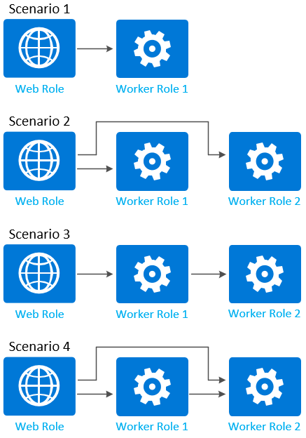

<properties 
pageTitle="雲端服務中的角色通訊 |Microsoft Azure" 
description="在雲端服務中的角色執行個體可以有結束點 （http https、 tcp、 udp） 為其定義的通訊與外或其他角色例項之間。" 
services="cloud-services" 
documentationCenter="" 
authors="Thraka" 
manager="timlt" 
editor=""/>
<tags 
ms.service="cloud-services" 
ms.workload="tbd" 
ms.tgt_pltfrm="na" 
ms.devlang="na" 
ms.topic="article" 
ms.date="09/06/2016" 
ms.author="adegeo"/>

# <a name="enable-communication-for-role-instances-in-azure"></a>啟用 azure 中的角色執行個體的通訊

雲端服務角色通訊到內部和外部的連線。 外部連接時內部連線稱為**內部端點**稱為**輸入結束點**。 本主題說明如何修改[服務定義](cloud-services-model-and-package.md#csdef)，以建立結束點。


## <a name="input-endpoint"></a>輸入的結束點
您想要的方式公開外的連接埠適用於輸入的結束點。 您指定的通訊協定類型，然後適用於兩個內部及外部連接埠端點的端點的連接埠。 如果您想，您可以指定不同的內部連接埠端點[localPort](https://msdn.microsoft.com/library/azure/gg557552.aspx#InputEndpoint)屬性。

輸入的結束點可以使用下列通訊協定︰ **http、 https、 tcp、 udp**。

若要建立輸入的端點，請新增**InputEndpoint**子元素至 web 」 或 「 工作者角色的**結束點**的項目。

```xml
<Endpoints>
  <InputEndpoint name="StandardWeb" protocol="http" port="80" localPort="80" />
</Endpoints> 
```

## <a name="instance-input-endpoint"></a>執行個體輸入結束點
執行個體輸入結束點類似輸入結束點但可讓您使用連接埠轉送負載平衡器上對應的每個個別的角色執行個體的特定-在公開連接埠。 您可以指定單一-在公開連接埠或範圍的連接埠。

執行個體輸入的端點只能使用**tcp**或**udp**為通訊協定。

若要建立執行個體輸入的端點，請新增**InstanceInputEndpoint**子元素至 web 」 或 「 工作者角色的**結束點**的項目。

```xml
<Endpoints>
  <InstanceInputEndpoint name="Endpoint2" protocol="tcp" localPort="10100">
    <AllocatePublicPortFrom>
      <FixedPortRange max="10109" min="10105" />
    </AllocatePublicPortFrom>
  </InstanceInputEndpoint>
</Endpoints>
```

## <a name="internal-endpoint"></a>內部端點
內部的結束點，可執行個體來執行個體通訊。 是選擇性的連接埠和動態連接埠，如果省略則為要指派給端點。 可以使用連接埠範圍。 有五個內部端點，每個角色的限制。

內部端點可以使用下列通訊協定︰ **http、 tcp、 udp，任何**。

若要建立內部輸入的端點，請新增**InternalEndpoint**子元素至 web 」 或 「 工作者角色的**結束點**的項目。

```xml
<Endpoints>
  <InternalEndpoint name="Endpoint3" protocol="any" port="8999" />
</Endpoints> 
```

您也可以使用連接埠範圍。

```xml
<Endpoints>
  <InternalEndpoint name="Endpoint3" protocol="any">
    <FixedPortRange max="8995" min="8999" />
  </InternalEndpoint>
</Endpoints>
```


## <a name="worker-roles-vs-web-roles"></a>Web 角色與工作角色

有一個差別次要具有端點使用 web 角色工作者與時。 使用**HTTP**通訊協定的單一輸入的端點時，必須至少具備網頁角色。


```xml
<Endpoints>
  <InputEndpoint name="StandardWeb" protocol="http" port="80" localPort="80" />
  <!-- more endpoints may be declared after the first InputEndPoint -->
</Endpoints>
```

## <a name="using-the-net-sdk-to-access-an-endpoint"></a>使用.NET SDK 存取端點
Azure 受管理的文件庫提供在執行階段通訊的角色執行個體的方法。 從角色執行個體中執行的程式碼，您可以擷取的其他角色執行個體和其端點，存在的相關資訊，以及目前的角色執行個體的相關資訊。

> [AZURE.NOTE] 您只能擷取角色執行個體的執行的在您的雲端服務，並的定義至少有一個內部端點的相關資訊。 您無法取得執行其他服務中的角色執行個體的相關資料。

您可以使用 [[執行個體](https://msdn.microsoft.com/library/azure/microsoft.windowsazure.serviceruntime.role.instances.aspx)] 屬性以擷取特定角色的執行個體。 第一次使用[CurrentRoleInstance](https://msdn.microsoft.com/library/azure/microsoft.windowsazure.serviceruntime.roleenvironment.currentroleinstance.aspx)傳回目前的角色執行個體的參照，然後使用 [[角色](https://msdn.microsoft.com/library/azure/microsoft.windowsazure.serviceruntime.roleinstance.role.aspx)] 屬性以傳回本身的角色的參考。

當您連線至角色執行個體透過.NET SDK 以程式設計方式時，是很容易存取的結束點資訊。 例如，您已連線到特定角色環境之後，您可以取得具有此程式碼的特定端點的連接埠︰

```csharp
int port = RoleEnvironment.CurrentRoleInstance.InstanceEndpoints["StandardWeb"].IPEndpoint.Port;
```

**執行個體**屬性會傳回**RoleInstance**物件的集合。 該集合通常包含目前執行個體。 如果角色不會定義內部端點，集合包含目前執行個體，但沒有其他執行個體。 集合中的角色執行個體數目一律為 1 位置任何內部端點針對角色所定義的大小寫。 如果該角色所定義內部端點，及其執行個體是在執行階段，可搜尋，而且集合中的執行個體數目會對應到指定的服務設定檔中的角色的執行個體數目。

> [AZURE.NOTE] Azure 受管理的文件庫不會提供一種決定健康狀況的其他角色執行個體，但您可以實作這種狀況評估自己如果您的服務需要此功能。 您可以使用[Azure 診斷](cloud-services-dotnet-diagnostics.md)以取得執行角色執行個體的相關資訊。

若要判斷內部的端點上角色執行個體的連接埠號碼，您可以使用[InstanceEndpoints](https://msdn.microsoft.com/library/azure/microsoft.windowsazure.serviceruntime.roleinstance.instanceendpoints.aspx)屬性，以傳回包含結束點名稱和其對應的 IP 位址和連接埠的字典物件。 [IPEndpoint](https://msdn.microsoft.com/library/azure/microsoft.windowsazure.serviceruntime.roleinstanceendpoint.ipendpoint.aspx)屬性會傳回指定的端點的連接埠與 IP 位址。 **PublicIPEndpoint**屬性會傳回負載平衡端點的連接埠。 不會使用**PublicIPEndpoint**屬性的 IP 位址部分。

以下是反覆運算角色執行個體的範例。

```csharp
foreach (RoleInstance roleInst in RoleEnvironment.CurrentRoleInstance.Role.Instances)
{
    Trace.WriteLine("Instance ID: " + roleInst.Id);
    foreach (RoleInstanceEndpoint roleInstEndpoint in roleInst.InstanceEndpoints.Values)
    {
        Trace.WriteLine("Instance endpoint IP address and port: " + roleInstEndpoint.IPEndpoint);
    }
}
```

以下是透過服務定義取得公開端點，並開始接聽連接的工作者角色的範例。

> [AZURE.WARNING] 將此程式碼會僅適用於已部署的服務。 Azure 計算模擬器在執行時，會忽略建立直接連接埠結束點 （**InstanceInputEndpoint**項目） 的服務設定項目。

```csharp
using System;
using System.Diagnostics;
using System.Linq;
using System.Net;
using System.Net.Sockets;
using System.Threading;
using Microsoft.WindowsAzure;
using Microsoft.WindowsAzure.Diagnostics;
using Microsoft.WindowsAzure.ServiceRuntime;
using Microsoft.WindowsAzure.StorageClient;

namespace WorkerRole1
{
  public class WorkerRole : RoleEntryPoint
  {
    public override void Run()
    {
      try
      {
        // Initialize method-wide variables
        var epName = "Endpoint1";
        var roleInstance = RoleEnvironment.CurrentRoleInstance;
        
        // Identify direct communication port
        var myPublicEp = roleInstance.InstanceEndpoints[epName].PublicIPEndpoint;
        Trace.TraceInformation("IP:{0}, Port:{1}", myPublicEp.Address, myPublicEp.Port);

        // Identify public endpoint
        var myInternalEp = roleInstance.InstanceEndpoints[epName].IPEndpoint;
                
        // Create socket listener
        var listener = new Socket(
          myInternalEp.AddressFamily, SocketType.Stream, ProtocolType.Tcp);
                
        // Bind socket listener to internal endpoint and listen
        listener.Bind(myInternalEp);
        listener.Listen(10);
        Trace.TraceInformation("Listening on IP:{0},Port: {1}",
          myInternalEp.Address, myInternalEp.Port);

        while (true)
        {
          // Block the thread and wait for a client request
          Socket handler = listener.Accept();
          Trace.TraceInformation("Client request received.");

          // Define body of socket handler
          var handlerThread = new Thread(
            new ParameterizedThreadStart(h =>
            {
              var socket = h as Socket;
              Trace.TraceInformation("Local:{0} Remote{1}",
                socket.LocalEndPoint, socket.RemoteEndPoint);

              // Shut down and close socket
              socket.Shutdown(SocketShutdown.Both);
              socket.Close();
            }
          ));

          // Start socket handler on new thread
          handlerThread.Start(handler);
        }
      }
      catch (Exception e)
      {
        Trace.TraceError("Caught exception in run. Details: {0}", e);
      }
    }

    public override bool OnStart()
    {
      // Set the maximum number of concurrent connections 
      ServicePointManager.DefaultConnectionLimit = 12;

      // For information on handling configuration changes
      // see the MSDN topic at http://go.microsoft.com/fwlink/?LinkId=166357.
      return base.OnStart();
    }
  }
}
```

## <a name="network-traffic-rules-to-control-role-communication"></a>若要控制角色通訊的網路流量規則
定義內部端點後，您可以新增網路流量規則 （根據您所建立的端點） 如何角色執行個體可以彼此的控制項。 下圖顯示一些常見的案例，以控制角色通訊︰



下列範例會顯示角色定義的上一個圖表中顯示的角色。 每一個角色定義包含至少一個定義的內部結束點︰

```xml
<ServiceDefinition name="MyService" xmlns="http://schemas.microsoft.com/ServiceHosting/2008/10/ServiceDefinition">
  <WebRole name="WebRole1" vmsize="Medium">
    <Sites>
      <Site name="Web">
        <Bindings>
          <Binding name="HttpIn" endpointName="HttpIn" />
        </Bindings>
      </Site>
    </Sites>
    <Endpoints>
      <InputEndpoint name="HttpIn" protocol="http" port="80" />
      <InternalEndpoint name="InternalTCP1" protocol="tcp" />
    </Endpoints>
  </WebRole>
  <WorkerRole name="WorkerRole1">
    <Endpoints>
      <InternalEndpoint name="InternalTCP2" protocol="tcp" />
    </Endpoints>
  </WorkerRole>
  <WorkerRole name="WorkerRole2">
    <Endpoints>
      <InternalEndpoint name="InternalTCP3" protocol="tcp" />
      <InternalEndpoint name="InternalTCP4" protocol="tcp" />
    </Endpoints>
  </WorkerRole>
</ServiceDefinition>
```

> [AZURE.NOTE] 固定和自動指派的連接埠內部端點可能會發生的角色之間的通訊的限制。

根據預設，定義內部端點後，通訊流量的任何角色的無限制地角色內部的結束點。 若要限制通訊，您必須將**NetworkTrafficRules**項目新增至**ServiceDefinition**中的項目服務定義檔案。

### <a name="scenario-1"></a>情況 1
只允許**WebRole1** **WorkerRole1**至網路流量。

```xml
<ServiceDefinition name="MyService" xmlns="http://schemas.microsoft.com/ServiceHosting/2008/10/ServiceDefinition">
  <NetworkTrafficRules>
    <OnlyAllowTrafficTo>
      <Destinations>
        <RoleEndpoint endpointName="InternalTCP2" roleName="WorkerRole1"/>
      </Destinations>
      <AllowAllTraffic/>
      <WhenSource matches="AnyRule">
        <FromRole roleName="WebRole1"/>
      </WhenSource>
    </OnlyAllowTrafficTo>
  </NetworkTrafficRules>
</ServiceDefinition>
```

### <a name="scenario-2"></a>案例 2
只允許**WebRole1** **WorkerRole1**和**WorkerRole2**網路流量。

```xml
<ServiceDefinition name="MyService" xmlns="http://schemas.microsoft.com/ServiceHosting/2008/10/ServiceDefinition">
  <NetworkTrafficRules>
    <OnlyAllowTrafficTo>
      <Destinations>
        <RoleEndpoint endpointName="InternalTCP2" roleName="WorkerRole1"/>
        <RoleEndpoint endpointName="InternalTCP3" roleName="WorkerRole2"/>
      </Destinations>
      <WhenSource matches="AnyRule">
        <FromRole roleName="WebRole1"/>
      </WhenSource>
    </OnlyAllowTrafficTo>
  </NetworkTrafficRules>
</ServiceDefinition>
```

### <a name="scenario-3"></a>情況 3
只允許**WebRole1** **WorkerRole1**，並以**WorkerRole2** **WorkerRole1**網路流量。

```xml
<ServiceDefinition name="MyService" xmlns="http://schemas.microsoft.com/ServiceHosting/2008/10/ServiceDefinition">
  <NetworkTrafficRules>
    <OnlyAllowTrafficTo>
      <Destinations>
        <RoleEndpoint endpointName="InternalTCP2" roleName="WorkerRole1"/>
      </Destinations>
      <AllowAllTraffic/>
      <WhenSource matches="AnyRule">
        <FromRole roleName="WebRole1"/>
      </WhenSource>
    </OnlyAllowTrafficTo>
  </NetworkTrafficRules>
  <NetworkTrafficRules>
    <OnlyAllowTrafficTo>
      <Destinations>
        <RoleEndpoint endpointName="InternalTCP3" roleName="WorkerRole2"/>
      </Destinations>
      <WhenSource matches="AnyRule">
        <FromRole roleName="WorkerRole1"/>
      </WhenSource>
    </OnlyAllowTrafficTo>
  </NetworkTrafficRules>
</ServiceDefinition>
```

### <a name="scenario-4"></a>案例 4
只允許**WebRole1** **WorkerRole1**， **WebRole1** **WorkerRole2**，以**WorkerRole1** **WorkerRole2**至網路流量。

```xml
<ServiceDefinition name="MyService" xmlns="http://schemas.microsoft.com/ServiceHosting/2008/10/ServiceDefinition">
  <NetworkTrafficRules>
    <OnlyAllowTrafficTo>
      <Destinations>
        <RoleEndpoint endpointName="InternalTCP2" roleName="WorkerRole1"/>
      </Destinations>
      <AllowAllTraffic/>
      <WhenSource matches="AnyRule">
        <FromRole roleName="WebRole1"/>
      </WhenSource>
    </OnlyAllowTrafficTo>
  </NetworkTrafficRules>
  <NetworkTrafficRules>
    <OnlyAllowTrafficTo >
      <Destinations>
        <RoleEndpoint endpointName="InternalTCP3" roleName="WorkerRole2"/>
      </Destinations>
      <AllowAllTraffic/>
      <WhenSource matches="AnyRule">
        <FromRole roleName="WorkerRole1"/>
      </WhenSource>
    </OnlyAllowTrafficTo>
  </NetworkTrafficRules>
  <NetworkTrafficRules>
    <OnlyAllowTrafficTo >
      <Destinations>
        <RoleEndpoint endpointName="InternalTCP4" roleName="WorkerRole2"/>
      </Destinations>
      <AllowAllTraffic/>
      <WhenSource matches="AnyRule">
        <FromRole roleName="WebRole1"/>
      </WhenSource>
    </OnlyAllowTrafficTo>
  </NetworkTrafficRules>
</ServiceDefinition>
```

您可以找到上方所用的項目 XML 結構描述參考[以下](https://msdn.microsoft.com/library/azure/gg557551.aspx)。

## <a name="next-steps"></a>後續步驟
進一步瞭解雲端服務[模型](cloud-services-model-and-package.md)。