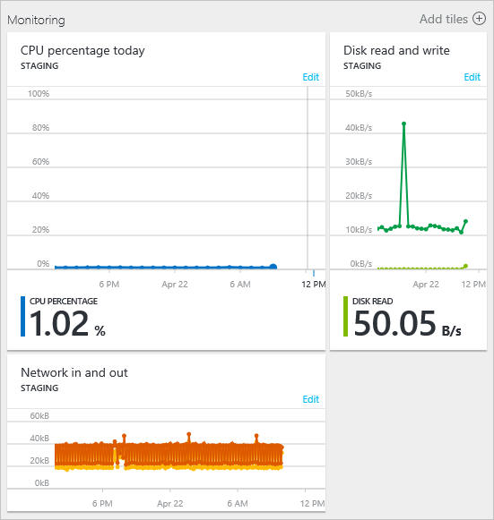
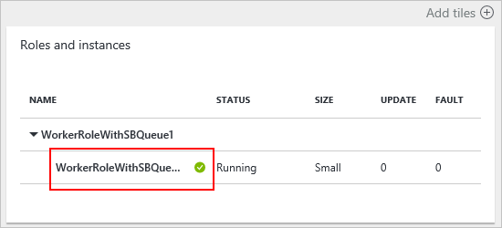
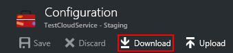

<properties 
    pageTitle="如何設定在雲端服務 （入口網站） |Microsoft Azure" 
    description="瞭解如何設定 Azure 中的雲端服務。 瞭解如何更新雲端服務設定和設定的角色執行個體的遠端存取。 這些範例使用 Azure 入口網站。" 
    services="cloud-services" 
    documentationCenter="" 
    authors="Thraka" 
    manager="timlt" 
    editor=""/>

<tags 
    ms.service="cloud-services" 
    ms.workload="tbd" 
    ms.tgt_pltfrm="na" 
    ms.devlang="na" 
    ms.topic="article" 
    ms.date="10/11/2016"
    ms.author="adegeo"/>

# 如何設定雲端服務

> [AZURE.SELECTOR]
- [Azure 入口網站](cloud-services-how-to-configure-portal.md)
- [Azure 傳統入口網站](cloud-services-how-to-configure.md)

您可以設定最常用的雲端服務中 Azure 入口網站。 或者，如果您想要直接更新您的設定檔，請下載服務設定檔以更新，然後更新的檔案上傳並更新雲端服務，以變更的設定。 兩種方式，設定更新被發送給角色的所有執行個體。

您也可以管理雲端服務的角色，或遠端桌面執行個體，將它們。

如果您有兩個以上角色執行個體，每個角色的 azure 只可以在設定更新時確保 99.95 百分比服務可用性。 讓其他更新時，處理用戶端要求的一個虛擬機器。 如需詳細資訊，請參閱[服務等級協定](https://azure.microsoft.com/support/legal/sla/)。

## 變更雲端服務

在開啟後[Azure 入口網站](https://portal.azure.com/)，瀏覽至您的雲端服務。 從這裡開始您管理許多層面。 

![設定] 頁面](./media/cloud-services-how-to-configure-portal/cloud-service.png)

**設定**刀位置變更**屬性**、 變更**設定**、 管理**憑證**，設定**通知的規則**，以及管理**使用者**可存取這個雲端服務將會開啟 [**設定**] 或 [**所有設定**的連結。

>[AZURE.NOTE]
>雲端服務使用的作業系統不能變更使用**Azure 入口網站**，您只能變更這項設定，透過[Azure 傳統入口網站](http://manage.windowsazure.com/)。 這詳細[以下](cloud-services-how-to-configure.md#update-a-cloud-service-configuration-file)。

## 監控

您可以新增通知您的雲端服務。 按一下 [**設定** > **通知規則** > **新增提醒**。 

從這裡開始，您可以設定提醒。 使用**Mertic** ] 下拉式方塊中，您可以設定下列類型的資料的提醒。

- 磁碟讀取
- 磁碟寫入
- 在網路
- 查看網路
- CPU 百分比 

### 設定監視從公制的磚

而不是使用**設定** > **通知的規則**，您可以按一下其中一個**雲端服務**刀**監控**一節中公制磚。

從這裡開始，您可以自訂磚，搭配使用的圖表，或新增提醒的規則。

## 重新啟動、 reimage 或遠端桌面

目前您無法設定使用**Azure 入口網站**的遠端桌面。 不過，您可以將其設定透過[Azure 傳統入口網站](cloud-services-role-enable-remote-desktop.md)， [PowerShell](cloud-services-role-enable-remote-desktop-powershell.md)或[Visual Studio](../vs-azure-tools-remote-desktop-roles.md)。 

首先，請按一下雲端服務執行個體。

從刀 uou 啟動遠端桌面連線、 遠端重新啟動的執行個體，或從遠端重新的開啟 （開始使用新的圖像） 執行個體。

![雲端服務執行個體] 按鈕](./media/cloud-services-how-to-configure-portal/cs-instance-buttons.png)

## 重新設定您的.cscfg

您可能需要重新設定您雲端服務，透過 [[服務設定 (cscfg)](cloud-services-model-and-package.md#cscfg)檔案。 首先您必須下載.cscfg 檔案、 修改，然後上傳。

1. 按一下 [**設定**] 圖示或 [**所有設定**] 連結，以開啟**設定**刀。

    ![設定] 頁面](./media/cloud-services-how-to-configure-portal/cloud-service.png)

2. 按一下**設定**項目。

    

3. 按一下 [**下載**] 按鈕。

    

4. 更新服務設定檔之後上, 傳並套用設定更新︰

     
    
5. 選取 [.cscfg 檔案，然後按一下**[確定**]。

            
## 後續步驟

* 瞭解如何[部署雲端服務](cloud-services-how-to-create-deploy-portal.md)。
* 設定[自訂網域名稱](cloud-services-custom-domain-name-portal.md)。
* [管理您的雲端服務](cloud-services-how-to-manage-portal.md)。
* 設定[ssl 憑證](cloud-services-configure-ssl-certificate-portal.md)。