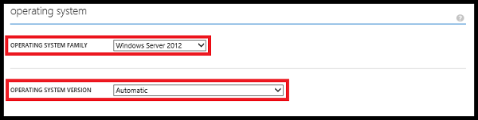

<properties 
    pageTitle="如何設定在雲端服務 （傳統入口網站） |Microsoft Azure" 
    description="瞭解如何設定 Azure 中的雲端服務。 瞭解如何更新雲端服務設定和設定的角色執行個體的遠端存取。" 
    services="cloud-services" 
    documentationCenter="" 
    authors="Thraka" 
    manager="timlt" 
    editor=""/>

<tags 
    ms.service="cloud-services" 
    ms.workload="tbd" 
    ms.tgt_pltfrm="na" 
    ms.devlang="na" 
    ms.topic="article" 
    ms.date="10/11/2016"
    ms.author="adegeo"/>

# 如何設定雲端服務

> [AZURE.SELECTOR]
- [Azure 入口網站](cloud-services-how-to-configure-portal.md)
- [Azure 傳統入口網站](cloud-services-how-to-configure.md)

您可以在 Azure 傳統入口網站設定雲端服務最常用的設定。 或者，如果您想要直接更新您的設定檔，請下載服務設定檔以更新，然後更新的檔案上傳並更新雲端服務，以變更的設定。 兩種方式，設定更新被發送給角色的所有執行個體。

Azure 傳統入口網站也可讓您[啟用遠端桌面連線 Azure 雲端服務中的角色](cloud-services-role-enable-remote-desktop.md)

如果您有至少兩個角色執行個體的每個角色 azure 只可以在設定更新時確保 99.95 百分比服務可用性。 讓其他更新時，處理用戶端要求的一個虛擬機器。 如需詳細資訊，請參閱[服務等級協定](https://azure.microsoft.com/support/legal/sla/)。

## 變更雲端服務

1. 在[Azure 傳統入口網站](http://manage.windowsazure.com/)中，按一下**雲端服務**，按一下雲端服務的名稱，然後按一下 [**設定**。

    ![設定] 頁面](./media/cloud-services-how-to-configure/CloudServices_ConfigurePage1.png)
    
    在 [**設定**] 頁面中，您可以設定監視、 更新角色的設定，並選擇來賓作業系統及家人的角色執行個體。 

2. 在**監控**詳細資訊，或最小，設定監控層級，設定所需的詳細資訊監控診斷連接字串。

3. 服務角色 （依角色群組），您可以更新下列設定︰
    
    >**設定**  
    >變更其他設定的設定所指定的服務設定 (.cscfg) 檔案的*ConfigurationSettings*項目中的值。
    >
    >**憑證**  
    >變更用於加密角色的憑證指紋。 若要變更憑證，您必須先上傳新的憑證 （在 [**憑證**] 頁面中）。 顯示在 [角色] 設定中的憑證字串中指紋更新。

4. 在**作業系統**中，您可以變更的作業系統系列版的角色執行個體，或選擇 [**自動**啟用自動更新目前作業系統的版本。 作業系統設定套用至網頁的角色和工作者角色，但是不會影響虛擬機器。

    部署期間上所有的角色執行個體，, 安裝最新的作業系統版本，並依預設會自動更新的作業系統。 
    
    如果您需要在程式碼中的相容性需求由於在不同作業系統版本上執行雲端服務，您可以選擇的作業系統系列和版本。 當您選擇的特定作業系統版本時，會暫停雲端服務的系統自動更新。 您必須以確保接收更新的作業系統。
    
    如果您解決您的應用程式有最新的作業系統版本的所有相容性問題，您可以啟用自動的作業系統更新為 [**自動**設定的作業系統版本。 
    
    

5. 若要儲存您設定的設定，並傳送至角色執行個體，請按一下 [**儲存**]。 （按一下 [**捨棄**] 予以取消變更）。**儲存**並**放棄**會新增至的命令列後變更設定。

## 更新雲端服務設定檔

1. 下載雲端服務設定檔案 (.cscfg) 以目前的設定。 在 [雲端服務的 [**設定**] 頁面中，按一下 [**下載**]。 然後按一下 [**儲存**]，或按一下 [**另存新檔**儲存檔案。

2. 更新服務設定檔之後上, 傳並套用設定更新︰

    1. 在 [**設定**] 頁面上，按一下 [**上傳**]。
    
        
    
    2. 在 [**設定檔**中，使用**瀏覽**選取更新的.cscfg 檔案。
    
    3. 如果您的雲端服務中包含有一個執行個體的任何角色，請選取 [**套用設定，即使將一或多個角色包含單一的執行個體**] 核取方塊，以啟用設定更新，若要繼續的角色。
    
        除非您定義的每個角色至少兩個執行個體，Azure 不保證至少 99.95 百分比期間服務設定更新您的雲端服務的顯示狀態。 如需詳細資訊，請參閱[服務等級協定](https://azure.microsoft.com/support/legal/sla/)。
    
    4. 按一下**[確定]** （核取記號）]。 

## 後續步驟

* 瞭解如何[部署雲端服務](cloud-services-how-to-create-deploy.md)。
* 設定[自訂網域名稱](cloud-services-custom-domain-name.md)。
* [管理您的雲端服務](cloud-services-how-to-manage.md)。
* [啟用遠端桌面連線 Azure 雲端服務中的角色](cloud-services-role-enable-remote-desktop.md)
* 設定[ssl 憑證](cloud-services-configure-ssl-certificate.md)。
