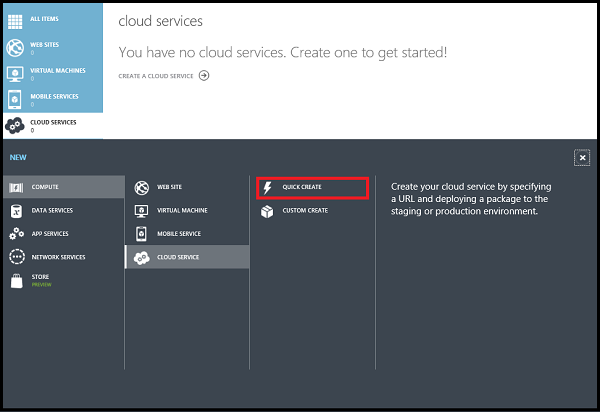
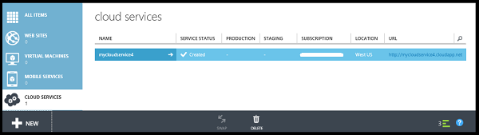
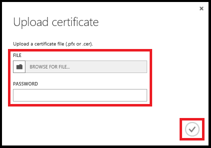
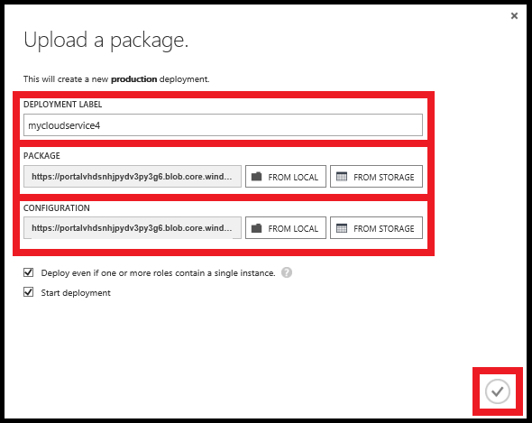

<properties
    pageTitle="如何建立並部署雲端服務 |Microsoft Azure"
    description="瞭解如何建立並部署 Azure 中使用快速建立的方法在雲端服務。"
    services="cloud-services"
    documentationCenter=""
    authors="Thraka"
    manager="timlt"
    editor=""/>

<tags
    ms.service="cloud-services"
    ms.workload="tbd"
    ms.tgt_pltfrm="na"
    ms.devlang="na"
    ms.topic="article"
    ms.date="09/06/2016"
    ms.author="adegeo"/>

# 如何建立並部署雲端服務

> [AZURE.SELECTOR]
- [Azure 入口網站](cloud-services-how-to-create-deploy-portal.md)
- [Azure 傳統入口網站](cloud-services-how-to-create-deploy.md)

Azure 傳統入口網站提供您建立並部署雲端服務的兩種方法︰**快速建立**和**自訂建立**。

本主題說明如何使用快速建立方法來建立新的雲端服務，然後使用 [上傳並部署雲端服務套件 Azure 中的 [**上傳**。 當您使用這個方法時，Azure 傳統入口網站可讓您可以使用方便的連結，當您完成所有的需求。 如果您已準備好要部署您的雲端服務，您所建立，您可以將兩者同時使用**自訂建立**執行。

> [AZURE.NOTE] 如果您打算要發佈您的雲端服務的 Visual Studio 小組服務 (VSTS)，使用 [快速建立，，並選擇 [設定 VSTS 發佈從 [**快速啟動**] 或 [儀表板。 如需詳細資訊，請參閱[連續的傳送到使用 Visual Studio 小組服務 Azure][TFSTutorialForCloudService]，或請參閱**快速入門**] 頁面的說明。

## 概念
若要部署 Azure 中的雲端服務應用程式所需的三個元件︰

- **服務定義**  
  雲端服務定義檔案 (.csdef) 定義的服務模型，包括角色的數量。

- **服務設定**  
  雲端服務設定檔 (.cscfg) 提供設定的設定雲端服務與個別的角色，包括角色執行個體數目。

- **服務套件**  
  服務套件 (.cspkg) 包含的應用程式碼和設定服務定義檔案。
  
您可以進一步瞭解這些，以及如何建立套件[以下](cloud-services-model-and-package.md)。

## 準備您的應用程式
您可以佈署雲端服務之前，您必須建立雲端服務套件 (.cspkg) 從您的應用程式碼和雲端服務設定檔 (.cscfg)。 Azure SDK 提供準備這些必要的部署檔案所需的工具。 您可以安裝 SDK [Azure 下載](https://azure.microsoft.com/downloads/)頁面上，在您想要開發應用程式碼中的語言。

前匯出服務套件，三個雲端服務功能需要特殊的設定︰

- 如果您想要部署雲端服務資料加密，[設定您的應用程式](cloud-services-configure-ssl-certificate.md#step-2-modify-the-service-definition-and-configuration-files)的 SSL 使用安全通訊端層 (SSL)。

- 如果您想要設定的角色執行個體，遠端桌面[設定的角色](cloud-services-role-enable-remote-desktop.md)遠端桌面連線。

- 如果要設定監控您的雲端服務的詳細資訊，請啟用 Azure 診斷雲端服務。 *最小監控*（預設監控層級） 使用主機作業系統的角色執行個體 （虛擬機器） 的所收集的效能計數器。 「 詳細監控 * 收集內啟用更深入的分析，在應用程式處理期間發生的問題的角色執行個體的效能資料所根據的其他指標。 若要瞭解如何啟用 Azure 診斷程式，請參閱[Azure 中的 [啟用診斷程式](cloud-services-dotnet-diagnostics.md)。

若要建立雲端服務的 web 角色或工作者角色的部署使用，您必須[建立服務套件](cloud-services-model-and-package.md#servicepackagecspkg)。

## 開始之前

- 如果您還沒有安裝 Azure SDK，按一下 [**安裝 Azure SDK**以開啟[Azure 下載 」 頁面](https://azure.microsoft.com/downloads/)上，並為下載 SDK 中您想要開發程式碼的語言。 （您必須有機會稍後再執行此動作）。

- 如果任何角色執行個體需要憑證，請建立憑證。 雲端服務以私密金鑰需要.pfx 檔。 您可以[上傳至 Azure 憑證](cloud-services-configure-ssl-certificate.md#step-3-upload-a-certificate)當您建立並部署雲端服務。

- 如果您打算要部署至相關性群組的雲端服務，建立相關性群組。 您可以使用相關性群組部署您雲端服務，其他 Azure 服務中的同一個位置。 您可以建立相關性] 群組中的 Azure 的傳統入口網站，在 [**相關性群組**] 頁面上的 [**網路**] 區域。

## 如何︰ 建立使用快速建立雲端服務

1. 在[Azure 傳統入口網站](http://manage.windowsazure.com/)中，按一下 [**新增**>**計算**>**雲端服務**>**快速建立**。

    

2. 在 [ **URL**]，輸入要使用公用 URL 中以存取您的雲端服務生產部署中的子網域名稱。 生產部署的 URL 格式是︰ http://*myURL*。 cloudapp.net。

3. 在**地區或相關性] 群組**中，選取 [地理區域或部署至雲端服務的相關性群組]。 如果您想要將您的雲端服務部署至其他 Azure 服務區域內的相同位置，請選取 [相關性群組]。

4. 按一下 [**建立雲端服務**。

    

    您可以監視在視窗底部的訊息區域中的程序的狀態。

    **雲端服務**區域隨即開啟，顯示新的雲端服務。 當狀態變更為 [建立] 時，雲端服務建立已順利完成。

    

## 如何︰ 上傳雲端服務的憑證

1. 在[Azure 傳統入口網站](http://manage.windowsazure.com/)中，按一下**雲端服務**，按一下雲端服務的名稱，然後按一下 [**憑證**]。

    

2. 按一下 [**上傳憑證**] 或 [**上傳**]。

3. 在 [**檔案**]，使用**瀏覽]**來選取憑證 （.pfx 檔）。

4. 在 [**密碼**] 中，輸入私密金鑰的憑證。

5. 按一下**[確定]** （核取記號）]。

    

    您可以觀看以下所示的訊息區域中，上傳的進度。 上傳完成時，會將憑證新增至資料表。 在 [郵件] 區域中，按一下 [確定] 關閉訊息。

    

## 如何︰ 部署雲端服務

1. 在[Azure 傳統入口網站](http://manage.windowsazure.com/)中，按一下**雲端服務**，按一下雲端服務的名稱，然後按一下 [**儀表板**。

2. 按一下 [**上傳新的產品部署**] 或 [**上傳**]。

3. 在 [**部署標籤**中，輸入新的部署-例如 MyCloudServicev4 的名稱。

3. 在**套件**中，使用**瀏覽]** ，選取要使用的服務套件檔案 (.cspkg)。

4. 在**設定**中，使用**瀏覽]**來選取要使用的服務設定檔 (.cscfg)。

5. 如果雲端服務會包含任何角色只有一個執行個體，請選取 [**部署即使一或多個角色包含單一的執行個體**] 核取方塊，以啟用進行部署。

    如果每個的角色具有兩個以上的執行個體 azure 只可以進行的維修作業與服務的更新時保證 99.95 百分比雲端服務的存取權。 如有需要您可以新增其他角色執行個體，在 [**縮放比例**] 頁面上之後部署雲端服務即可。 如需詳細資訊，請參閱[服務等級協定](https://azure.microsoft.com/support/legal/sla/)。

6. 按一下**[確定]** （核取記號） 若要開始雲端服務部署。

    

    您可以監視的訊息區域中部署的狀態。 按一下 [確定] 以隱藏訊息。

    

## 請確認您已順利完成的部署

1. 按一下 [**儀表板**]。

    狀態應該會顯示服務會**執行**。

2. 按一下 [**快速檢視**的 [以網頁瀏覽器中開啟您的雲端服務的網站 URL]。

    

[TFSTutorialForCloudService]: cloud-services-continuous-delivery-use-vso.md
 
## 後續步驟

* [一般設定您的雲端服務](cloud-services-how-to-configure.md)。
* 設定[自訂網域名稱](cloud-services-custom-domain-name.md)。
* [管理您的雲端服務](cloud-services-how-to-manage.md)。
* 設定[ssl 憑證](cloud-services-configure-ssl-certificate.md)。