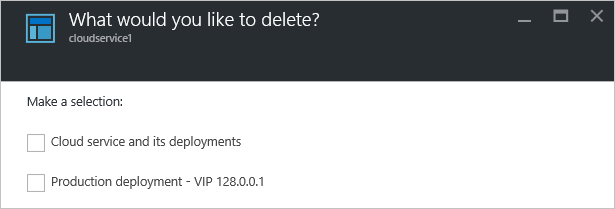

<properties 
    pageTitle="常見的雲端服務管理工作 |Microsoft Azure" 
    description="瞭解如何管理 Azure 入口網站中的雲端服務。 這些範例使用 Azure 入口網站。" 
    services="cloud-services" 
    documentationCenter="" 
    authors="Thraka" 
    manager="timlt" 
    editor=""/>

<tags 
    ms.service="cloud-services" 
    ms.workload="tbd" 
    ms.tgt_pltfrm="na" 
    ms.devlang="na" 
    ms.topic="article" 
    ms.date="08/02/2016"
    ms.author="adegeo"/>

# 如何管理雲端服務

> [AZURE.SELECTOR]
- [Azure 入口網站](cloud-services-how-to-manage-portal.md)
- [Azure 傳統入口網站](cloud-services-how-to-manage.md)

**雲端服務 （傳統）**的區域中 Azure 入口網站管理您的雲端服務。 本文將說明一些常見的動作，同時管理您的雲端服務，您可以採用。 包含更新、 刪除、 縮放比例和升級生產分段的部署。

深入瞭解如何調整您的雲端服務有[以下](cloud-services-how-to-scale-portal.md)。

## 如何︰ 更新部署或雲端服務的角色

如果您需要更新您的雲端服務的應用程式碼，**更新**上使用雲端服務刀。 您可以更新單一角色或所有的角色。 若要更新，您可以上傳新服務套件或服務設定檔。

1. 在[Azure 入口網站][]中，選取您想要更新的雲端服務。 此步驟中開啟雲端服務的執行個體刀。

2. 在刀中，按一下 [**更新**] 按鈕。

    ![[更新] 按鈕](./media/cloud-services-how-to-manage-portal/update-button.png)

3. 更新部署新的服務套件檔案 (.cspkg) 與服務設定檔 (.cscfg)。

    

4. **您也可以**更新部署標籤和儲存帳戶。 

5. 如果任何角色只有一個角色執行個體，請選取 [**部署即使一或多個角色包含單一的執行個體**啟用繼續升級。 

    如果每個的角色具有兩個以上的角色執行個體 （虛擬機器） azure 僅能在雲端服務的更新保證 99.95 百分比服務可用性。 具有兩個角色執行個體，一個虛擬機器會處理用戶端的要求，而其他會更新。

6. 核取 [**啟動部署**已套用的套件上傳完畢後更新]。

7. 按一下**[確定**] 以開始更新服務。

## 如何︰ 交換升級生產分段的部署部署

當您決定要部署新的版本的雲端服務，階段，並在雲端服務的開發環境中測試您的新版本。 使用**切換**來切換兩種部署收件者和升階正式的新版本的 Url。 

您可以交換來自**雲端服務**頁面或儀表板部署。

1. 在[Azure 入口網站][]中，選取您想要更新的雲端服務。 此步驟中開啟雲端服務的執行個體刀。

2. 在刀中，按一下 [**交換**] 按鈕。

    

3. 下列出現確認提示時開啟。

    

4. 驗證的部署資訊後，按一下**[確定**] 以交換部署。

    部署交換很快就會因為唯一變更的虛擬 IP 位址 (Vip) 部署。

    若要儲存計算成本中,，您可以刪除暫存的部署之後您驗證您的產品部署正常運作正常。

## 如何︰ 連結至雲端服務的資源

Azure 入口網站沒有連結資源一起目前 Azure 傳統入口網站並未等。 不過，部署至雲端服務正在使用相同資源群組的其他資源。

## 如何︰ 刪除部署和雲端服務

您可以刪除在雲端服務之前，您必須先刪除每個現有的部署。

若要儲存計算成本中,，您可以刪除暫存的部署之後您驗證您的產品部署正常運作正常。 是向您收費計算為的成本停止部署的角色執行個體。

若要刪除部署或雲端服務中使用下列程序。 

1. 在[Azure 入口網站][]中，選取您想要刪除的雲端服務。 此步驟中開啟雲端服務的執行個體刀。

2. 在刀中，按一下 [**刪除**] 按鈕。

    

3. 您可以刪除整個雲端服務，請核取**雲端服務，其部署**，或選擇 [**生產部署**] 或 [**臨時部署**。

     

4. 按一下底部的 [**刪除**] 按鈕。

5. 若要刪除的雲端服務，請按一下 [**刪除雲端服務**。 然後在確認提示時，按一下**[是]**。

> [AZURE.NOTE]
> 當會刪除雲端服務，並監控的詳細資訊，並進行設定時，您必須從儲存帳戶手動刪除資料。 哪裡可以找到指標資料表的相關資訊，請參閱[本文](cloud-services-how-to-monitor.md)。

[Azure 入口網站]: https://portal.azure.com

## 後續步驟

* [一般設定您的雲端服務](cloud-services-how-to-configure-portal.md)。
* 瞭解如何[部署雲端服務](cloud-services-how-to-create-deploy-portal.md)。
* 設定[自訂網域名稱](cloud-services-custom-domain-name-portal.md)。
* 設定[ssl 憑證](cloud-services-configure-ssl-certificate-portal.md)。