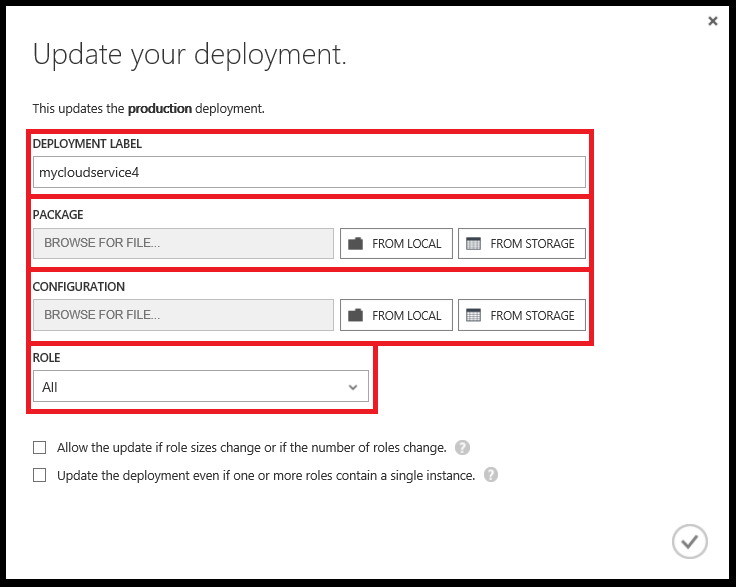
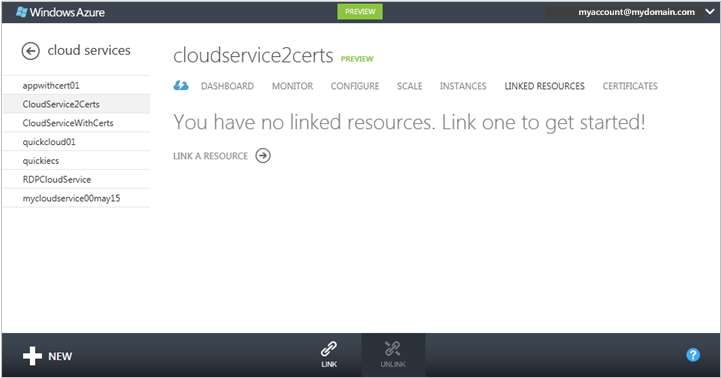
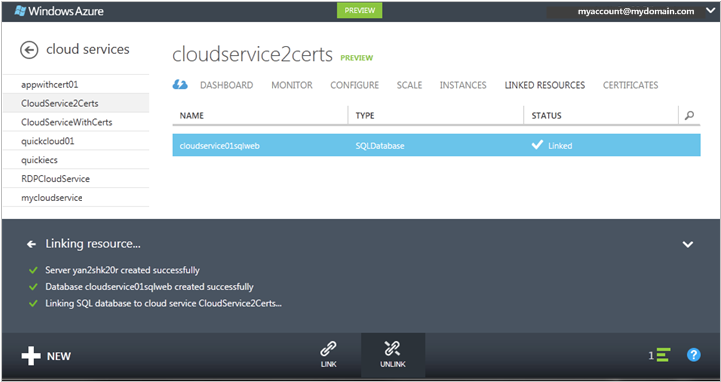
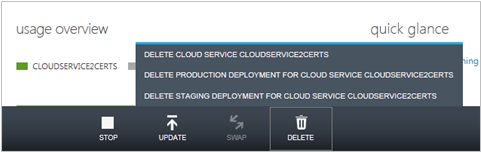

<properties 
    pageTitle="常見的雲端服務管理工作 （傳統） |Microsoft Azure" 
    description="瞭解如何管理 Azure 傳統入口網站中的雲端服務。" 
    services="cloud-services" 
    documentationCenter="" 
    authors="Thraka" 
    manager="timlt" 
    editor=""/>

<tags 
    ms.service="cloud-services" 
    ms.workload="tbd" 
    ms.tgt_pltfrm="na" 
    ms.devlang="na" 
    ms.topic="article" 
    ms.date="08/10/2016"
    ms.author="adegeo"/>

# 如何管理雲端服務

> [AZURE.SELECTOR]
- [Azure 入口網站](cloud-services-how-to-manage-portal.md)
- [Azure 傳統入口網站](cloud-services-how-to-manage.md)

在**雲端服務**區域中的 Azure 傳統入口網站，您可以更新服務角色或部署升階生產分段的部署、 連結至雲端服務的資源，讓您可以查看資源相依性在一起，不按比例縮放的資源及刪除雲端服務或部署。

## 如何︰ 更新部署或雲端服務的角色

如果您要更新您的雲端服務的應用程式碼，請使用**更新**儀表板、**雲端服務**] 頁面上或**執行個體**] 頁面上。 您可以更新單一角色或所有的角色。 您需要上傳新服務封裝並服務設定檔。

1. 在[Azure 傳統入口網站](https://manage.windowsazure.com/)，儀表板、**雲端服務**] 頁面上，或**執行個體**] 頁面上，按一下 [**更新**]。

    

2. 在 [**部署標籤**中，輸入名稱來識別部署 (例如，mycloudservice4)。 在儀表板上看到 [部署] 標籤底下**快速入門**。

3. 在**套件**中，使用**瀏覽**上傳服務套件檔案 (.cspkg)。

4. 在 [**設定**中，使用**瀏覽**上傳的服務設定檔案 (.cscfg)。

5. 在 [**角色**中，選取 [**全部**如果您想要升級雲端服務中的所有角色。 若要執行的單一角色更新，請選取您想要更新的角色。 即使您選取特定角色更新，服務設定檔中的更新會套用到所有的角色。

6. 如果更新變更角色的數量或任何角色的大小，請選取 [**允許更新如果角色大小或角色數目的變更**] 核取方塊，以便進行更新。 

    請注意，如果您變更角色 （也就是虛擬機器裝載角色執行個體的大小） 或角色的數量的大小，每個角色執行個體 （虛擬機器） 必須重新影像處理，任何本機資料將會遺失。

7. 如果任何服務角色只有一個角色執行個體，請選取 [**更新即使一或多個角色包含單一的執行個體] 核取方塊**以啟用繼續升級。 

    如果每個的角色具有兩個以上的角色執行個體 （虛擬機器） azure 僅能在雲端服務的更新保證 99.95 百分比服務可用性。 讓其他更新時，處理用戶端要求的一個虛擬機器。

8. 按一下**[確定]** （核取記號） 開始更新服務。

## 如何︰ 交換升級生產分段的部署部署

若要提高暫存部署的正式雲端服務，使用**交換**。 當您決定要部署新的版本的雲端服務時，您可以階段，並雲端服務的開發環境中測試您的新版本，當您的客戶生產環境中使用目前的版本。 當您準備好要升階正式的新版本時，您可以使用**交換**切換所用的兩個部署收件者的 Url。 

您可以交換來自**雲端服務**頁面或儀表板部署。

1. 在[Azure 傳統入口網站](https://manage.windowsazure.com/)中，按一下 [ **Cloud Services**。

2. 在雲端服務的清單中，按一下以選取該雲端服務。

3. 按一下 [**切換]**。

    下列出現確認提示時開啟。

    

4. 確認部署資訊後，請按一下 [****交換部署。

    部署交換很快就會因為唯一變更的虛擬 IP 位址 (Vip) 部署。

    若要儲存計算成本，您可以刪除執行環境中的部署，當您確定如預期般，新的產品部署正在執行時。

## 如何︰ 連結至雲端服務的資源

若要顯示您的雲端服務的相依性在其他資源，您可以連結 Azure SQL 資料庫執行個體或儲存帳戶雲端服務。 您可以連結和取消連結資源**連結資源**在頁面上，然後監控其雲端服務的儀表板上的使用方式。 如果連結的儲存空間帳戶有監視開啟，您可以監視雲端服務的儀表板上的總要求。

使用**連結**至新的或現有 SQL 資料庫執行個體或儲存空間客戶連結至您的雲端服務。 然後，您可以調整以及雲端服務角色使用 [**縮放比例**] 頁面上的資料庫。 （儲存帳戶縮放自動使用方式的增加。）如需詳細資訊，請參閱[如何不按比例縮放的雲端服務和連結的資源](cloud-services-how-to-scale.md)。 

您也可以監控、 管理及 Azure 傳統入口網站的 [**資料庫**] 節點中調整資料庫。 

「 連結 」 這方面的資源，沒有您的應用程式連線至資源。 如果您建立新的資料庫，使用**連結**時，您會需要新增應用程式碼的連接字串，然後升級雲端服務。 您也需要新增的連接字串，如果您的應用程式使用資源連結的儲存空間帳戶。

下列程序說明如何連結新 SQL 資料庫執行個體，部署新 SQL 資料庫伺服器上，在雲端服務。

### 若要連結至雲端服務的 SQL 資料庫執行個體

1. 在[Azure 傳統入口網站](http://manage.windowsazure.com/)中，按一下 [**雲端服務**。 然後按一下以開啟儀表板雲端服務的名稱。

2. 按一下 [**連結的資源**。

    **連結的資源**頁面隨即開啟。

    

3. 按一下 [**連結資源**] 或 [**連結**]。

    **連結資源**精靈] 啟動。

    

4. 按一下 [**建立新的資源**或**現有的資源的連結**。

5. 選擇要連結資源的類型。 在[Azure 傳統入口網站](http://manage.windowsazure.com/)中，按一下 [ **SQL 資料庫**]。 （預覽 Azure 傳統入口網站不支援連結的儲存空間帳戶至雲端服務。）

6. 若要完成資料庫設定，依照指示進行說明的 [ **SQL 資料庫**] 區域中的 Azure 傳統入口網站。

    您可以遵循執行連結作業的訊息區域中的進度。

    

    連結完成後，您可以監視連結資源雲端服務的儀表板上的狀態。 縮放比例連結的 SQL 資料庫的相關資訊，請參閱[如何不按比例縮放的雲端服務和連結的資源](cloud-services-how-to-scale.md)。

### 若要取消連結的資源

1. 在[Azure 傳統入口網站](http://manage.windowsazure.com/)中，按一下 [**雲端服務**。 然後按一下以開啟儀表板雲端服務的名稱。

2. 按一下 [**連結的資源**]，然後選取 [資源。

3. 按一下 [**取消**]。 然後按一下 [**是**] 確認提示。

    取消連結 SQL 資料庫有不會影響資料庫或資料庫的應用程式的連線。 您仍然可以管理 Azure 傳統入口網站的 [ **SQL 資料庫**] 區域中的資料庫。

## 如何︰ 刪除部署和雲端服務

您可以刪除在雲端服務之前，您必須先刪除每個現有的部署。

若要儲存計算成本中,，您可以刪除暫存部署之後您驗證您的產品部署正常運作正常。 即使未執行雲端服務，您可以的角色執行個體的計費的計算成本。

若要刪除部署或雲端服務中使用下列程序。 

1. 在[Azure 傳統入口網站](http://manage.windowsazure.com/)中，按一下 [**雲端服務**。

2. 選取雲端服務，然後再按一下 [**刪除**]。 （若要選取雲端服務，但不開啟儀表板，按一下任何位置以外的雲端服務項目中的名稱）。

    如果您有臨時或生產中的部署，您會看到類似以下底部的視窗選項的功能表。 您可以刪除雲端服務之前，您必須先刪除任何現有的部署。

    

3. 若要刪除的部署，按一下 [**刪除生產部署**或**刪除暫存的部署**]。 然後在確認提示時，按一下**[是]**。 

4. 如果您打算刪除雲端服務，請重複步驟 3，如有需要若要刪除其他部署。

5. 若要刪除的雲端服務，請按一下 [**刪除雲端服務**。 然後在確認提示時，按一下**[是]**。

> [AZURE.NOTE]
> 如果詳細監控設定雲端服務，Azure 並不會刪除監視資料儲存帳戶當您刪除雲端服務。 您必須手動刪除資料。 哪裡可以找到指標資料表的相關資訊，請參閱 「 如何︰ 詳細監控 Azure 傳統入口網站的外部資料存取 」 如何[監視器雲端服務](cloud-services-how-to-monitor.md)。

## 後續步驟

 * [一般設定您的雲端服務](cloud-services-how-to-configure.md)。
* 瞭解如何[部署雲端服務](cloud-services-how-to-create-deploy.md)。
* 設定[自訂網域名稱](cloud-services-custom-domain-name.md)。
* 設定[ssl 憑證](cloud-services-configure-ssl-certificate.md)。
