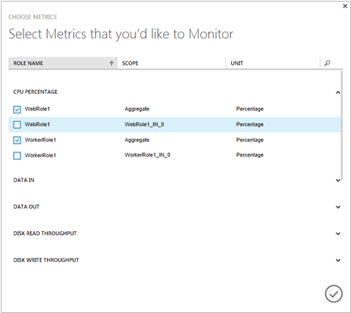

<properties 
    pageTitle="如何監視雲端服務 |Microsoft Azure" 
    description="瞭解如何使用 Azure 傳統入口網站中監控雲端服務。" 
    services="cloud-services" 
    documentationCenter="" 
    authors="rboucher" 
    manager="timlt" 
    editor=""/>

<tags 
    ms.service="cloud-services" 
    ms.workload="tbd" 
    ms.tgt_pltfrm="na" 
    ms.devlang="na" 
    ms.topic="article" 
    ms.date="08/04/2015" 
    ms.author="robb"/>


# <a name="how-to-monitor-cloud-services"></a>如何監視雲端服務

[AZURE.INCLUDE [disclaimer](../../includes/disclaimer.md)]

您可以監視`key`Azure 傳統入口網站中雲端服務的效能指標。 您可以設定的層級的監控以最小和每個服務的角色的詳細資訊，並可以自訂監控顯示。 詳細資訊的監控資料會儲存於儲存的帳戶，您可以存取入口網站外。 

Azure 傳統入口網站的監控會顯示可高度設定項目。 您可以選擇您想要在 [**監視器**] 頁面上的 [指標] 清單中監控的度量，讓您選擇在 [**監視器**] 頁面和儀表板上的指標圖表中繪製的指標。 

## <a name="concepts"></a>概念

根據預設，為新的雲端服務，使用 [主機作業系統的角色執行個體 （虛擬機器） 從收集到的效能計數器提供最小監控。 最小的指標限於 CPU 百分比、 資料、 資料出、 磁碟讀取處理量和磁碟撰寫處理能力。 藉由設定監控的詳細資訊，您會收到其他虛擬機器 （角色執行個體） 內的效能資料為基礎的指標。 詳細資訊的指標啟用更深入的分析的應用程式作業期間發生的問題。

預設角色執行個體的效能計數器資料取樣，而在 3 分鐘的時間間隔轉移從角色執行個體。 當您啟用監控的詳細資訊時，原始效能計數器資料會彙總的每一個角色執行個體，並在每一個角色的角色執行個體在 5 分鐘，1 小時和 12 小時的時間間隔。 10 天後，會清除彙總的資料。

您啟用詳細監控之後，彙總的監控資料會儲存在您儲存的帳戶中的資料表。 若要啟用角色的詳細資訊監控，您必須設定連結至儲存帳戶的診斷連線字串。 您可以使用不同的儲存帳戶的不同的角色。

請注意啟用詳細監控會增加您相關的資料儲存區、 資料傳送及儲存交易的儲存空間成本。 最小監控不需要的儲存空間的帳戶。 即使您將監控層級設定為詳細資訊，則計量公開的最小的監控層級的資料不會儲存在您儲存的帳戶。


## <a name="how-to-configure-monitoring-for-cloud-services"></a>如何︰ 設定監視雲端服務

您可以使用下列程序來設定 [Azure 傳統入口網站中的詳細資訊，或最小監視。 

### <a name="before-you-begin"></a>開始之前

- 建立儲存監視資料的儲存空間帳戶。 您可以使用不同的儲存帳戶的不同的角色。 如需詳細資訊，請參閱說明**儲存帳戶**，或瞭解[如何建立儲存的帳戶](/manage/services/storage/how-to-create-a-storage-account/)。

- 啟用您的雲端服務角色 Azure 診斷。 請參閱[設定診斷雲端服務](https://msdn.microsoft.com/library/azure/dn186185.aspx#BK_EnableBefore)。

請確定診斷連線字串中的角色設定。 您無法開啟詳細監控，直到您啟用 Azure 診斷程式診斷連線字串納入角色設定。   

> [AZURE.NOTE] 專案目標 Azure SDK 2.5 未自動包含專案範本中診斷連線字串。 這些專案必須手動新增至角色設定的 [診斷連線字串。

**手動新增至角色設定的 [診斷連線字串**

1. 在 Visual Studio 中開啟雲端服務的專案
2. 按兩下要開啟 [角色設計工具]，然後選取 [**設定**] 索引標籤的**角色**
3. 尋找名為**Microsoft.WindowsAzure.Plugins.Diagnostics.ConnectionString**設定。 
4. 如果此設定不存在然後按一下 [**新增設定**] 按鈕，以將其新增至 [設定，以及變更**連接字串**，新設定的類型
5. 設定連線字串值，即可在**...** ] 按鈕上。 這會開啟一個對話方塊，讓您可以選取儲存的帳戶。

    

### <a name="to-change-the-monitoring-level-to-verbose-or-minimal"></a>若要變更的監控層級詳細資訊，或最小

1. 在[Azure 傳統入口網站](https://manage.windowsazure.com/)中，開啟 [**設定**] 頁面的雲端服務部署。

2. 在**階層**中，按一下 [**詳細資訊**，或**最小**]。 

3. 按一下 [**儲存**]。

開啟詳細監控之後，您應該能如常看到中 Azure 傳統入口網站的監控資料 1 小時。

原始效能計數器資料和彙總的監控資料會儲存在限定角色的部署識別碼的資料表中的儲存帳戶。 

## <a name="how-to-receive-alerts-for-cloud-service-metrics"></a>如何︰ 收到的雲端服務計量通知

您會收到通知，根據您的雲端服務監視指標。 Azure 傳統入口網站的 [**管理服務**] 頁面上，您可以建立規則以觸發通知，當您選擇的公制達到您指定的值。 您也可以選擇要觸發警示時，傳送電子郵件。 如需詳細資訊，請參閱[如何︰ 收到通知的通知和 Azure 中管理通知規則](http://go.microsoft.com/fwlink/?LinkId=309356)。

## <a name="how-to-add-metrics-to-the-metrics-table"></a>如何︰ 指標表格加上指標

1. [Azure 傳統入口網站](http://manage.windowsazure.com/)中，在開啟雲端服務的 [**監視器**] 的頁面。

    根據預設，指標表格會顯示可用的指標的子集。 下圖顯示雲端服務，其資料彙總的角色層級，限制為記憶體 \ 可用 Mb 效能計數器，預設詳細的指標。 若要選取其他彙總與角色層級指標監控 Azure 傳統入口網站中使用**新增指標**。

    
 
2. 若要新增指標指標表格︰

    1. 按一下 [**新增指標**開啟**選擇指標**，以下所示。

        第一個可用的公制會展開以顯示可用的選項。 每個公制，最常用的選項會顯示彙總監控資料所有的角色。 此外，您可以選擇要顯示資料的個別角色。

        

    2. 若要選取要顯示的指標

        - 按一下向下箭號以展開監視選項公制。
        - 選取您想要顯示每個監控選項的核取方塊。

        您可以在計量表顯示超過 50 個度量。

        > [AZURE.TIP] 在設定監視的詳細資訊，指標清單包含數十種指標。 若要顯示捲軸，請將游標停留在右側的對話方塊。 若要篩選的清單，請按一下 [搜尋] 圖示，然後在 [搜尋] 方塊中輸入文字，如下所示。
    
        


3. 選取 [公制之後，請按一下 [確定] （核取記號）。

    選取的指標會新增至 [指標] 資料表中，如下所示。

    

 
4. 若要刪除度量單位，指標資料表中，按一下加以選取，公制，然後按一下**刪除公制**。 （您只看到**刪除公制**時必須選取 [公制）。

### <a name="to-add-custom-metrics-to-the-metrics-table"></a>若要指標表格加上自訂的指標

監控層級的**詳細資訊**入口網站上，提供您可以監視的預設度量清單。 除了這些，您可以監視任何自訂指標或透過入口網站應用程式所定義的效能計數器。

下列步驟假設您已開啟監控層級的**詳細資訊**，並已設定來收集及傳送自訂效能計數器應用程式。 

若要顯示在入口網站的自訂效能計數器您需要更新 wad 控制項容器中的設定︰
 
1. 開啟 wad 控制項容器 blob 診斷儲存帳戶中。 若要這麼做，您可以使用 Visual Studio 或任何其他儲存檔案總管]。

    

2. 瀏覽以尋找您的角色執行個體的設定使用模式**DeploymentId/角色名稱/RoleInstance** blob 路徑。 

    
3. 下載您的角色執行個體的設定檔，並更新以包含的任何自訂效能計數器。 監控*磁碟寫入每秒位元組* *C 磁碟機*中，例如新增在**PerformanceCounters\Subscriptions**節點

    ```xml
    <PerformanceCounterConfiguration>
    <CounterSpecifier>\LogicalDisk(C:)\Disk Write Bytes/sec</CounterSpecifier>
    <SampleRateInSeconds>180</SampleRateInSeconds>
    </PerformanceCounterConfiguration>
    ```
4. 儲存變更，並設定檔案上傳回到覆寫現有檔案中 blob 的同一個位置。
5. 切換至的 Azure 傳統入口網站設定的詳細資訊模式。 如果您已經在詳細資訊模式中您必須切換至 [最小] 以及回到詳細資訊。
6. 自訂效能計數器現在會出現在 [**新增指標**] 對話方塊。 

## <a name="how-to-customize-the-metrics-chart"></a>如何︰ 自訂指標圖表

1. 在 [指標] 資料表中，選取 [繪製指標圖表上最多 6 指標]。 若要選取度量單位，請按一下它左邊的核取方塊。 若要移除指標圖表的度量單位，請清除其指標資料表中的核取方塊。

    當您選取標準計量表時，指標會新增至指標圖表中。 縮小顯示， **n 更多**下拉式清單包含公制不符合顯示的標題。

 
2. 若要顯示相對的值 （僅適用於每個公制的最後一個值） 和絕對值值 （Y 軸顯示） 之間切換，請選取相對於] 或 [頂端的 [圖表的絕對值。

    

3. 若要變更的時間範圍指標圖表會顯示，會選取 1 小時、 24 小時的時間或 7 天頂端的圖表。

    

    儀表板指標在圖表上，繪製指標的方法是不同的。 一組標準的指標可供使用並新增或移除選取 [公制的標頭指標。

### <a name="to-customize-the-metrics-chart-on-the-dashboard"></a>若要自訂的儀表板上的指標圖表

1. 開啟儀表板的雲端服務。

2. 新增或移除圖表中的指標︰

    - 若要繪製的新的度量，選取 [圖表標題中的公制] 核取方塊。 縮小顯示]，按一下向下箭號以***n*??metrics**若要繪製圖表頁首區域無法顯示度量單位。

    - 若要刪除的繪製方式在圖表的度量，請依其標題清除核取方塊。

3. 切換**相對**和**絕對**會顯示。

4. 選擇 [24 小時的時間或要顯示的資料 7 天 1 小時。

## <a name="how-to-access-verbose-monitoring-data-outside-the-azure-classic-portal"></a>如何︰ 詳細監控 Azure 傳統入口網站的外部資料存取

詳細資訊的監控資料儲存在您指定每一個角色儲存帳戶中的資料表。 針對每個雲端服務部署中，建立六個表格的角色。 （5 分鐘，1 小時和 12 小時） 時，會為每一個建立兩個資料表。 下列表格的其中一個儲存角色層級彙總。其他資料表儲存角色執行個體的彙總。 

資料表名稱有下列格式︰

```
WAD*deploymentID*PT*aggregation_interval*[R|RI]Table
```

位置︰

- *deploymentID*是指定至雲端服務部署 GUID

- *aggregation_interval* = 5 M、 1 H、 或 12 H

- 角色層級的彙總 = R

- 角色執行個體的彙總 = RI

例如下, 表會儲存在 1 小時的時間間隔彙總的詳細資訊監控資料︰

```
WAD8b7c4233802442b494d0cc9eb9d8dd9fPT1HRTable (hourly aggregations for the role)

WAD8b7c4233802442b494d0cc9eb9d8dd9fPT1HRITable (hourly aggregations for role instances)
```
