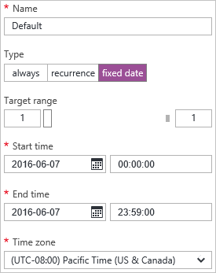
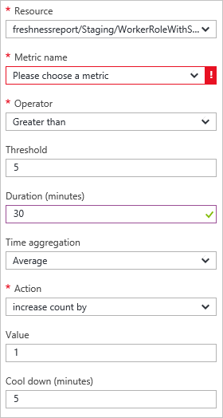
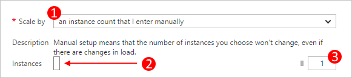

<properties
    pageTitle="自動調整入口網站中的雲端服務 |Microsoft Azure"
    description="瞭解如何使用自動小數位數的設定規則的雲端服務 web 角色或工作者角色 Azure 中的入口網站。"
    services="cloud-services"
    documentationCenter=""
    authors="Thraka"
    manager="timlt"
    editor=""/>

<tags
    ms.service="cloud-services"
    ms.workload="tbd"
    ms.tgt_pltfrm="na"
    ms.devlang="na"
    ms.topic="article"
    ms.date="09/06/2016"
    ms.author="adegeo"/>

# 如何自動調整大小雲端服務

> [AZURE.SELECTOR]
- [Azure 入口網站](cloud-services-how-to-scale-portal.md)
- [Azure 傳統入口網站](cloud-services-how-to-scale.md)

觸發的比例或縮小作業雲端服務工作者角色的可設定條件。 角色條件可以根據 CPU、 或網路負載的角色。 您也可以設定 conditation，根據訊息佇列或與您的訂閱相關聯的某些其他 Azure 資源的度量。

>[AZURE.NOTE] 本文著重於雲端服務 web 及工作者角色。 當您直接建立虛擬機器 （傳統） 時，它會裝載雲端服務中。 您可以藉由將它[可用性設定](../virtual-machines/virtual-machines-windows-classic-configure-availability.md)縮放標準的虛擬機器並手動將其開啟或關閉。

## 考量

設定應用程式的縮放比例之前，您應該考慮下列資訊︰

- 縮放比例，並受到核心使用方式。 較大的角色執行個體使用更多核心。 您可以調整只在核心的限制內的應用程式，您的訂閱。 例如，如果您的訂閱有二十核心和您與調整大小的兩個中執行的應用程式的限制雲端服務 （總計的四個核心），您可以只縮放設定其他雲端服務部署在您的訂閱 16 個核心。 大小的詳細資訊，請參閱[雲端服務的大小](cloud-services-sizes-specs.md)。

- 您可以在不按比例縮放在佇列中郵件閥值。 如需有關如何使用佇列的詳細資訊，請參閱[如何使用佇列中儲存服務](../storage/storage-dotnet-how-to-use-queues.md)。

- 您也可以調整您的訂閱相關聯的其他資源。

- 若要啟用您的應用程式的可用性，您應該確認部署與兩個或多個角色執行個體。 如需詳細資訊，請參閱[服務等級協定](https://azure.microsoft.com/support/legal/sla/)。

## 縮放比例所在的位置

選取您的雲端服務之後，您應該看到雲端服務刀。

1. 在雲端服務防禦，在 [**角色及執行個體**] 方塊中，選取雲端服務的名稱。   
**重要事項**︰ 請務必按一下雲端服務角色，而不是下一個角色的角色執行個體。

    

2. 選取 [**縮放比例**] 方塊。

    

## 自動縮放比例

您可以使用兩種模式**手動**或**自動**設定角色的縮放設定。 手動您所預期，您設定的執行個體絕對的計數。 自動不過可讓您設定的規則，如何以及更您應縮放。

將**依比例縮放**選項**排程和效能**的規則。

1. 現有的設定檔。
2. 新增上層設定檔的規則。
3. 新增另一個設定檔。

選取 [**新增設定檔**]。 設定檔會決定您想要的刻度使用哪一種的模式︰**永遠**、**週期**、**固定日期**。

您已設定的設定檔和規則之後，請選取 [頂端的 [**儲存**] 圖示。

#### 設定檔

設定檔設定最小值和最大比例] 的執行個體，並且也時縮放比例範圍作用中。

* **永遠**

    永遠保持此範圍的可用的執行個體。  

    
    
* **循環**

    選擇一組縮放週的日子。

    
    
* **固定的日期**

    若要縮放的角色固定的日期範圍。

    

您已設定設定檔之後，請選取 [設定檔刀底部的 [**確定**] 按鈕。

#### 規則

規則會新增至 [設定檔，而且代表會觸發小數位數的條件。 

規則的觸發程序會根據度量單位，您可以新增條件的值的雲端服務 （CPU 使用率、 磁碟活動或網路活動）。 此外，您可以讓郵件佇列中或公制與您的訂閱相關聯的某些其他 Azure 資源的觸發程序。

您已設定規則之後，請選取規則刀底部的 [**確定**] 按鈕。

## 回到手動縮放比例

瀏覽至[縮放設定](#where-scale-is-located)，並將**依比例縮放**選項設定為**手動輸入執行個體字數統計**。

這樣就會移除該角色的自動化縮放比例，然後您可以直接設定執行個體計數。 

1. 小數位數 （手動或自動） 選項。
2. 若要設定要縮放的執行個體角色執行個體滑桿。
3. 若要縮放至角色的執行個體。

您已設定縮放設定後，請選取 [頂端的 [**儲存**] 圖示。

