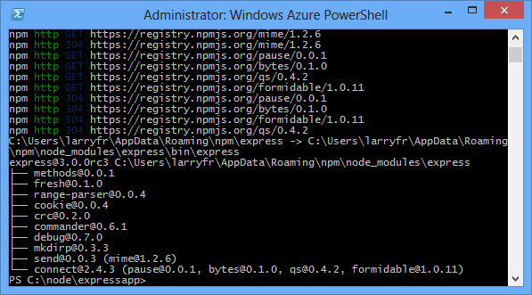
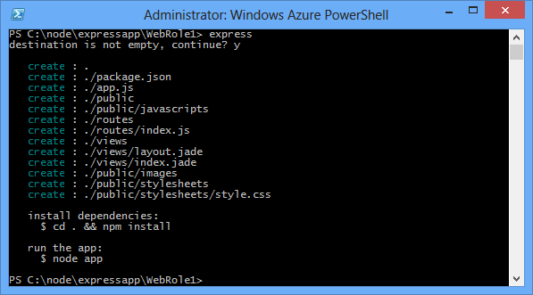
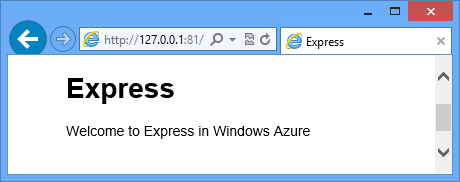

<properties 
    pageTitle="網頁 Express (Node.js) 應用程式 |Microsoft Azure" 
    description="教學課程，根據 cloud 服務教學課程中，並示範如何使用 Express 模組。" 
    services="cloud-services" 
    documentationCenter="nodejs" 
    authors="rmcmurray" 
    manager="wpickett" 
    editor=""/>

<tags 
    ms.service="cloud-services" 
    ms.workload="tbd" 
    ms.tgt_pltfrm="na" 
    ms.devlang="nodejs" 
    ms.topic="article" 
    ms.date="08/11/2016" 
    ms.author="robmcm"/>

# 建立在 Azure 雲端服務中使用快速 Node.js web 應用程式

Node.js 核心執行階段中包含最基本的功能。
開發人員經常使用第 3 廠商模組以開發 Node.js 應用程式時提供其他功能。 在本教學課程中，您會建立新的應用程式使用[Express][]模組，提供 MVC framework 建立 Node.js web 應用程式。

下方，為已完成的應用程式的螢幕擷取畫面︰

##建立雲端服務專案

若要建立新的雲端服務專案，名為 「 expressapp' 下列步驟執行︰

1. 從**[開始] 功能表**或**[開始] 畫面**中，搜尋**Windows PowerShell**。 最後，以滑鼠右鍵按一下**Windows PowerShell** ，並選取 [**以系統管理員身分執行**。

    

    [AZURE.INCLUDE [install-dev-tools](../../includes/install-dev-tools.md)]

2. 變更目錄**c:\\節點**目錄]，然後輸入下列命令以建立新的方案名稱為**expressapp**和命名**WebRole1**網頁角色︰

        PS C:\node> New-AzureServiceProject expressapp
        PS C:\Node\expressapp> Add-AzureNodeWebRole
        PS C:\Node\expressapp> Set-AzureServiceProjectRole WebRole1 Node 0.10.21

    > [AZURE.NOTE] 根據預設，**新增 AzureNodeWebRole**會使用舊版 Node.js。 上述**設定 AzureServiceProjectRole**陳述式指示 Azure 使用 v0.10.21 的節點。  請注意參數會區分大小寫。  您可以驗證，請核取 [**引擎**] 屬性中**WebRole1\package.json**已選取正確的 Node.js 版本。

##安裝 Express

1. 安裝 Express 產生器發出下列命令︰

        PS C:\node\expressapp> npm install express-generator -g

    Npm 命令的輸出應該看起來類似下列結果。 

    

2. 變更目錄**WebRole1**目錄，使用快速命令來產生新的應用程式︰

        PS C:\node\expressapp\WebRole1> express

    系統會提示您的舊版應用程式，覆寫。 輸入**y** ] 或 [ **]**以繼續進行。 快速將會產生 app.js 檔案與資料夾結構，建立您的應用程式。

    

5.  若要安裝其他相依性定義 package.json 檔案中，輸入下列命令︰

        PS C:\node\expressapp\WebRole1> npm install

    ![輸出 npm 的安裝] 命令](./media/cloud-services-nodejs-develop-deploy-express-app/node26.png)

6.  使用下列命令，將**bin/www**檔案複製到**server.js**。 這是雲端服務可以尋找這個應用程式的進入點。

        PS C:\node\expressapp\WebRole1> copy bin/www server.js

    這個命令完成之後，您應該已經 WebRole1 目錄中的**server.js**檔案。

7.  修改**server.js** ，若要移除下列其中一項 「。 」 的下列行字元。

        var app = require('../app');

    進行修改之後, 行應如下。

        var app = require('./app');

    這項變更是必要因為移動檔案 (舊稱**bin/www**，) 所需的應用程式檔案與相同的目錄。 在之後進行這項變更，請儲存**server.js**檔案。

8.  Azure 模擬器中執行應用程式中使用下列命令︰

        PS C:\node\expressapp\WebRole1> Start-AzureEmulator -launch

    

## 修改檢視

現在修改檢視以顯示 「 歡迎使用至 Express 中 Azure 」 的訊息。

1.  輸入下列命令以開啟 index.jade 檔案︰

        PS C:\node\expressapp\WebRole1> notepad views/index.jade

    

    碧眼是 Express 應用程式所用的預設檢視引擎。 如需有關碧眼檢視引擎的詳細資訊，請參閱[http://jade-lang.com][]。

2.  修改附加**Azure 中**的最後一行文字。

    

3.  儲存檔案，然後結束記事本。

4.  重新整理瀏覽器，您會看到您的變更。

    

測試之後應用程式，使用**停駐點 AzureEmulator** cmdlet 停止模擬器。

##發佈 Azure 應用程式

在 PowerShell 的 Azure 視窗中，使用**發佈 AzureServiceProject** cmdlet 來部署到雲端服務應用程式

    PS C:\node\expressapp\WebRole1> Publish-AzureServiceProject -ServiceName myexpressapp -Location "East US" -Launch

部署作業完成後，您的瀏覽器會開啟，並顯示網頁。

![顯示 [快速] 頁面的網頁瀏覽器。 URL 指出現在裝載於 Azure 上。](./media/cloud-services-nodejs-develop-deploy-express-app/node36.png)

## 後續步驟

如需詳細資訊，請參閱[Node.js 開發人員中心](/develop/nodejs/)。

  [Node.js Web Application]: http://www.windowsazure.com/develop/nodejs/tutorials/getting-started/
  [Express]: http://expressjs.com/
  [http://jade-lang.com]: http://jade-lang.com

 
