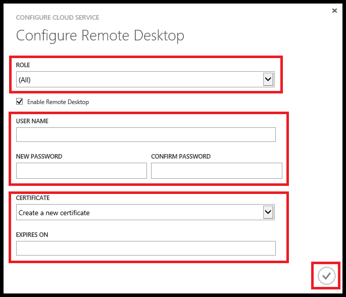

<properties 
pageTitle="啟用遠端桌面連線 Azure 雲端服務中的角色" 
description="如何設定以允許遠端桌面連線的 azure 雲端服務應用程式" 
services="cloud-services" 
documentationCenter="" 
authors="sbtron" 
manager="timlt" 
editor=""/>
<tags 
ms.service="cloud-services" 
ms.workload="tbd" 
ms.tgt_pltfrm="na" 
ms.devlang="na" 
ms.topic="article" 
ms.date="02/17/2016" 
ms.author="saurabh"/>

# <a name="enable-remote-desktop-connection-for-a-role-in-azure-cloud-services"></a>啟用遠端桌面連線 Azure 雲端服務中的角色

>[AZURE.SELECTOR]
- [Azure 傳統入口網站](cloud-services-role-enable-remote-desktop.md)
- [PowerShell](cloud-services-role-enable-remote-desktop-powershell.md)
- [Visual Studio](../vs-azure-tools-remote-desktop-roles.md)


遠端桌面可讓您存取執行 Azure 中的角色的桌面。 您可以使用遠端桌面連線疑難排解，並在執行中時，診斷應用程式的問題。 

您可以在您的角色啟動遠端桌面連線，開發期間，以在您的服務定義包括遠端桌面模組，或您可以選擇以啟用遠端桌面延伸到遠端桌面。 慣用的方法是，您可以啟用遠端桌面，而不必重新部署您的應用程式部署應用程式，即使使用遠端桌面副檔名。 


## <a name="configure-remote-desktop-from-the-azure-classic-portal"></a>從 Azure 傳統入口網站設定遠端桌面
Azure 傳統入口網站使用遠端桌面擴充方法，因此即使應用程式的部署，您可以啟用遠端桌面。 [**設定**] 頁面，您的雲端服務可讓您啟用遠端桌面、 變更用來連線到虛擬機器本機系統管理員帳戶、 憑證驗證中使用，並設定到期日。 


1. 按一下**Cloud Services**，按一下該雲端服務中的名稱，然後按一下 [**設定**。

2. 按一下 [**遠端**]。
    
    
    
    > [AZURE.WARNING] 當您第一次啟用遠端桌面，並按一下 [確定] （核取記號），將會重新啟動所有角色執行個體。 若要防止重新啟動電腦，使用密碼加密的憑證必須安裝角色。 若要防止重新啟動電腦[上, 傳雲端服務的憑證](cloud-services-how-to-create-deploy/#how-to-upload-a-certificate-for-a-cloud-service)，然後回到這個對話方塊。
    

3. 在 [**角色**] 中，選取您要更新，或選取 [**全部**] 的所有角色的角色。

4. 進行任何的下列變更︰
    
    - 若要啟用遠端桌面，請選取 [**啟用遠端桌面**] 核取方塊。 若要停用遠端桌面，清除核取方塊。
    
    - 建立要使用中的角色執行個體的遠端桌面連線的帳戶。
    
    - 更新現有的帳戶的密碼。
    
    - 選取 [上傳的憑證用於驗證 （上傳使用 [**憑證**] 頁面上的 [**上傳**的憑證），或建立新的憑證]。 
    
    - 變更遠端桌面設定的到期日。

5. 當您完成設定更新時，按一下**[確定]** （核取記號）。


## <a name="remote-into-role-instances"></a>將角色執行個體的遠端
一旦啟用遠端桌面的角色可以遠端透過各種工具的角色執行個體。

從 Azure 傳統入口網站，以連線至角色執行個體︰
    
  1.   按一下以開啟 [**執行個體**] 頁面的**執行個體**。
  2.   選取具有遠端桌面設定的角色執行個體。
  3.   按一下 [**連線**]，然後依照指示操作以開啟桌面。 
  4.   按一下 [**開啟**]，然後**連線**以啟動遠端桌面連線]。 


### <a name="use-visual-studio-to-remote-into-a-role-instance"></a>使用 Visual Studio 遠端的角色執行個體

在 Visual Studio 中，伺服器總管︰

1. 展開**Azure\\雲端服務\\雲端服務姓名**節點。
2. 展開**臨時**或**生產**。
3. 展開的個別的角色。
4. 以滑鼠右鍵按一下其中一個角色執行個體，按一下 [**使用 … 執行遠端桌面連線**]，然後輸入使用者名稱和密碼。 


### <a name="use-powershell-to-get-the-rdp-file"></a>使用 PowerShell 來取得 RDP 檔案
[取得 AzureRemoteDesktopFile](https://msdn.microsoft.com/library/azure/dn495261.aspx)指令程式可用來擷取 RDP 檔案。 然後，您可以使用遠端桌面連線 RDP 檔案存取雲端服務。

### <a name="programmatically-download-the-rdp-file-through-the-service-management-rest-api"></a>以程式設計方式下載服務管理 REST API RDP 檔案
您可以使用 [[下載 RDP 檔案](https://msdn.microsoft.com/library/jj157183.aspx)其餘作業下載 RDP 檔案。 


## <a name="to-configure-remote-desktop-in-the-service-definition-file"></a>若要設定遠端桌面服務定義檔案中

這個方法可讓您啟用遠端桌面應用程式開發期間。 此方法需要加密的密碼儲存在您的服務設定檔案及遠端桌面設定的任何更新需要重新部署的應用程式。 如果您想要避免這些缺點您應該使用上述的基礎的遠端桌面擴充方法。  

您可以使用 Visual Studio[啟用遠端桌面連線](../vs-azure-tools-remote-desktop-roles.md)使用服務定義檔案的方法。  
下列步驟來啟用遠端桌面服務模型檔案所需的變更。 Visual Studio 發佈時，就會自動將這些變更。

### <a name="set-up-the-connection-in-the-service-model"></a>設定服務模型中的連線 
使用**遠端存取**模組與**RemoteForwarder**模組匯入到[ServiceDefinition.csdef](cloud-services-model-and-package.md#csdef)檔案**匯入**項目。

服務定義檔案應該類似下面的範例與`<Imports>`新增的項目。

```xml
<ServiceDefinition name="<name-of-cloud-service>" xmlns="http://schemas.microsoft.com/ServiceHosting/2008/10/ServiceDefinition" schemaVersion="2013-03.2.0">
    <WebRole name="WebRole1" vmsize="Small">
        <Sites>
            <Site name="Web">
                <Bindings>
                    <Binding name="Endpoint1" endpointName="Endpoint1" />
                </Bindings>
            </Site>
        </Sites>
        <Endpoints>
            <InputEndpoint name="Endpoint1" protocol="http" port="80" />
        </Endpoints>
        <Imports>
            <Import moduleName="Diagnostics" />
            <Import moduleName="RemoteAccess" />
            <Import moduleName="RemoteForwarder" />
        </Imports>
    </WebRole>
</ServiceDefinition>
```
[ServiceConfiguration.cscfg](cloud-services-model-and-package.md#cscfg)檔案應該類似下面的範例，請注意`<ConfigurationSettings>`和`<Certificates>`項目。 指定的憑證必須是[上傳至雲端服務](../cloud-services-how-to-create-deploy.md#how-to-upload-a-certificate-for-a-cloud-service)。

```xml
<?xml version="1.0" encoding="utf-8"?>
<ServiceConfiguration serviceName="<name-of-cloud-service>" xmlns="http://schemas.microsoft.com/ServiceHosting/2008/10/ServiceConfiguration" osFamily="3" osVersion="*" schemaVersion="2013-03.2.0">
    <Role name="WebRole1">
        <Instances count="2" />
        <ConfigurationSettings>
            <Setting name="Microsoft.WindowsAzure.Plugins.RemoteAccess.Enabled" value="true" />
            <Setting name="Microsoft.WindowsAzure.Plugins.RemoteAccess.AccountUsername" value="[name-of-user-account]" />
            <Setting name="Microsoft.WindowsAzure.Plugins.RemoteAccess.AccountEncryptedPassword" value="[base-64-encrypted-user-password]" />
            <Setting name="Microsoft.WindowsAzure.Plugins.RemoteAccess.AccountExpiration" value="[certificate-expiration]" />
            <Setting name="Microsoft.WindowsAzure.Plugins.RemoteForwarder.Enabled" value="true" />
        </ConfigurationSettings>
        <Certificates>
            <Certificate name="Microsoft.WindowsAzure.Plugins.RemoteAccess.PasswordEncryption" thumbprint="[certificate-thumbprint]" thumbprintAlgorithm="sha1" />
        </Certificates>
    </Role>
</ServiceConfiguration>
```


## <a name="additional-resources"></a>其他資源

[如何設定雲端服務](cloud-services-how-to-configure.md)