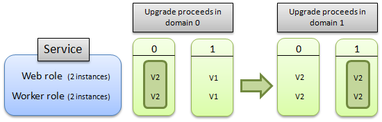

<properties
pageTitle="如何更新雲端服務 |Microsoft Azure"
description="瞭解如何更新 Azure 中的雲端服務。 瞭解如何在雲端服務的更新會繼續以確保可用性。"
services="cloud-services"
documentationCenter=""
authors="Thraka"
manager="timlt"
editor=""/>
<tags
ms.service="cloud-services"
ms.workload="tbd"
ms.tgt_pltfrm="na"
ms.devlang="na"
ms.topic="article"
ms.date="08/10/2016"
ms.author="adegeo"/>

# 如何更新雲端服務

## 概觀
10000 英呎，更新雲端服務，包括其角色與來賓 OS，是三個步驟的程序。 首先，必須上載的二進位檔案及新的雲端服務的作業系統版本的設定檔。 接下來，Azure 會保留計算和網路根據需求的雲端服務最新版的雲端服務的資源。 最後，Azure 執行輪流升級從屬參照到新的版本或來賓 OS，同時保留您的顯示狀態更新租用戶。 本文將討論最後一個步驟 – 輪流升級詳細的資料。

## 更新 Azure 服務

Azure 會將您的角色執行個體組織成邏輯群組，稱為升級的網域 （「 ud 」）。 升級的網域 （「 ud 」） 是邏輯的更新群組的角色執行個體。  Azure 更新的雲端服務，一次，允許例項，以繼續做流量其他 UDs 中的一個 「 ud 」。

預設的升級的網域數就是 5。 您可以指定不同的數字的升級的網域服務的定義檔案 (.csdef) 中加入 upgradeDomainCount 屬性。 如需有關 upgradeDomainCount 屬性的詳細資訊，請參閱[WebRole 結構描述](https://msdn.microsoft.com/library/azure/gg557553.aspx)或[WorkerRole 結構描述](https://msdn.microsoft.com/library/azure/gg557552.aspx)。

當您執行的一或多個角色就地更新，在您的服務時，Azure 更新組的角色執行個體，根據升級所屬的網域。 Azure 更新所有執行個體中指定的升級網域 – 停止，更新，使其返回線上 – 然後移到下一個網域。 藉由停止執行中目前的升級網域的執行個體，Azure 確保的更新，就會發生的最低可能影響執行服務。 如需詳細資訊，請參閱本文稍後的[方式更新將繼續進行](#howanupgradeproceeds)。

> [AZURE.NOTE] 雖然字詞**更新**並**升級**有稍微不同的意義內容 Azure 中，他們可以交換使用程序和描述的文件中的功能。

您的服務，必須先定義至少兩個執行個體的更新該角色的角色就地升級不停機時間。 如果服務組成一個角色只有一個執行個體，直到完成就地更新時，將無法使用您的服務。

本主題會說明 Azure 更新的下列資訊︰

-   [更新時允許服務變更](#AllowedChanges)
-   [升級的進行方式](#howanupgradeproceeds)
-   [更新的復原](#RollbackofanUpdate)
-   [啟動多個進行中部署的變化作業](#multiplemutatingoperations)
-   [通訊群組的角色升級的網域](#distributiondfroles)

## 更新時允許服務變更
下表顯示服務允許的變更，更新時︰

|變更允許裝載、 服務與角色|就地更新|分段 （VIP 交換）|刪除和重新部署|
|---|---|---|---|
|作業系統版本|[是]|[是]|[是]
|.NET 信任層級|[是]|[是]|[是]|
|虛擬機器大小1|是2|[是]|[是]|
|本機存放區設定|增加2|[是]|[是]|
|新增或移除服務中的角色|[是]|[是]|[是]|
|為特定角色的執行個體數目|[是]|[是]|[是]|
|服務的結束點的個數或類型|是2|無|[是]|
|名稱和設定的設定值|[是]|[是]|[是]|
|值 （但不是名稱） 的設定|[是]|[是]|[是]|
|新增新的憑證|[是]|[是]|[是]|
|變更現有的憑證|[是]|[是]|[是]|
|部署新的程式碼|[是]|[是]|[是]|
1調整大小的子集可使用雲端服務的大小限制的變更。

2需要 Azure SDK 1.5 或更新版本。

> [AZURE.WARNING] 變更虛擬機器大小會損毀本機的資料。

更新時不支援下列項目︰

-   變更角色的名稱。 移除，然後新增 [新名稱的角色。
-   變更升級網域計數。
-   縮小本機資源。

如果您對其他更新您的服務定義，例如縮小本機資源時，您必須改為執行 VIP 交換更新。 如需詳細資訊，請參閱[交換部署](https://msdn.microsoft.com/library/azure/ee460814.aspx)。

## 升級的進行方式
您可以決定您是否要更新的所有服務中的角色或服務的單一角色。 在任一情況，每一個角色正在升級，所屬的第一個升級網域的所有例項停止、 升級，以及上線。 後有恢復連線，請在第二個升級網域的執行個體停止、 升級，以及上線。 作用中一次一個升級最多可以有雲端服務。 針對最新版的雲端服務，會自動執行升級。

下圖顯示升級的進行方式如果您要升級所有服務中的角色︰

此下一個圖表可圖解更新的進行方式如果您要升級單一角色︰

  

> [AZURE.NOTE] 從一個執行個體的服務升級至多個執行個體時您的服務會引進向下，雖然因為方式 Azure 升級服務來執行升級。 服務等級協定 guaranteeing 服務可用性僅適用於部署與多個執行個體的服務。 下列清單說明每一個磁碟機上的資料會如何影響每個 Azure 服務升級案例︰
>
>VM 重新啟動︰
>
-   C︰ 保留
-   D︰ 保留
-   E︰ 保留
>
>入口網站的重新啟動︰
>
-   C︰ 保留
-   D︰ 保留
-   E︰ 損毀
>
>設定重新的入口網站︰
>
-   C︰ 保留
-   D︰ 損毀
-   E︰ 損毀

>就地升級︰
>
-   C︰ 保留
-   D︰ 保留
-   E︰ 損毀
>
>節點移轉︰
>
-   C︰ 損毀
-   D︰ 損毀
-   E︰ 損毀

>請注意，上述清單中，e︰ 磁碟機代表角色的根磁碟機，不應該硬式編碼。 請改用 %roleroot%環境變數來代表磁碟機。

>若要升級的單一執行個體服務時，最小化停機時間，部署新的多個執行個體服務開發用伺服器並執行 VIP 交換。

自動更新，期間 Azure 布料的轉印圖樣控制器定期評估雲端服務，來判斷安全引導下一個 「 ud 」 時的狀況。 此狀況評估執行每個角色為基礎，並將最新版本 （也就是執行個體從已受到的 UDs） 的執行個體。 它會驗證的最小的數字的角色執行個體，每一個角色，已達到滿意終端機狀態。

### 角色執行個體開始逾時
布料的轉印圖樣控制器會等待 30 分鐘，每個角色執行個體達到啟動狀態。 如果逾時持續時間超過時間，布料的轉印圖樣控制器會繼續到下一個角色執行個體說明。

## 更新的復原
Azure 讓您在升級期間管理服務，讓您啟動其他服務，作業後 Azure 布料的轉印圖樣控制器接受初始更新要求。 更新 （設定變更） 時，可以只執行復原或升級部署上的 [**進行中**] 狀態。 更新或升級會被視為進行中，只要尚未更新為新的版本服務至少有一個執行個體。 若要測試是否允許復原，檢查 RollbackAllowed 標幟，[取得部署](https://msdn.microsoft.com/library/azure/ee460804.aspx)及[取得雲端服務內容](https://msdn.microsoft.com/library/azure/ee460806.aspx)作業所傳回的值，會設定為 true。

> [AZURE.NOTE] 只讓來電復原**就地**更新或升級，因為 VIP 交換升級涉及取代另一個整個執行個體您的服務。

進行中更新的復原具有項效果部署上︰

-   任何角色執行個體，其中有尚未更新或升級至新的版本不會更新或升級，因為這些執行個體已執行的服務的目標版本。
-   具有已被更新或升級至新版的服務套件任何角色執行個體 (\*.cspkg) 檔案] 或 [服務設定 (\*.cscfg) 檔案 （或兩個檔案） 會還原為這些檔案的升級前的版本。

此功能會提供下列功能︰

-   [復原更新或升級](https://msdn.microsoft.com/library/azure/hh403977.aspx)作業，可以在上的設定 （呼叫[變更部署設定](https://msdn.microsoft.com/library/azure/ee460809.aspx)觸發） 或 （觸發呼叫[升級部署](https://msdn.microsoft.com/library/azure/ee460793.aspx)） 升級稱為，只要在服務尚未更新為新的版本有至少有一個執行個體。
-   鎖定項目和 RollbackAllowed 項目，會傳回做為回應本文[取得部署](https://msdn.microsoft.com/library/azure/ee460804.aspx)及[取得雲端服務內容](https://msdn.microsoft.com/library/azure/ee460806.aspx)作業的一部分︰
    1.  鎖定元素可讓您偵測何時變化的作業，可在指定的部署叫用。
    2.  RollbackAllowed 元素可讓您偵測何時[復原更新或升級](https://msdn.microsoft.com/library/azure/hh403977.aspx)作業可在指定的部署。

    若要執行復原，您沒有同時鎖定] 及 [RollbackAllowed 項目。 它即可確認 RollbackAllowed 設定為 true。 如果使用設定為 [要求標頭叫用下列方法，只會傳回這些項目 」 x ms 版本︰ 2011年-10-01 」 或更新版本。 如需版本設定標題的詳細資訊，請參閱[服務管理版本設定](https://msdn.microsoft.com/library/azure/gg592580.aspx)。

有某些情況下位置更新復原或不支援升級，這些是，如下所示︰

-   在本機資源-如果更新增加角色 Azure 平台的本機資源不允許復原。 
-   更新屬性的狀況下操作，您可能不會再小數位數配額限制-有足夠的計算配額完成復原作業。 每個 Azure 的訂閱有與其相關聯的指定的數目上限的核心可由隸屬於該訂閱的所有裝載服務的配額。 如果執行復原指定的更新會透過配額，然後將您的訂閱將不會啟用復原。
-   競爭情況-如果初始更新已完成，不能復原。

當更新的復原可能很有用的範例是如果您使用[升級部署](https://msdn.microsoft.com/library/azure/ee460793.aspx)作業以手動控制主要的就地升級至您 Azure 裝載於服務的率會導入模式。

升級的首展期間您撥入手動模式中的 [[升級的部署](https://msdn.microsoft.com/library/azure/ee460793.aspx)，並開始逐步引導升級的網域。 如果有些時候，當您監控升級您記下您檢查的第一個升級網域中的某些角色執行個體變得沒有回應、 打電話[復原更新或升級](https://msdn.microsoft.com/library/azure/hh403977.aspx)作業在部署中，將延用有任何升級的執行個體及復原執行個體的已升級到上一個服務套件及設定。

## 啟動多個進行中部署的變化作業
在某些情況下，您可能要啟動多個進行中部署同步的變化作業。 比方說，您可能會執行服務的更新，更新正在首展過您的服務，而您想要進行一些變更，例如就緒回的更新，套用不同的更新，或甚至刪除部署。 在其中可能會需要這種情況下是服務升級如果包含有問題的程式碼會使升級的角色執行個體重複當機。 在此情況下，Azure 布料的轉印圖樣控制器會無法進行中套用升級因為不足，無法在升級的網域中的執行個體數目健全的進度。 此狀態被指*部署無法解決問題*。 您可以助您脫離停滯部署回復更新或套用新的更新失敗頂端上一個。

一旦 Azure 布料的轉印圖樣控制器已經收到更新或升級服務的初始要求，您就可以開始後續變化的作業。 就是您沒有等待作業初始完成之前，您可以開始另一個變化的作業。

進行中的第一次更新時，初始第二個的更新作業會執行類似回復作業。 第二個更新時自動模式中，第一個升級的網域會升級，可能會產生執行個體從多個時間正在離線的同一點的升級網域。

變化作業如下所示︰[變更部署設定](https://msdn.microsoft.com/library/azure/ee460809.aspx)、[升級部署](https://msdn.microsoft.com/library/azure/ee460793.aspx)、[更新部署狀態](https://msdn.microsoft.com/library/azure/ee460808.aspx)、[刪除部署](https://msdn.microsoft.com/library/azure/ee460815.aspx)及[復原更新或升級](https://msdn.microsoft.com/library/azure/hh403977.aspx)。

兩項作業，[取得部署](https://msdn.microsoft.com/library/azure/ee460804.aspx)及[取得雲端服務的內容](https://msdn.microsoft.com/library/azure/ee460806.aspx)，傳回鎖定標幟用來決定變化的作業是否可以在指定的部署叫用。

才能呼叫這些方法會傳回鎖定旗標的版本，您必須設定要求標題為 「 x ms 版本︰ 2011年-10-01 」 或更新版本。 如需版本設定標題的詳細資訊，請參閱[服務管理版本設定](https://msdn.microsoft.com/library/azure/gg592580.aspx)。

## 通訊群組的角色升級的網域
Azure 分配角色的執行個體平均設定數字的升級的網域，您可以設定服務定義 (.csdef) 檔案的一部分。 升級的網域的最大的數字 20，而預設為 5。 如需有關如何修改服務定義檔案的詳細資訊，請參閱[Azure 服務定義結構描述 (.csdef 檔案)](cloud-services-model-and-package.md#csdef)。

例如，如果您的角色具有十個執行個體，依預設升級的每個網域包含兩個執行個體。 如果您的角色具有 14 的執行個體，然後升級的網域中的四筆包含三個執行個體，然後第五個網域都包含兩個。

升級的網域會標示起始的索引︰ 第一個升級網域的識別碼為 0，及第二個升級網域的識別碼為 1，依此類推。

下圖說明當服務定義出兩個升級的網域，如何分配比包含兩個角色服務。 服務執行八個執行個體網頁角色及工作角色的九個執行個體。

> [AZURE.NOTE] 請注意 Azure 控制項在升級的網域配置的執行個體。 您不可以指定哪些執行個體配置給的網域。

## 後續步驟
[如何管理雲端服務](cloud-services-how-to-manage.md)  
[如何監視雲端服務](cloud-services-how-to-monitor.md)  
[如何設定 Cloud Services](cloud-services-how-to-configure.md)  
