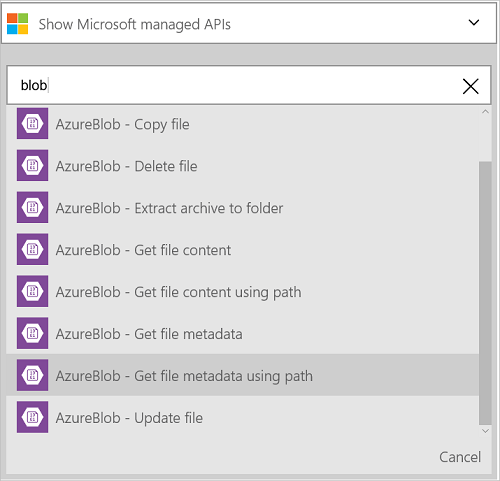

<properties
    pageTitle="邏輯應用程式中新增 Azure blob 儲存體 Connector |Microsoft Azure"
    description="Azure blob 儲存體 Connector REST API 參數的概觀"
    services=""
    documentationCenter="" 
    authors="MandiOhlinger"
    manager="anneta"
    editor=""
    tags="connectors"/>

<tags
   ms.service="logic-apps"
   ms.devlang="na"
   ms.topic="article"
   ms.tgt_pltfrm="na"
   ms.workload="integration" 
   ms.date="10/18/2016"
   ms.author="mandia"/>

# Azure blob 儲存體 connector 快速入門
Azure Blob 儲存體] 是儲存大量的非結構化資料的服務。 執行各種動作，例如 [上傳、 更新、 取得，及刪除二進位大型物件中 Azure blob 儲存體。 

Azure blob 儲存體，與您︰

- 上傳新專案，或取得最近已更新的檔案，以建立您的工作流程。
- 若要取得檔案的中繼資料，請刪除檔案、 複製檔案，以及更多使用動作。 例如，當工具更新 Azure 網站 （觸發程序） 中時，然後更新 blob 儲存體 （動作） 中的檔案。 

本主題說明如何使用 blob 儲存體 connector 邏輯應用程式中，也會列出動作。

>[AZURE.NOTE] 此版本，請參閱適用於邏輯應用程式上市 (GA)。 

若要進一步瞭解邏輯應用程式，請參閱[什麼是邏輯應用程式](../app-service-logic/app-service-logic-what-are-logic-apps.md)，並[建立邏輯應用程式](../app-service-logic/app-service-logic-create-a-logic-app.md)。

## 連線至 Azure blob 儲存體

邏輯應用程式可以存取任何服務之前，您先建立服務的*連線*。 一個連線提供邏輯應用程式與其他服務之間的連線。 例如，若要連線到儲存的帳戶，您先建立 blob 儲存體*連線*。 若要建立的連線，輸入您通常用來存取您連線到該服務的認證。 因此 Azure 儲存空間，輸入認證存放區帳戶建立的連線。 

#### 建立連線

>[AZURE.INCLUDE [Create a connection to Azure blob storage](../../includes/connectors-create-api-azureblobstorage.md)]
 
## 使用引動程序

此連接器沒有任何引動程序。 您可以使用其他引動程序來啟動邏輯應用程式，例如週期觸發程序、 HTTP Webhook 觸發程序、 引動程序提供其他接點]，及其他內容。 [建立邏輯應用程式](../app-service-logic/app-service-logic-create-a-logic-app.md)提供的範例。

## 使用巨集指令
    
動作是在邏輯應用程式中定義工作流程所執行的作業。

1. 選取加號。 您看到幾個選擇︰**新增動作**]、 [**新增條件**]，或 [**更多**選項的其中一個。

    

2. 選擇 [**新增動作**]。

3. 在 [文字] 方塊中，輸入 「 blob 」 的所有可用的動作。

     

4. 在此範例中，選擇 [ **AzureBlob-取得檔案的中繼資料使用路徑**。 如果連線已經存在，然後選取 [ **...**若要選取檔案 （顯示選擇器）] 按鈕。

    

    如果系統提示您的連線資訊，然後輸入詳細資料] 來建立的連線。 [建立連線](connectors-create-api-azureblobstorage.md#create-the-connection)本主題中說明這些屬性。 

    > [AZURE.NOTE] 在此範例中，我們會收到檔案的中繼資料。 若要查看中繼資料，加入另一個動作，建立新檔案，以使用其他的連接器。 例如，新增 OneDrive 動作建立中繼資料為基礎的新 「 測試 」 檔案。 

5. **儲存**您的變更 （工具列的左上的角）。 邏輯應用程式儲存時，可能會自動啟用。

> [AZURE.TIP] [儲存 Explorer](http://storageexplorer.com/)是絕佳工具來管理多個儲存的帳戶。

## 技術詳細資料

## 儲存 Blob 動作

|巨集指令|描述|
|--- | ---|
|[取得檔案的中繼資料](connectors-create-api-azureblobstorage.md#get-file-metadata)|這項作業取得檔案的中繼資料使用檔案的識別碼。|
|[更新檔案](connectors-create-api-azureblobstorage.md#update-file)|這項作業更新檔案。|
|[刪除檔案](connectors-create-api-azureblobstorage.md#delete-file)|這項作業會刪除的檔案。|
|[取得檔案的中繼資料使用的路徑](connectors-create-api-azureblobstorage.md#get-file-metadata-using-path)|這項作業取得檔案的中繼資料使用的路徑。|
|[取得使用路徑的檔案內容](connectors-create-api-azureblobstorage.md#get-file-content-using-path)|這項作業取得檔案內容使用路徑。|
|[取得檔案內容](connectors-create-api-azureblobstorage.md#get-file-content)|這項作業取得使用識別碼檔案內容。|
|[建立檔案](connectors-create-api-azureblobstorage.md#create-file)|這項作業上傳的檔案。|
|[複製檔案](connectors-create-api-azureblobstorage.md#copy-file)|這項作業會將檔案複製到 Azure Blob 儲存體。|
|[擷取封存資料夾](connectors-create-api-azureblobstorage.md#extract-archive-to-folder)|這項作業資料夾中抽選封存檔 (範例︰.zip)。|

### 動作的詳細資料

在 [此節]，查看特定每個動作，包括任何必要或選擇性輸入的內容，以及任何對應的輸出連接器的相關詳細資料。

#### 取得檔案的中繼資料
這項作業取得檔案的中繼資料使用檔案的識別碼。  

|屬性名稱| 顯示名稱|描述|
| ---|---|---|
|識別碼 *|檔案|選取檔案|

星號 （*） 代表是必要的屬性。

##### 輸出詳細資料
BlobMetadata

| 屬性名稱 | 資料類型 |
|---|---|
|識別碼|字串|
|名稱|字串|
|顯示名稱|字串|
|路徑|字串|
|上次修改|字串|
|大小|整數|
|媒體類型|字串|
|IsFolder|布林值|
|ETag|字串|
|FileLocator|字串|

#### 更新檔案
這項作業更新檔案。  

|屬性名稱| 顯示名稱|描述|
| ---|---|---|
|識別碼 *|檔案|選取檔案|
|本文 *|檔案內容|若要更新檔案內容|

星號 （*） 代表是必要的屬性。

##### 輸出詳細資料
BlobMetadata

| 屬性名稱 | 資料類型 |
|---|---|
|識別碼|字串|
|名稱|字串|
|顯示名稱|字串|
|路徑|字串|
|上次修改|字串|
|大小|整數|
|媒體類型|字串|
|IsFolder|布林值|
|ETag|字串|
|FileLocator|字串|

#### 刪除檔案
這項作業會刪除的檔案。  

|屬性名稱| 顯示名稱|描述|
| ---|---|---|
|識別碼 *|檔案|選取檔案|

星號 （*） 代表是必要的屬性。

##### 輸出詳細資料
無。

#### 取得檔案的中繼資料使用的路徑
這項作業取得檔案的中繼資料使用的路徑。  

|屬性名稱| 顯示名稱|描述|
| ---|---|---|
|路徑 *|檔案路徑|選取檔案|

星號 （*） 代表是必要的屬性。

##### 輸出詳細資料
BlobMetadata

| 屬性名稱 | 資料類型 |
|---|---|
|識別碼|字串|
|名稱|字串|
|顯示名稱|字串|
|路徑|字串|
|上次修改|字串|
|大小|整數|
|媒體類型|字串|
|IsFolder|布林值|
|ETag|字串|
|FileLocator|字串|

#### 取得使用路徑的檔案內容
這項作業取得檔案內容使用路徑。  

|屬性名稱| 顯示名稱|描述|
| ---|---|---|
|路徑 *|檔案路徑|選取檔案|

星號 （*） 代表是必要的屬性。

##### 輸出詳細資料
無。

#### 取得檔案內容
這項作業取得使用識別碼檔案內容。  

|屬性名稱| 資料類型|描述|
| ---|---|---|
|識別碼 *|字串|選取檔案|

星號 （*） 代表是必要的屬性。

##### 輸出詳細資料
無。

#### 建立檔案
這項作業上傳的檔案。  

|屬性名稱| 顯示名稱|描述|
| ---|---|---|
|folderPath *|資料夾的路徑|選取的資料夾|
|名稱 *|檔案名稱|若要上傳檔案的名稱|
|本文 *|檔案內容|若要上傳檔案的內容|

星號 （*） 代表是必要的屬性。

##### 輸出詳細資料
BlobMetadata

| 屬性名稱 | 資料類型 | 
|---|---|
|識別碼|字串|
|名稱|字串|
|顯示名稱|字串|
|路徑|字串|
|上次修改|字串|
|大小|整數|
|媒體類型|字串|
|IsFolder|布林值|
|ETag|字串|
|FileLocator|字串|

#### 複製檔案
這項作業會將檔案複製到 Azure Blob 儲存體。  

|屬性名稱| 顯示名稱|描述|
| ---|---|---|
|來源 *|來源 url|指定 Url 來源檔案|
|目的地 *|目的檔案路徑|指定目的地檔案路徑，包括目標檔案名稱|
|覆寫|覆寫嗎？|應該目的地會覆寫現有檔案 (true/false)？  |

星號 （*） 代表是必要的屬性。

##### 輸出詳細資料
BlobMetadata

| 屬性名稱 | 資料類型 |
|---|---|
|識別碼|字串|
|名稱|字串|
|顯示名稱|字串|
|路徑|字串|
|上次修改|字串|
|大小|整數|
|媒體類型|字串|
|IsFolder|布林值|
|ETag|字串|
|FileLocator|字串|

#### 擷取封存資料夾
這項作業資料夾中抽選封存檔 (範例︰.zip)。  

|屬性名稱| 顯示名稱|描述|
| ---|---|---|
|來源 *|來源封存檔案路徑|選取 [封存檔案|
|目的地 *|目的地資料夾路徑|選取要擷取的內容|
|覆寫|覆寫嗎？|應該目的地會覆寫現有檔案 (true/false)？|

星號 （*） 代表是必要的屬性。

##### 輸出詳細資料
BlobMetadata

| 屬性名稱 | 資料類型 |
|---|---|
|識別碼|字串|
|名稱|字串|
|顯示名稱|字串|
|路徑|字串|
|上次修改|字串|
|大小|整數|
|媒體類型|字串|
|IsFolder|布林值|
|ETag|字串|
|FileLocator|字串|

## HTTP 回應

以不同的行動電話時，您可能會收到特定的回應。 下表列出回應和其說明︰  

|名稱|描述|
|---|---|
|200|[確定]|
|202|接受|
|400|錯誤的要求|
|401|未獲授權|
|403|禁止|
|404|找不到|
|500|內部伺服器錯誤。 發生未知的錯誤|
|預設值|作業失敗。|

## 後續步驟

[建立邏輯應用程式](../app-service-logic/app-service-logic-create-a-logic-app.md)。 瀏覽邏輯應用程式，在我們的[Api 清單](apis-list.md)中其他可用的連接器。

