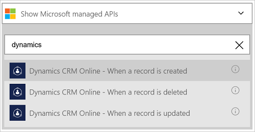
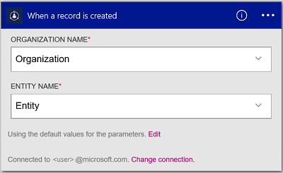

<properties
    pageTitle="Dynamics CRM Online 連接器加入邏輯應用程式 |Microsoft Azure"
    description="Azure 應用程式服務建立邏輯應用程式。 Dynamics CRM Online 連線提供者提供的 API 使用 Dynamics CRM Online 上的項目。"
    services="logic-apps"    
    documentationCenter=""     
    authors="MandiOhlinger"    
    manager="erikre"    
    editor="" 
    tags="connectors" />

<tags
ms.service="logic-apps"
ms.devlang="na"
ms.topic="article"
ms.tgt_pltfrm="na"
ms.workload="integration"
ms.date="08/15/2016"
ms.author="mandia"/>

# 開始使用 Dynamics CRM Online 連接器
連線到 Dynamics CRM Online 若要建立新的記錄，請更新項目，及其他內容。 使用 CRM Online，您可以︰

- 建立您的商務流程根據您收到 CRM Online 中的資料。 
- 使用動作的刪除記錄，取得實體，及其他內容。 這些動作獲得回應，然後再輸出可用的其他動作。 例如，當 CRM 中更新項目時，您可以傳送使用 Office 365 電子郵件。

本主題說明如何使用 Dynamics CRM Online 連接器邏輯應用程式中，也會列出引動程序和動作。

>[AZURE.NOTE] 此版本，請參閱適用於邏輯應用程式上市 (GA)。

若要進一步瞭解邏輯應用程式，請參閱[什麼是邏輯應用程式](../app-service-logic/app-service-logic-what-are-logic-apps.md)，並[建立邏輯應用程式](../app-service-logic/app-service-logic-create-a-logic-app.md)。

## 連線到 Dynamics CRM Online

邏輯應用程式可以存取任何服務之前，您先建立服務的*連線*。 一個連線提供邏輯應用程式與其他服務之間的連線。 例如，若要連線到 Dynamics，您必須 Dynamics CRM Online*連線*。 若要建立的連線，輸入您通常用來存取您要連線至服務的認證。 因此使用 Dynamics，輸入您 Dynamics CRM Online 建立連線的帳戶認證。

### 建立連線

>[AZURE.INCLUDE [Steps to create a connection to Dynamics CRM Online Connection Provider](../../includes/connectors-create-api-crmonline.md)]

## 使用引動程序

觸發程序是可以用來開始工作流程中的邏輯應用程式定義的事件。 觸發程序 「 投票 」 服務的間隔，您想要的頻率。 [深入瞭解引動程序](../app-service-logic/app-service-logic-what-are-logic-apps.md#logic-app-concepts)。

1. 中的邏輯應用程式中，輸入 「 dynamics 「 若要取得引動程序的清單︰  

    

2. 選取**Dynamics CRM Online-當您建立一筆記錄時**。 如果連線已經存在，然後選擇組織和實體從下拉式清單。

    

    如果系統提示您登入，然後輸入註冊建立連線的詳細資料。 [建立連線](connectors-create-api-crmonline.md#create-the-connection)本主題中列出的步驟。 

    > [AZURE.NOTE] 在此範例中，建立一筆記錄時，會執行邏輯應用程式。 若要查看此觸發程序的結果，新增其他電子郵件傳送給您的動作。 例如，新增您電子郵件時加入新記錄的 Office 365*傳送電子郵件*動作。 

3. 選取 [**編輯**] 按鈕並將 [**頻率**] 和 [**間隔**值。 例如，如果您想要觸發程序，以獲得每 15 分鐘，然後**分鐘**，設定**頻率**，並設定**間隔** **15**。 

    

4. **儲存**您的變更 （工具列的左上的角）。 邏輯應用程式儲存時，可能會自動啟用。

## 使用巨集指令

動作是在邏輯應用程式中定義工作流程所執行的作業。 [深入瞭解動作](../app-service-logic/app-service-logic-what-are-logic-apps.md#logic-app-concepts)。

1. 選取加號。 您看到幾個選擇︰**新增動作**]、 [**新增條件**]，或 [**更多**選項的其中一個。

    

2. 選擇 [**新增動作**]。

3. 在 [文字] 方塊中輸入 「 dynamics 」，取得清單的所有可用的動作。

    

4. 在此範例中，選擇 [ **Dynamics CRM Online-更新記錄**]。 如果連線已經存在，請選擇 [**組織名稱**、**實體名稱**及其他屬性︰  

    

    如果系統提示您的連線資訊，然後輸入詳細資料] 來建立的連線。 [建立連線](connectors-create-api-crmonline.md#create-the-connection)本主題中說明這些屬性。 

    > [AZURE.NOTE] 在此範例中，我們要更新現有 CRM Online 中的記錄。 您可以使用其他觸發程序的輸出更新記錄。 例如，新增 SharePoint*修改現有的項目時*的觸發程序。 然後加入 CRM Online*更新的記錄*的動作，以更新現有記錄 CRM Online 中的使用 SharePoint 欄位。 

5. **儲存**您的變更 （工具列的左上的角）。 邏輯應用程式儲存時，可能會自動啟用。

## 技術詳細資料

## 觸發程序

|觸發程序 | 描述|
|--- | ---|
|[建立一筆記錄的時機](connectors-create-api-crmonline.md#when-a-record-is-created)|CRM 中建立物件時，觸發程序的流程。|
|[更新記錄時](connectors-create-api-crmonline.md#when-a-record-is-updated)|在物件修改 CRM 中時，會觸發流程。|
|[在刪除記錄時](connectors-create-api-crmonline.md#when-a-record-is-deleted)|CRM 中刪除物件時，觸發程序的流程。|

## 動作

|巨集指令|描述|
|--- | ---|
|[清單記錄](connectors-create-api-crmonline.md#list-records)|這項作業取得實體的記錄。|
|[建立新的記錄](connectors-create-api-crmonline.md#create-a-new-record)|這項作業會建立新記錄的實體。|
|[取得記錄](connectors-create-api-crmonline.md#get-record)|這項作業取得實體指定的記錄。|
|[刪除記錄](connectors-create-api-crmonline.md#delete-a-record)|這項作業會刪除實體集合中的記錄。|
|[更新記錄](connectors-create-api-crmonline.md#update-a-record)|這項作業更新現有記錄的實體。|

### 觸發程序和動作的詳細資料

在 [此節]，查看每個觸發程序和巨集指令，包括任何必要或選擇性輸入的內容，以及任何對應的輸出連接器的相關特定詳細資料。

#### 建立一筆記錄的時機
CRM 中建立物件時，觸發程序的流程。 

|屬性名稱| 顯示名稱|描述|
| ---|---|---|
|資料集 *|組織名稱|例如 Contoso CRM 組織的名稱|
|表格 *|實體名稱|實體的名稱|
|$skip|略過次數|若要跳項目數 (預設 = 0)|
|$top|最大取得字數統計|若要取得的項目數目上限 (預設 = 256)|
|$filter|篩選查詢|ODATA 篩選查詢，來限制傳回的項目|
|$orderby|排序方式|針對指定的項目順序 ODATA orderBy 查詢|

星號 （*） 代表是必要的屬性。

##### 輸出詳細資料
ItemsList

| 屬性名稱 | 資料類型 |
|---|---|
|值|陣列|

#### 更新記錄時
在物件修改 CRM 中時，會觸發流程。 

|屬性名稱| 顯示名稱|描述|
| ---|---|---|
|資料集 *|組織名稱|例如 Contoso CRM 組織的名稱|
|表格 *|實體名稱|實體的名稱|
|$skip|略過次數|若要跳項目數 (預設 = 0)|
|$top|最大取得字數統計|若要取得的項目數目上限 (預設 = 256)|
|$filter|篩選查詢|ODATA 篩選查詢，來限制傳回的項目|
|$orderby|排序方式|針對指定的項目順序 ODATA orderBy 查詢|

星號 （*） 代表是必要的屬性。

##### 輸出詳細資料
ItemsList

| 屬性名稱 | 資料類型 |
|---|---|
|值|陣列|

#### 在刪除記錄時
CRM 中刪除物件時，觸發程序的流程。 

|屬性名稱| 顯示名稱|描述|
| ---|---|---|
|資料集 *|組織名稱|例如 Contoso CRM 組織的名稱|
|表格 *|實體名稱|實體的名稱|
|$skip|略過次數|若要跳項目數 (預設 = 0)|
|$top|最大取得字數統計|若要取得的項目數目上限 (預設 = 256)|
|$filter|篩選查詢|ODATA 篩選查詢，來限制傳回的項目|
|$orderby|排序方式|針對指定的項目順序 ODATA orderBy 查詢|

星號 （*） 代表是必要的屬性。

##### 輸出詳細資料
ItemsList

| 屬性名稱 | 資料類型 |
|---|---|
|值|陣列|

#### 清單記錄
這項作業取得實體的記錄。 

|屬性名稱| 顯示名稱|描述|
| ---|---|---|
|資料集 *|組織名稱|例如 Contoso CRM 組織的名稱|
|表格 *|實體名稱|實體的名稱|
|$skip|略過次數|若要跳項目數 (預設 = 0)|
|$top|最大取得字數統計|若要取得的項目數目上限 (預設 = 256)|
|$filter|篩選查詢|ODATA 篩選查詢，來限制傳回的項目|
|$orderby|排序方式|針對指定的項目順序 ODATA orderBy 查詢|

星號 （*） 代表是必要的屬性。

##### 輸出詳細資料
ItemsList

| 屬性名稱 | 資料類型 |
|---|---|
|值|陣列|

#### 建立新的記錄
這項作業會建立新記錄的實體。 

|屬性名稱| 顯示名稱|描述|
| ---|---|---|
|資料集 *|組織名稱|例如 Contoso CRM 組織的名稱|
|表格 *|實體名稱|實體的名稱|

星號 （*） 代表是必要的屬性。

##### 輸出詳細資料
無。

#### 取得記錄
這項作業取得實體指定的記錄。 

|屬性名稱| 顯示名稱|描述|
| ---|---|---|
|資料集 *|組織名稱|例如 Contoso CRM 組織的名稱|
|表格 *|實體名稱|實體的名稱|
|識別碼 *|項目識別碼|指定記錄識別碼|

星號 （*） 代表是必要的屬性。

##### 輸出詳細資料
無。

#### 刪除記錄
這項作業會刪除實體集合中的記錄。 

|屬性名稱| 顯示名稱|描述|
| ---|---|---|
|資料集 *|組織名稱|例如 Contoso CRM 組織的名稱|
|表格 *|實體名稱|實體的名稱|
|識別碼 *|項目識別碼|指定記錄識別碼|

星號 （*） 代表是必要的屬性。

#### 更新記錄
這項作業更新現有記錄的實體。 

|屬性名稱| 顯示名稱|描述|
| ---|---|---|
|資料集 *|組織名稱|例如 Contoso CRM 組織的名稱|
|表格 *|實體名稱|實體的名稱|
|識別碼 *|記錄識別碼|指定記錄識別碼|

星號 （*） 代表是必要的屬性。

##### 輸出詳細資料
無。

## HTTP 回應

動作和引動程序可以傳回一或多個下列 HTTP 狀態碼︰ 

|名稱|描述|
|---|---|
|200|[確定]|
|202|接受|
|400|錯誤的要求|
|401|未獲授權|
|403|禁止|
|404|找不到|
|500|內部伺服器錯誤。 未知錯誤。|
|預設值|作業失敗。|

## 後續步驟

[建立邏輯應用程式](../app-service-logic/app-service-logic-create-a-logic-app.md)。 瀏覽邏輯應用程式，在我們的[Api 清單](apis-list.md)中其他可用的連接器。

