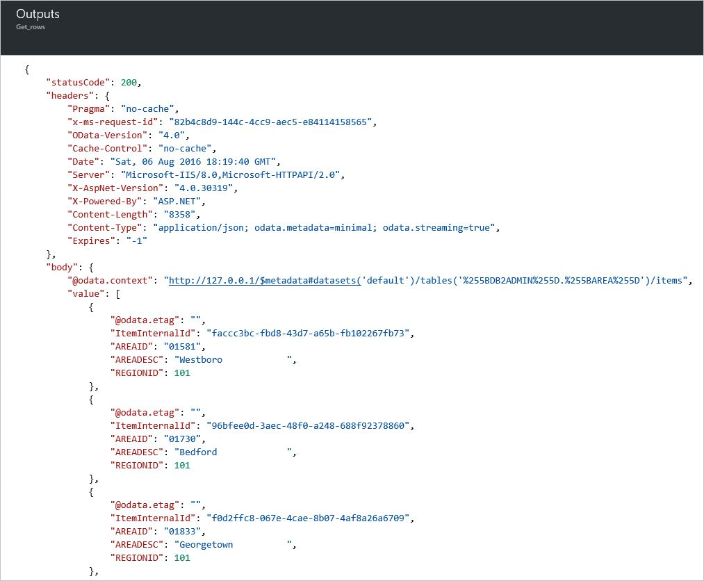
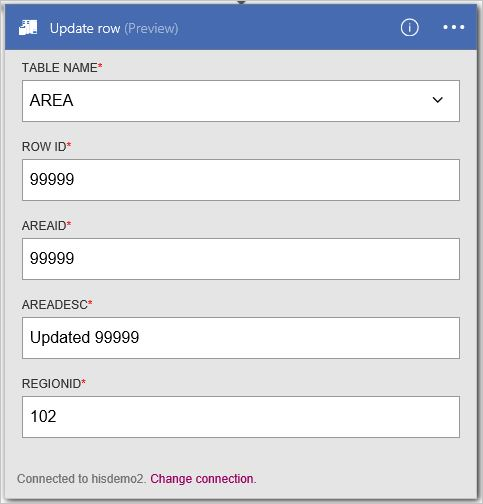
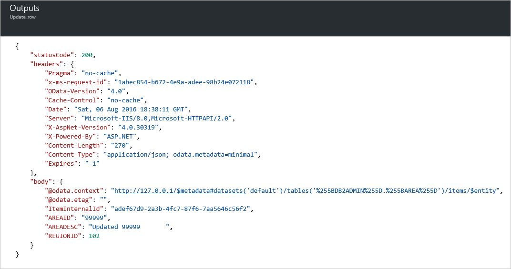
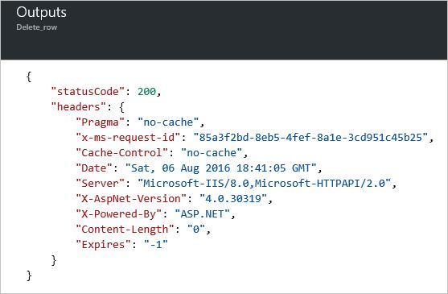

<properties
    pageTitle="邏輯應用程式中新增 DB2 連接器 |Microsoft Azure"
    description="REST API 參數 DB2 連接器的概觀"
    services=""
    documentationCenter="" 
    authors="gplarsen"
    manager="erikre"
    editor=""
    tags="connectors"/>

<tags
   ms.service="logic-apps"
   ms.devlang="na"
   ms.topic="article"
   ms.tgt_pltfrm="na"
   ms.workload="integration" 
   ms.date="09/26/2016"
   ms.author="plarsen"/>

# 快速入門 DB2 連接器
Microsoft DB2 連接器連接邏輯應用程式儲存在 IBM DB2 資料庫中的資源。 此連接器包含通訊與遠端 DB2 伺服器電腦 TCP/IP 網路上的 Microsoft 用戶端。 這包含雲端資料庫，例如 IBM Bluemix dashDB 或 Azure 虛擬化，在執行 Windows 版的 IBM DB2 和內部部署使用內部部署資料閘道器的資料庫。 請參閱[支援的清單](connectors-create-api-db2.md#supported-db2-platforms-and-versions)的 IBM DB2 平台與版本 （在本主題中）。

>[AZURE.NOTE] 此版本，請參閱適用於邏輯應用程式上市 (GA)。 

DB2 連接器支援下列的資料庫作業︰

- 清單資料庫表格
- 閱讀使用選取一個資料列
- 閱讀使用選取的所有資料列
- 新增使用插入一列
- 變更使用更新的一列
- 移除一列，使用 [刪除]

本主題說明如何使用程序的資料庫作業邏輯應用程式中的連接器。

若要進一步瞭解邏輯應用程式，請參閱[建立邏輯應用程式](../app-service-logic/app-service-logic-create-a-logic-app.md)。

## 可用的動作
DB2 連接器支援下列邏輯應用程式動作︰

- GetTables
- GetRow
- GetRows
- InsertRow
- UpdateRow
- DeleteRow

## 列出資料表
建立邏輯應用程式的任何作業組成許多透過 Microsoft Azure 入口網站執行的步驟。

邏輯應用程式，您可以新增巨集指令清單 DB2 資料庫中的資料表。 此動作會指示連接器，以處理 DB2 結構描述陳述式，例如`CALL SYSIBM.SQLTABLES`。

### 建立邏輯應用程式
1.  在 [ **Azure 開始區**，請選取 [ **+** （加號） **Web + Mobile**，然後**邏輯應用程式**。
2.  輸入**名稱**，例如`Db2getTables`，**訂閱**、**資源群組**、**位置**及**應用程式服務方案**。 選取 [**固定至儀表板**]，然後選取 [**建立**。

### 新增觸發程序和動作
1.  在**邏輯應用程式的設計工具**中，請在 [**範本**] 清單中選取**空白 LogicApp** 。
2.  在**引動程序**清單中，選取 [**週期性**]。 
3.  **循環**觸發程序，選取 [**編輯**]、 選取**頻率**下拉式清單選取**一天**，，然後設定要輸入 [ **7**] 的**間隔**。  
4.  選取 [ **+ 新步驟**] 方塊，然後選取 [**新增動作**。
5.  在 [**動作**] 清單中，輸入`db2`**搜尋更多動作]**中編輯] 方塊中，然後按一下**DB2-將資料表 （預覽版本）**。

      

6.  **DB2-將資料表**設定窗格中，選取 [啟用**透過內部部署資料閘道器的連線** **] 核取方塊**]。 請注意，從雲端變更為內部部署的設定。
    - **伺服器**]，在表單中的地址或別名冒號連接埠號碼中輸入值。 例如，輸入`ibmserver01:50000`。
    - **資料庫**中輸入值。 例如，輸入`nwind`。
    - 選取**驗證**的值。 例如，選取 [**基本**]。
    - 輸入**使用者名稱**的值。 例如，輸入`db2admin`。
    - 輸入**密碼**的值。 例如，輸入`Password1`。
    - 選取 [**閘道器**的 [值]。 例如，選取**datagateway01**。
7. 選取 [**建立**]，然後選取 [**儲存**]。 

    

8.  在**Db2getTables**刀，在 [**摘要**] 底下的**所有執行**清單中選取的第一列的項目 （最近執行）。
9.  在**執行的邏輯應用程式**刀中，選取 [**執行詳細資料**]。 在 [**動作**] 清單中，選取 [ **Get_tables**]。 哪些應是**成功**的**狀態**，查看的值。 選取**輸入連結**至檢視輸入值。 選取**輸出連結**，並檢視輸出;其中應該包含資料表的清單。

    

## 建立連線
此連接器支援資料庫裝載於內部部署和雲端使用下列的連線屬性中的連線。 

屬性 | 描述
--- | ---
伺服器 | 所需。 接受字串值，代表 TCP/IP 連接埠號碼 TCP/IP 地址或別名，IPv4 或 IPv6 格式後, 接 （以分號分隔）。 
資料庫 | 所需。 接受字串值，表示 DRDA 關聯式資料庫名稱 (RDBNAM)。 針對 z/OS DB2 接受 16 位元字串 （資料庫稱為 z/OS 位置 IBM DB2）。 針對 i5 中/OS DB2 接受 18 位元組字串 (資料庫稱為的 IBM DB2 i 關聯式資料庫)。 針對 LUW DB2 接受 8 位元組字串。
驗證 | 選用。 接受一個清單項目值，Basic 或 Windows (kerberos)。 
使用者名稱 | 所需。 接受字串值。 針對 z/OS DB2 接受 8 位元組字串。 DB2 的 i 接受 10 位元組字串。 Linux 或 UNIX DB2 接受 8 位元組字串。 Windows 版 DB2 接受 30 位元組字串。
密碼 | 所需。 接受字串值。
閘道器 | 所需。 接受清單項目值，代表定義邏輯應用程式儲存群組內的內部部署資料閘道器。  

## 建立內部部署閘道器的連線
此連接器可以存取使用內部部署閘道器的內部部署 DB2 資料庫。 請參閱閘道器主題，如需詳細資訊。 

1. 在 [**閘道器**組態] 窗格中，選取 [啟用**透過閘道器的連線** **] 核取方塊**]。 請注意，從雲端變更為內部部署的設定。
2. **伺服器**]，在表單中的地址或別名冒號連接埠號碼中輸入值。 例如，輸入`ibmserver01:50000`。
3. **資料庫**中輸入值。 例如，輸入`nwind`。
4. 選取**驗證**的值。 例如，選取 [**基本**]。
5. 輸入**使用者名稱**的值。 例如，輸入`db2admin`。
6. 輸入**密碼**的值。 例如，輸入`Password1`。
7. 選取 [**閘道器**的 [值]。 例如，選取**datagateway01**。
8. 選取 [**建立**]，繼續]。 

    

## 建立雲端的連線
此連接器可以存取雲端 DB2 資料庫。 

1. 在 [**閘道器**組態] 窗格中，[離開**] 核取方塊**停用 （未按之）**透過閘道器的連線**。 
2. 輸入**連線名稱**值。 例如，輸入`hisdemo2`。
3. 針對**DB2 伺服器名稱**，請在表單中的地址或別名冒號連接埠號碼中輸入值。 例如，輸入`hisdemo2.cloudapp.net:50000`。
3. 輸入**DB2 資料庫名稱**值。 例如，輸入`nwind`。
4. 輸入**使用者名稱**的值。 例如，輸入`db2admin`。
5. 輸入**密碼**的值。 例如，輸入`Password1`。
6. 選取 [**建立**]，繼續]。 

    

## 擷取使用選取的所有資料列
您可以定義邏輯的應用程式動作擷取 DB2 表格中的所有資料列。 這會指示連接器，以處理程序 DB2 SELECT 陳述式，例如`SELECT * FROM AREA`。

### 建立邏輯應用程式
1.  在 [ **Azure 開始區**，請選取 [ **+** （加號） **Web + Mobile**，然後**邏輯應用程式**。
2.  輸入**名稱**，例如`Db2getRows`，**訂閱**、**資源群組**、**位置**及**應用程式服務方案**。 選取 [**固定至儀表板**]，然後選取 [**建立**。

### 新增觸發程序和動作
1.  在**邏輯應用程式的設計工具**中，請在 [**範本**] 清單中選取**空白 LogicApp** 。
2.  在**引動程序**清單中，選取 [**週期性**]。 
3.  **循環**觸發程序中選取 [**編輯**]、 選取**頻率**下拉式清單選取**一天**，，然後選取的**間隔**輸入 [ **7**]。 
4.  選取 [ **+ 新步驟**] 方塊，然後選取 [**新增動作**。
5.  在 [**動作**] 清單中，輸入`db2`**搜尋更多動作]**中編輯] 方塊中，然後按一下**DB2-取得資料列 （預覽版本）**。
6. 在 [**取得資料列 （預覽版本）**的指令，選取 [**變更連線**]。
7. 在 [**連線**設定] 窗格中，選取 [**建立新**。 

    
  
8. 在 [**閘道器**組態] 窗格中，[離開**] 核取方塊**停用 （未按之）**透過閘道器的連線**。
    - 輸入**連線名稱**值。 例如，輸入`HISDEMO2`。
    - 針對**DB2 伺服器名稱**，請在表單中的地址或別名冒號連接埠號碼中輸入值。 例如，輸入`HISDEMO2.cloudapp.net:50000`。
    - 輸入**DB2 資料庫名稱**值。 例如，輸入`NWIND`。
    - 輸入**使用者名稱**的值。 例如，輸入`db2admin`。
    - 輸入**密碼**的值。 例如，輸入`Password1`。
9. 選取 [**建立**]，繼續]。

    

10. 在 [**表格名稱**] 清單中，選取**向下箭號**，然後選取**區域**。
11. 您也可以選取 [**顯示進階選項]** ，若要指定查詢選項]。
12. 選取 [**儲存**]。 

    

13. 在**Db2getRows**刀，在 [**摘要**] 底下的**所有執行**清單中選取的第一列的項目 （最近執行）。
14. 在**執行的邏輯應用程式**刀中，選取 [**執行詳細資料**]。 在 [**動作**] 清單中，選取 [ **Get_rows**]。 哪些應是**成功**的**狀態**，查看的值。 選取**輸入連結**至檢視輸入值。 選取**輸出連結**，並檢視輸出;其中應該包含列的清單。

    

## 新增使用插入一列
您可以定義邏輯的應用程式動作 DB2 表格中新增一列。 這個動作會指示連接器，以處理 DB2 插入陳述式，例如`INSERT INTO AREA (AREAID, AREADESC, REGIONID) VALUES ('99999', 'Area 99999', 102)`。

### 建立邏輯應用程式
1.  在 [ **Azure 開始區**，請選取 [ **+** （加號） **Web + Mobile**，然後**邏輯應用程式**。
2.  輸入**名稱**，例如`Db2insertRow`，**訂閱**、**資源群組**、**位置**及**應用程式服務方案**。 選取 [**固定至儀表板**]，然後選取 [**建立**。

### 新增觸發程序和動作
1.  在**邏輯應用程式的設計工具**中，請在 [**範本**] 清單中選取**空白 LogicApp** 。
2.  在**引動程序**清單中，選取 [**週期性**]。 
3.  **循環**觸發程序中選取 [**編輯**]、 選取**頻率**下拉式清單選取**一天**，，然後選取的**間隔**輸入 [ **7**]。 
4.  選取 [ **+ 新步驟**] 方塊，然後選取 [**新增動作**。
5.  在 [**動作**] 清單中，**尋找更多動作]**編輯在方塊中，輸入**db2** ，然後選取**DB2-插入列 （預覽版本）**。
6. 在 [**取得資料列 （預覽版本）**的指令，選取 [**變更連線**]。 
7. 在 [**連線**設定] 窗格中，選取 [連線]。 例如，選取**hisdemo2**。

    

8. 在 [**表格名稱**] 清單中，選取**向下箭號**，然後選取**區域**。
9. 輸入所有必要的欄 （請參閱的紅色星號） 的值。 例如，輸入`99999` **AREAID**，輸入`Area 99999`，然後輸入`102` **REGIONID**的。 
10. 選取 [**儲存**]。

    
 
11. 在**Db2insertRow**刀，在 [**摘要**] 底下的**所有執行**清單中選取的第一列的項目 （最近執行）。
12. 在**執行的邏輯應用程式**刀中，選取 [**執行詳細資料**]。 在 [**動作**] 清單中，選取 [ **Get_rows**]。 哪些應是**成功**的**狀態**，查看的值。 選取**輸入連結**至檢視輸入值。 選取**輸出連結**，並檢視輸出;應該包括新的資料列。

    

## 使用選取擷取一個資料列
您可以定義邏輯應用程式動作來擷取 DB2 表格中的一列。 這個動作會指示連接器，以處理 DB2 位置選取陳述式，例如`SELECT FROM AREA WHERE AREAID = '99999'`。

### 建立邏輯應用程式
1.  在 [ **Azure 開始區**，請選取 [ **+** （加號） **Web + Mobile**，然後**邏輯應用程式**。
2.  輸入**名稱**(例如 「**Db2getRow**」)、**訂閱**、**資源群組**、**位置**及**應用程式服務方案**。 選取 [**固定至儀表板**]，然後選取 [**建立**。

### 新增觸發程序和動作
1.  在**邏輯應用程式的設計工具**中，請在 [**範本**] 清單中選取**空白 LogicApp** 。 
2.  在**引動程序**清單中，選取 [**週期性**]。 
3.  **循環**觸發程序中選取 [**編輯**]、 選取**頻率**下拉式清單選取**一天**，，然後選取的**間隔**輸入 [ **7**]。 
4.  選取 [ **+ 新步驟**] 方塊，然後選取 [**新增動作**。
5.  在 [**動作**] 清單中，**尋找更多動作]**編輯在方塊中，輸入**db2** ，然後選取**DB2-取得資料列 （預覽版本）**。
6. 在 [**取得資料列 （預覽版本）**的指令，選取 [**變更連線**]。 
7. 在 [**連線**的設定] 窗格中，選取 [現有連線]。 例如，選取**hisdemo2**。

    

8. 在 [**表格名稱**] 清單中，選取**向下箭號**，然後選取**區域**。
9. 輸入所有必要的欄 （請參閱的紅色星號） 的值。 例如，輸入`99999` **AREAID**的。 
10. 您也可以選取 [**顯示進階選項]** ，若要指定查詢選項]。
11. 選取 [**儲存**]。 

    

12. 在**Db2getRow**刀，在 [**摘要**] 底下的**所有執行**清單中選取的第一列的項目 （最近執行）。
13. 在**執行的邏輯應用程式**刀中，選取 [**執行詳細資料**]。 在 [**動作**] 清單中，選取 [ **Get_rows**]。 哪些應是**成功**的**狀態**，查看的值。 選取**輸入連結**至檢視輸入值。 選取**輸出連結**，並檢視輸出;其中應該包含資料列。

    

## 變更使用更新的一列
您可以定義邏輯的應用程式動作變更 DB2 表格中的一列。 這個動作會指示連接器，以處理 DB2 UPDATE 陳述式，例如`UPDATE AREA SET AREAID = '99999', AREADESC = 'Area 99999', REGIONID = 102)`。

### 建立邏輯應用程式
1.  在 [ **Azure 開始區**，請選取 [ **+** （加號） **Web + Mobile**，然後**邏輯應用程式**。
2.  輸入**名稱**，例如`Db2updateRow`，**訂閱**、**資源群組**、**位置**及**應用程式服務方案**。 選取 [**固定至儀表板**]，然後選取 [**建立**。

### 新增觸發程序和動作
1.  在**邏輯應用程式的設計工具**中，請在 [**範本**] 清單中選取**空白 LogicApp** 。
2.  在**引動程序**清單中，選取 [**週期性**]。 
3.  **循環**觸發程序中選取 [**編輯**]、 選取**頻率**下拉式清單選取**一天**，，然後選取的**間隔**輸入 [ **7**]。 
4.  選取 [ **+ 新步驟**] 方塊，然後選取 [**新增動作**。
5.  在 [**動作**] 清單中，輸入**db2** **搜尋更多動作]**編輯在] 方塊中，然後選取**DB2-更新列 （預覽版本）**。
6. 在 [**取得資料列 （預覽版本）**的指令，選取 [**變更連線**]。 
7. 在 [**連線**的設定] 窗格中，選取若要選取現有的連線。 例如，選取**hisdemo2**。

    

8. 在 [**表格名稱**] 清單中，選取**向下箭號**，然後選取**區域**。
9. 輸入所有必要的欄 （請參閱的紅色星號） 的值。 例如，輸入`99999` **AREAID**，輸入`Updated 99999`，然後輸入`102` **REGIONID**的。 
10. 選取 [**儲存**]。 

    

11. 在**Db2updateRow**刀，在 [**摘要**] 底下的**所有執行**清單中選取的第一列的項目 （最近執行）。
12. 在**執行的邏輯應用程式**刀中，選取 [**執行詳細資料**]。 在 [**動作**] 清單中，選取 [ **Get_rows**]。 哪些應是**成功**的**狀態**，查看的值。 選取**輸入連結**至檢視輸入值。 選取**輸出連結**，並檢視輸出;應該包括新的資料列。

    

## 移除一列，使用 [刪除]
您可以定義邏輯的應用程式動作移除 DB2 表格中的一列。 這個動作會指示連接器，以處理 DB2 刪除陳述式，例如`DELETE FROM AREA WHERE AREAID = '99999'`。

### 建立邏輯應用程式
1.  在 [ **Azure 開始區**，請選取 [ **+** （加號） **Web + Mobile**，然後**邏輯應用程式**。
2.  輸入**名稱**，例如`Db2deleteRow`，**訂閱**、**資源群組**、**位置**及**應用程式服務方案**。 選取 [**固定至儀表板**]，然後選取 [**建立**。

### 新增觸發程序和動作
1.  在**邏輯應用程式的設計工具**中，請在 [**範本**] 清單中選取**空白 LogicApp** 。 
2.  在**引動程序**清單中，選取 [**週期性**]。 
3.  **循環**觸發程序中選取 [**編輯**]、 選取**頻率**下拉式清單選取**一天**，，然後選取的**間隔**輸入 [ **7**]。 
4.  選取 [ **+ 新步驟**] 方塊，然後選取 [**新增動作**。
5.  在 [**動作**] 清單中，選取**db2**在 [**搜尋更多動作]**編輯] 方塊，然後選取**DB2-刪除列 （預覽版本）**。
6. 在 [**取得資料列 （預覽版本）**的指令，選取 [**變更連線**]。 
7. 在 [**連線**的設定] 窗格中，選取 [現有連線]。 例如，選取**hisdemo2**。

    

8. 在 [**表格名稱**] 清單中，選取**向下箭號**，然後選取**區域**。
9. 輸入所有必要的欄 （請參閱的紅色星號） 的值。 例如，輸入`99999` **AREAID**的。 
10. 選取 [**儲存**]。 

    

11. 在**Db2deleteRow**刀，在 [**摘要**] 底下的**所有執行**清單中選取的第一列的項目 （最近執行）。
12. 在**執行的邏輯應用程式**刀中，選取 [**執行詳細資料**]。 在 [**動作**] 清單中，選取 [ **Get_rows**]。 哪些應是**成功**的**狀態**，查看的值。 選取**輸入連結**至檢視輸入值。 選取**輸出連結**，並檢視輸出;應該包括刪除的列。

    

## 技術詳細資料

## 動作
動作是在邏輯應用程式中定義工作流程所執行的作業。 DB2 資料庫連接器包含下列的動作。 

|巨集指令|描述|
|--- | ---|
|[GetRow](connectors-create-api-db2.md#get-row)|從 DB2 表格中擷取單一資料列|
|[GetRows](connectors-create-api-db2.md#get-rows)|從 DB2 資料表擷取資料列|
|[InsertRow](connectors-create-api-db2.md#insert-row)|DB2 表格中插入新列|
|[DeleteRow](connectors-create-api-db2.md#delete-row)|從 DB2 資料表刪除列|
|[GetTables](connectors-create-api-db2.md#get-tables)|從 DB2 資料庫中擷取資料表|
|[UpdateRow](connectors-create-api-db2.md#update-row)|更新現有的資料列 DB2 表格中|

### 動作的詳細資料

在 [此節]，查看特定每個動作，包括任何必要或選擇性輸入的內容，以及任何對應的輸出連接器的相關詳細資料。

#### 取得資料列 
從 DB2 資料表擷取單一資料列。  

| 屬性名稱| 顯示名稱 |描述|
| ---|---|---|
|表格 * | 資料表名稱 |DB2 資料表的名稱|
|識別碼 * | 資料列識別碼 |要擷取的資料列的唯一識別碼|

星號 （*） 代表是必要的屬性。

##### 輸出詳細資料
項目

| 屬性名稱 | 資料類型 |
|---|---|
|ItemInternalId|字串|

#### 取得資料列 
從 DB2 資料表擷取資料列。  

|屬性名稱| 顯示名稱|描述|
| ---|---|---|
|表格 *|資料表名稱|DB2 資料表的名稱|
|$skip|略過次數|若要跳項目數 (預設 = 0)|
|$top|最大取得字數統計|若要擷取的項目數目上限 (預設 = 256)|
|$filter|篩選查詢|若要限制的項目數 ODATA 篩選查詢|
|$orderby|排序方式|針對指定的項目順序 ODATA orderBy 查詢|

星號 （*） 代表是必要的屬性。

##### 輸出詳細資料
ItemsList

| 屬性名稱 | 資料類型 |
|---|---|
|值|陣列|

#### 插入列 
DB2 表格中插入新的資料列。  

|屬性名稱| 顯示名稱|描述|
| ---|---|---|
|表格 *|資料表名稱|DB2 資料表的名稱|
|項目 *|資料列|若要插入 DB2 中指定之資料表的資料列|

星號 （*） 代表是必要的屬性。

##### 輸出詳細資料
項目

| 屬性名稱 | 資料類型 |
|---|---|
|ItemInternalId|字串|

#### 刪除列 
移除 DB2 表格中的列。  

|屬性名稱| 顯示名稱|描述|
| ---|---|---|
|表格 *|資料表名稱|DB2 資料表的名稱|
|識別碼 *|資料列識別碼|若要刪除的資料列的唯一識別碼|

星號 （*） 代表是必要的屬性。

##### 輸出詳細資料
無。

#### 將資料表 
從 DB2 資料庫擷取資料表。  

沒有這個呼叫參數。 

##### 輸出詳細資料 
TablesList

| 屬性名稱 | 資料類型 |
|---|---|
|值|陣列|

#### 更新資料列 
更新現有的資料列 DB2 表格中。  

|屬性名稱| 顯示名稱|描述|
| ---|---|---|
|表格 *|資料表名稱|DB2 資料表的名稱|
|識別碼 *|資料列識別碼|若要更新的資料列的唯一識別碼|
|項目 *|資料列|更新值的資料列|

星號 （*） 代表是必要的屬性。

##### 輸出詳細資料  
項目

| 屬性名稱 | 資料類型 |
|---|---|
|ItemInternalId|字串|

### HTTP 回應

以不同的行動電話時，您可能會收到特定的回應。 下表列出回應和其說明︰  

|名稱|描述|
|---|---|
|200|[確定]|
|202|接受|
|400|錯誤的要求|
|401|未獲授權|
|403|禁止|
|404|找不到|
|500|內部伺服器錯誤。 發生未知的錯誤|
|預設值|作業失敗。|

## 支援 DB2 平台與版本
此連接器支援下列 IBM DB2 平台與版本，以及 IBM DB2 相容產品 (例如 IBM Bluemix dashDB) 支援分散式關聯式資料庫結構 (DRDA) SQL 存取管理員 (SQLAM) 版本 10 和 11:

- IBM DB2 的 z OS 11.1
- IBM DB2 的 z OS 10.1
- IBM DB2 的 i 7.3
- IBM DB2 的 i 7.2
- IBM DB2 的 i 7.1
- IBM DB2 LUW 11
- IBM DB2 的 LUW 10.5

## 後續步驟

[建立邏輯應用程式](../app-service-logic/app-service-logic-create-a-logic-app.md)。 瀏覽邏輯應用程式，在我們的[Api 清單](apis-list.md)中其他可用的連接器。

