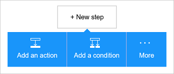

<properties
    pageTitle="在您的邏輯應用程式新增 Office 365 Outlook connector |Microsoft Azure"
    description="建立 Office 365 與 Office 365 互動的連接器邏輯應用程式。 例如︰ 建立、 編輯和更新連絡人與行事曆項目。"
    services=""    
    documentationCenter=""     
    authors="MandiOhlinger"    
    manager="anneta"    
    editor="" 
    tags="connectors" />

<tags
ms.service="logic-apps"
ms.devlang="na"
ms.topic="article"
ms.tgt_pltfrm="na"
ms.workload="integration"
ms.date="10/18/2016"
ms.author="mandia"/>

# 開始使用 Office 365 Outlook connector 

Office 365 Outlook connector 可以與 Office 365 中的 Outlook 之間的互動。 您可以使用此連接器來建立、 編輯和更新連絡人和行事曆項目，並也可以取得、 傳送，及回覆電子郵件。

使用 Office 365 Outlook，您︰

- 建立您的工作流程使用 Office 365 中的 [電子郵件和行事曆] 功能。 
- 使用引動程序有新的電子郵件，當更新的行事曆項目時，及其他內容時，啟動您的工作流程。
- 若要傳送電子郵件，請建立一個新的行事曆事件，以及其他使用動作。 例如，當 Salesforce （觸發程序） 中有新的物件時，傳送電子郵件至 Office 365 Outlook （動作）。 

本主題說明如何使用 Office 365 Outlook connector 邏輯應用程式中，也會列出引動程序和動作。

>[AZURE.NOTE] 此版本，請參閱適用於邏輯應用程式上市 (GA)。

若要進一步瞭解邏輯應用程式，請參閱[什麼是邏輯應用程式](../app-service-logic/app-service-logic-what-are-logic-apps.md)，並[建立邏輯應用程式](../app-service-logic/app-service-logic-create-a-logic-app.md)。

## 連線至 Office 365

邏輯應用程式可以存取任何服務之前，您先建立服務的*連線*。 一個連線提供邏輯應用程式與其他服務之間的連線。 例如，若要連線至 Office 365 Outlook，您必須*連線*至 Office 365。 若要建立的連線，輸入您通常用來存取您要連線至服務的認證。 因此，使用 Office 365 Outlook，請到您的 Office 365 帳戶，才能建立連線輸入認證。

## 建立連線

>[AZURE.INCLUDE [Steps to create a connection to Office 365](../../includes/connectors-create-api-office365-outlook.md)]

## 使用引動程序

觸發程序是可以用來開始工作流程中的邏輯應用程式定義的事件。 觸發程序 「 投票 」 服務的間隔，您想要的頻率。 [深入瞭解引動程序](../app-service-logic/app-service-logic-what-are-logic-apps.md#logic-app-concepts)。

1. 在邏輯應用程式中，輸入 「 office 365 」 取得引動程序的清單︰  

    

2. 選取**Office 365 Outlook-即將發生的事件會立即啟動時**。 如果連線已經存在，然後從下拉式清單選取行事曆。

    

    如果系統提示您登入，然後輸入註冊建立連線的詳細資料。 [建立連線](connectors-create-api-office365-outlook.md#create-the-connection)本主題中列出的步驟。 

    > [AZURE.NOTE] 在此範例中，更新行事曆事件時，會執行的邏輯應用程式。 若要查看此觸發程序的結果，新增另一個傳送簡訊給您的動作。 例如，新增該文字 Twilio*傳送郵件*的動作時開始在 15 分鐘行事曆事件。 

3. 選取 [**編輯**] 按鈕，然後將 [**頻率**] 和 [**間隔**值]。 例如，如果您想要觸發程序，以獲得每 15 分鐘，然後**分鐘**，設定**頻率**，並設定**間隔** **15**。 

    

4. **儲存**您的變更 （工具列的左上的角）。 邏輯應用程式儲存時，可能會自動啟用。

## 使用巨集指令

動作是在邏輯應用程式中定義工作流程所執行的作業。 [深入瞭解動作](../app-service-logic/app-service-logic-what-are-logic-apps.md#logic-app-concepts)。

1. 選取加號。 您看到幾個選擇︰**新增動作**]、 [**新增條件**]，或 [**更多**選項的其中一個。

    

2. 選擇 [**新增動作**]。

3. 在 [文字] 方塊中，輸入 「 office 365 」 的所有可用的動作。

     

4. 在此範例中，選擇 [ **Office 365 Outlook-建立連絡人**]。 如果連線已經存在，請選擇 [**資料夾識別碼**、**指定名稱**及其他屬性︰  

    

    如果系統提示您的連線資訊，然後輸入詳細資料] 來建立的連線。 [建立連線](connectors-create-api-office365-outlook.md#create-the-connection)本主題中說明這些屬性。 

    > [AZURE.NOTE] 在此範例中，我們建立 Office 365 在 Outlook 中的新連絡人。 若要建立連絡人，您可以使用其他觸發程序的輸出。 例如，新增 SalesForce*物件建立時*觸發程序。 然後新增至 Office 365 中建立新的新連絡人會使用 SalesForce 欄位的 Office 365 Outlook*建立連絡人*動作。 

5. **儲存**您的變更 （工具列的左上的角）。 邏輯應用程式會儲存，而將自動啟用。

## 技術詳細資料

以下是有關引動程序、 動作和回應此連線支援的詳細資料︰

## Office 365 引動程序

|觸發程序 | 描述|
|--- | ---|
|[當即將發生的事件會開始](connectors-create-api-office365-outlook.md#when-an-upcoming-event-is-starting-soon)|啟動即將來臨的行事曆事件時，這項作業會觸發流程。|
|[新的電子郵件送達時](connectors-create-api-office365-outlook.md#when-a-new-email-arrives)|這項作業在新的電子郵件送達時，觸發程序的流程|
|[建立新的事件時](connectors-create-api-office365-outlook.md#when-a-new-event-is-created)|在行事曆中建立新的事件時，這項作業會觸發流程。|
|[修改事件](connectors-create-api-office365-outlook.md#when-an-event-is-modified)|行事曆] 中修改事件時，這項作業觸發程序的流程。|

## Office 365 的動作

|巨集指令|描述|
|--- | ---|
|[取得電子郵件](connectors-create-api-office365-outlook.md#get-emails)|這項作業取得電子郵件資料夾中。|
|[傳送電子郵件](connectors-create-api-office365-outlook.md#send-an-email)|這項作業傳送電子郵件訊息。|
|[刪除電子郵件](connectors-create-api-office365-outlook.md#delete-email)|這項作業會刪除電子郵件的識別碼。|
|[標示為已讀取](connectors-create-api-office365-outlook.md#mark-as-read)|這項作業標記為已讀取電子郵件。|
|[回覆電子郵件](connectors-create-api-office365-outlook.md#reply-to-email)|這項作業回覆電子郵件。|
|[取得附件](connectors-create-api-office365-outlook.md#get-attachment)|這項作業取得電子郵件附件的識別碼。|
|[傳送電子郵件選項](connectors-create-api-office365-outlook.md#send-email-with-options)|這項作業會傳送電子郵件的多個選項，並等待 [收件者使用其中一個選項來回應。|
|[「 核准 」 電子郵件傳送](connectors-create-api-office365-outlook.md#send-approval-email)|這項作業傳送 「 核准 」 電子郵件，並等待 [收件者的回應。|
|[取得行事曆](connectors-create-api-office365-outlook.md#get-calendars)|這項作業會列出可用的行事曆。|
|[取得事件](connectors-create-api-office365-outlook.md#get-events)|這項作業取得行事曆事件。|
|[建立事件](connectors-create-api-office365-outlook.md#create-event)|這項作業會建立新的事件行事曆] 中。|
|[取得事件](connectors-create-api-office365-outlook.md#get-event)|這項作業會取得特定的事件，從 [行事曆。|
|[刪除事件](connectors-create-api-office365-outlook.md#delete-event)|這項作業會刪除行事曆] 中的事件。|
|[更新事件](connectors-create-api-office365-outlook.md#update-event)|這項作業更新行事曆事件。|
|[取得連絡人資料夾](connectors-create-api-office365-outlook.md#get-contact-folders)|這項作業會列出可用的連絡人資料夾。|
|[取得連絡人](connectors-create-api-office365-outlook.md#get-contacts)|這項作業從 [連絡人] 資料夾中取得連絡人。|
|[建立連絡人](connectors-create-api-office365-outlook.md#create-contact)|這項作業會建立新連絡人的連絡人資料夾中。|
|[取得連絡人](connectors-create-api-office365-outlook.md#get-contact)|這項作業會取得特定連絡人從連絡人資料夾。|
|[刪除連絡人](connectors-create-api-office365-outlook.md#delete-contact)|這項作業從 [連絡人] 資料夾中刪除連絡人。|
|[更新連絡人](connectors-create-api-office365-outlook.md#update-contact)|這項作業更新連絡人資料夾中的連絡人。|

### 觸發程序和動作的詳細資料

在 [此節]，查看每個觸發程序和巨集指令，包括任何必要或選擇性輸入的內容，以及任何對應的輸出連接器的相關特定詳細資料。

#### 當即將發生的事件會開始
啟動即將來臨的行事曆事件時，這項作業會觸發流程。 

|屬性名稱| 顯示名稱|描述|
| ---|---|---|
|表格 *|行事曆識別碼|行事曆的唯一識別碼|
|lookAheadTimeInMinutes|外觀預先時間|若要繼續進行尋找即將到來的事件時間 （以分鐘為單位）|

星號 （*） 代表是必要的屬性。

##### 輸出詳細資料
CalendarItemsList︰ 行事曆項目清單

| 屬性名稱 | 資料類型 | 描述 |
|---|---|---|
|值|陣列|行事曆項目清單|

#### 取得電子郵件
這項作業取得電子郵件資料夾中。 

|屬性名稱| 顯示名稱|描述|
| ---|---|---|
|folderPath|資料夾的路徑|若要擷取的電子郵件] 資料夾的路徑 (預設: 「 收件匣])|
|頁首|頁首|若要擷取的電子郵件的數字 (預設︰ 10)|
|fetchOnlyUnread|擷取未讀取的郵件|擷取未讀取的電子郵件？|
|includeAttachments|包含附件|如果設為 true，附件也會擷取以及電子郵件|
|searchQuery|搜尋查詢|若要篩選的電子郵件的搜尋查詢|
|略過|略過|若要跳過的電子郵件的數字 (預設︰ 0)|
|skipToken|略過權杖|跳至擷取新頁面的權杖|

星號 （*） 代表是必要的屬性。

##### 輸出詳細資料
ReceiveMessage︰ 收到電子郵件訊息

| 屬性名稱 | 資料類型 | 描述 |
|---|---|---|
|從|字串|從|
|若要|字串|若要|
|主旨|字串|主旨|
|本文|字串|本文|
|重要性|字串|重要性|
|HasAttachment|布林值|包含附件|
|識別碼|字串|郵件識別碼|
|IsRead|布林值|為唯讀|
|DateTimeReceived|字串|收到日期時間|
|附件|陣列|附件|
|副本|字串|指定電子郵件地址，並以分號等someone@contoso.com|
|密件副本|字串|指定電子郵件地址，並以分號等someone@contoso.com|
|IsHtml|布林值|為 Html|

#### 傳送電子郵件
這項作業傳送電子郵件訊息。 

|屬性名稱| 顯示名稱|描述|
| ---|---|---|
|emailMessage *|電子郵件|電子郵件|

星號 （*） 代表是必要的屬性。

##### 輸出詳細資料
無。

#### 刪除電子郵件
這項作業會刪除電子郵件的識別碼。 

|屬性名稱| 顯示名稱|描述|
| ---|---|---|
|訊息 *|郵件識別碼|若要刪除的電子郵件的識別碼|

星號 （*） 代表是必要的屬性。

##### 輸出詳細資料
無。

#### 標示為已讀取
這項作業標記為已讀取電子郵件。 

|屬性名稱| 顯示名稱|描述|
| ---|---|---|
|訊息 *|郵件識別碼|讀取電子郵件標示為 id|

星號 （*） 代表是必要的屬性。

##### 輸出詳細資料
無。

#### 回覆電子郵件
這項作業回覆電子郵件。 

|屬性名稱| 顯示名稱|描述|
| ---|---|---|
|訊息 *|郵件識別碼|若要回覆電子郵件的識別碼|
|註解 *|註解|回覆註解|
|有|全部回覆|回覆給所有收件者|

星號 （*） 代表是必要的屬性。

##### 輸出詳細資料
無。

#### 取得附件
這項作業取得電子郵件附件的識別碼。 

|屬性名稱| 顯示名稱|描述|
| ---|---|---|
|訊息 *|郵件識別碼|電子郵件的識別碼|
|attachmentId *|附件識別碼|若要下載附件的識別碼|

星號 （*） 代表是必要的屬性。

##### 輸出詳細資料
無。

#### 新的電子郵件送達時
新的電子郵件送達時，這項作業觸發程序的流程。

|屬性名稱| 顯示名稱|描述|
| ---|---|---|
|folderPath|資料夾的路徑|若要擷取的 [郵件] 資料夾 (預設︰ 收件匣)|
|若要|若要|收件者的電子郵件地址|
|從|從|從位址|
|重要性|重要性|（[高]、 [標準模式]，[低） 的電子郵件的重要性 (預設︰ 標準模式)|
|fetchOnlyWithAttachment|包含附件|擷取含有附件的電子郵件|
|includeAttachments|包含附件|包含附件|
|subjectFilter|主旨篩選|若要尋找主旨中的字串|

星號 （*） 代表是必要的屬性。

##### 輸出詳細資料
TriggerBatchResponse [ReceiveMessage]

| 屬性名稱 | 資料類型 |
|---|---|
|值|陣列|

#### 傳送電子郵件選項
這項作業會傳送電子郵件的多個選項，並等待 [收件者使用其中一個選項來回應。 

|屬性名稱| 顯示名稱|描述|
| ---|---|---|
|optionsEmailSubscription *|訂閱要求選項電子郵件|訂閱要求選項電子郵件|

星號 （*） 代表是必要的屬性。

##### 輸出詳細資料
「 核准 」 電子郵件訂閱 SubscriptionResponse︰ 模型

| 屬性名稱 | 資料類型 | 描述 |
|---|---|---|
|識別碼|字串|訂閱的識別碼|
|資源|字串|訂閱要求的資源|
|notificationType|字串|通知類型|
|notificationUrl|字串|通知 Url|

#### 「 核准 」 電子郵件傳送
這項作業傳送 「 核准 」 電子郵件，並等待 [收件者的回應。 

|屬性名稱| 顯示名稱|描述|
| ---|---|---|
|approvalEmailSubscription *|訂閱要求核准的電子郵件|訂閱要求核准的電子郵件|

星號 （*） 代表是必要的屬性。

##### 輸出詳細資料
「 核准 」 電子郵件訂閱 SubscriptionResponse︰ 模型

| 屬性名稱 | 資料類型 | 描述 |
|---|---|---|
|識別碼|字串|訂閱的識別碼|
|資源|字串|訂閱要求的資源|
|notificationType|字串|通知類型|
|notificationUrl|字串|通知 Url|

#### 取得行事曆
這項作業會列出可用的行事曆。 

沒有這個呼叫參數。

##### 輸出詳細資料
TablesList

| 屬性名稱 | 資料類型 |
|---|---|
|值|陣列|

#### 取得事件
這項作業取得行事曆事件。 

|屬性名稱| 顯示名稱|描述|
| ---|---|---|
|表格 *|行事曆識別碼|選取行事曆|
|$filter|篩選查詢|ODATA 篩選查詢，來限制傳回的項目|
|$orderby|排序方式|針對指定的項目順序 ODATA orderBy 查詢|
|$skip|略過次數|若要跳項目數 (預設 = 0)|
|$top|最大取得字數統計|若要擷取的項目數目上限 (預設 = 256)|

星號 （*） 代表是必要的屬性。

##### 輸出詳細資料
CalendarEventList︰ 行事曆項目清單

| 屬性名稱 | 資料類型 | 描述 |
|---|---|---|
|值|陣列|行事曆項目清單|

#### 建立事件
這項作業會建立新的事件行事曆] 中。 

|屬性名稱| 顯示名稱|描述|
| ---|---|---|
|表格 *|行事曆識別碼|選取行事曆|
|項目 *|項目|若要建立的事件|

星號 （*） 代表是必要的屬性。

##### 輸出詳細資料
CalendarEvent︰ 連接器特定的行事曆事件模型類別。

| 屬性名稱 | 資料類型 | 描述 |
|---|---|---|
|識別碼|字串|事件的唯一識別碼。|
|出席者|陣列|事件的出席者的清單。|
|本文|未定義|與事件相關的郵件本文。|
|BodyPreview|字串|與事件相關的郵件的預覽。|
|類別|陣列|與事件相關類別。|
|ChangeKey|字串|識別事件物件的版本。 每次事件會變更，ChangeKey 也會跟著變更。|
|DateTimeCreated|字串|日期及時間所建立的事件。|
|DateTimeLastModified|字串|日期及時間上次修改事件。|
|結束|字串|事件的結束時間。|
|EndTimeZone|字串|指定會議的時區結束時間。 此值必須是在 Windows 中的定義 (範例: 「 太平洋標準時間 」)。|
|HasAttachments|布林值|設定為 true，則如果事件有附件。|
|重要性|字串|事件的重要性︰ 低、 標準或由高。|
|IsAllDay|布林值|設定為 true，則若事件時間全天。|
|IsCancelled|布林值|設定為 true，則如果事件已取消。|
|IsOrganizer|布林值|設為 true，如果郵件的寄件者也是組合管理]。|
|位置|未定義|事件的位置。|
|組合管理|未定義|事件的 [組合管理]。|
|循環|未定義|事件的週期模式。|
|提醒|整數|在前，提醒的事件開始的分鐘的時間。|
|ResponseRequested|布林值|設定為 true，則如果寄件者接受或拒絕事件時，想要回應。|
|ResponseStatus|未定義|指出回應事件訊息的回應類型。|
|SeriesMasterId|字串|數列母片事件類型的唯一識別碼。|
|ShowAs|字串|會顯示為空閒或忙碌中。|
|開始|字串|事件的開始時間。|
|StartTimeZone|字串|指定區域會議的開始時間的時間。 此值必須是在 Windows 中的定義 (範例: 「 太平洋標準時間 」)。|
|主旨|字串|事件主旨。|
|類型|字串|事件類型︰ 單一執行個體、 項目、 例外或數列母片。|
|網頁連結|字串|與事件相關的郵件的預覽。|

#### 取得事件
這項作業會取得特定的事件，從 [行事曆。 

|屬性名稱| 顯示名稱|描述|
| ---|---|---|
|表格 *|行事曆識別碼|選取行事曆|
|識別碼 *|項目識別碼|選取事件|

星號 （*） 代表是必要的屬性。

##### 輸出詳細資料
CalendarEvent︰ 連接器特定的行事曆事件模型類別。

| 屬性名稱 | 資料類型 | 描述 |
|---|---|---|
|識別碼|字串|事件的唯一識別碼。|
|出席者|陣列|事件的出席者的清單。|
|本文|未定義|與事件相關的郵件本文。|
|BodyPreview|字串|與事件相關的郵件的預覽。|
|類別|陣列|與事件相關類別。|
|ChangeKey|字串|識別事件物件的版本。 每次事件會變更，ChangeKey 也會跟著變更。|
|DateTimeCreated|字串|日期及時間所建立的事件。|
|DateTimeLastModified|字串|日期及時間上次修改事件。|
|結束|字串|事件的結束時間。|
|EndTimeZone|字串|指定會議的時區結束時間。 此值必須是在 Windows 中的定義 (範例: 「 太平洋標準時間 」)。|
|HasAttachments|布林值|設定為 true，則如果事件有附件。|
|重要性|字串|事件的重要性︰ 低、 標準或由高。|
|IsAllDay|布林值|設定為 true，則若事件時間全天。|
|IsCancelled|布林值|設定為 true，則如果事件已取消。|
|IsOrganizer|布林值|設為 true，如果郵件的寄件者也是組合管理]。|
|位置|未定義|事件的位置。|
|組合管理|未定義|事件的 [組合管理]。|
|循環|未定義|事件的週期模式。|
|提醒|整數|在前，提醒的事件開始的分鐘的時間。|
|ResponseRequested|布林值|設定為 true，則如果寄件者接受或拒絕事件時，想要回應。|
|ResponseStatus|未定義|指出回應事件訊息的回應類型。|
|SeriesMasterId|字串|數列母片事件類型的唯一識別碼。|
|ShowAs|字串|會顯示為空閒或忙碌中。|
|開始|字串|事件的開始時間。|
|StartTimeZone|字串|指定區域會議的開始時間的時間。 此值必須是在 Windows 中的定義 (範例: 「 太平洋標準時間 」)。|
|主旨|字串|事件主旨。|
|類型|字串|事件類型︰ 單一執行個體、 項目、 例外或數列母片。|
|網頁連結|字串|與事件相關的郵件的預覽。|

#### 刪除事件
這項作業會刪除行事曆] 中的事件。 

|屬性名稱| 顯示名稱|描述|
| ---|---|---|
|表格 *|行事曆識別碼|選取行事曆|
|識別碼 *|識別碼|選取事件|

星號 （*） 代表是必要的屬性。

##### 輸出詳細資料
無。

#### 更新事件
這項作業更新行事曆事件。 

|屬性名稱| 顯示名稱|描述|
| ---|---|---|
|表格 *|行事曆識別碼|選取行事曆|
|識別碼 *|識別碼|選取事件|
|項目 *|項目|若要更新的事件|

星號 （*） 代表是必要的屬性。

##### 輸出詳細資料
CalendarEvent︰ 連接器特定的行事曆事件模型類別。

| 屬性名稱 | 資料類型 | 描述 |
|---|---|---|
|識別碼|字串|事件的唯一識別碼。|
|出席者|陣列|事件的出席者的清單。|
|本文|未定義|與事件相關的郵件本文。|
|BodyPreview|字串|與事件相關的郵件的預覽。|
|類別|陣列|與事件相關類別。|
|ChangeKey|字串|識別事件物件的版本。 每次事件會變更，ChangeKey 也會跟著變更。|
|DateTimeCreated|字串|日期及時間所建立的事件。|
|DateTimeLastModified|字串|日期及時間上次修改事件。|
|結束|字串|事件的結束時間。|
|EndTimeZone|字串|指定會議的時區結束時間。 此值必須是在 Windows 中的定義 (範例: 「 太平洋標準時間 」)。|
|HasAttachments|布林值|設定為 true，則如果事件有附件。|
|重要性|字串|事件的重要性︰ 低、 標準或由高。|
|IsAllDay|布林值|設定為 true，則若事件時間全天。|
|IsCancelled|布林值|設定為 true，則如果事件已取消。|
|IsOrganizer|布林值|設為 true，如果郵件的寄件者也是組合管理]。|
|位置|未定義|事件的位置。|
|組合管理|未定義|事件的 [組合管理]。|
|循環|未定義|事件的週期模式。|
|提醒|整數|在前，提醒的事件開始的分鐘的時間。|
|ResponseRequested|布林值|設定為 true，則如果寄件者接受或拒絕事件時，想要回應。|
|ResponseStatus|未定義|指出回應事件訊息的回應類型。|
|SeriesMasterId|字串|數列母片事件類型的唯一識別碼。|
|ShowAs|字串|會顯示為空閒或忙碌中。|
|開始|字串|事件的開始時間。|
|StartTimeZone|字串|指定區域會議的開始時間的時間。 此值必須是在 Windows 中的定義 (範例: 「 太平洋標準時間 」)。|
|主旨|字串|事件主旨。|
|類型|字串|事件類型︰ 單一執行個體、 項目、 例外或數列母片。|
|網頁連結|字串|與事件相關的郵件的預覽。|

#### 建立新的事件時
在行事曆中建立新的事件時，這項作業會觸發流程。 

|屬性名稱| 顯示名稱|描述|
| ---|---|---|
|表格 *|行事曆識別碼|選取行事曆|
|$filter|篩選查詢|ODATA 篩選查詢，來限制傳回的項目|
|$orderby|排序方式|針對指定的項目順序 ODATA orderBy 查詢|
|$skip|略過次數|若要跳項目數 (預設 = 0)|
|$top|最大取得字數統計|若要擷取的項目數目上限 (預設 = 256)|

星號 （*） 代表是必要的屬性。

##### 輸出詳細資料
CalendarItemsList︰ 行事曆項目清單

| 屬性名稱 | 資料類型 | 描述 |
|---|---|---|
|值|陣列|行事曆項目清單|

#### 修改事件
行事曆] 中修改事件時，這項作業觸發程序的流程。 

|屬性名稱| 顯示名稱|描述|
| ---|---|---|
|表格 *|行事曆識別碼|選取行事曆|
|$filter|篩選查詢|ODATA 篩選查詢，來限制傳回的項目|
|$orderby|排序方式|針對指定的項目順序 ODATA orderBy 查詢|
|$skip|略過次數|若要跳項目數 (預設 = 0)|
|$top|最大取得字數統計|若要擷取的項目數目上限 (預設 = 256)|

星號 （*） 代表是必要的屬性。

##### 輸出詳細資料
CalendarItemsList︰ 行事曆項目清單

| 屬性名稱 | 資料類型 | 描述 |
|---|---|---|
|值|陣列|行事曆項目清單|

#### 取得連絡人資料夾
這項作業會列出可用的連絡人資料夾。 

沒有這個呼叫參數。

##### 輸出詳細資料
TablesList

| 屬性名稱 | 資料類型 |
|---|---|
|值|陣列|

#### 取得連絡人
這項作業從 [連絡人] 資料夾中取得連絡人。 

|屬性名稱| 顯示名稱|描述|
| ---|---|---|
|表格 *|資料夾識別碼|若要擷取的 [連絡人] 資料夾的唯一識別碼|
|$filter|篩選查詢|ODATA 篩選查詢，來限制傳回的項目|
|$orderby|排序方式|針對指定的項目順序 ODATA orderBy 查詢|
|$skip|略過次數|若要跳項目數 (預設 = 0)|
|$top|最大取得字數統計|若要擷取的項目數目上限 (預設 = 256)|

星號 （*） 代表是必要的屬性。

##### 輸出詳細資料
ContactList: 的連絡人清單

| 屬性名稱 | 資料類型 | 描述 |
|---|---|---|
|值|陣列|連絡人清單|

#### 建立連絡人
這項作業會建立新連絡人的連絡人資料夾中。 

|屬性名稱| 顯示名稱|描述|
| ---|---|---|
|表格 *|資料夾識別碼|選取 [連絡人] 資料夾|
|項目 *|項目|若要建立連絡人|

星號 （*） 代表是必要的屬性。

##### 輸出詳細資料
連絡人︰ 連絡人

| 屬性名稱 | 資料類型 | 描述 |
|---|---|---|
|識別碼|字串|連絡人的唯一識別碼。|
|ParentFolderId|字串|連絡人的上層資料夾的識別碼|
|生日|字串|連絡人的生日。|
|歸檔|字串|歸檔連絡人的名稱。|
|顯示名稱|字串|連絡人的顯示名稱。|
|GivenName|字串|連絡人的名字。|
|縮寫|字串|連絡人的縮寫。|
|單獨|字串|連絡人的中間名。|
|暱稱|字串|連絡人的別名。|
|姓氏|字串|連絡人的姓氏。|
|標題|字串|連絡人的標題。|
|產生器|字串|連絡人的產生。|
|EmailAddresses|陣列|連絡人的電子郵件地址。|
|ImAddresses|陣列|連絡人的立即訊息 (IM) 地址。|
|JobTitle|字串|連絡人的職稱。|
|[供應商|字串|連絡人的公司名稱。|
|部門|字串|連絡人的部門。|
|OfficeLocation|字串|連絡人的 office 的位置。|
|行業|字串|連絡人的行業。|
|BusinessHomePage|字串|商務首頁上的連絡人。|
|AssistantName|字串|連絡人的小幫手的名稱。|
|管理員|字串|連絡人的管理員的名稱。|
|HomePhones|陣列|連絡人的住家電話號碼。|
|BusinessPhones|陣列|連絡人的商務電話號碼|
|MobilePhone1|字串|連絡人的行動電話號碼。|
|HomeAddress|未定義|連絡人的住家地址。|
|BusinessAddress|未定義|連絡人的公司地址。|
|OtherAddress|未定義|連絡人的其他地址。|
|YomiCompanyName|字串|連絡人的注音標示日文的公司名稱。|
|YomiGivenName|字串|注音標示日文指定名稱 （名字） 的連絡人。|
|YomiSurname|字串|注音標示的日文姓氏 （姓氏） 的連絡人|
|類別|陣列|連絡人相關聯的類別。|
|ChangeKey|字串|識別事件物件的版本|
|DateTimeCreated|字串|建立連絡人的時間。|
|DateTimeLastModified|字串|修改連絡人] 時間。|

#### 取得連絡人
這項作業會取得特定連絡人從連絡人資料夾。 

|屬性名稱| 顯示名稱|描述|
| ---|---|---|
|表格 *|資料夾識別碼|選取 [連絡人] 資料夾|
|識別碼 *|項目識別碼|若要聽取連絡人的唯一識別碼|

星號 （*） 代表是必要的屬性。

##### 輸出詳細資料
連絡人︰ 連絡人

| 屬性名稱 | 資料類型 | 描述 |
|---|---|---|
|識別碼|字串|連絡人的唯一識別碼。|
|ParentFolderId|字串|連絡人的上層資料夾的識別碼|
|生日|字串|連絡人的生日。|
|歸檔|字串|歸檔連絡人的名稱。|
|顯示名稱|字串|連絡人的顯示名稱。|
|GivenName|字串|連絡人的名字。|
|縮寫|字串|連絡人的縮寫。|
|單獨|字串|連絡人的中間名。|
|暱稱|字串|連絡人的別名。|
|姓氏|字串|連絡人的姓氏。|
|標題|字串|連絡人的標題。|
|產生器|字串|連絡人的產生。|
|EmailAddresses|陣列|連絡人的電子郵件地址。|
|ImAddresses|陣列|連絡人的立即訊息 (IM) 地址。|
|JobTitle|字串|連絡人的職稱。|
|[供應商|字串|連絡人的公司名稱。|
|部門|字串|連絡人的部門。|
|OfficeLocation|字串|連絡人的 office 的位置。|
|行業|字串|連絡人的行業。|
|BusinessHomePage|字串|商務首頁上的連絡人。|
|AssistantName|字串|連絡人的小幫手的名稱。|
|管理員|字串|連絡人的管理員的名稱。|
|HomePhones|陣列|連絡人的住家電話號碼。|
|BusinessPhones|陣列|連絡人的商務電話號碼|
|MobilePhone1|字串|連絡人的行動電話號碼。|
|HomeAddress|未定義|連絡人的住家地址。|
|BusinessAddress|未定義|連絡人的公司地址。|
|OtherAddress|未定義|連絡人的其他地址。|
|YomiCompanyName|字串|連絡人的注音標示日文的公司名稱。|
|YomiGivenName|字串|注音標示日文指定名稱 （名字） 的連絡人。|
|YomiSurname|字串|注音標示的日文姓氏 （姓氏） 的連絡人|
|類別|陣列|連絡人相關聯的類別。|
|ChangeKey|字串|識別事件物件的版本|
|DateTimeCreated|字串|建立連絡人的時間。|
|DateTimeLastModified|字串|修改連絡人] 時間。|

#### 刪除連絡人
這項作業從 [連絡人] 資料夾中刪除連絡人。 

|屬性名稱| 顯示名稱|描述|
| ---|---|---|
|表格 *|資料夾識別碼|選取 [連絡人] 資料夾|
|識別碼 *|識別碼|若要刪除的連絡人的唯一識別碼|

星號 （*） 代表是必要的屬性。

##### 輸出詳細資料
無。

#### 更新連絡人
這項作業更新連絡人資料夾中的連絡人。 

|屬性名稱| 顯示名稱|描述|
| ---|---|---|
|表格 *|資料夾識別碼|選取 [連絡人] 資料夾|
|識別碼 *|識別碼|若要更新的連絡人的唯一識別碼|
|項目 *|項目|若要更新的連絡人項目|

星號 （*） 代表是必要的屬性。

##### 輸出詳細資料
連絡人︰ 連絡人

| 屬性名稱 | 資料類型 | 描述 |
|---|---|---|
|識別碼|字串|連絡人的唯一識別碼。|
|ParentFolderId|字串|連絡人的上層資料夾的識別碼|
|生日|字串|連絡人的生日。|
|歸檔|字串|歸檔連絡人的名稱。|
|顯示名稱|字串|連絡人的顯示名稱。|
|GivenName|字串|連絡人的名字。|
|縮寫|字串|連絡人的縮寫。|
|單獨|字串|連絡人的中間名。|
|暱稱|字串|連絡人的別名。|
|姓氏|字串|連絡人的姓氏。|
|標題|字串|連絡人的標題。|
|產生器|字串|連絡人的產生。|
|EmailAddresses|陣列|連絡人的電子郵件地址。|
|ImAddresses|陣列|連絡人的立即訊息 (IM) 地址。|
|JobTitle|字串|連絡人的職稱。|
|[供應商|字串|連絡人的公司名稱。|
|部門|字串|連絡人的部門。|
|OfficeLocation|字串|連絡人的 office 的位置。|
|行業|字串|連絡人的行業。|
|BusinessHomePage|字串|商務首頁上的連絡人。|
|AssistantName|字串|連絡人的小幫手的名稱。|
|管理員|字串|連絡人的管理員的名稱。|
|HomePhones|陣列|連絡人的住家電話號碼。|
|BusinessPhones|陣列|連絡人的商務電話號碼|
|MobilePhone1|字串|連絡人的行動電話號碼。|
|HomeAddress|未定義|連絡人的住家地址。|
|BusinessAddress|未定義|連絡人的公司地址。|
|OtherAddress|未定義|連絡人的其他地址。|
|YomiCompanyName|字串|連絡人的注音標示日文的公司名稱。|
|YomiGivenName|字串|注音標示日文指定名稱 （名字） 的連絡人。|
|YomiSurname|字串|注音標示的日文姓氏 （姓氏） 的連絡人|
|類別|陣列|連絡人相關聯的類別。|
|ChangeKey|字串|識別事件物件的版本|
|DateTimeCreated|字串|建立連絡人的時間。|
|DateTimeLastModified|字串|修改連絡人] 時間。|

## HTTP 回應

動作與上方的觸發程序可以傳回一或多個下列 HTTP 狀態碼︰ 

|名稱|描述|
|---|---|
|200|[確定]|
|202|接受|
|400|錯誤的要求|
|401|未獲授權|
|403|禁止|
|404|找不到|
|500|內部伺服器錯誤。 發生未知的錯誤|
|預設值|作業失敗。|

## 後續步驟

[建立邏輯應用程式](../app-service-logic/app-service-logic-create-a-logic-app.md)。 瀏覽邏輯應用程式，在我們的[Api 清單](apis-list.md)中其他可用的連接器。