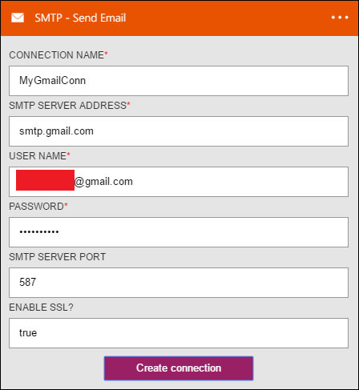

<properties
pageTitle="SMTP |Microsoft Azure"
description="Azure 應用程式服務建立邏輯應用程式。 連線至 SMTP 傳送電子郵件。"
services="logic-apps"   
documentationCenter=".net,nodejs,java"  
authors="msftman"   
manager="erikre"    
editor=""
tags="connectors" />

<tags
ms.service="app-service-logic"
ms.devlang="multiple"
ms.topic="article"
ms.tgt_pltfrm="na"
ms.workload="integration"
ms.date="07/15/2016"
ms.author="deonhe"/>

# 開始使用 SMTP 連接器

連線至 SMTP 傳送電子郵件。

若要使用[任一個連接器](./apis-list.md)，您必須建立邏輯應用程式。 您可以開始建立[現在邏輯應用程式](../app-service-logic/app-service-logic-create-a-logic-app.md)。

## 連線至 SMTP

邏輯應用程式可以存取任何服務之前，您必須建立該服務的*連線*。 一個[連線](./connectors-overview.md)提供邏輯應用程式與其他服務之間的連線。 例如，才能連線到 SMTP，必須先 SMTP*連線*。 若要建立連線，您必須提供您通常用來存取您要連線至服務的認證。 因此，在 SMTP 範例中，會建立所需的認證以連線名稱、 SMTP 伺服器位址，以及使用者的登入資訊 SMTP 連線。 [進一步瞭解連線]()  

### 建立 SMTP 的連線

>[AZURE.INCLUDE [Steps to create a connection to SMTP](../../includes/connectors-create-api-smtp.md)]

## 使用 SMTP 觸發程序

觸發程序是可以用來開始工作流程中的邏輯應用程式定義的事件。 [深入瞭解引動程序](../app-service-logic/app-service-logic-what-are-logic-apps.md#logic-app-concepts)。

在此範例中，因為 SMTP 沒有觸發程序，我們將使用**Salesforce-建立物件時**觸發程序。 Salesforce 中建立新的物件時，會啟動此觸發程序。 我們的範例中，我們會將其設定的每次 Salesforce 中建立新的潛在客戶時，*傳送電子郵件*動作發生透過 SMTP 連接器，以建立新的潛在客戶的通知。

1. 在 [搜尋] 方塊中輸入*salesforce*邏輯應用程式設計工具，然後選取 [ **Salesforce-建立物件時**觸發程序。  
   

2. 會顯示**在建立物件時**控制項。
   

3. 選取的**物件類型**，然後選取 [從清單中的物件的 [*潛在客戶]* 。 您要在此步驟中，表示您正在建立 Salesforce 中建立新的潛在客戶時，會通知您邏輯應用程式的觸發程序。  
   

4. 已建立觸發程序。  
   

## 使用 SMTP 動作

動作是在邏輯應用程式中定義工作流程所執行的作業。 [深入瞭解動作](../app-service-logic/app-service-logic-what-are-logic-apps.md#logic-app-concepts)。

已新增觸發程序，請遵循下列步驟以新增 Salesforce 中建立新的潛在客戶時，會發生的 SMTP 動作。

1. 選取 [ **+ 新步驟**以新增您想要建立新的潛在客戶時採取的動作。  
   

2. 選取 [**新增動作**。 [搜尋] 方塊，您可以搜尋的任何動作您想要採取此隨即會開啟。  
   

3. 輸入*smtp*搜尋 SMTP 與相關的動作。  

4. 您可以選取 [ **SMTP-傳送電子郵件**以建立新的潛在客戶時採取的動作。 隨即會開啟 [巨集指令控制區塊。 您必須建立 smtp 連接設計工具的區塊中，如果您還不這麼做之前。  
     

5. 輸入**SMTP-傳送電子郵件**區塊中您想要的電子郵件的資訊。  
   

6. 若要啟動您的工作流程，儲存您的工作。  

## 技術詳細資料

以下是有關引動程序、 動作和回應此連線支援的詳細資料︰

## SMTP 引動程序

SMTP 有任何引動程序。 

## SMTP 動作

SMTP 具有下列動作︰

|巨集指令|描述|
|--- | ---|
|[傳送電子郵件](connectors-create-api-smtp.md#send-email)|這項作業會將電子郵件傳送給一或多個收件者。|

### 動作的詳細資料

以下是此連接器，以及其回應的動作的詳細資料︰

### 傳送電子郵件
這項作業會將電子郵件傳送給一或多個收件者。 

|屬性名稱| 顯示名稱|描述|
| ---|---|---|
|若要|若要|指定電子郵件地址，並以分號等recipient1@domain.com;recipient2@domain.com|
|副本|副本|指定電子郵件地址，並以分號等recipient1@domain.com;recipient2@domain.com|
|主旨|主旨|電子郵件主旨|
|本文|本文|電子郵件本文|
|從|從|電子郵件地址，例如寄件者sender@domain.com|
|IsHtml|為 Html|傳送電子郵件另存為 HTML (true/false)|
|密件副本|密件副本|指定電子郵件地址，並以分號等recipient1@domain.com;recipient2@domain.com|
|重要性|重要性|（[高]、 [一般] 或 [低） 的電子郵件的重要性|
|ContentData|附件內容的資料|內容的資料 (base64 編碼資料流以及-適用於字串)|
|ContentType|附件的內容類型|內容類型|
|ContentTransferEncoding|附件內容傳輸編碼方式|內容傳輸編碼 （base64 或無）|
|檔案名稱|附件的檔案名稱|檔案名稱|
|ContentId|附件內容識別碼|內容的識別碼|

* 表示必要屬性

## HTTP 回應

動作與上方的觸發程序可以傳回一或多個下列 HTTP 狀態碼︰ 

|名稱|描述|
|---|---|
|200|[確定]|
|202|接受|
|400|錯誤的要求|
|401|未獲授權|
|403|禁止|
|404|找不到|
|500|內部伺服器錯誤。 未知錯誤。|
|預設值|作業失敗。|

## 後續步驟
[建立邏輯應用程式](../app-service-logic/app-service-logic-create-a-logic-app.md)