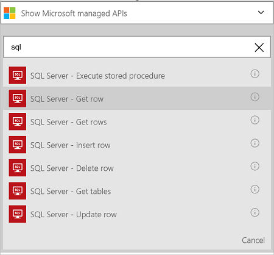
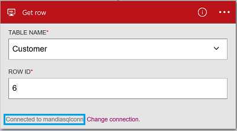

<properties
    pageTitle="邏輯應用程式中新增 Azure SQL 資料庫連接器 |Microsoft Azure"
    description="Azure SQL 資料庫連接器與 REST API 參數的概觀"
    services=""
    documentationCenter="" 
    authors="MandiOhlinger"
    manager="anneta"
    editor=""
    tags="connectors"/>

<tags
   ms.service="logic-apps"
   ms.devlang="na"
   ms.topic="article"
   ms.tgt_pltfrm="na"
   ms.workload="na" 
   ms.date="10/18/2016"
   ms.author="mandia"/>

# 開始使用 Azure SQL 資料庫連接器
使用 Azure SQL 資料庫連接器，建立您的組織管理表格中的資料的工作流程。 

SQL 資料庫]，與您︰

- 建立您的工作流程新增至客戶資料庫、 客戶或更新的訂單的訂單資料庫中。
- 以取得資料列，插入新列，甚至刪除動作。 例如，Dynamics CRM Online （觸發程序） 中建立一筆記錄時，然後插入列在 Azure SQL 資料庫 （動作）。 

本主題說明如何使用 SQL 資料庫連接器邏輯應用程式中，也會列出動作。

>[AZURE.NOTE] 此版本，請參閱適用於邏輯應用程式上市 (GA)。 

若要進一步瞭解邏輯應用程式，請參閱[什麼是邏輯應用程式](../app-service-logic/app-service-logic-what-are-logic-apps.md)，並[建立邏輯應用程式](../app-service-logic/app-service-logic-create-a-logic-app.md)。

## 連線到 Azure SQL 資料庫

邏輯應用程式可以存取任何服務之前，您先建立服務的*連線*。 一個連線提供邏輯應用程式與其他服務之間的連線。 例如，若要連線到 SQL 資料庫，您先建立 SQL 資料庫*連線*。 若要建立的連線，您可以輸入您通常用來存取您連線到該服務的認證。 因此，在 SQL 資料庫中，輸入您 SQL 資料庫的認證以建立連線。 

#### 建立連線

>[AZURE.INCLUDE [Create the connection to SQL Azure](../../includes/connectors-create-api-sqlazure.md)]

## 使用引動程序

此連接器沒有任何引動程序。 您可以使用其他引動程序來啟動邏輯應用程式，例如週期觸發程序、 HTTP Webhook 觸發程序、 引動程序提供其他接點]，及其他內容。 [建立邏輯應用程式](../app-service-logic/app-service-logic-create-a-logic-app.md)提供的範例。

## 使用巨集指令
    
動作是在邏輯應用程式中定義工作流程所執行的作業。 [深入瞭解動作](../app-service-logic/app-service-logic-what-are-logic-apps.md#logic-app-concepts)。

1. 選取加號。 您看到幾個選擇︰**新增動作**]、 [**新增條件**]，或 [**更多**選項的其中一個。

    

2. 選擇 [**新增動作**]。

3. 在 [文字] 方塊中，輸入 「 sql 」，取得清單的所有可用的動作。

     

4. 在此範例中，選擇 [ **SQL Server-取得的資料列**]。 如果連線已經存在，然後從下拉式清單中，選取 [**資料表名稱**，並輸入您想要傳回的**資料列識別碼**。

    

    如果系統提示您的連線資訊，然後輸入詳細資料] 來建立的連線。 [建立連線](connectors-create-api-sqlazure.md#create-the-connection)本主題中說明這些屬性。 

    > [AZURE.NOTE] 在此範例中，我們會傳回一列的表格。 若要查看此列中的資料，加入另一個動作，建立使用資料表的欄位的檔案。 例如，新增 OneDrive 使用的動作，[名字和姓氏] 欄位中的雲端儲存空間帳戶建立新檔案。 

5. **儲存**您的變更 （工具列的左上的角）。 邏輯應用程式儲存時，可能會自動啟用。

## 技術詳細資料

## SQL 資料庫動作
動作是在邏輯應用程式中定義工作流程所執行的作業。 SQL 資料庫連接器包含下列的動作。 

|巨集指令|描述|
|--- | ---|
|[ExecuteProcedure](connectors-create-api-sqlazure.md#execute-stored-procedure)|在 SQL 中執行預存程序|
|[GetRow](connectors-create-api-sqlazure.md#get-row)|從 SQL 資料表中擷取單一資料列|
|[GetRows](connectors-create-api-sqlazure.md#get-rows)|從 SQL 資料表擷取資料列|
|[InsertRow](connectors-create-api-sqlazure.md#insert-row)|SQL 表格中插入新列|
|[DeleteRow](connectors-create-api-sqlazure.md#delete-row)|從 SQL 資料表刪除列|
|[GetTables](connectors-create-api-sqlazure.md#get-tables)|從 SQL 資料庫中擷取資料表|
|[UpdateRow](connectors-create-api-sqlazure.md#update-row)|更新現有的資料列中的 SQL 表格|

### 動作的詳細資料

在 [此節]，查看特定每個動作，包括任何必要或選擇性輸入的內容，以及任何對應的輸出連接器的相關詳細資料。

#### 執行 [預存程序
在 SQL 中執行的預存程序。  

| 屬性名稱| 顯示名稱 |描述|
| ---|---|---|
|程序 * | 程序名稱 | 您想要執行的預存程序的名稱 |
|參數 * | 輸入的參數 | 參數是動態並根據您所選擇的預存程序。    例如，如果您使用 Adventure Works 範例資料庫，選擇 [ *ufnGetCustomerInformation*預存程序。 **客戶識別碼**輸入的參數會顯示。 輸入 「 6 」 或其中一個其他客戶識別碼。 |

星號 （*） 代表是必要的屬性。

##### 輸出詳細資料
ProcedureResult︰ 執行預存程序執行的結果

| 屬性名稱 | 資料類型 | 描述 |
|---|---|---|
|輸出參數|物件|輸出參數值 |
|ReturnCode|整數|傳回的程式碼的程序 |
|結果集|物件| 結果集|

#### 取得資料列 
從 SQL 資料表擷取單一資料列。  

| 屬性名稱| 顯示名稱 |描述|
| ---|---|---|
|表格 * | 資料表名稱 |SQL 資料表的名稱|
|識別碼 * | 資料列識別碼 |要擷取的資料列的唯一識別碼|

星號 （*） 代表是必要的屬性。

##### 輸出詳細資料
項目

| 屬性名稱 | 資料類型 |
|---|---|
|ItemInternalId|字串|

#### 取得資料列 
從 SQL 資料表擷取資料列。  

|屬性名稱| 顯示名稱|描述|
| ---|---|---|
|表格 *|資料表名稱|SQL 資料表的名稱|
|$skip|略過次數|若要跳項目數 (預設 = 0)|
|$top|最大取得字數統計|若要擷取的項目數目上限 (預設 = 256)|
|$filter|篩選查詢|若要限制的項目數 ODATA 篩選查詢|
|$orderby|排序方式|針對指定的項目順序 ODATA orderBy 查詢|

星號 （*） 代表是必要的屬性。

##### 輸出詳細資料
ItemsList

| 屬性名稱 | 資料類型 |
|---|---|
|值|陣列|

#### 插入列 
SQL 表格中插入新的資料列。  

|屬性名稱| 顯示名稱|描述|
| ---|---|---|
|表格 *|資料表名稱|SQL 資料表的名稱|
|項目 *|資料列|若要指定表格中插入列|

星號 （*） 代表是必要的屬性。

##### 輸出詳細資料
項目

| 屬性名稱 | 資料類型 |
|---|---|
|ItemInternalId|字串|

#### 刪除列 
移除 SQL 資料表中的列。  

|屬性名稱| 顯示名稱|描述|
| ---|---|---|
|表格 *|資料表名稱|SQL 資料表的名稱|
|識別碼 *|資料列識別碼|若要刪除的資料列的唯一識別碼|

星號 （*） 代表是必要的屬性。

##### 輸出詳細資料
無。

#### 將資料表 
從 SQL 資料庫擷取資料表。  

沒有這個呼叫參數。 

##### 輸出詳細資料 
TablesList

| 屬性名稱 | 資料類型 |
|---|---|
|值|陣列|

#### 更新資料列 
更新現有的資料時，是 SQL 表格中的列。  

|屬性名稱| 顯示名稱|描述|
| ---|---|---|
|表格 *|資料表名稱|SQL 資料表的名稱|
|識別碼 *|資料列識別碼|若要更新的資料列的唯一識別碼|
|項目 *|資料列|更新值的資料列|

星號 （*） 代表是必要的屬性。

##### 輸出詳細資料  
項目

| 屬性名稱 | 資料類型 |
|---|---|
|ItemInternalId|字串|

### HTTP 回應

以不同的行動電話時，您可能會收到特定的回應。 下表列出回應和其說明︰  

|名稱|描述|
|---|---|
|200|[確定]|
|202|接受|
|400|錯誤的要求|
|401|未獲授權|
|403|禁止|
|404|找不到|
|500|內部伺服器錯誤。 發生未知的錯誤|
|預設值|作業失敗。|

## 後續步驟

[建立邏輯應用程式](../app-service-logic/app-service-logic-create-a-logic-app.md)。 瀏覽邏輯應用程式，在我們的[Api 清單](apis-list.md)中其他可用的連接器。
