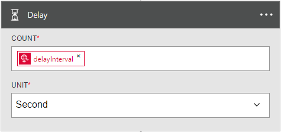

<properties
    pageTitle="邏輯應用程式中新增延遲 |Microsoft Azure"
    description="延遲和延遲概觀-直到動作]，以及如何 Azure 邏輯應用程式搭配使用。"
    services=""
    documentationCenter=""
    authors="jeffhollan"
    manager="erikre"
    editor=""
    tags="connectors"/>

<tags
   ms.service="logic-apps"
   ms.devlang="na"
   ms.topic="article"
   ms.tgt_pltfrm="na"
   ms.workload="na"
   ms.date="07/18/2016"
   ms.author="jehollan"/>

# 延遲和延遲入門-直到動作

使用延遲和 「 延遲-直到 」 動作]，在您完成工作流程案例。

例如，您可以︰

- 等到透過電子郵件傳送狀態更新的工作日。
- 延遲工作流程，直到 HTTP 通話已完成，才能繼續，以及擷取結果的時間。

若要開始使用邏輯應用程式中的 [延遲] 動作，請參閱[建立邏輯應用程式](../app-service-logic/app-service-logic-create-a-logic-app.md)。

## 使用延遲動作

動作是由邏輯應用程式中定義的工作流程執行的作業。 [深入瞭解動作](connectors-overview.md)。

以下是如何使用延遲步驟邏輯應用程式中的範例順序︰

1. 加入後觸發程序，請按一下 [**新的步驟**，若要新增動作]。
2. 搜尋**延遲**，以顯示延遲動作。 我們將在此範例中，選取**延遲**。

    

3. 完成的任何動作屬性設定延遲。

    

4. 按一下 [發佈，並啟動邏輯應用程式的 [**儲存**]。

## 動作的詳細資料

循環觸發程序有下列屬性，您可以設定。

### 延遲巨集指令

這個動作會延遲針對特定的時間間隔執行。
A * 表示它是必要的欄位。

|顯示名稱|屬性名稱|描述|
|---|---|---|
|計算 *|字數統計|若要延遲的時間單位的數字|
|單價 *|單位|時間單位︰ `Second`， `Minute`， `Hour`，或`Day`|
 

### 延遲-直到巨集指令

這個動作會執行，直到指定的日期/時間延遲。
A * 表示它是必要的欄位。

|顯示名稱|屬性名稱|描述|
|---|---|---|
|年 *|時間戳記|若要延遲 (GMT) 直到年|
|月 *|時間戳記|若要延遲 (GMT) 直到月份|
|日 *|時間戳記|若要延遲 (GMT) 直到日期|
 

## 後續步驟

現在，請試試看的平台和[建立邏輯應用程式](../app-service-logic/app-service-logic-create-a-logic-app.md)。 您可以查看我們的[Api 清單](apis-list.md)來探索邏輯應用程式中其他可用的連接器。
