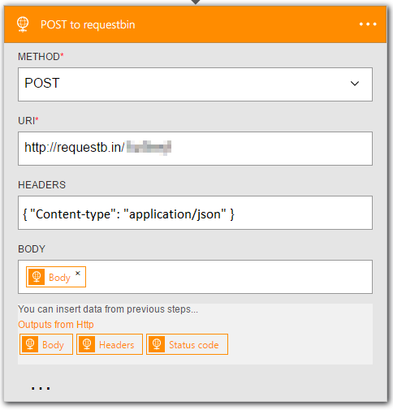

<properties
    pageTitle="邏輯應用程式中新增 HTTP 動作 |Microsoft Azure"
    description="使用屬性的 HTTP 動作的概觀"
    services=""
    documentationCenter=""
    authors="jeffhollan"
    manager="erikre"
    editor=""
    tags="connectors"/>

<tags
   ms.service="logic-apps"
   ms.devlang="na"
   ms.topic="article"
   ms.tgt_pltfrm="na"
   ms.workload="na"
   ms.date="07/15/2016"
   ms.author="jehollan"/>

# <a name="get-started-with-the-http-action"></a>開始使用 HTTP 巨集指令

HTTP 動作，可以將工作流程延伸為您的組織，並透過 HTTP 通訊任何端點。

您可以︰

- 建立邏輯啟動 （觸發程序），當您管理網站的應用程式工作流程。
- 與任何端點通訊透過 HTTP，將工作流程延伸到其他服務。

若要開始在邏輯應用程式中使用 HTTP 動作，請參閱[建立邏輯應用程式](../app-service-logic/app-service-logic-create-a-logic-app.md)。

## <a name="use-the-http-trigger"></a>使用 HTTP 觸發程序

觸發程序是可以用來開始工作流程中的邏輯應用程式所定義的事件。 [深入瞭解引動程序](connectors-overview.md)。

以下是如何設定 HTTP 觸發程序邏輯應用程式設計工具中的範例順序。

1. 邏輯應用程式中新增 HTTP 觸發程序。
2. 填入您要投票 HTTP 端點的參數。
3. 修改頻率，應該投票的循環間隔。
4. 邏輯應用程式現在會引發會傳回期間每個核取任何內容。


### <a name="how-the-http-trigger-works"></a>HTTP 觸發程序的運作方式

HTTP 觸發程序呼叫 HTTP 端點上的週期性間隔。 根據預設，任何 HTTP 回應的程式碼中執行的邏輯應用程式的小於 300 結果。 您可以新增條件，將會評估 HTTP 呼叫決定如果邏輯應用程式應該啟動後的程式碼檢視中。 以下是在 HTTP 觸發程序，使用時傳回的狀態碼大於或等於範例`400`。

```javascript
"Http":
{
    "conditions": [
        {
            "expression": "@greaterOrEquals(triggerOutputs()['statusCode'], 400)"
        }
    ],
    "inputs": {
        "method": "GET",
        "uri": "https://blogs.msdn.microsoft.com/logicapps/",
        "headers": {
            "accept-language": "en"
        }
    },
    "recurrence": {
        "frequency": "Second",
        "interval": 15
    },
    "type": "Http"
}
```

關於 HTTP 觸發程序參數的完整詳細資料，可在[MSDN](https://msdn.microsoft.com/library/azure/mt643939.aspx#HTTP-trigger)上。

## <a name="use-the-http-action"></a>使用 [HTTP 指令

動作是由邏輯應用程式中定義的工作流程執行的作業。 [深入瞭解動作](connectors-overview.md)。

1. 選取**新的步驟**] 按鈕。
2. 選擇 [**新增動作**]。
3. 在 [巨集指令搜尋] 方塊中，輸入**http**清單 HTTP 動作。

    

4. 新增所需的 HTTP 通話任何參數。

    

5. 按一下 [儲存] 工具列的左上的角。 邏輯應用程式將會同時儲存並發佈 （啟動）。

## <a name="http-trigger"></a>HTTP 觸發程序

以下是支援此連接器的觸發程序的詳細資料。 HTTP 連接器有一個觸發程序。

|觸發程序|描述|
|---|---|
|HTTP|呼叫 HTTP，並傳回回應內容。|

## <a name="http-action"></a>HTTP 巨集指令

以下是支援此連接器的動作的詳細資料。 HTTP 連接器有一個可能的動作。

|巨集指令|描述|
|---|---|
|HTTP|呼叫 HTTP，並傳回回應內容。|

## <a name="http-details"></a>HTTP 詳細資料

下表描述的必要與選用輸入的欄位的動作，並使用動作相關聯的相對應輸出詳細資料。


#### <a name="http-request"></a>HTTP 要求
以下是動作，讓 HTTP 輸出要求輸入的欄位。
A * 表示它是必要的欄位。

|顯示名稱|屬性名稱|描述|
|---|---|---|
|方法 *|方法|若要使用 HTTP 動作|
|URI *|uri|空的 URI|
|頁首|頁首|將 HTTP 標頭的 JSON 物件|
|本文|本文|HTTP 邀請內文|
|驗證|驗證|在 [[驗證](#authentication)] 區段中的詳細資料|
<br>

#### <a name="output-details"></a>輸出詳細資料

以下是 HTTP 回應的輸出詳細資料。

|屬性名稱|資料類型|描述|
|---|---|---|
|頁首|物件|回應標頭|
|本文|物件|回應物件|
|狀態碼|int|HTTP 狀態碼|

## <a name="authentication"></a>驗證

Azure 應用程式服務的邏輯應用程式功能可讓您使用不同的驗證的 HTTP 結束點類型。 您可以使用此驗證的**HTTP** **[HTTP + Swagger](./connectors-native-http-swagger.md)**，與**[HTTP Webhook](./connectors-native-webhook.md)**連接器。 下列類型是驗證的可設定︰

* [基本驗證](#basic-authentication)
* [用戶端憑證驗證](#client-certificate-authentication)
* [Azure Active Directory (Azure AD) OAuth 驗證](#azure-active-directory-oauth-authentication)

#### <a name="basic-authentication"></a>基本驗證

下列驗證物件所需的基本驗證。
A * 表示它是必要的欄位。

|屬性名稱|資料類型|描述|
|---|---|---|
|輸入 *|類型|驗證類型 (必須`Basic`基本驗證)|
|使用者名稱 *|使用者名稱|要驗證的使用者名稱|
|密碼 *|密碼|若要驗證的密碼|

>[AZURE.TIP] 如果您想要使用的密碼，無法從定義，使用`securestring`參數和`@parameters()`[工作流程定義的函數](http://aka.ms/logicappdocs)。

因此您想要建立如下物件驗證] 欄位中︰

```javascript
{
    "type": "Basic",
    "username": "user",
    "password": "test"
}
```

#### <a name="client-certificate-authentication"></a>用戶端憑證驗證

下列驗證物件所需的用戶端憑證驗證]。 A * 表示它是必要的欄位。

|屬性名稱|資料類型|描述|
|---|---|---|
|輸入 *|類型|驗證類型 (必須`ClientCertificate`的用戶端的 SSL 憑證)|
|PFX *|pfx|個人資訊交換 (PFX) 檔案 Base64 編碼內容|
|密碼 *|密碼|若要存取 PFX 檔案密碼|

>[AZURE.TIP] 您可以使用`securestring`參數和`@parameters()`使用無法讀取儲存邏輯應用程式之後定義中的參數的[工作流程定義的函數](http://aka.ms/logicappdocs)。

例如︰

```javascript
{
    "type": "ClientCertificate",
    "pfx": "aGVsbG8g...d29ybGQ=",
    "password": "@parameters('myPassword')"
}
```

#### <a name="azure-ad-oauth-authentication"></a>Azure AD OAuth 驗證

Azure AD OAuth 驗證需要下列驗證物件。 A * 表示它是必要的欄位。

|屬性名稱|資料類型|描述|
|---|---|---|
|輸入 *|類型|驗證類型 (必須`ActiveDirectoryOAuth`Azure AD OAuth 版)|
|租用戶 *|租用戶|Azure AD 租用戶租用戶識別碼|
|對象 *|對象|若要設定`https://management.core.windows.net/`|
|用戶端識別碼 *|clientId|Azure AD 應用程式的用戶端識別碼|
|私人 *|密碼|要求權杖的用戶端的密碼|

>[AZURE.TIP] 您可以使用`securestring`參數和`@parameters()`使用無法讀取儲存後定義中的參數的[工作流程定義的函數](http://aka.ms/logicappdocs)。

例如︰

```javascript
{
    "type": "ActiveDirectoryOAuth",
    "tenant": "72f988bf-86f1-41af-91ab-2d7cd011db47",
    "audience": "https://management.core.windows.net/",
    "clientId": "34750e0b-72d1-4e4f-bbbe-664f6d04d411",
    "secret": "hcqgkYc9ebgNLA5c+GDg7xl9ZJMD88TmTJiJBgZ8dFo="
}
```

## <a name="next-steps"></a>後續步驟

現在，請試試看的平台和[建立邏輯應用程式](../app-service-logic/app-service-logic-create-a-logic-app.md)。 您可以查看我們的[Api 清單](apis-list.md)來探索邏輯應用程式中其他可用的連接器。
