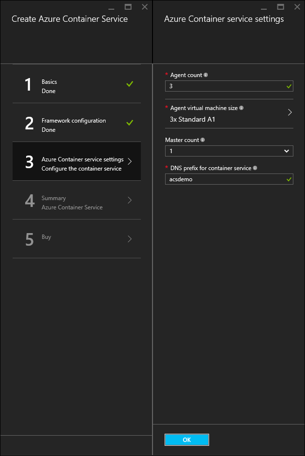

<properties
   pageTitle="部署 Azure 容器服務叢集 |Microsoft Azure"
   description="部署使用 Azure 入口網站、 Azure CLI 或 PowerShell 的 Azure 容器服務叢集。"
   services="container-service"
   documentationCenter=""
   authors="rgardler"
   manager="timlt"
   editor=""
   tags="acs, azure-container-service"
   keywords="Docker，容器，微服務，Mesos、 Azure"/>

<tags
   ms.service="container-service"
   ms.devlang="na"
   ms.topic="get-started-article"
   ms.tgt_pltfrm="na"
   ms.workload="na"
   ms.date="09/13/2016"
   ms.author="rogardle"/>

# <a name="deploy-an-azure-container-service-cluster"></a>部署 Azure 容器服務叢集

Azure 容器服務會提供常用開啟來源容器的快速部署叢集和協調流程解決方案。 藉由使用 Azure 容器服務，您可以部署 DC/OS 和 Docker 廣域叢集使用 Azure 資源管理員範本或 Azure 入口網站。 您使用 Azure 虛擬機器比例組部署這些叢集和叢集利用 Azure 網路連線，儲存空間方案。 若要存取 Azure 容器服務，您需要的 Azure 訂閱。 如果您沒有帳戶，然後您可以註冊[免費試用版](http://azure.microsoft.com/pricing/free-trial/?WT.mc_id=AA4C1C935)。

這份文件會引導您部署 Azure 容器服務叢集使用[Azure 入口網站](#creating-a-service-using-the-azure-portal)、 [Azure 命令列介面 (CLI)](#creating-a-service-using-the-azure-cli)和[Azure PowerShell 模組](#creating-a-service-using-powershell)。  

## <a name="create-a-service-by-using-the-azure-portal"></a>使用 [Azure 入口網站中建立的服務

登入 Azure 入口網站，選取 [**新增**]，然後搜尋 Azure Marketplace **Azure 容器服務**。

  <br />

選取**Azure 容器服務**，然後按一下 [**建立**]。

  <br />

輸入下列資訊︰

- **使用者名稱**︰ 這是用於在每一個虛擬機器上帳戶使用者名稱和 Azure 容器服務叢集虛擬機器縮放比例設定。
- **訂閱**︰ 選取 [Azure 的訂閱。
- **資源群組**︰ 選取現有的資源群組，或建立新的範本。
- **位置**︰ 選取 Azure 容器服務部署 Azure 區域。
- **SSH 公開金鑰**︰ 新增將會用於驗證的 Azure 容器服務虛擬機器公用鍵。 請務必此按鍵包含沒有分行符號，和其包含的 「 ssh rsa' 前置詞和'username@domain'後置。 看起來應該像下面︰ **...ssh rsa AAAAB3Nz <>......UcyupgH azureuser@linuxvm **。 建立安全命令介面 (SSH) 鍵的指引，請參閱[Linux]( https://azure.microsoft.com/documentation/articles/virtual-machines-linux-ssh-from-linux/)和[Windows]( https://azure.microsoft.com/documentation/articles/virtual-machines-linux-ssh-from-windows/)文件。

當您準備好繼續，請按一下**[確定]** 。

  <br />

選取協調流程類型。 選項包括︰

- **DC/OS**︰ 部署 DC/OS 叢集。
- **廣域**︰ 部署 Docker 廣域叢集。

當您準備好繼續，請按一下**[確定]** 。

  <br />

輸入下列資訊︰

- **母片計數**︰ 母片的叢集數目。
- **代理程式計數**︰ 的 Docker 廣域，這會在代理程式的縮放比例設定代理程式的初始數目。 對於 DC/OS，這是私人的縮放比例設定中的代理程式的初始數目。 此外，會建立公用縮放設定，其中包含預先定義的數字的代理程式。 在此公用縮放比例設定代理程式數目決定多少母片來建立叢集-一個母片，請一公用代理程式和兩個公用代理程式的三個或五個母片。
- **代理程式的虛擬機器大小**︰ 代理程式虛擬機器的大小。
- **DNS 首碼**︰ 全球唯一的名稱會用來加上字首服務的完整的網域名稱的重要部分。

當您準備好繼續，請按一下**[確定]** 。

  <br />

服務驗證完畢後，請按一下**[確定]** 。

  <br />

按一下 [**建立**]，開始部署程序。

  <br />

如果您已選擇將其釘選至 Azure 入口網站的部署，您可以看到部署狀態。

  <br />

當部署完成時，就有一個 Azure 容器服務叢集可供使用。

## <a name="create-a-service-by-using-the-azure-cli"></a>使用 Azure CLI 建立服務

若要使用的命令列建立 Azure 容器服務的執行個體，您需要的 Azure 訂閱。 如果您沒有帳戶，然後您可以註冊[免費試用版](http://azure.microsoft.com/pricing/free-trial/?WT.mc_id=AA4C1C935)。 您也需要有[安裝](../xplat-cli-install.md)並[設定](../xplat-cli-connect.md)Azure CLI。

若要部署的 DC/OS 或 Docker 廣域叢集，從選取其中下列範本 GitHub。 請注意，這兩個這些範本相同，但預設 orchestrator 選取範圍。

* [DC/OS 範本](https://github.com/Azure/azure-quickstart-templates/tree/master/101-acs-dcos)
* [廣域範本](https://github.com/Azure/azure-quickstart-templates/tree/master/101-acs-swarm)

接下來，請確定 Azure CLI 具有已連線至 Azure 訂閱。 您可以使用下列命令︰

```bash
azure account show
```
如果不會傳回 Azure 帳戶，請使用下列命令 Azure CLI 登入。

```bash
azure login -u user@domain.com
```

接下來，設定 Azure CLI 工具，即可使用 Azure 資源管理員]。

```bash
azure config mode arm
```

使用下列命令，建立 Azure 資源群組和容器服務叢集位置︰

- **RESOURCE_GROUP**是您想要使用這項服務的 [資源] 群組的名稱。
- **位置**是 Azure 資源群組和 Azure 容器服務部署建立所在的區域。
- **TEMPLATE_URI**是部署檔案的位置。 請注意，這必須是未經處理的檔案，而不 GitHub UI 的指標。 若要尋找此 URL，選取 azuredeploy.json 檔案中 GitHub，然後按一下 [**原始**] 按鈕。

> [AZURE.NOTE] 當您執行此命令時，shell 會提示您輸入部署參數值。

```bash
azure group create -n RESOURCE_GROUP DEPLOYMENT_NAME -l LOCATION --template-uri TEMPLATE_URI
```

### <a name="provide-template-parameters"></a>提供範本參數

這個版本的命令會要求您定義參數互動的方式。 如果您想要提供 JSON 格式字串，例如的參數，您可以執行使用`-p`切換。 例如︰

 ```bash
azure group deployment create RESOURCE_GROUP DEPLOYMENT_NAME --template-uri TEMPLATE_URI -p '{ "param1": "value1" … }'
```

或者，您可以使用提供 JSON 格式參數檔案`-e`切換︰

```bash
azure group deployment create RESOURCE_GROUP DEPLOYMENT_NAME --template-uri TEMPLATE_URI -e PATH/FILE.JSON
```

若要查看範例參數檔名為`azuredeploy.parameters.json`，與 Azure 容器服務中的範本 GitHub 尋找它。

## <a name="create-a-service-by-using-powershell"></a>使用 PowerShell 來建立服務

您也可以部署使用 PowerShell 的 Azure 容器服務叢集。 這份文件會根據 1.0 版[Azure PowerShell 模組](https://azure.microsoft.com/blog/azps-1-0/)。

若要部署 DC/OS 或 Docker 廣域叢集，選取其中一個下列範本。 請注意，這兩個這些範本相同，但預設 orchestrator 選取範圍。

* [DC/OS 範本](https://github.com/Azure/azure-quickstart-templates/tree/master/101-acs-dcos)
* [廣域範本](https://github.com/Azure/azure-quickstart-templates/tree/master/101-acs-swarm)

先建立叢集 Azure 訂閱中，確認您 PowerShell 工作階段具有至 Azure 登入。 您可以使用`Get-AzureRMSubscription`命令︰

```powershell
Get-AzureRmSubscription
```

如果您需要登入 Azure，使用`Login-AzureRMAccount`命令︰

```powershell
Login-AzureRmAccount
```

如果您部署至新的資源群組，您必須先建立資源群組。 若要建立新的資源群組，請使用`New-AzureRmResourceGroup`命令，並指定 [資源群組名稱和目的地區域︰

```powershell
New-AzureRmResourceGroup -Name GROUP_NAME -Location REGION
```

建立資源群組之後，您可以使用下列命令來建立叢集。 將指定的所需的範本 URI`-TemplateUri`參數。 當您執行此命令時，PowerShell 會提示您輸入部署參數值。

```powershell
New-AzureRmResourceGroupDeployment -Name DEPLOYMENT_NAME -ResourceGroupName RESOURCE_GROUP_NAME -TemplateUri TEMPLATE_URI
```

### <a name="provide-template-parameters"></a>提供範本參數

如果您是使用 PowerShell 熟悉，您知道您可以輸入減號 （-），然後按 [TAB 鍵循環 cmdlet 可用的參數。 相同的功能也適用於您在您的範本中定義的參數。 當您輸入範本名稱，指令程式會擷取範本、 剖析參數，並範本將參數加入至] 命令以動態方式。 如此可讓您很容易指定範本參數值。 如果您忘記必要的參數值，PowerShell 會提示您輸入的值。

以下是 [完整] 命令，以包含的參數。 您可以將您自己的值提供資源的名稱。

```powershell
New-AzureRmResourceGroupDeployment -ResourceGroupName RESOURCE_GROUP_NAME-TemplateURI TEMPLATE_URI -adminuser value1 -adminpassword value2 ....
```

## <a name="next-steps"></a>後續步驟

有作用叢集之後，請參閱這些文件的連線和管理詳細資料︰

- [連線到 Azure 容器服務叢集](container-service-connect.md)
- [使用容器 Azure 服務和 DC/作業系統](container-service-mesos-marathon-rest.md)
- [使用容器 Azure 服務和 Docker 廣域](container-service-docker-swarm.md)
