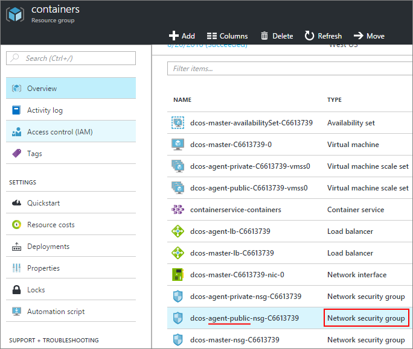

<properties
   pageTitle="讓公用存取 ACS 應用程式 |Microsoft Azure"
   description="如何啟用 Azure 容器服務的公開存取。"
   services="container-service"
   documentationCenter=""
   authors="Thraka"
   manager="timlt"
   editor=""
   tags="acs, azure-container-service"
   keywords="Docker，容器，微服務，Mesos、 Azure"/>

<tags
   ms.service="container-service"
   ms.devlang="na"
   ms.topic="article"
   ms.tgt_pltfrm="na"
   ms.workload="na"
   ms.date="08/26/2016"
   ms.author="timlt"/>

# 啟用公用存取 Azure 容器服務應用程式

ACS[公用代理程式集區](container-service-mesos-marathon-ui.md#deploy-a-docker-formatted-container)中的任何 DC/OS 容器會自動為網際網路上公開。 依預設連接埠**80**、 **443**， **8080**會開啟，而且這些連接埠接聽任何 （公開） 容器存取。 本文將示範如何在 Azure 容器服務開啟應用程式的更多的連接埠。

## 開啟連接埠 （入口網站） 

首先，我們需要開啟我們想要的連接埠。

1. 登入入口網站。
2. 尋找您部署 Azure 容器服務資源群組。
3. 選取 [代理程式負載平衡器 （此稱為類似**XXXX 代理程式-lb XXXX**）]。

    

4. 按一下**探查**，然後**新增**。

    

5. 填寫探查表單，然後按一下**[確定**]。

  	| 功能變數 | 描述 |
  	| ----- | ----------- |
  	| 名稱  | 探查的描述性名稱。 |
  	| 連接埠  | 若要測試容器的連接埠。 |
  	| 路徑  | （在 HTTP 模式時）要檢查的相對網站路徑。 不支援的 HTTPS。 |
  	| 間隔 | 嘗試探查之間的時間量秒數。 |
  	| 不佳的閥值 | 考慮不佳的容器之前，先連續探查次數。 | 
    

6. 回在代理程式負載平衡器的屬性，按一下 [**負載平衡規則**] 與 [**新增**]。

    

7. 填寫負載平衡器表單，然後按一下**[確定**]。

  	| 功能變數 | 描述 |
  	| ----- | ----------- |
  	| 名稱  | 負載平衡器的描述性名稱。 |
  	| 連接埠  | 公用內送的連接埠。 |
  	| 後端連接埠 | 若要將流量路由傳送容器內部公用連接埠。 |
  	| 後端資料庫 | 在這個集區容器會此負載平衡器的目標。 |
  	| 探查 | 用來決定是否健全**後端資料庫**中的目標探查。 |
  	| 工作階段持續性 | 判斷從用戶端流量應該如何處理工作階段期間。  **無**︰ 可由任何容器處理相同的用戶端的後續要求。 **用戶端 IP**︰ 連續要求相同的用戶端 IP 處理相同的容器。 **用戶端 IP 與通訊協定**︰ 從相同的用戶端 IP 與通訊協定組合的後續要求處理相同的容器。 |
  	| 閒置逾時 | (僅限 TCP)若要保留的 TCP/HTTP 用戶端時間開啟不需依賴以分鐘為單位*保持*郵件。 |

## 新增安全性規則 （入口網站）

接下來，我們需要新增路由流量，我們已開啟的連接埠透過防火牆的安全性規則。

1. 登入入口網站。
2. 尋找您部署 Azure 容器服務資源群組。
3. 選取 [**公用**代理程式的網路安全性] 群組 （此稱為**XXXX 代理程式-公用-nsg-XXXX**類似）。

    

4. 選取 [**連入安全性規則**] 與 [**新增**]。

    

5. 填寫防火牆規則，允許您的公用連接埠並按一下**[確定]**。

  	| 功能變數 | 描述 |
  	| ----- | ----------- |
  	| 名稱  | 防火牆規則的描述性名稱。 |
  	| 優先順序 | 規則的優先順序等級。 更低的數字較高的優先順序。 |
  	| 來源 | 限制允許或拒絕此規則的內送的 IP 位址範圍。 使用**任何**未指定的限制。 |
  	| 服務 | 選取一組這個安全性規則適用於預先定義的服務。 若要建立您自己，否則使用**自訂**。 |
  	| 通訊協定 | 限制根據**TCP**或**UDP**流量。 使用**任何**未指定的限制。 |
  	| 連接埠範圍 | **自訂****服務**時，指定此規則會影響的連接埠的範圍。 您可以使用單一連接埠，例如**80**或像**1024年 1500年**範圍。 |
  	| 巨集指令 | 允許或拒絕符合準則的流量。 |

## 後續步驟

進一步瞭解[公開及私密金鑰 DC/OS 代理程式](container-service-dcos-agents.md)之間的差異。

請閱讀[管理您的 DC/OS 容器](container-service-mesos-marathon-ui.md)的詳細資訊。