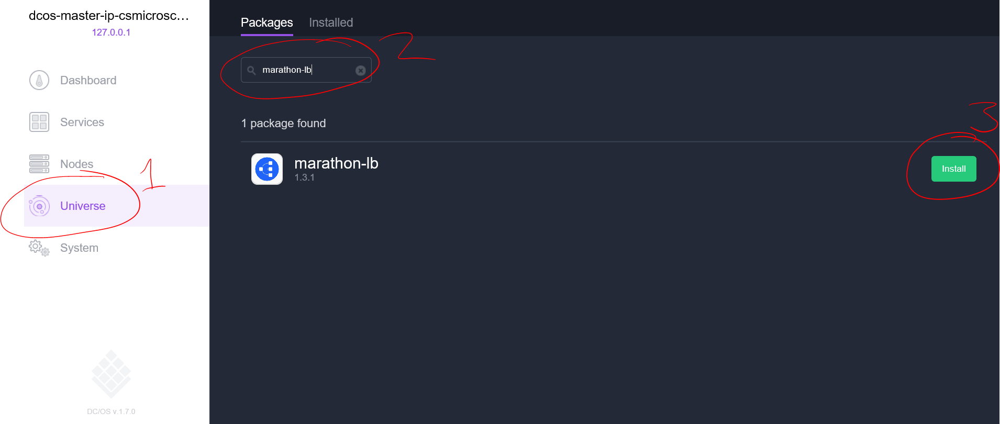

<properties
   pageTitle="負載平衡容器中 Azure 容器服務叢集 |Microsoft Azure"
   description="跨多個容器中 Azure 容器服務叢集負載平衡。"
   services="container-service"
   documentationCenter=""
   authors="rgardler"
   manager="timlt"
   editor=""
   tags="acs, azure-container-service"
   keywords="容器，微服務 DC/OS Azure"/>

<tags
   ms.service="container-service"
   ms.devlang="na"
   ms.topic="get-started-article"
   ms.tgt_pltfrm="na"
   ms.workload="na"
   ms.date="07/11/2016"
   ms.author="rogardle"/>

# <a name="load-balance-containers-in-an-azure-container-service-cluster"></a>Azure 容器服務叢集負載平衡容器

在本文中，我們會探索︰ 如何建立內部負載平衡器，在 DC/OS 管理使用 Marathon LB Azure 容器服務。 這會讓您水平不按比例縮放應用程式。 它也可以讓您利用公開及私密金鑰代理程式的叢集公用叢集和您的應用程式上容器私人叢集放在您的負載平衡器。

## <a name="prerequisites"></a>必要條件

使用 orchestrator 類型 DC/OS 的[部署 Azure 容器服務的執行個體](container-service-deployment.md)，並[確保您的用戶端可以連線到您的叢集](container-service-connect.md)。 

## <a name="load-balancing"></a>負載平衡

我們會建立容器服務叢集中有兩個負載平衡圖層︰ 

  1. Azure 負載平衡器提供公用進入點 （使用者會叫用的項目）。 這由自動 Azure 容器服務，根據預設，設定為公開連接埠 80、 443 和 8080。
  2. Marathon 負載平衡器 (marathon lb) 路由輸入的要求的服務要求] 這些容器例項。 我們不按比例縮放提供 web 服務的容器，如 marathon lb 動態調整。 在您的容器服務中的預設不會提供此負載平衡器，但很容易安裝。

## <a name="marathon-load-balancer"></a>Marathon 負載平衡器

Marathon 負載平衡器動態重新設定根據您已部署容器本身。 如果發生這種情況，Apache Mesos 只會重新啟動其他位置的容器 marathon lb 來調整，還有有彈性的容器或代理程式的影響。

若要安裝您可以使用 [DC/OS Marathon 負載平衡器 web UI 或命令列。

### <a name="install-marathon-lb-using-dcos-web-ui"></a>安裝 Marathon LB 使用 DC/OS Web UI

  1. 按一下 「 Universe 」
  2. 搜尋 「 Marathon LB 」
  3. 按一下 [安裝]



### <a name="install-marathon-lb-using-the-dcos-cli"></a>安裝 Marathon LB 使用 DC/OS CLI

安裝 DC/OS CLI，並確保之後，您可以連線至叢集，從您的用戶端電腦執行下列命令︰

```bash
dcos package install marathon-lb
```

這個命令會自動安裝公用代理程式叢集上的負載平衡器。

## <a name="deploy-a-load-balanced-web-application"></a>部署負載平衡 Web 應用程式

現在，我們已 marathon lb 套件，我們可以部署我們希望負載平衡應用程式容器。 這個範例中，我們會使用下列設定部署簡單的網頁伺服器︰

```json
{
  "id": "web",
  "container": {
    "type": "DOCKER",
    "docker": {
      "image": "yeasy/simple-web",
      "network": "BRIDGE",
      "portMappings": [
        { "hostPort": 0, "containerPort": 80, "servicePort": 10000 }
      ],
      "forcePullImage":true
    }
  },
  "instances": 3,
  "cpus": 0.1,
  "mem": 65,
  "healthChecks": [{
      "protocol": "HTTP",
      "path": "/",
      "portIndex": 0,
      "timeoutSeconds": 10,
      "gracePeriodSeconds": 10,
      "intervalSeconds": 2,
      "maxConsecutiveFailures": 10
  }],
  "labels":{
    "HAPROXY_GROUP":"external",
    "HAPROXY_0_VHOST":"YOUR FQDN",
    "HAPROXY_0_MODE":"http"
  }
}

```

  * 設定的值`HAProxy_0_VHOST`負載平衡器您代理程式的完整網域。 這是在表單中`<acsName>agents.<region>.cloudapp.azure.com`。 例如，如果您使用名稱建立容器服務叢集`myacs`區域`West US`，應 FQDN `myacsagents.westus.cloudapp.azure.com`。 您也可以找到這尋找名稱中的 「 代理程式 」 的負載平衡器尋找透過您建立的容器服務[Azure 入口網站](https://portal.azure.com)中的 [資源] 群組中的資源。
  * 連接埠設定 servicePort > = 10000。 這會識別正在執行這個容器-服務 marathon lb 將此識別它應該在 [餘額的服務。
  * 設定`HAPROXY_GROUP`標籤至 「 外部的 」。
  * 設定`hostPort`0。 這表示 Marathon 任意會配置可用的連接埠。
  * 設定`instances`至您想要建立的執行個體數目。 您可以隨時調整這些向上和向下更新版本。

值得 noing，依預設 Marathon 會部署至私人叢集，這表示的上述部署時，才會透過您的負載平衡器，通常是我們想要的行為。

### <a name="deploy-using-the-dcos-web-ui"></a>部署使用 DC/OS 網路使用者介面

  1. 造訪 http://localhost/marathon 的 Marathon 頁面 （後設定[SSH 通道](container-service-connect.md)和按一下`Create Appliction`
  2. 在 [`New Application`對話方塊按一下`JSON Mode`在右上角
  3. 上述 JSON 貼入編輯器
  4. 按一下 [`Create Appliction`

### <a name="deploy-using-the-dcos-cli"></a>使用 DC/OS CLI 部署

部署 DC/OS CLI 使用此應用程式只複製上述 JSON 至檔案中稱為`hello-web.json`，並執行︰

```bash
dcos marathon app add hello-web.json
```

## <a name="azure-load-balancer"></a>Azure 負載平衡器

根據預設，Azure 負載平衡器公開連接埠 80、 8080，和 443。 如果您使用其中一個這三個連接埠 （如我們執行上面範例中），然後沒有您所要做的任何項目]。 您應該可以存取您的代理人負載平衡器的 FQDN-，每次您更新時，您會按其中三個網頁伺服器循環方式。 不過，如果您使用不同的連接埠，您需要加入循環規則和檢查在負載平衡器所使用的連接埠。 您可以從[Azure CLI](../xplat-cli-azure-resource-manager.md)的命令`azure network lb rule create`和`azure network lb probe create`。 您也可以執行此使用 Azure 入口網站。


## <a name="additional-scenarios"></a>其他的分析藍本

您可能會有的情況，您使用不同的網域來顯示不同的服務。 例如︰

mydomain1.com]-> [Azure LB:80 marathon]-> [-lb:10001]-> [mycontainer1:33292  
mydomain2.com]-> [Azure LB:80 marathon]-> [-lb:10002]-> [mycontainer2:22321

若要達到此目標，取出[虛擬主機](https://mesosphere.com/blog/2015/12/04/dcos-marathon-lb/)，其中提供關聯到特定的 marathon lb 路徑的網域的方式。

或者，您可能會不同的連接埠的方式公開，重新對應它們前 marathon lb 正確的服務。例如︰

Azure lb:80]-> [marathon-lb:10001]-> [mycontainer:233423  
Azure lb:8080]-> [marathon-lb:1002]-> [mycontainer2:33432


## <a name="next-steps"></a>後續步驟

請參閱更多開啟[marathon lb](https://dcos.io/docs/1.7/usage/service-discovery/marathon-lb/)DC/OS 文件。
