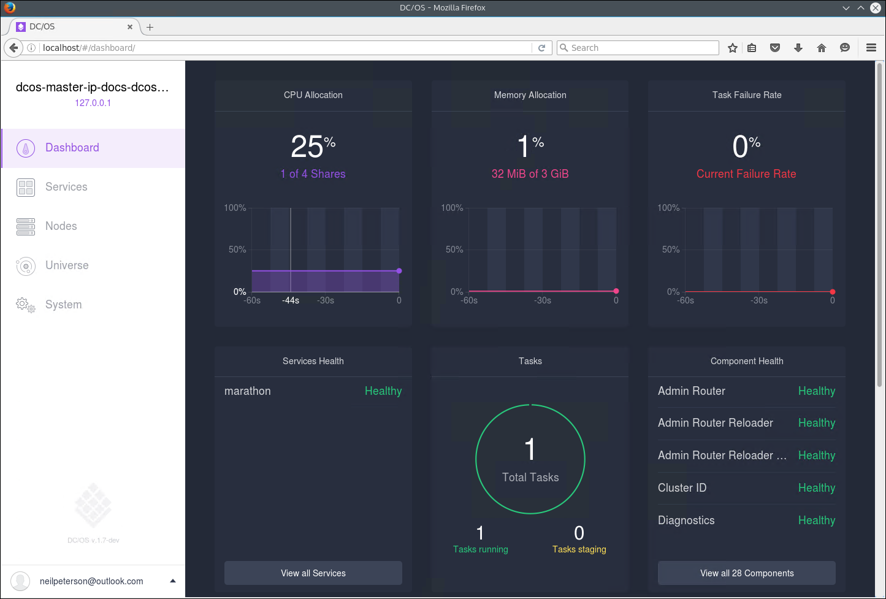
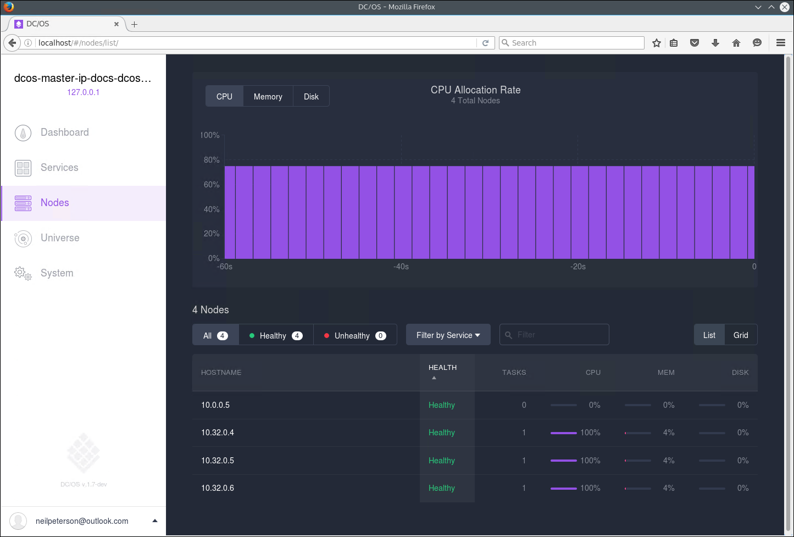

<properties
   pageTitle="透過網頁 UI azure 容器服務容器管理 |Microsoft Azure"
   description="使用 Marathon 網頁 UI，容器部署至 Azure 容器服務叢集服務。"
   services="container-service"
   documentationCenter=""
   authors="neilpeterson"
   manager="timlt"
   editor=""
   tags="acs, azure-container-service"
   keywords="Docker，容器，微服務，Mesos、 Azure"/>

<tags
   ms.service="container-service"
   ms.devlang="na"
   ms.topic="get-started-article"
   ms.tgt_pltfrm="na"
   ms.workload="na"
   ms.date="09/19/2016"
   ms.author="timlt"/>

# <a name="container-management-through-the-web-ui"></a>透過網頁 UI 容器管理

DC/OS 提供的部署及縮放叢集的負載，同時基礎硬體環境。 DC/OS，上方有管理排程和執行計算工作負載的架構。

適用於許多熱門的工作負載架構時，這份文件會說明如何建立及調整 Marathon 與容器部署。 這些範例使用之前，您必須 DC/OS 叢集中 Azure 容器服務設定。 您也需要遠端連線到此叢集。 如需有關這些項目的詳細資訊，請參閱下列文章︰

- [部署 Azure 容器服務叢集](container-service-deployment.md)
- [連線到 Azure 容器服務叢集](container-service-connect.md)

## <a name="explore-the-dcos-ui"></a>探索 DC/OS 使用者介面

與建立安全命令介面 (SSH) 通道，瀏覽至 http://localhost/。 這會載入 DC/OS 網頁 UI，並顯示叢集，例如使用的資源作用中的代理程式，與執行服務的相關資訊。


## <a name="explore-the-marathon-ui"></a>探索 Marathon UI

若要查看 Marathon UI，瀏覽至 http://localhost/Marathon。 從這個畫面中，您可以在 Azure 容器服務 DC/OS 叢集開始新的容器或其他應用程式。 您也可以查看執行容器和應用程式的相關資訊。  


## <a name="deploy-a-docker-formatted-container"></a>部署 Docker 格式化容器

使用 Marathon 部署新的容器，按一下 [**建立應用程式**] 按鈕，然後表單中輸入下列資訊︰

功能變數           | 值
----------------|-----------
識別碼              | nginx
圖像           | nginx
網路         | 橋
Host （主機） 連接埠       | 80
通訊協定        | TCP


如果您想要靜態代理程式的連接埠對應容器連接埠，您需要使用 JSON 模式。 若要這麼做，請切換至**JSON 模式**新的應用程式精靈，使用切換。 然後，請輸入下`portMappings`應用程式定義的區段。 此範例會連接埠 80 容器的繫結 DC/OS 代理程式的連接的埠 80。 進行這項變更後，您可以切換結束 JSON 模式此精靈。

```none
"hostPort": 80,
```


DC/OS 叢集部署私人及公用的代理程式的一組。 若要從網際網路存取應用程式叢集，您需要部署至公用代理程式的應用程式。 若要這麼做，請選取新的應用程式精靈中的 [**選項**] 索引標籤，輸入**slave_public** **接受資源角色**。


回到 Marathon 主頁面上，您可以看到容器的部署狀態。


當您切換回 DC/OS 網頁 UI (http://localhost/) 時，您會看到的 DC/OS 叢集上執行工作 （在此例中 Docker 格式化容器）。



您也可以查看叢集節點上所執行的工作。


## <a name="scale-your-containers"></a>不按比例縮放您容器

若要縮放的容器執行個體計數，您可以使用在 Marathon ui。 若要這麼做，請瀏覽至**Marathon**頁面選取您想要縮放的容器，按一下 [**縮放比例**] 按鈕。 在 [**縮放比例應用程式**] 對話方塊中，輸入您要的容器執行個體數目並選取**縮放比例應用程式**。

![Marathon UI-比例應用程式] 對話方塊](media/dcos/dcos10.png)

[小數位數] 作業完成後，您會看到相同的工作分散到 DC/OS 代理程式的多個執行個體。




## <a name="next-steps"></a>後續步驟

- [使用 DC/OS 和 Marathon API](container-service-mesos-marathon-rest.md)

Azure 容器服務與 Mesos 深度剖析

> [AZURE。影片] azurecon-2015-deep-dive-on-the-azure-container-service-with-mesos]
