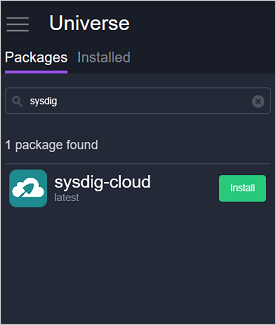
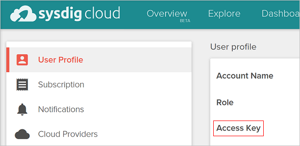

<properties
   pageTitle="監控 Sysdig Azure 容器服務叢集 |Microsoft Azure"
   description="監控 Sysdig Azure 容器服務叢集。"
   services="container-service"
   documentationCenter=""
   authors="rbitia"
   manager="timlt"
   editor=""
   tags="acs, azure-container-service"
   keywords="容器，亦即/OS，Azure"/>

<tags
   ms.service="container-service"
   ms.devlang="na"
   ms.topic="get-started-article"
   ms.tgt_pltfrm="na"
   ms.workload="na"
   ms.date="08/08/2016"
   ms.author="t-ribhat"/>

# 監控 Sysdig Azure 容器服務叢集

本文中，我們會將 Sysdig 代理程式部署至 Azure 容器服務叢集中的所有代理程式節點。 您需要此設定 Sysdig 的帳戶。 

## 必要條件 

[部署](container-service-deployment.md)，並[連線](container-service-connect.md)叢集 Azure 容器服務所設定。 探索[Marathon UI](container-service-mesos-marathon-ui.md)。 移至[http://app.sysdigcloud.com](http://app.sysdigcloud.com)設定 Sysdig 雲端帳戶。 

## Sysdig

Sysdig 是可讓您監視您容器內叢集監視服務。 以協助疑難排解已知 Sysdig，但也有您基本的監控指標的 CPU、 網路、 記憶體和 I/O。 Sysdig 方便您將看看的容器 hardest 或基本上使用最記憶體和 CPU。 此檢視會在 [概觀] 區段中，目前位於 beta。 

 

## 設定 Marathon Sysdig 部署

這些步驟說明如何設定和部署與 Marathon 叢集 Sysdig 應用程式。 

存取您的 DC/OS 使用者介面，透過[http://localhost:80 /](http://localhost:80/) DC/OS ui 上一次瀏覽至 「 Universe 」，這是在左下方，然後搜尋 「 Sysdig 」。

現在若要完成設定您需要 Sysdig 雲端帳戶或免費的試用帳戶。 一旦您登入 Sysdig 雲端網站，您的使用者名稱，按一下，然後在頁面上，您應該會看到您的 「 便捷鍵 」。 

 

下一步輸入內 DC/OS Universe Sysdig 設定您的便捷鍵。 

現在設定 10000000 執行個體，因此叢集 Sysdig 加入新的節點時將會自動部署代理程式的新節點。 這是以確定 Sysdig 部署至叢集內的所有新代理程式中期解決方案。 

安裝之後套件瀏覽至 Sysdig UI，然後您就可以瀏覽不同的使用方式的指標內叢集容器。 