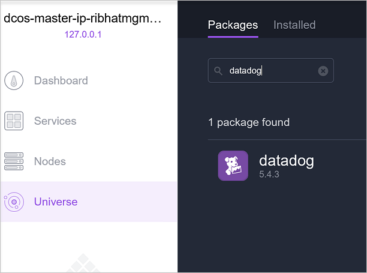

<properties
   pageTitle="監控 Datadog Azure 容器服務叢集 |Microsoft Azure"
   description="監控 Datadog Azure 容器服務叢集。 使用 DC/OS 網頁 UI 叢集部署 Datadog 代理程式。"
   services="container-service"
   documentationCenter=""
   authors="rbitia"
   manager="timlt"
   editor=""
   tags="acs, azure-container-service"
   keywords="容器，亦即/OS，Docker 廣域 Azure"/>

<tags
   ms.service="container-service"
   ms.devlang="na"
   ms.topic="article"
   ms.tgt_pltfrm="na"
   ms.workload="infrastructure"   
   ms.date="07/28/2016"
   ms.author="t-ribhat"/>

# 監視使用 Datadog Azure 容器服務叢集

本文中我們會將 Datadog 代理程式部署至 Azure 容器服務叢集中的所有代理程式節點。 此設定，您將需要 Datadog 的帳戶。 

## 必要條件 

[部署](container-service-deployment.md)，並[連線](container-service-connect.md)叢集 Azure 容器服務所設定。 探索[Marathon UI](container-service-mesos-marathon-ui.md)。 移至[http://datadoghq.com](http://datadoghq.com)設定 Datadog 帳戶。 

## Datadog 

Datadog 是從您的容器內 Azure 容器服務叢集收集監控資料監視服務。 Datadog 有 Docker 整合儀表板讓您能夠看到您容器內的特定的指標。 從您的容器收集到的指標安排 CPU、 記憶體、 網路和 I/O。 Datadog 容器和圖像分割指標。 以下是範例 UI 的 CPU 使用率的外觀

## 設定 Marathon Datadog 部署

這些步驟說明如何設定和部署與 Marathon 叢集 Datadog 應用程式。 

存取您的 DC/OS 使用者介面，透過[http://localhost:80 /](http://localhost:80/)。 一次在 DC/OS ui 上瀏覽至 「 Universe 」 左下方的和搜尋 「 Datadog 」，按一下 「 安裝 」。

現在若要完成設定您需要 Datadog 或免費的試用帳戶。 一旦您左邊的 Datadog 網站外觀登入並移至 [整合]-> 然後 API 的。 

下一步輸入內 DC/OS Universe Datadog 設定您的 API 金鑰。 

 

在上述設定執行個體設定為 10000000 作業時加入新的節點是叢集 Datadog 會自動將代理程式部署至該節點。 這是中期的解決方案。 一旦您已安裝的套件，您應該瀏覽回 Datadog 網站，並尋找 「 儀表板]。 從這裡，您會看到自訂及整合儀表板。 Docker 整合儀表板有監控叢集，您需要的所有容器指標。 
