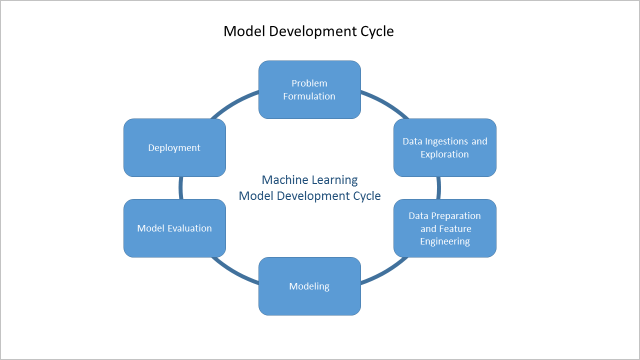

<properties
    pageTitle="視需要預測的能源 Cortana 智慧解決方案範本 Playbook |Microsoft Azure"
    description="使用 Microsoft Cortana 智慧可預測能源公用程式公司的解決方案範本。"
    services="cortana-analytics"
    documentationCenter=""
    authors="ilanr9"
    manager="ilanr9"
    editor="yijichen"/>

<tags
    ms.service="cortana-analytics"
    ms.workload="data-services"
    ms.tgt_pltfrm="na"
    ms.devlang="na"
    ms.topic="article"
    ms.date="01/24/2016"
    ms.author="ilanr9;yijichen;garye"/>

# 視需要預測的能源 Cortana 智慧解決方案範本 Playbook  

## 執行摘要  

過去幾年網際網路的項目 (IoT)、 替代能源來源和大型資料您合併到公用程式與精力網域中建立大量的商機。 同時，公用程式，並整個能源類股過消耗簡維消費者要求控制的能源其用途的好方法。 因此，公用程式並智慧格線公司是非常需要創新和續訂本身。 此外，許多 power 及公用程式方格變得過時和維護及管理很高。 在最後一年，小組目前正在預訂能源網域中的數字。 在這些互動，我們有遇到的工具或 Isv （獨立軟體廠商） 在尋找將預測未來能源指定的許多情況。 這些預測其目前和未來的企業中播放重要的角色，並有成為各種不同的使用案例的基礎。 包括簡短與長期 power 載入預測、 交易、 負載平衡、 格線最佳化等。大型資料和進階分析 (AA) 方法例如機器學習 （毫升） 是金鑰 enablers 產生正確且可靠的預測。  

在此 playbook，我們將放在一起的商務及分析所需的成功的開發的指導方針，部署能源要求的預測解決方案。 這些建議的指導方針可協助工具程式、 資料科學家和資料工程師建立完全 operationalized 雲端、 需求預測的解決方案。 其大型資料和進階的分析路剛開始的公司，這種解決方案可能代表其長期智慧的格線策略中的初始種子。

>[AZURE.TIP] 若要下載的圖表，提供此範本的建築概觀，請參閱[Cortana 智慧解決方案範本架構 demand 預測的能源](cortana-analytics-architecture-demand-forecasting-energy.md)。  

## 概觀  

這份文件涵蓋商務資料，與技術層面的使用 Cortana 智慧和在特定 Azure 電腦學習 (AML) 實作及部署能源預測的解決方案。 文件包含三個主要部分︰  

1. 商務用的瞭解程度  
2. 資料的瞭解程度  
3. 技術

**商務瞭解**組件概述了解並進行投資決策之前請考慮您需要的商務外觀。 它說明如何限定先後，以確保預測分析及電腦學習都確實有效且可用的商務問題。 文件進一步說明電腦學習及如何使用地址能源預測問題的基本概念。 必要條件和驗證準則的使用案例列出了。 部分範例使用情況和商務案例另外也提供案例。

資料是任何電腦學習解決方案的主要因素。 這份文件的**資料了解**部分說明一些重要的資料。 列出了所需的能源預測、 資料品質需求和一般存在於哪些資料來源的資料類型。 我們也會說明如何使用原始資料準備實際驅動模型中的組件的資料功能。

文件的第三部分涵蓋解決方案的**技術實作**外觀。 功能工程和建立模型有資料科學程序的核心，，因此討論的一些詳細資料。 矩形是雲端部署的預測狀況分析解決方案的重要車輛的 web 服務的概念。 我們也大綱端對端 operationalized 解決方案的一般的架構。

此外，在文件會包含可用來取得更進一步瞭解網域和技術的參考資料。

請務必請注意，我們不想要在這份文件中涵蓋更深入的資料科學程序，其數學和技術層面。 [Azure 毫升文件](http://azure.microsoft.com/services/machine-learning/)和[部落格](http://blogs.microsoft.com/blog/tag/azure-machine-learning/)可以找到這些詳細資料。

### 目標對象   
這份文件的目標對象商務，並且技術人員想要取得知識及電腦學習了解基礎的解決方案並如何使用這些內能源預測的網域。

資料科學家可以也可以從讀取高層級的磁碟機的預測解決方案能源部署程序的深入瞭解此文件。 在這個內容，也可建立好的比較基準，起點如需更多詳細和進階的資料。

### 產業趨勢  
過去幾年 IoT、 替代能源來源和大型資料您合併到公用程式與精力空間中建立大量的商機。 同時，公用程式，並整個能源︰ 類股過消耗簡維消費者要求控制的能源其用途的好方法。

許多公用程式和智慧能源公司則有已開創性部署進行的情況下使用方格所產生的資料使用的數字的[智慧的格線](https://en.wikipedia.org/wiki/Smart_grid)。 許多的使用情況下為中心的電力生產固有特性︰ 無法累積或出儲存為清單。 因此，所必須使用。 想要更有效率的公用程式需要只要預測 power 消耗因為的會為其授與大於**遞減供應與視需要**功能，因此禁止能源 wastage、**減少 greenhouse 石油器發出**與控制成本。

交談的成本，當有另一個重要的觀點，這是價格。 預測**未來的要求和未來價格電力**非常需要帶入貿易 power 之間公用程式的新功能。 這可以協助決定其生產區的公司。

當我們使用 「 智慧 「 word 時，我們實際參考格線可以進一步瞭解，然後進行預測。 它可以將會季節性消耗，以及**預見暫時超載的情況下，並且自動調整為其**變更。 藉由遠端調整消耗 （含這些智慧公尺說明），可以處理本地化超量的狀況情況。 **第一次預測，然後再做**格線讓自己能夠事半功倍一段時間。

這份文件，我們將焦點放在特定的封面的未來，預測的使用案例系列的其餘部分簡短的字詞，然後長期能源需求。 我們已在這些區域中的幾個月工作，並獲得了一些知識庫和技巧，讓我們來產生產業成績的結果。 其他的使用案例將涵蓋以及文件中不久。

## 商務用的瞭解程度

### 業務目標
**能源示範**目標是示範一般的預測狀況分析及電腦學習解決方案，可以部署在最短時間範圍。 具體來說，我們目前的焦點會放在啟用能源 demand 預測的解決方案，使其商業價值可以快速支付的時間，並在運用。 此 playbook 中的資訊可協助完成下列目標客戶︰
-   簡短時間值的電腦學習基礎解決方案
-   可展開試驗使用其他的使用案例或較大的範圍，根據業務需要的大小寫
-   快速取得 Cortana 智慧套件產品知識

記住這些目標，此 playbook 旨在進行商業和技術，可以幫助達成目標的知識。

### Power 載入並視需要預測
能源類股中可能有哪些 demand 預測可協助解決重要的商務問題的多種方式。 事實上，視需要預測可以考慮許多核心使用情況下，在產業的基礎。 一般而言，我們請考慮使用兩種類型的能源需求預測︰ 短期和長期。 每個可能不同的用途，並使用不同的方法。 兩個主要的差異是時間的預測的水平，我們要為其預測未來表示範圍。

#### 簡短字詞載入預測
在能源視需要的內容，簡短字詞載入預測 (STLF) 的定義預測近期的格線 （或整個格線） 的各個部分中的彙總載入。 在此情況下，短期定義為 1 小時到 24 小時的時間範圍內的時間水平。 在某些情況下，也有可能是 48 小時的水平。 因此，STLF 是常見格線的操作使用大小寫。 以下是一些範例 STLF 導向使用案例︰
-   平衡供應與需求
-   Power 交易支援
-   市場進行 (設定 power price)
-   格線操作最佳化
-   [視需要回應](https://en.wikipedia.org/wiki/Demand_response)
-   尖峰 demand 預測
-   視需要端管理
-   負載平衡與超載防止
-   長期載入預測
-   錯誤與異常偵測
-   最大使用量 curtailment/撫平 

STLF 模型大多根據近期過去的經驗 （最後一天或週） 消耗資料和使用預測溫度為重要的預測。 取得正確的溫度預測的下一個小時，設定為 24 小時變得更少的挑戰現在天。 這些模型是不區分季節性圖樣或長期消耗趨勢。

SLTF 解決方案也可能會產生大量的預測通話 （服務要求） 因為它們會被叫用地，在某些情況下即使使用較高的頻率。 也是常見若要查看的 implantation 位置以獨立模型表示每個個別分站或轉換程式，因此大量預測要求更大。

#### 長期載入預測
目標的長字詞載入預測 (LTLF) 是以多個月 （和在某些情況下的年數） 介於 1 週時間水平與預測 power 需求。 此範圍的重要考試大多適用於規劃，而投資使用案例。

長期案例中，務必高品質的資料，包括範圍內的多個年 （最少 3 年）。 這些模型通常會從歷程記錄的資料擷取季節性模式並使用外部 predicators 例如為天氣和趨勢模式。

請務必釐清的較長的預測的重要考試，預測可能不正確。 因此務必以產生一些信賴時間間隔，以及實際預測，讓人們因素將其規劃的程序可能的變化。

由於 LTLF 的使用案例大多計劃，我們預期更低的預測區 （相較於 STLF)。 我們通常會看到這些視覺效果的工具，例如 Excel 或中將內嵌的預測，並由使用者手動呼叫。

### 長時間與簡短字詞字詞預測
下表會比較 STLF 和 LTLF 的最重要的屬性︰

|屬性|短期載入預測|長期載入預測|
|---|---|---|
|預測水平|從至 48 小時 1 小時|從 1 到 6 個月或更多|
|資料資料粒度|每小時|每小時或每日|
|一般的使用案例|<ul><li>視需要/供應平衡</li><li>挑選小時預測</li><li>視需要回應</li></ul>|<ul><li>長期規劃</li><li>格線資產規劃</li><li>資源規劃</li></ul>|
|一般的預測|<ul><li>日或週</li><li>日期的小時</li><li>每小時的溫度</li></ul>|<ul><li>年的月份</li><li>月份的日期</li><li>長期溫度和趨勢</li></ul>|
|歷程記錄的資料範圍|資料三年價值|資料到 10 五年的價值|
|一般的正確性|MAPE * 5%或較低|MAPE * 或較低的 25%|
|預測的頻率|產生每小時或每 24 小時|產生後每月、 季或每年|
\*[MAPE](https://en.wikipedia.org/wiki/Mean_absolute_percentage_error) – 平均數 Average 百分比錯誤

當可看見這個資料表中，是相當重要區別簡短和長期預測案例，以及這些代表不同的業務需求可能會有不同的部署和消耗模式。

### 範例使用案例 1: eSmart 系統 – 超量的狀況最佳化
[智慧格線](https://en.wikipedia.org/wiki/Smart_grid)的重要的角色是動態持續最佳化，並調整變更消耗模式。 這是短期主要所造成的溫度變動 （*例如*，更多 power 用於 air 條件或加熱） 的修訂，可能會受到影響 power 消耗。 同時，也會受長期趨勢的電源消耗。 這些可能包含季節性效果與國際假日、 長期消耗等比級數，甚至經濟各種因素消費者索引與石油價格 GDP。

在此使用情況下， [eSmart](http://www.esmartsystems.com/)要部署可預測的超量的狀況狀況在任何指定分站方格的傾向雲端解決方案。 特別 eSmart 想要識別 substations 可能超載中的下一個小時，若要避免或解決這種情況可能會採取立即的動作。

正確，然後按一下 [快速執行預測需要實作三個預測模型︰
-   時間有多長，可在每個分站期間週或下一個幾個月的 power 耗用的預測的字詞模型
-   短期模型，可讓超量的狀況上指定的分站中的情況下一個小時期間的預測
-   提供的未來的溫度預測在多個案例的溫度模型

長期模型的目標是排列 substations 依其傾向到下一週或月期間超載 （指定 power 傳輸能力）。 這樣就可以做為輸入，這是短期的預測的 substations 短清單的建立。 溫度是長期模型重要預測工具，就需要經常產生多個案例溫度預測與摘要其做為到長期模型的輸入。 短期預測然後叫用來預測哪些分站有可能超載移到下一個小時。

每個分站每個人部署短期與長期模型。 因此，這些模型的實際執行需要大量協調流程。 若要取得更高的預測精確度短期，更細緻的模型專用的一天的每個小時。 所有的模型完成允許足夠的時間來回應和採取一些預防動作，如有需要幾分鐘內執行，以及執行的是每小時。 此模型的集合訓練期刊使用最新的資料保持最新版本。

您可以找到有關此使用案例[此處](https://customers.microsoft.com/Pages/CustomerStory.aspx?recid=18945)。

#### 使用大小寫的完整名稱準則 – 先決條件
主要強度 Cortana 智慧是部署及電腦學習中心解決方案不按比例縮放功能強大的能力。 用來支援千分位的同時執行的預測。 它可以自動縮放以符合消耗圖樣的變更。 因此，解決方案的焦點會放在正確性和計算效能中。 例如，公用程式公司有興趣產生正確能源 demand 預測的下一個小時，以及一天的每個小時。 另一方面，我們會較不想回答問題為什麼要為它預測要求 （模型本身會負責的）。

因此務必瞭解而非所有使用情況下，與商務問題可以有效率地解決使用電腦學習。

Cortana 智慧及電腦學習可能是相當有效符合下列條件時解決指定的商務問題︰
-   在手商務問題是**預測**的。 預測使用大小寫的範例是公用程式公司想要預測指定分站 power 負載期間的下一個小時。 另一方面，分析及排名的歷程記錄驅動程式是需求的**描述性**性質，因此不適用。
-   預測有所採取有**動作路徑**清除。 例如，預測分站超載期間的下一個小時可以觸發主動式的動作，減少該分站與相關聯的載入和因而可能會導致超量的狀況。
-   使用案例代表**一般問題類型**這類時解決它可以基石解決其他類似使用案例。
-   客戶可以設定示範成功的方案實作**品質和數量的目標**。 量化目標能源 demand forecast，例如是必要的精確度閥值 （*例如*，則可以為 5%錯誤） 或當預測分站超載然後 （true 測率） 的精確度和上方臨界值應該回收 （true 正數的範圍）。 這些目標應該從客戶的商務目標。
-   有清除**整合案例**與公司的商務工作流程。 例如，分站載入預測可以整合格線的控制中心，若要允許超量的狀況防止活動。
-   客戶已準備好使用**足夠的品質的資料**來支援使用大小寫 （請參閱更多在下一個區段中，**資料品質**，此 playbook 的）。
-   客戶如何雲端中心的資料結構，或**雲端電腦學習**，包括 Azure 毫升和其他 Cortana 智慧套件元件。
-   客戶是願意建立**端對端資料流程**該功能傳送資料至雲端當前，和解決方案以**operationalize**願意。
-   客戶已準備好的**專用的資源**將初始試驗計畫期間積極互動，以便可以順利完成時的客戶傳輸知識和解決方案的擁有權限。
-   客戶資源應該**熟悉資料專業**，最好是資料科學家。

根據上述條件的使用案例的完整名稱可以大幅改善使用案例的成功率，並建立好攻擊的實作，供日後使用情況下。

### 雲端解決方案
Cortana 智慧套件上 Azure 是位於雲端的整合式的環境。 在雲端環境中的進階的分析方案的部署含有許多優點，適用於企業和同時可能表示顯示較大的變更，還是使用內部部署的 IT 解決方案的公司。 能源類股有清除逐漸移轉到雲端運算的趨勢。 此趨勢以及智慧格線的開發進入手手中，如上述**產業趨勢**所述。 為此 playbook 著重於能源網域中的雲端方案，請務必說明優點，以及其他部署雲端解決方案的考量。

或許雲端解決方案的最大優點是成本。 解決方案以使用雲端部署元件] 沒有任何些預先成本或與其相關聯的 COGS （成本的商品銷售） 元件成本。 這表示投資硬體、 軟體和 IT 進行的維修作業，不需要，因此沒有獲得超乎減少商務風險。

另一個重要的優點是以雲端為基礎的解決方案的 pay-as-you-go 成本結構。 雲端運算或儲存空間的伺服器可以部署或縮放只-視需要為基礎。 這代表成本效率的優點以雲端為基礎的解決方案。

最後，不是需要的投資 IT 進行的維修作業或未來的基礎結構開發為所有這是雲端服務的一部分。 若要該範圍內，Cortana 智慧套件類別服務中包含最適合，其藍圖會持續不斷發展。 新功能、 元件和功能的持續簡略並發展。

公司，只要啟動其轉換為雲端，我們強烈建議實作雲端移轉藍圖採取漸進的方式。 我們相信公用程式或能源網域中的公司，在此 playbook 中所討論的使用案例代表試驗雲端中的預測狀況分析解決方案的絕佳機會。

#### 公司的大小寫對齊考量
在許多情況下，客戶可能會感興趣的進行業務上指定的使用案例的雲端解決方案及電腦學習的重要元件。 不同於內部部署解決方案，以雲端為基礎的解決方案，些預先成本元件是最小，大部分的成本項目會與實際的使用狀況相關聯。 部署能源預測上 Cortana 智慧套件解決方案時，可以使用單一常見成本結構整合多個服務。 例如資料庫 （*例如*，SQL Azure） 可以用來儲存的原始資料，然後針對實際預測 Azure 毫升用來裝載預測的服務。 在此範例中，儲存與交易元件，可能包含成本結構。

另一方面，其中一個應該瞭解作業系統預測 （短期或長期項） 的能源要求的商業價值。 事實上，請務必瞭解每個預測作業的商業價值。 例如對於 24 小時的預測 power 載入造成 overproduction 或可協助以防超載方格上的，這可以 quantified 而言財務儲蓄每日。

基本的公式計算指定的財務優點的預測的解決方法是︰

由於 Cortana 智慧套件提供 pay-as-you-go 價格模型，就不需要的支付此公式固定的成本元件。 此公式可以計算每日、 每月或每年的基準。

您可以找到目前 Cortana 智慧套件和 Azure 毫升資費方案[此處](http://azure.microsoft.com/pricing/details/machine-learning/)。

### 解決方案開發程序
開發週期的預測解決方案通常涉及 4 階段，我們會將所有的能源視需要使用雲端技術及 Cortana 智慧套件內的服務。

下圖所示︰

下列段落說明此 4 步驟程序︰

1.  **資料收集**– 任何基礎的進階的分析解決方案依賴 （請參閱**資料瞭解**） 的資料。 具體來說，預測狀況分析及預測時，我們需要進行中的動態資料流動。 若是能源 demand 預測，此資料直接從智慧公尺，取得資料的來源，或已在內部部署資料庫彙總。 我們也依賴其他外部資料來源的溫度天氣等。 必須協調、 排程，以及儲存此進行中的資料流量。 [Azure 資料工廠](http://azure.microsoft.com/services/data-factory/)(ADF) 是我們主 workhorse 完成此項工作。
2.  **模型**– 且可靠能源的預測，其中一個必須開發 （訓練），並維持很棒的模型會讓使用的歷程記錄的資料，並擷取資料的有意義和預測模式。 區域的電腦學習 （毫升） 具有快速成長與更進階的演算法定期開發。 Azure 毫升 Studio 提供絕佳的使用者體驗可利用最進階的毫升演算法內完成的工作流程。 該工作流程所示直覺式的流程圖，其中包含資料準備、 功能擷取、 模型、 和模型評估。 使用者可以拉下數百個會包含在此環境中的各種模型中。 此階段中的最後資料科學家會有不完整評估並準備好進行部署的工作模型。

    下圖是一般工作流程範例︰

    

3.  **部署**– 使用模型中下, 一步是部署。 以下模型會轉換成公開可以透過網際網路上的各種消耗用戶端同時叫用 RESTful API web 服務。 Azure 毫升提供的部署模型，直接從 Azure 毫升 Studio 中，按一下] 按鈕的簡單的方法。 顯示進階設定，這時整個部署程序。 此方案可以自動調整，以符合必要的消耗。

4.  **消耗**– 在階段中，我們實際將使用的預測模型來產生預測。 被課消費稅可以從使用者應用程式 （*例如*，儀表板） 驅動或直接從例如操作系統需求/供應平衡系統或格線最佳化解決方案。 多個的使用情況下可以趕單一模型。

## 資料的瞭解程度
之後涵蓋預測解決方案的能源要求的企業考量 （請參閱**瞭解商務**），我們已準備好要討論資料組件。 任何預測分析解決方案依賴可靠的資料。 對於能源 demand 預測，我們依賴歷史消耗資料粒度的各種層級的資料。 該記錄的資料作為資源。 它會經歷的資料科學家會識別 （又稱為功能） 的預測可以放到模型中的最後會產生所需的預測仔細分析。

在此區段的其餘部分中，我們會說明不同的步驟和考量了解資料，以及如何將它顯示在 [可用的表單。

### 模型開發週期
製作良好的預測模型需要一些小心準備與規劃。 分解模型程序，將多個步驟，並將焦點放在一個步驟，一次無法大幅改善整個程序的結果。

下圖說明如何模型程序可以細分為多個步驟︰

可以看出循環圖組成的六個步驟︰
-   問題化
-   資料 ingestion 及資料探索
-   資料準備工作及功能工程
-   模型
-   模型評估
-   開發

本節的其餘部分中我們會說明的個別步驟和項目，請考慮在每個步驟。

### 問題化
我們可以考慮問題編寫，您需要採取之前執行任何預測分析解決方案的最重要步驟。 以下我們想要轉換的商務問題和分解，只要使用資料與模型技巧可以解決的特定項目。 最好制定問題，我們想要回答的問題的一組。 以下是一些可能適用的能源 demand 預測範圍內的可能問題︰
-   中的下一個小時或天有什麼個別分站預期的負載？
-   一天的時間，將我格線體驗最大使用量需求？
-   如何可能是我的格線以進行維持預期的最大使用量載入？
-   Power 站產生一天的每個小時期間的多少 power？

制定這些問題讓我們將焦點集中在取得正確的資料，並執行完整對齊手邊商務問題的解決方案。 此外，我們可以再設定一些主要的度量，讓我們來評估模型的效能。 比方說，如何正確預測應且功能仍可接受的企業的錯誤的範圍嗎？

### 資料來源
從不同的組件和元件，格線的現代化的智慧方格會收集的資料。 這項資料代表作業的各方面和 power 格線的使用狀況。 範圍內的預測能源需求，我們會限制，討論的實際 demand 耗用的資料來源。 能源耗用的一個重要的來源是智慧公尺。 公用程式各地其消費者用快速部署智慧公尺。 智慧公尺錄製實際 power 消耗，並持續轉接給公用程式公司這個資料。 收集資料，並傳送回在固定的間隔，範圍是從每個 5 分鐘，為 1 小時。 更多進階的智慧公尺可以從遠端設計來控制及平衡家庭成員中實際的消耗。 智慧量表資料相當可靠，，其中包括時間戳記。 可讓您指定預測重要的因素。 量表資料可以彙總 （總和應設定） 格線拓撲內的各個層級︰*轉換程式、 分站、 地區等*。然後，我們可以挑選所需的彙總層級，若要為其建立預測模型。 例如，如果公用程式公司想要預測未來載入每個其格線 substations 所有公尺資料可以會彙總的每個個別分站然後做為預測模型輸入。 我們會將智慧公尺為內部資料來源。

其他外部資料來源也將依賴可靠能源 demand 預測。 一個重要的因素的影響 power 消耗是天氣或更精確地溫度。 歷程記錄的資料顯示強式外部溫度與 power 消耗之間的相互關聯。 熱門夏季天內，讓使用者皆使用其 air 氣溫和期間冬天的到來電源加熱系統。 歷史溫度格線位置的可靠的來源，因此是鍵。 此外，我們也依賴正確預測的溫度為 power 耗用的預測。

其他外部資料來源也有助於建置能源 demand 預測的模型。 這些可能包含長期氣象變更經濟索引 （*例如*，GDP），與其他人。 在這份文件中我們不會包含這些其他資料來源。

### 資料結構
之後找出所需的資料來源，我們想要確保原始已經收集的資料包含正確的資料的各項功能。 若要建立可靠的需求預測的模型，我們會需要確保收集的資料包含資料元素，可協助您預測未來的要求。 以下是有關的原始資料的資料結構 （結構描述） 的一些基本需求。

原始的資料包含列和欄。 每個度量單位表示為單一資料列。 每一個資料列包含多個資料行 （也稱為功能或功能變數）。

1.  **時間戳記**– 時間戳記欄位代表度量單位錄製時的實際時間。 它必須符合其中一種常見的日期/時間格式。 日期與時間的組件應該包括在內。 在大部分情況下，沒有必要記錄的第二個層級前次。 請務必指定資料記錄中的時區。
2.  **量表識別碼**此欄位識別計量器或度量單位裝置。 它的分類變數，並可以是數字與字元的組合。
3.  **消耗值**-這是在指定的日期/時間的實際消耗。 消耗可能以 kWh (kilowatt-hour) 或任何其他慣用的單位。 請務必請注意，在資料中的所有度量單位必須保持一致的度量單位。 在某些情況下，消耗可提供超過 3 power 階段。 在此情況下我們需要收集所有獨立消耗階段。
4.  **溫度**– 溫度通常會收集從獨立的來源。 不過，應該與消耗量資料相容。 應該包含可讓它與實際消耗資料進行同步處理的時間戳記上方所述。 中度攝氏或華氏可以指定溫度值，但應該保持一致上所有的度量單位。
5.  **位置︰**[位置] 欄位是一般與已經收集的溫度資料的位置。 它可以表示為郵遞區號數字或經緯度 （lat/長） 的格式。

下表顯示建議的消耗和溫度資料格式的範例︰

|**日期**|**時間**|**量表識別碼**|**階段 1**|**階段 2**|**階段 3**|
|--------|--------|------------|-----------|-----------|-----------|
|7/1/2015|10:00:00|ABC1234     |7.0        |2.1        |5.3        |
|7/1/2015|10:00:01|ABC1234     |7.1        |2.2        |4.3        |
|7/1/2015|10:00:02|ABC1234     |6.0        |2.1        |4.0        |

|**日期**|**時間**|**位置**|**溫度**|
|--------|--------|-------------|---------------|
|7/1/2015|10:00:00|11242        |24.4           |
|7/1/2015|10:00:01|11242        |24.4           |
|7/1/2015|10:00:02|11242        |24.5           |

當可看見上方，此範例中包含消耗 3 power 階段與相關聯的 3 個不同的值。 此外，請注意會分隔 [日期及時間] 欄位，但是他們也可以結合為單一資料行。 在此情況下 [位置] 欄會以 5 位數郵遞區號格式和攝氏格式溫度來表示。

### 資料格式
Cortana 智慧套件可支援最常見的資料格式，如*CSV、 TSV、 JSON 等*。請務必針對整個專案生命週期保持一致的資料格式。

### 資料 Ingestion
能源 demand 預測會經常與常見問題的預測，因為我們必須確保原始資料在傳送以純色和可靠的資料 ingestion 程序。 Ingestion 程序必須保證的原始資料目前使用的預測的程序所需的時間。 隱含資料 ingestion 頻率應大於預測的頻率。

例如︰ 如果預測解決方案我們 demand 會產生新預測在每日 8:00 AM，則需要以確保所有具有過去 24 小時期間已收集的資料具有該點直到完全 ingested，甚至包含資料的最後一個小時。

若要這麼做，Cortana 智慧套件提供支援可靠的資料 ingestion 程序的各種方法。 這將會進一步討論此文件的 [**部署**] 區段中。

### 資料品質
從原始資料來源所需執行可靠和正確 demand 預測必須符合一些基本資料品質準則。 雖然進階統計方法可以用來賠償一些可能的資料品質的問題，我們仍然需要確認 ingesting 新的資料時，我們會交叉一些基本資料品質閥值。 以下是一些考量指派原始資料品質︰
-   **遺漏的值**-這是指這種情況時未收集特定的度量單位。 基本的需求，是遺漏的值工資率應該不大於 10%任何特定期間。 大小寫單一值會遺失其表示使用預先定義的值 (例如: 「 9999 」) 並不 '0'，這可能是有效的度量單位。
-   **測量正確性**– 被課消費稅或溫度的實際值記錄應正確。 不正確的度量單位會產生不正確的預測。 一般而言，度量單位錯誤應該低於 1%相對於，則為 true 的值。
-   **時間的度量**– 需要資料的實際時間戳記收集不符合多個 10 秒相對於實際的度量單位，則為 true 時，會。
-   **同步處理**– 使用多個資料來源時 （*例如*消耗量與溫度） 我們必須確認那里都沒有時間同步處理問題它們之間。 這表示間的兩個獨立的資料來源的任何資料收集時間戳記不應該超過超過 10 秒。
-   **延遲**-所述上述**資料 Ingestion**，我們會取決於可靠的資料流程和 ingestion 程序。 若要控制的我們必須確保我們控制資料延遲。 指定為拍攝實際的度量單位的時間和時間的已載入到 Cortana 智慧套件儲存為可供使用的時間差異。 針對短期載入預測的總延遲不應該大於 30 分鐘。 針對長期載入預測的總延遲不應大於 1 天。

### 資料準備工作及功能工程
從原始資料已 ingested （請參閱**資料 Ingestion**） 並安全地儲存之後，就準備好進行處理。 資料準備階段基本上採取的原始資料，而轉換 （轉換，重繪） 將其轉換為表單模型階段。 可能包含簡單的作業，例如使用原始的資料行現狀與實際測量的值、 標準化的值、 更複雜的作業，例如[時間 lagging](https://en.wikipedia.org/wiki/Lag_operator)，其他人。 新建立的資料欄稱為資料功能，功能工程指的產生下列程序。 此程序結尾，我們有新的資料集，從原始資料，並可用於的模型。 此外，資料準備階段需要負責遺漏的值 （請參閱**資料品質**），並賠償它們。 在某些情況下，我們也需要標準化資料，以確保所有的值會以相同的比例。

我們列出一些常見的資料功能能源中包含的此區段中指定預測模型。

**導向功能的時間︰**這些功能所衍生的日期/時間戳記資料。 這些是解壓縮並轉換成分類的功能，例如︰
-   時間一天 – 這是一天會從 0 到 23 的值的小時
-   一天的週 – 這代表一週的日期，並會使用值從 1 （星期日） 到 7 （星期六）
-   日期的月 – 這代表實際的日期，可能需要從 1 到 31 的值
-   月份的年份 – 這表示月份，且值從 1 （一月） 到 12 （十二月）
-   週末 – 這是所需的時間為 0 的值的工作日或 1 週末二進位值功能
-   假日-這是所需的時間為 0 的值在一般日期或 1 的假日二進位值功能
-   傅立葉字詞 – 傅立葉字詞資料位於所衍生的時間戳記，可用來擷取季節性 （循環） 的權重。 由於在我們的資料中，我們可能有多個季節我們可能需要多個傅立葉的字詞。 例如，視需要值可能會有每年、 每週及每日季節/循環會導致 3 傅立葉條款。

**獨立的度量單位功能︰**獨立的功能包括我們想要作為預測我們模型中的所有資料元素。 以下我們排除從屬參照] 功能，我們需要預測。
-   延隔時間功能 – 這些是移出的時間值的實際的需求。 例如，延隔時間 1 功能會保留要求值相對於目前的時間戳記的前一個小時 （假設資料每小時）。 同樣地，我們可以新增延隔時間 2，3，延隔時間*等等*。實際的延隔時間功能所使用的組合取決於模型階段期間評估模型的結果。
-   長期趨勢，這項功能代表線性成長年之間的需求。

**相依功能︰**相依功能，我們希望我們預測的模型資料欄位。 使用[受監督的電腦學習](https://en.wikipedia.org/wiki/Supervised_learning)，我們要先訓練模型使用相依功能 （也稱為標籤）。 這個選項可讓模型，以了解相依功能相關聯的資料中的模式。 預測能源 demand 我們通常要在預測實際的需求，因此我們會為相依功能使用它。

**處理遺漏的值︰**在資料準備工作階段中，我們就必須決定最佳的策略處理遺漏的值。 通常這是使用各種不同的統計[資料 imputation 方法](https://en.wikipedia.org/wiki/Imputation_(statistics))。 若是能源 demand 預測，我們通常 impute 遺漏值使用從先前的可用的資料點的移動平均。

**資料正常化︰**資料正規化是轉換的其他類型這轉換的用來顯示所有的數字資料，例如 demand 預測類似的小數位數。 這通常是可協助改善模型正確性和精確度。 我們通常要執行此動作的實際值除以的資料範圍。
這將會在到較小的範圍，通常是介於-1 到 1，向下縮放原來的值。

## 模型
模型階段是到模型中的資料轉換生效的位置。 在此程序那里的核心被進階演算法的瀏覽歷程記錄的資料 （訓練資料）、 擷取圖樣和建立模型。 模型稍後可用來預測建立模型未使用的新資料。

就可以使用可靠模型，我們可以用它來分數包含所需的功能 (X) 的結構的新資料。 使用保存模型 （從訓練階段的物件），並且預測 Ŷ 以表示目標變數，就能計分的程序。

### 視需要預測模型技巧
若是預測我們請視需要使用的歷史資料依時間順序排序。 我們通常參照包含時間維度為[時間數列](https://en.wikipedia.org/wiki/Time_series)的資料。 時間序列模型中的目標是要尋找相關的趨勢，季節性，自動相互關聯 （一段時間相關），而且制定那些到模型中。

最近幾年進階的演算法已開發出以容納時間序列預測及改善預測精確度。 我們簡要討論這些以下幾個。

> [AZURE.NOTE] 本節不是要做為學習及預測概觀的電腦，但而為簡短問卷的模型的需求預測常用的技巧。 如需的資訊與教育時間序列預測資料，我們強烈建議線上活頁簿[預測︰ 原則] 和 [練習](https://www.otexts.org/book/fpp)。

#### [**台中 （移動平均）**](https://www.otexts.org/fpp/6/2)
移動平均的時間序列預測已使用的第一個分析技巧，而是仍其中一個最常用的技巧今天起。 也是基礎更進階的預測技巧。 移動平均我們會以透過 K 最新的點，其中 K 表示毀損的移動平均順序不動產平均預測的下一個資料點。

移動平均的技巧的預測的效果，因此無法處理資料中的大型也適用。

#### [**ETS （指數平滑法）**](https://www.otexts.org/fpp/7/5)
指數平滑法 (ETS) 是一系列的預測的下一個資料點，才能使用加權的平均最近資料點的各種方法。 概念是較高的權重指派為較新的值，逐漸減少較舊的測量值此粗細。 數字與這一系列的不同方法，將其中一些處理的季節性納入資料，例如[被 Winters 季節性方法](https://www.otexts.org/fpp/7/5)。

其中一些方法也會納入資料的季節性。

#### [**ARIMA （自動迴歸整合式移動平均）**](https://www.otexts.org/fpp/8)
自動迴歸整合式移動平均 (ARIMA) 是在另一系列的方法通常用於時間序列預測。 實際上，它會結合自動迴歸方法與移動平均。 自動迴歸方法使用迴歸模型接受前一個時間的序列值來計算下一個時間點。 ARIMA 方法也會套用差異的方法，包括計算資料點之間的差異，以及使用這些，而不是原始測量的值。 最後，ARIMA 也使用所探討的移動平均技巧。 組合，所有這些方法各種不同的方式是什麼建構系列的 ARIMA 方法。

ETS 和 ARIMA 廣泛用於今天能源 demand 預測和許多其他預測問題。 在許多情況下結合在一起，以進行非常正確的結果。

**一般多迴歸分析**迴歸模型可能網域電腦學習和統計值中最重要的模型方法。 在時間序列的內容中，我們會使用迴歸預測未來的值 （*例如*，視需要的）。 迴歸中我們預測等差級數組合並瞭解這些預測的權數 （也稱為係數） 訓練程序時。 目標是要產生會預測我們預測的值迴歸線。 迴歸分析方法是適合目標變數是數字，因此也可容納時間序列預測。 有各式各樣的迴歸分析方法包括非常簡單的迴歸模型，例如[線性迴歸](https://en.wikipedia.org/wiki/Linear_regression)與更進階的項目，例如決策樹、[隨機樹系](https://en.wikipedia.org/wiki/Random_forest)、[類神經網路](https://en.wikipedia.org/wiki/Artificial_neural_network)及提高決策樹。

建構能源 demand 預測的迴歸問題會提供我們很多的彈性，我們可以結合的資料功能透過實際的指定時間數列資料和外部溫度各種因素。 工程 （請參閱**資料準備工作及功能工程**） 區段中的此 playbook 功能討論所選的功能的相關詳細資訊。

從實作及部署能源 demand 預測試驗經驗，我們發現 Azure 毫升提供進階的迴歸模型似乎經常犯獲得最佳結果，我們會將加以使用。

## 模型評估
模型評估已**模型開發週期**內重要的角色。 在此步驟，我們將驗證模型和實際資料與效能。 在模型步驟中，我們會使用可用的資料一部分的訓練模型。 在評估階段我們需要測試模型資料的其餘部分。 幾乎表示我們放入模型新的資料具有已重建，其中包含與訓練資料集相同的功能。 不過，驗證過程中，我們使用模型預測目標變數，而不是提供可用的目標變數。 我們通常會將模型計分此程序。 然後，我們會使用，則為 true 的目標值，並以預測的比較。 以下的目標是量值和最小化預測錯誤，表示預測和，則為 true 的值之間的差異。 量化錯誤度量單位是金鑰，因為我們想要微調模型驗證是否真的減少錯誤。 修改模型參數，可用於控制學習程序，也可以新增或移除資料功能 （又稱為[參數整理](https://channel9.msdn.com/Blogs/Windows-Azure/Data-Science-Series-Building-an-Optimal-Model-With-Parameter-Sweep)），可以完成微調模型。 幾乎也就是說，我們可能需要持續之間功能工程，模型，並模型評估階段多次，直到可以所需的等級以減少錯誤。

請務必強調預測錯誤永遠不會是零為絕不會是可以完全預測每個結果的模型。 不過，就是由商務可接受之錯誤的特定大小。 驗證過程中，我們想要確保我們模型預測錯誤的層級或更多的商務了層級。 因此務必將可以接受錯誤的層級的**問題編寫**階段的循環的開頭。

### 一般的評估技巧
有哪些預測中錯誤可以測量和量化的各種方式。 此區段中，我們將重點放在評估技術中預測能源指定特定時間序列與相關討論。

#### [**MAPE**](https://en.wikipedia.org/wiki/Mean_absolute_percentage_error)
MAPE 代表意義絕對百分比誤差。 使用 MAPE 中，我們會計算之間的差異每預測點及該點的實際值。 然後，我們量化每點錯誤計算相對於的實際值差異的比例。 在最後一個步驟中，我們平均這些值。 用於 MAPE 的數學公式如下︰

*t為的實際值、 F，t是預測的值，而 n 是預測的水平的位置。*

## 部署
我們已固定下模型階段和驗證模型效能後我們已準備好移到部署階段。 在此情況下，部署表示啟用客戶取用模型執行實際的預測它在大型的小數位數。 部署的概念是 Azure 毫升鍵，因為我們主要的目標是持續叫用而不是只從資料中取得充分的預測。 部署階段是我們用來啟用到消耗在大型的模型。

在能源 demand 預測的內容，我們的目的是同時確保全新的資料是可用的模型，且預測的資料會傳送至耗用的用戶端呼叫連續和定期預測。

### Web 服務的部署
Azure 毫升主部署的建置組塊是 web 服務。 這是以啟用消耗預測模型雲端中的最有效的方式。 Web 服務封裝模型，並使用[RESTful](http://www.restapitutorial.com/) API （應用程式設計介面） 共同構成。 API 可做為任何用戶端程式碼，如下圖所示的一部分。

可以看出 web 服務 Cortana 智慧套件雲端部署，並可透過其公開 REST API 端點叫用。 同時叫用不同類型的用戶端在不同的網域透過網頁 API 服務。 Web 服務也可以調整支援數以千計的同時呼叫。

### 一般的解決方案架構
在部署預測解決方案的能源要求時，我們會感興趣部署超過預測 web 服務及有助於整個資料流程的端對端解決方案。 我們叫用新預測時，我們要確認模型 fed 的最新資料功能。 隱含的新收集的原始資料持續 ingested、 處理及轉換為必要的功能設定建立模型。 同時，我們想要建立預測的資料供取用的用戶端的結尾。 範例資料流程循環圖 （或資料管線） 說明下圖中︰

以下是進行能源 demand 預測循環圖的一部分的步驟︰
1.  部署的資料公尺數百萬持續產生即時 power 消耗資料。
2.  此資料收集和上傳至雲端儲存機制 （*例如*，Azure Blob）。
3.  然後再進行處理，原始資料會分站或地區的層級彙總，所定義的企業。
4.  功能處理 （請參閱**資料準備工作及功能處理**） 然後生效，會產生所需的資料模型訓練或計分 – 功能設定資料儲存在資料庫 （*例如*，SQL Azure）。
5.  重新訓練課程的服務叫用更新的版的模型重新訓練預測模型保存這樣就可以使用評分 web 服務。
6.  處理的排程不符合所需的預測的頻率叫用計分的 web 服務。
7.  預測的資料會儲存於可存取結束消耗用戶端的資料庫。
8.  使用用戶端擷取預測、 將其套用到格線中，並根據需要的使用大小寫的是使用它。

請務必請注意，這整個週期完全自動執行的排程。 此資料循環圖的整個協調可透過使用工具，例如[Azure 資料工廠](http://azure.microsoft.com/services/data-factory/)。

### 端對端部署架構
以幾乎部署能源 demand 預測的方案 Cortana 智慧上，我們需要確認所需的元件會建立並設定正確。

下圖顯示的一般 Cortana 智慧基礎架構實作及協調資料流程循環圖是上方所述︰

如需各元件與整個架構的相關資訊，請參閱能源方案範本。
