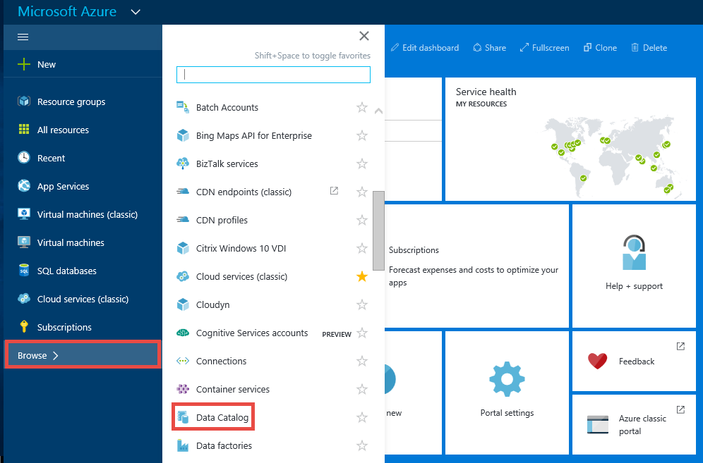
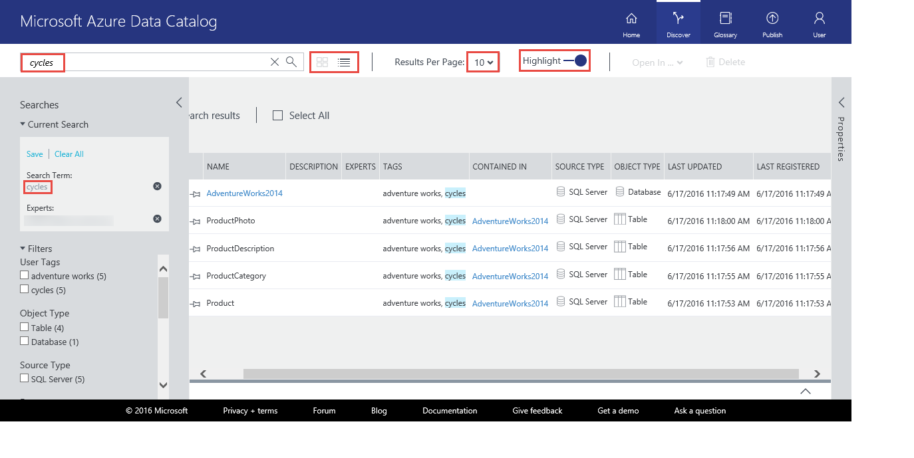
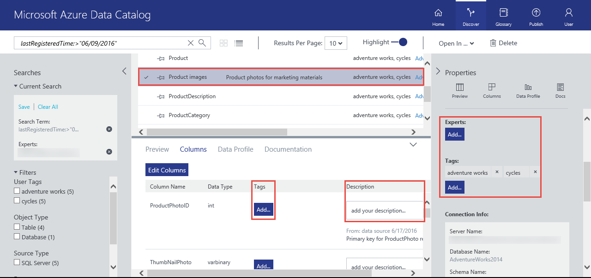
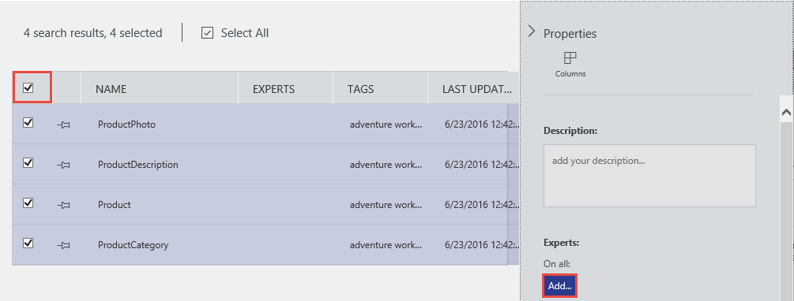
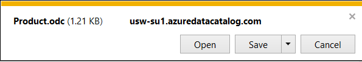
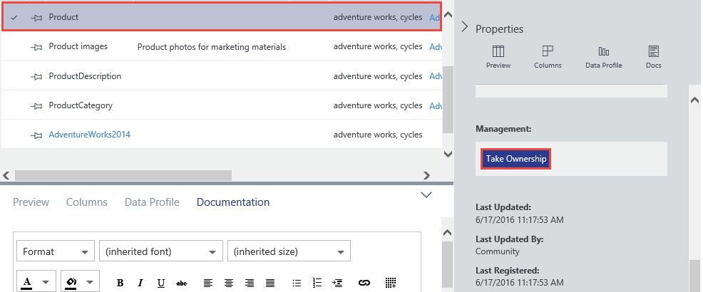

<properties
    pageTitle="開始使用資料目錄 |Microsoft Azure"
    description="簡報的案例和 Azure 資料目錄功能的端對端教學課程。"
    documentationCenter=""
    services="data-catalog"
    authors="steelanddata"
    manager="jhubbard"
    editor=""
    tags=""/>
<tags
    ms.service="data-catalog"
    ms.devlang="NA"
    ms.topic="get-started-article"
    ms.tgt_pltfrm="NA"
    ms.workload="data-catalog"
    ms.date="09/20/2016"
    ms.author="spelluru"/>

# 開始使用 Azure 資料目錄
Azure 資料目錄] 是登錄的完全受管理的雲端服務，作為系統及探索企業資料資產的系統。 如需詳細的概觀，請參閱[什麼是 Azure 資料目錄](data-catalog-what-is-data-catalog.md)。

本教學課程中，可協助您開始使用 Azure 資料目錄。 您可以執行下列程序在本教學課程︰

| 程序 | 描述 |
| :--- | :---------- |
| [佈建資料目錄](#provision-data-catalog) | 此程序，您可以佈建或設定 Azure 資料目錄。 只有當目錄尚未設定之前，您可以執行此步驟。 即使您 Azure 帳戶相關聯的多個訂閱，您可以讓只有一個資料目錄，每個組織 （Microsoft Azure Active Directory 網域）。 |
| [登錄的資料資產](#register-data-assets) | 此程序，您會使用資料目錄註冊從 AdventureWorks2014 範例資料庫的資料資產。 註冊是從資料來源擷取索引鍵的結構化中繼資料，例如名稱、 類型及位置，並將該中繼資料複製到目錄] 的程序。 資料來源與資料資產，會保留位置，但目錄會使用中繼資料，使其更輕鬆地探索並容易理解。 |
| [探索資料資產](#discover-data-assets) | 此程序，您可以使用 Azure 資料目錄入口網站找出在上一個步驟中已登錄的資料資產。 已註冊 Azure 資料目錄的資料來源之後，它的中繼資料被索引服務，讓使用者可以輕鬆地搜尋所需的資料。 |
| [加上註釋的資料資產](#annotate-data-assets) | 此程序，您的資料資產提供註釋 （例如描述、 標籤、 文件或專家資訊）。 這項資訊補充資料來源，並對其他人更容易理解的資料來源中擷取的中繼資料。 |
| [連線至資料資產](#connect-to-data-assets) | 此程序，您可以開啟 （如 Excel 和 SQL Server Data Tools） 整合式的用戶端工具中的資料資產] 與 [非整合工具 (SQL Server Management Studio 中)。 |
| [管理資料資產](#manage-data-assets) | 此程序，您將您的資料資產的安全性設定。 資料目錄不會讓使用者存取本身的資料。 資料來源的擁有者可以控制資料存取。    使用資料目錄，您可以探索資料來源與檢視在目錄中登錄來源相關的**中繼資料**。 可能的情況下，不過，應該顯示給特定使用者或特定群組的成員資料來源。 下列情況下，您可以使用資料目錄，以取得已註冊的資料資產，在目錄內的擁有權，並控制您擁有自己的資產的可見性。 |
| [移除資料資產](#remove-data-assets) | 此程序，您可以瞭解如何移除資料目錄中的資料資產。 |  

## 教學課程的先決條件

### Azure 訂閱
若要設定 Azure 資料目錄，您必須是擁有者或 Azure 訂閱的共同擁有者。

Azure 訂閱可協助您組織雲端服務資源，例如 Azure 資料目錄的存取權。 他們也說明如何資源使用狀況報告，您可以控制計費，並支付。 每個訂閱可讓不同帳單與付款設定，您可以安裝不同的訂閱和部門、 project、 地區的 office，等不同的方案。 每個雲端服務所屬的訂閱，您必須具備設定 Azure 資料目錄之前先訂閱。 若要深入瞭解，請參閱[管理帳戶、 訂閱及系統管理角色](../active-directory/active-directory-how-subscriptions-associated-directory.md)。

如果您沒有安裝訂閱，您可以建立的免費的試用帳戶在幾分鐘。 如需詳細資訊，請參閱[免費試用版](https://azure.microsoft.com/pricing/free-trial/)。

### Azure Active Directory
若要設定 Azure 資料目錄，您必須登入的 Azure Active Directory (Azure AD) 的使用者帳戶。 您必須是擁有者或 Azure 訂閱的共同擁有者。  

Azure AD 提供企業管理的身分識別與存取權，同時在內部部署與雲端中的一個簡單的方法。 您可以使用單一的公司或學校帳戶登入任何雲端或內部部署的 web 應用程式。 Azure 資料目錄使用 Azure AD 驗證登入。 若要深入瞭解，請參閱[什麼是 Azure Active Directory](../active-directory/active-directory-whatis.md)。

### Azure Active Directory 原則設定

Azure 資料目錄入口網站，您可以登入的位置，但當您嘗試登入的資料來源註冊工具時，您可能會遇到的情況下，您遇到錯誤訊息，讓您無法登入。 當您在公司內部網路上，或從公司網路以外連線時，可能會發生這個錯誤。

註冊工具使用*表單驗證*驗證使用者登增益集針對 Azure Active Directory。 順利登入，以 Azure Active Directory 系統管理員必須啟用*全域驗證原則*中的表單驗證。

全域驗證原則，您可以啟用驗證分別為內部和外部網路連線]，如下圖所示。 如果您從連線的網路不會啟用表單驗證，可能會發生登入錯誤。

 

如需詳細資訊，請參閱[設定驗證原則](https://technet.microsoft.com/library/dn486781.aspx)。

## 佈建資料目錄
您可以提供只有一個資料目錄，每個組織 （Azure Active Directory 網域）。 因此，如果擁有人或屬於此 Azure Active Directory 網域 Azure 訂閱的共同擁有者已經建立目錄，您將無法重新建立目錄，即使您有多個 Azure 訂閱。 若要測試是否已的 Azure Active Directory 網域中的使用者建立資料目錄，移至[Azure 資料目錄 [首頁] 頁面](http://azuredatacatalog.com)並確認您是否看到目錄]。 如果您已經建立目錄，略過下列程序，並移至下一節。    

1. 移至[資料目錄服務] 頁面](https://azure.microsoft.com/services/data-catalog)，然後按一下 [**開始使用**。

    
2. 使用的是 [擁有人或共同擁有者 Azure 訂閱的使用者帳戶登入。 您會看到下列頁面後登入。

    
3. 指定資料目錄，您想要使用的**訂閱**和**位置**目錄的**名稱**。
4. 展開**價格**並選取 Azure 資料目錄**的版本**（免費或標準）。
    
5. 展開 [**類別目錄使用者**，然後按一下 [**新增**]，以新增使用者的資料目錄。 您會自動新增到此群組。
    
6. 展開**目錄系統管理員**，然後按一下 [**新增**]，以新增其他管理員的資料目錄。 您會自動新增到此群組。
    
7. 按一下 [建立資料目錄，為您的組織**建立的目錄**。 建立後，您會看到 [首頁] 頁面的資料目錄。
        

### Azure 入口網站中尋找資料目錄
1. 在另一個索引標籤上的網頁瀏覽器中或另一個網頁瀏覽器視窗中，移至[Azure 入口網站](https://portal.azure.com)並使用您用來建立一個步驟中的資料目錄的同一個帳戶登入。
2. 選取 [**瀏覽]** ，然後按一下 [**資料目錄**。

    您看到您所建立的資料類別目錄。

    
4.  按一下您所建立的目錄。 您會看到**資料目錄**刀，在入口網站。

    
5. 您可以檢視資料目錄的內容，並進行更新。 例如，按一下**價格層**，然後變更版本。

    

### Adventure Works 範例資料庫
在此教學課程中，您從 AdventureWorks2014 範例資料庫的資料資產 （表格） 註冊 SQL Server 資料庫引擎，但如果您偏好使用的是熟悉且您的角色與相關的資料，您可以使用任何支援的資料來源。 如需支援的資料來源清單，請參閱[支援的資料來源](data-catalog-dsr.md)。

### 安裝 Adventure Works 2014 OLTP 資料庫
Adventure Works 資料庫虛構自行車製造商 （Adventure Works 循環），其中包含銷售，並購買的產品支援標準線上交易處理案例。 在本教學課程中，您可以註冊 Azure 資料目錄到產品的相關資訊。

若要安裝 Adventure Works 範例資料庫︰

1. 下載 CodePlex 上的[探險運作 2014年全資料庫 Backup.zip](https://msftdbprodsamples.codeplex.com/downloads/get/880661) 。
2. 若要還原您的電腦上的資料庫，請遵循指示[還原使用 SQL Server Management Studio 資料庫備份](http://msdn.microsoft.com/library/ms177429.aspx)，或依照下列步驟︰
    1. 開啟 [SQL Server Management Studio 中，然後連線至 SQL Server 資料庫引擎。
    2. 以滑鼠右鍵按一下**資料庫**，然後按一下 [**還原資料庫**。
    3. **還原資料庫**] 下按一下 [**裝置**] 選項的**來源**，然後按一下 [**瀏覽**。
    4. 在 [**選取備份裝置**，按一下 [**新增**]。
    5. 移至資料夾位置**AdventureWorks2014.bak**檔案，選取檔案，也可以按一下**[確定]**以關閉 [**找出備份檔案**] 對話方塊。
    6. 按一下**[確定**] 關閉 [**選取備份裝置**] 對話方塊。    
    7. 按一下**[確定**] 關閉 [**還原資料庫**] 對話方塊。

您現在可以使用 Azure 資料目錄註冊從 Adventure Works 範例資料庫的資料資產。

## 登錄的資料資產

在練習中，您可以使用 [註冊] 工具登錄 Adventure Works 資料庫中的資料資產，使用目錄。 註冊是從資料來源，其中包含，資產擷取索引鍵的結構化中繼資料，例如名稱、 類型及位置，並將該中繼資料複製到目錄] 的程序。 資料來源與資料資產，會保留位置，但目錄會使用中繼資料，使其更輕鬆地探索並容易理解。

### 登錄的資料來源

1.  移至[Azure 資料目錄 [首頁] 頁面](https://azuredatacatalog.com)，然後按一下 [**發佈資料**。

    ![Azure 資料目錄，將資料發佈] 按鈕](media/data-catalog-get-started/data-catalog-publish-data.png)

2.  按一下 [**啟動應用程式**下載、 安裝及執行您電腦上的 [註冊] 工具。

    ![Azure 資料目錄-啟動] 按鈕](media/data-catalog-get-started/data-catalog-launch-application.png)

3. 在 [**歡迎**] 頁面上按一下 [**登入**，然後輸入您的認證。    

    

4. 在 [ **Microsoft Azure 資料目錄**] 頁面中，按一下 [ **SQL Server** **下, 一步**]。

    

5.  輸入**AdventureWorks2014** SQL Server 連線內容 （請參閱下列範例），按一下 [**連線**]。

    

6.  註冊您的資料資產的中繼資料。 在此範例中，您可以註冊 AdventureWorks 生產命名空間**生產/產品**物件︰

    1. 在 [**伺服器階層**樹狀目錄中，展開**AdventureWorks2014**並按一下**生產**。
    2. 使用 Ctrl + 滑鼠左鍵以選取**產品**、**產品**、 **ProductDescription**及**ProductPhoto** 。
    3. 按一下 [**移動選取的箭號**(**>**)。 這個動作會將所有選取的物件移至 [**註冊的物件**] 清單中。

        
    4. 選取包含資料的快照預覽**包含預覽**。 快照集包含 20 個記錄，且每個資料表，而且它會將它複製到目錄]。
    5. 選取**包含資料設定檔**，以包含資料的設定檔的物件統計資料的快照 (例如︰ 最小值、 最大值和平均的值的資料行的資料列的數字)。
    6. 在 [**新增標籤**] 欄位中，輸入**adventure works，循環**。 這個動作會將這些資料資產的搜尋標籤。 標籤是可以協助使用者找到登錄的資料來源的絕佳方式。
    7. （選用） 此資料中指定的**專家**名稱。

        

    8. 按一下 [**註冊**]。 Azure 資料目錄註冊您選取的物件。 在此練習中，註冊 Adventure Works 從選取的物件。 註冊工具資料資產算起的中繼資料，並將資料複製到 Azure 資料目錄服務。 資料會保留位置目前位於，且仍是系統管理員的控制項與目前系統的原則] 下。

        

    9. 若要查看您已註冊的資料來源的物件，按一下 [**檢視入口網站**]。 在 [Azure 資料目錄] 入口網站中，確認，您會看到所有的四個資料表和 [格線] 檢視中的資料庫。

        

在此練習中，您註冊 Adventure Works 範例資料庫物件，讓他們可以輕鬆地找到的使用者在組織。 在下一個練習中，您可以瞭解如何找出已註冊的資料資產。

## 探索資料資產
探索 Azure 資料目錄] 中的會使用這兩個主要機制︰ 搜尋和篩選。

搜尋被專為直覺化且強大。 根據預設，在目錄中，包括使用者提供的註釋的任何屬性符合搜尋字詞。

篩選被設計來補充搜尋。 您可以選取特定的特性，例如專家、 資料來源類型、 物件類型，以及標籤若要檢視相符的資料資產，若要限制搜尋結果比對資產。

藉由使用搜尋及篩選的組合，您可以快速導覽已註冊 Azure 資料目錄，找出您需要的資料資產與資料來源。

在練習中，您可以使用 [Azure 資料目錄] 入口網站探索註冊，讓您在前一個練習中的資料資產。 如需搜尋語法的詳細資訊，請參閱[資料目錄搜尋語法參考](https://msdn.microsoft.com/library/azure/mt267594.aspx)。

以下是一些範例是針對探索目錄] 中的資料資產。  

### 探索資料資產，基本搜尋
基本搜尋可協助您使用一或多個搜尋字詞來搜尋目錄。 結果為任何符合一或多個指定的條款與任何屬性的資產。

1. Azure 資料目錄入口網站中按一下 [**常用**]。 如果您已關閉的網頁瀏覽器，請移至[Azure 資料目錄首頁](https://www.azuredatacatalog.com)。
2. 在 [搜尋] 方塊中輸入`cycles`，然後按**enter 鍵**。

    
3. 確認您看到所有四個資料表和資料庫 (AdventureWorks2014) 在結果中。 您可以切換**格線檢視**和**清單檢視**，如下圖所示，請按一下工具列上的按鈕。 請注意，搜尋關鍵字會以醒目提示搜尋結果****醒目提示**] 選項位於**因為。 您也可以在搜尋結果中指定**每頁結果**數目。

    

    [**搜尋**] 面板的左側，而是在右側的 [**屬性**] 面板。 在 [**搜尋**] 面板中，您可以變更搜尋準則，並篩選結果。 [**屬性**] 面板會顯示格線或清單中選取的物件的屬性。

4. 按一下 [搜尋結果中的 [**產品**]。 按一下 [**預覽**、**資料行**、**資料設定檔**和**文件**] 索引標籤，或按一下箭號以展開 [底部] 窗格。  

    

    在 [**預覽**] 索引標籤上，您會看到**Product**資料表中資料的預覽。  
5. 按一下 [**欄**] 索引標籤，若要尋找的詳細資訊 （例如 [**名稱**與**資料類型**） 欄中的資料資產。
6. 按一下 [若要查看的資料分析的 [**資料設定檔**] 索引標籤 (例如︰ 數字的資料列]、 [大小的資料或資料行中的最小值) 中的資料資產。
7. 使用左側的**篩選**來篩選結果。 例如，按一下 [**物件類型**，[**表格**，您看到的四個資料表，不是資料庫。

    

### 探索資料資產，與屬性設定的範圍
設定屬性的範圍，可協助您探索位置與指定的屬性符合搜尋條件的資料資產。

1. 清除**篩選器**中的**物件類型**] 下的 [**表格**] 篩選。  
2. 在 [搜尋] 方塊中輸入`tags:cycles`，然後按**enter 鍵**。 您可以使用搜尋資料目錄的所有內容，請參閱[資料目錄搜尋語法參考](https://msdn.microsoft.com/library/azure/mt267594.aspx)。
3. 確認您看到所有四個資料表和資料庫 (AdventureWorks2014) 在結果中。  

    

### 儲存搜尋
1. 在 [**目前的搜尋**] 區段中的 [**搜尋**] 窗格中，輸入搜尋的名稱，然後按一下 [**儲存**]。

    
2. 確認已儲存的搜尋顯示在**儲存搜尋結果**。

    
3. 選取其中一個已儲存的搜尋 （**重新命名**、**刪除**，請**將儲存成預設值**的搜尋） 您可以採取的動作。

    

### 布林值運算子
您可以放大或縮小布林值運算子的搜尋範圍。

1. 在 [搜尋] 方塊中輸入`tags:cycles AND objectType:table`，然後按**enter 鍵**。
2. 確認 [請參閱只有資料表 （不是資料庫） 在結果]。  

    

### 使用括號括住的群組
依 [群組]，使用括號括住，您可以群組的部分邏輯隔離，尤其是以及布林值運算子的查詢。

1. 在 [搜尋] 方塊中輸入`name:product AND (tags:cycles AND objectType:table)`，然後按**enter 鍵**。
2. 確認您看到只搜尋結果中的**產品**資料表。

       

### 比較運算子
您可以使用比較運算子，比較相等以外的數值和日期資料類型的屬性。

1. 在 [搜尋] 方塊中輸入`lastRegisteredTime:>"06/09/2016"`。
2. 清除 [**物件類型**] 下的 [**表格**] 篩選。
3. 按下**ENTER**。
4. 確認您看到 [**產品**、**產品**、 **ProductDescription**和**ProductPhoto**資料表和 AdventureWorks2014 資料庫註冊，讓您在搜尋結果中。

    

如需探索資料資產] 與 [[資料目錄搜尋語法參照](https://msdn.microsoft.com/library/azure/mt267594.aspx)搜尋語法的詳細資訊，請參閱[如何探索資料資產](data-catalog-how-to-discover.md)。

## 加上註釋的資料資產
在此練習中，您可以使用 Azure 資料目錄入口網站加上註釋 （新增資訊，例如描述、 標籤或專家） 您先前已登錄目錄] 中的資料資產。 註釋補充增強在註冊時擷取資料來源的資料結構的中繼資料，並讓更容易探索和了解資料資產。

在此練習中，您加上註釋的單一資料資產 (ProductPhoto)。 您可以新增的好記的名稱和描述 ProductPhoto 資料資產。  

1.  移至[Azure 資料目錄 [首頁] 頁面](https://www.azuredatacatalog.com)，然後使用搜尋`tags:cycles`若要尋找您已登錄的資料資產。  
2. 按一下 [搜尋結果中的 [ **ProductPhoto** ]。  
3. 輸入**產品圖像****易記的名稱**] 和 [**產品相片行銷材料的****描述**。

    

    **描述**可協助其他人探索並瞭解為何，以及如何使用 [選取的資料資產。 您也可以新增更多標籤，並檢視資料行。 現在您可以嘗試搜尋和篩選，以探索資料資產，使用描述性的中繼資料，您已新增到目錄]。

您也可以執行下列動作，在此頁面上︰

- 新增的資料資產的專家。 按一下 [**新增****專家**區域中。
- 在資料集層級新增標籤。 按一下 [**新增****標籤**] 區域中。 標籤可以是使用者標記或詞彙標籤。 資料目錄標準版包含可協助目錄系統管理員定義中央商務分類商務詞彙。 目錄使用者可以再加上註釋的資料資產，與詞彙。 如需詳細資訊，請參閱[如何設定的權限所規範標記商務詞彙](data-catalog-how-to-business-glossary.md)
- 新增標籤的欄層級。 在 [**標籤]**底下，按一下 [**新增**您想要加上註釋的資料行。
- 新增欄層級的描述。 資料行中輸入**描述**。 您也可以檢視資料來源擷取描述中繼資料。
- 新增向使用者說明如何要求存取資料資產的**要求存取**資訊。

    

- 選擇 [**文件**] 索引標籤，然後提供的資料資產的文件]。 Azure 資料目錄的文件，您可以使用您的資料目錄為內容儲存機制，建立您的資料資產完成敘述。

    ![Azure 資料目錄，文件] 索引標籤](media/data-catalog-get-started/data-catalog-documentation.png)

您也可以新增多個資料資產的註釋。 比方說，您可以選取註冊您的所有資料資產，並指定它們，或者向專家。

Azure 資料目錄支援凸顯傳送的方式來註釋。 資料目錄中的任何使用者可以新增標籤 （使用者或詞彙），描述，以及其他中繼資料，以便透視資料資產，以及使用任何使用者的觀點來擷取及其他使用者可以使用。

如需註解的資料資產詳細資訊，請參閱[如何加上註釋的資料資產](data-catalog-how-to-annotate.md)。

## 連線至資料資產
在此練習中，您可以開啟 [整合式的用戶端工具 (Excel) 和非整合工具 (SQL Server Management Studio) 中的資料資產使用連線資訊。

> [AZURE.NOTE] 請務必記住 Azure 資料目錄，不讓您存取實際的資料來源，它只是讓您輕鬆地探索並瞭解它。 當您連線至資料來源時，您選擇的用戶端應用程式會使用您的 Windows 認證，或會提示您輸入認證視。 如果您不先前授予存取資料來源，您需要授與存取權才能連線。

### 從 Excel 連線至資料資產

1. 從搜尋結果中選取 [**產品**]。 按一下工具列上的 [**開啟中**，按一下 [ **Excel**。

    
2. 按一下 [**開啟**下載的快顯視窗。 此體驗可能會有所不同瀏覽器。

    
3. 在 [ **Microsoft Excel 安全性注意事項**] 視窗中，按一下 [**啟用**]。

    
4. 保留在 [**匯入資料**] 對話方塊中的預設值，然後按一下**[確定**]。

    
5. 在 Excel 中檢視資料來源。

    ![Azure 資料目錄，在 Excel 中的 [產品] 資料表](media/data-catalog-get-started/data-catalog-connect2.png)

在此練習中，您連線到發現使用 Azure 資料目錄的資料資產。 使用 Azure 資料目錄] 入口網站，您可以直接使用整合**中開啟**的功能表的用戶端應用程式來連線。 您也可以與您選擇使用連接位置資訊資產中繼資料中所包含任何應用程式連線。 例如，您可以使用 SQL Server Management Studio 中連線至 AdventureWorks2014 可存取資料庫中的資料資產，註冊此教學課程中的資料。

1. 開啟 [ **SQL Server Management Studio 中**。
2. 在 [**伺服器的連線**] 對話方塊中，輸入伺服器名稱從 Azure 資料目錄入口網站中的 [**屬性**] 窗格。
3. 存取資料資產，使用適當的驗證與認證。 如果您沒有安裝 access，請**要求存取**] 欄位中使用資訊，將它。

    

按一下 [**檢視連接字串**來檢視和複製到剪貼簿應用程式中使用的 ADF.NET、 ODBC 和 OLEDB 連接字串。

## 管理資料資產
在此步驟中，您可以瞭解如何將您的資料資產的安全性設定。 資料目錄不會讓使用者存取本身的資料。 資料來源的擁有者可以控制資料存取。

探索資料來源，並檢視在目錄中登錄來源相關的中繼資料，您可以使用資料目錄。 可能的情況下，不過，在資料來源應，才會顯示特定使用者或特定群組的成員。 下列情況下，您可以使用資料目錄的目錄中的已註冊的資料資產擁有權，然後控制資產的可見性您擁有。

> [AZURE.NOTE] 在此練習中所述的管理功能，可只標準版的 Azure 資料目錄] 中，在免費版。
在 Azure 資料目錄中，您可以採取的資料資產的擁有權、 新增共同擁有者的資料資產，設定的資料資產可見性。

### 取得資料資產的擁有權，並限制可見性

1. 移至[Azure 資料目錄首頁](https://www.azuredatacatalog.com)。 在 [**搜尋**文字] 方塊中輸入`tags:cycles`，然後按**enter 鍵**。
2. 按一下 [結果] 清單中的項目，然後按一下工具列上的 [**取得擁有權**。
3. 在 [**屬性**] 面板的 [**管理**] 區段中，按一下 [**取得擁有權**]。

    
4. 若要限制可見度，在 [**可見度**] 區段中選擇 [**擁有人與這些使用者**，然後按一下 [**新增**]。 在 [文字] 方塊中輸入使用者的電子郵件地址，然後按**ENTER**。

    

## 移除資料資產

在此練習中，您可以使用 Azure 資料目錄入口網站移除已註冊的資料資產的預覽資料，並刪除目錄中的資料資產。

Azure 資料目錄，您可以刪除個別資產或刪除多個資產。

1. 移至[Azure 資料目錄首頁](https://www.azuredatacatalog.com)。
2. 在 [**搜尋**文字] 方塊中輸入`tags:cycles`按一下**enter 鍵**。
3. 在 [結果] 清單中選取一個項目，按一下 [**刪除**] 工具列上下圖所示︰

    

    如果您使用的 [清單] 檢視，核取方塊是左邊的項目，如下圖所示︰

    

    您也可以選取多個資料資產，並將其刪除，如下圖所示︰

    

> [AZURE.NOTE] 目錄的預設行為是允許任何使用者註冊任何資料來源]，並允許任何使用者刪除任何資料資產的已登錄。 含標準版的 Azure 資料目錄] 中的管理功能提供取得資產，就限制可以探索資產的擁有權，以及限制誰可以刪除資產的其他選項。

## 摘要

在本教學課程中，您探索 Azure 資料目錄，包括註冊、 註解、 意見與心得，以及管理企業資料資產的基本功能。 既然您已完成教學課程，則若要開始的時間。 註冊您和您的小組依賴，資料來源，並邀請同事使用目錄，您可以立即開始。

## 參照

- [如何註冊的資料資產](data-catalog-how-to-register.md)
- [探索資料資產的方式](data-catalog-how-to-discover.md)
- [若要加上註釋的資料資產的方式](data-catalog-how-to-annotate.md)
- [如何將資料資產的文件](data-catalog-how-to-documentation.md)
- [如何連線至資料資產](data-catalog-how-to-connect.md)
- [如何管理資料資產](data-catalog-how-to-manage.md)
